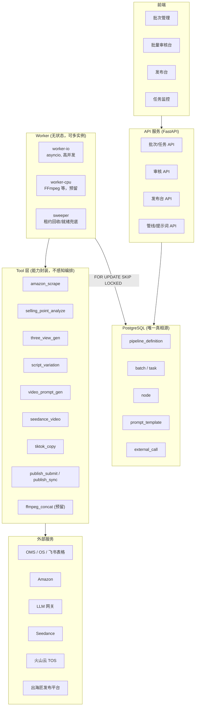
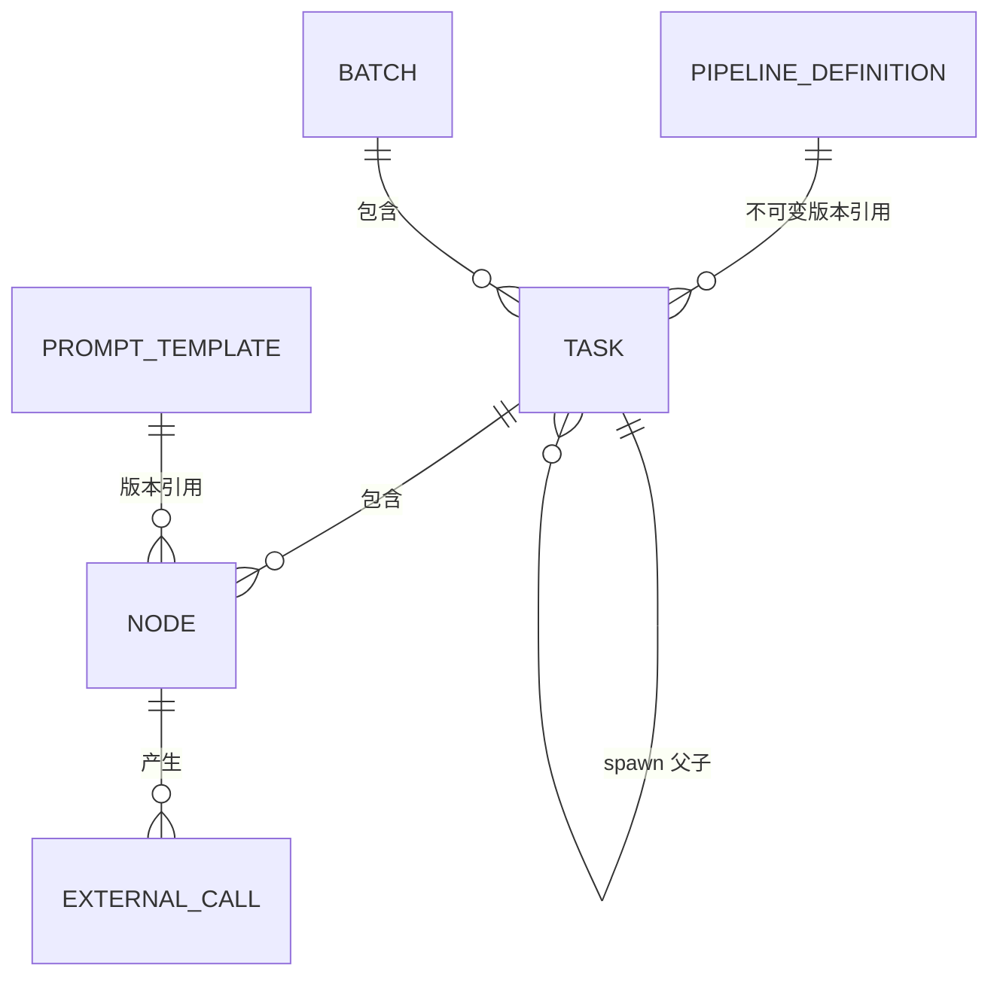
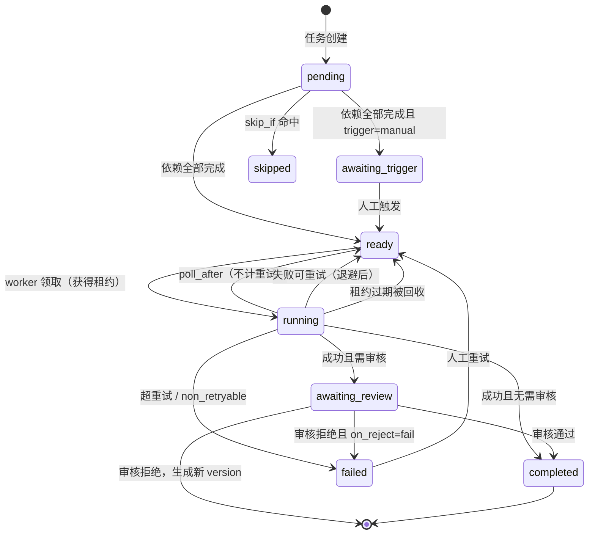

# TikTok 电商视频生产系统 — 架构设计 V1.0.0

> 状态：初稿，待讨论
> 输入依据：`自动化工具需求.md` 节点表 + 架构选型讨论
> 未决：`核心流程图.md` 内容为空，图中若含失败流转/审核退回分支，可能影响状态机细节

---

## 1. 背景与目标

### 1.1 业务目标

批量生产投放到 TikTok 的电商短视频（当前 15 秒，未来扩展 60 秒），覆盖从商品数据收集、参考图生成、脚本与提示词生成、视频生成、文案生成到发布的完整链路。

### 1.2 规模预期

| 指标 | 当前 | 设计余量 |
|---|---|---|
| 每天任务数 | 100 ~ 200 | 1000+ |
| 单任务节点数 | 5 | 不限 |
| 每天节点执行记录 | 约 1000 ~ 1500（含重跑） | — |
| 单视频时长 | 15 秒 | 60 秒（需视频拼接） |
| 每天人工审核次数 | 约 300 | 需通过批量审核与抽检降低 |

### 1.3 设计目标

1. **批量可控**：一次发起 100+ 任务，并发按外部服务配额精确控制
2. **状态透明**：任意一条任务，可查看每个节点的输入、输出、耗时、重试、失败原因、所用提示词版本
3. **随处可恢复**：进程重启、机器崩溃后自动继续，无需人工干预
4. **节点级重跑**：审核不通过时只重跑相关节点，不重跑整条任务
5. **人工介入不占资源**：等待审核的任务不消耗任何计算资源
6. **管线可配置**：增删节点、调整顺序、开关审核，改配置不改代码
7. **可扩展重计算**：预留 FFmpeg 等 CPU 密集节点的执行能力

### 1.4 非目标

- 不做实时/低延迟处理，全部为异步批处理
- 不做多租户隔离（内部工具，单组织使用）
- V1 不做自动化质量评分，质量控制依赖人工审核

---

## 2. 需求分析

### 2.1 业务节点梳理

#### 阶段一：产品准备（作用域 = 产品货号）

| 序号 | 节点 | 输入 | 输出 | 人工审核 |
|---|---|---|---|---|
| P1 | 批量建单 | 产品货号 | asin、运营货号、渠道 sku、产品编码、颜色、销售店铺、pid | 是 |
| P2 | Amazon 主图提取 | asin | 主图（8 张）、卖点、功能描述 | 否 |
| P3 | 三视图生成 | asin、商品主图 | 三视图（存 TOS） | 是 |
| P4 | 任务生成 | 产品货号、所需视频数量 | 按 `颜色 × 视频数量` 展开视频任务 | 否 |

#### 阶段二：视频生成（作用域 = 单个视频任务）

| 序号 | 节点 | 输入 | 输出 | 人工审核 |
|---|---|---|---|---|
| V1 | 脚本裂化 | 分镜脚本模板、三视图、产品描述、卖点 | 新分镜脚本 | 是 |
| V2 | 视频提示词生成 | 产品货号、颜色、三视图、裂变脚本、时长 | 中文产品分析、Seedance 提示词 | 是 |
| V3 | 视频生成 | 三视图、视频提示词、时长 | 视频 | 否 |
| V4 | TikTok 文案 | 最终 Prompt、产品信息、最终视频 | 英文文案、合规标签 | 否 |
| V5 | 发布 | 视频、文案、发布账号、PID、发布方式（立刻/定时）、预约时间 | 会话 ID、发布状态、VID、发布链接 | 否，由发布人在发布台手动触发 |

> 需求原表中的「分镜首帧图」节点已确认取消，不纳入设计。
>
> 发布环节由独立角色（发布人）按账号权限操作，不自动执行。发布节点留在管线内，在发布台被人工触发后才执行，详见 10.6。

### 2.2 关键业务特征

**特征一：全链路 IO 密集，当前无 CPU 密集环节。**
15 秒视频由 Seedance 直接产出，无合成、剪辑、字幕烧录。所有节点都是「调外部服务 → 等待返回」。这决定了 IO worker 单进程即可支撑当前规模。未来 60 秒视频引入 FFmpeg 拼接后，需要独立的 CPU 执行器。

**特征二：人工审核是一等公民，且是真正的产能瓶颈。**
按任务计的审核点有 2 个（V1、V2），每天约 300 次。若单次审核耗时 2 分钟，则每天需要 10 小时人工时间，超过一人日。因此：
- 审核 UI 必须支持批次聚合与批量操作
- 审核配置必须可降级为抽检或关闭
- 等待审核期间不得占用任何计算资源

**特征三：真相源必须是数据库，不能是工作流引擎的执行历史。**
运营需要在前端直接修改节点产出（改脚本、改提示词），然后从该节点重跑。这是「外部随时改写中间态」的模式，要求每个节点的输入输出都作为一等数据持久化。

**特征四：外部依赖异构且各有配额与失败模式。**
OMS/OS 系统、飞书表格、Amazon 爬虫、火山云 TOS 对象存储、LLM、三视图服务、Seedance、出海匠发布平台。需要按服务分组独立限流，单个上游故障不应拖垮整批。

**特征五：付费调用需要幂等保护。**
Seedance 视频生成与 LLM 调用按次计费，重复提交直接造成资金损失。

**特征六：提示词需要版本化。**
需求中五个节点均强调「运营同学提供 Skill/提示词，把思路固化下来」，说明提示词会长期迭代，必须能回答「这批产出用的是哪版提示词」。

---

## 3. 架构选型

### 3.1 候选方案对比

| 维度 | Celery | Temporal | 数据库状态机（本方案） |
|---|---|---|---|
| 等待人工审核 | 无原语，需自行实现 | signal 可支持，需额外设计 | 状态字段，天然支持 |
| 外部改写中间态 | 无此概念 | 与确定性重放冲突，属反模式 | 天然支持 |
| 节点级重跑 | 需自行实现 | 需自行实现 | 天然支持 |
| 长任务重复执行风险 | 有（visibility timeout 重投） | 无 | 无（租约机制） |
| 扇出扇入 | chord/group，失败场景脆弱 | 原生支持 | 需自行实现（本文档已设计） |
| CPU 密集任务 | 多进程池，强项 | 支持 | 独立执行器支持 |
| 新增运维组件 | broker + result backend | Temporal 集群 | 无 |
| 多实例安全 | 是 | 是 | 是（`FOR UPDATE SKIP LOCKED`） |
| 状态可观测 | 需额外建设 | Web UI，但为执行历史视角 | 业务表即状态，SQL 直查 |

### 3.2 选型结论

**采用数据库驱动的节点状态机 + 无状态 worker。**

理由：

1. **Celery 的核心优势在此业务中无法兑现。** 其最大价值是多进程 worker 池承载 CPU 密集任务，而当前链路是纯 IO 密集。同时 chord/group 在含人工审核的长流程中极易出现回调丢失，Redis broker 的 visibility timeout 机制会导致长任务被重复投递——而这正是付费调用最不能接受的风险。

2. **Temporal 可用但性价比不高。** 本业务的编排拓扑是线性的 5~6 个节点，复杂度很低；而 Temporal 的价值集中在复杂长流程编排与确定性重放。引入它需要承担集群运维成本和「workflow 代码必须确定性」的心智负担，且中间态被外部修改与其模型冲突。

3. **数据库状态机与业务特征高度契合。** 状态即数据，审核即改状态，重跑即加版本，恢复即继续轮询。无新增组件，多实例天然安全。当前规模下（每天约 1500 条节点记录，一年不到 50 万行）Postgres 毫无压力，未来十倍量只需多开 worker 进程。

### 3.3 从旧项目继承什么

| 旧项目（aimv-studio） | 本项目 | 说明 |
|---|---|---|
| `ToolInterface` + `ToolRegistry` | **原样继承** | 统一工具抽象是旧项目设计最好的部分 |
| `StageProducer` + `"stage:impl"` 注册表 | 演进为数据化管线定义 | 思路正确，但停留在「实现可替换」，节点数量与顺序仍硬编码 |
| `WorkStage` 枚举 + `run()` if 链 | 改为节点 DAG 定义 | 节点增删无需改代码 |
| `material.input_data.depend` | 提升为节点级 `depends_on` + 输入表达式 | 依赖关系归属管线定义，而非散落在数据中 |
| 内存态 `retry_count`/`submit_time`/`non_retryable` | 全部落库 | 旧项目无法多实例、重启丢状态的根因 |
| `ArtworkQueue` 进程内队列 | 数据库抢锁 | 支持多实例与崩溃恢复 |
| 三级队列 `get_queue_type_for_stage` 硬编码映射 | 节点声明 `executor` | 加节点无需改调度代码 |
| 关键字段埋在 JSON（tags、_metadata） | 提升为独立列 | 支持索引与约束 |

---

## 4. 总体架构



### 4.1 分层职责

| 层 | 职责 | 明确不做 |
|---|---|---|
| **Tool** | 一项业务能力的完整封装：接收业务参数，产出可直接使用的业务结果（含产物持久化） | 不读写编排状态，不感知自己处于哪条管线的哪个位置 |
| **Runner** | 领取节点、解析输入、注入依赖、调用 Tool、写回状态、判定审核、推进就绪 | 不包含任何业务逻辑，不理解 Tool 的输出语义 |
| **管线定义** | 声明节点、依赖、审核策略、执行器、限流组、输入映射 | 不含可执行代码 |
| **API** | 批次与任务管理、审核操作、管线与提示词维护、状态查询 | 不执行任何节点 |

**Tool 的边界不是「不碰存储」，而是「不碰编排」。** 详见 5.2。

> 旧项目的教训：`material_result_handler_drive.py` 中混杂了 Drive 转存、审核判断、fallback 兜底。问题不在于「结果处理器碰了存储」，而在于它同时承担了**能力**（转存）与**编排**（判定审核状态、决定是否走 fallback）两类职责，导致改任何一边都要理解另一边。本方案的划分方式是：能力归 Tool，编排归 Runner。

---

## 5. 核心概念模型

### 5.1 概念关系



### 5.2 概念定义

**Tool（工具）**
一项**业务能力的完整封装**。详见 5.3。

**PipelineDefinition（管线定义）**
一份声明式的节点 DAG，以 `(key, version)` 唯一标识。**一经发布不可修改**，需变更则发布新版本。因版本不可变，task 引用它即等价于持有快照。

**Batch（批次）**
一次业务操作发起的任务集合。承载批次级审核覆盖配置与整体进度。

**Task（任务）**
管线的一次执行实例，是进度与重跑的业务单位。分两类：
- `kind = product_prep`：作用域为产品货号，跑产品准备管线
- `kind = video`：作用域为「产品货号 × 颜色 × 序号」，跑视频生成管线，由 `product_prep` 的任务生成节点 spawn 产生

**Node（节点执行记录）**
状态与恢复的**唯一真相源**。主键 `(task_id, node_key, shard_index, version)`。重跑产生新 version，历史完整保留。
与管线定义中的节点定义（`definition.nodes`，按 `node_key` 标识）区分：节点定义是静态声明，Node 是它在某个任务上的一次执行实例。

**PromptTemplate（提示词模板）**
独立版本化管理，节点定义引用 `prompt_key`，运行时解析为具体版本并记入 `node`。

**ExternalCall（外部调用记录）**
每次付费/长耗时外部调用的记录，承载幂等保护与成本核算。

### 5.3 Tool 定义（重点）

#### 5.3.1 什么是 Tool

**Tool 是一项业务能力的完整封装：给它业务参数，它还你可以直接使用的业务结果。**

以「Amazon 主图提取」为例，这项能力的完整语义是：

> 给一个 ASIN，还我**稳定可访问**的主图 URL 列表、产品描述和卖点文本。

其中「稳定可访问」意味着它必须把 Amazon CDN 上会过期的图片下载下来、上传到自己的 TOS、返回自有 URL。**这个持久化动作是能力语义的一部分，不应该被剥离出去交给 Runner。** 如果 Tool 只返回 Amazon 的临时 URL，那它交付的就是一个残缺的能力，调用方还得自己收拾。

同理：
- `seedance_video` 返回的应该是已落到自有 TOS 的视频 URL，而不是 Seedance 的临时下载地址
- `three_view_gen` 返回的应该是已入库的三视图 URL

#### 5.3.2 边界：不碰编排，而非不碰存储

Tool 可以依赖的，和绝对不能依赖的：

| 依赖类型 | 举例 | 是否允许 | 说明 |
|---|---|---|---|
| **基础设施服务** | `StorageService`、`HttpClient`、`LLMGateway` | 允许 | 必须通过**构造注入**，不得自行读取全局配置或新建实例 |
| **业务数据源** | 产品库、脚本模板库、店铺组数据 | 允许 | 通过 Repository 接口注入；这是能力的一部分 |
| **编排状态** | `task`、`node`、`batch`、`review_action` | **禁止** | 一旦触碰，Tool 即与本系统绑死，无法复用、无法单测，且状态真相源分裂 |
| **自身位置信息** | 「我是第几个节点」「我的上游是谁」「我失败了要不要重试」 | **禁止** | 这些是 Runner 的职责 |

这条边界带来三个具体收益：

1. **可独立单测**：注入内存版 `StorageService` 即可跑完整逻辑，不需要起数据库
2. **可命令行单跑**：`python -m tools.amazon_scrape --asin B0XXXX`，调试时不必走整条管线
3. **可跨管线复用**：同一个 `seedance_video` 同时服务 15 秒和 60 秒两条管线，且未来可被其他项目直接引用

#### 5.3.3 接口定义

```python
class Tool(ABC):
    name: str
    input_schema: dict      # JSON Schema，Runner 据此校验输入
    output_schema: dict     # JSON Schema，Runner 据此校验输出

    def __init__(self, *, storage: StorageService, http: HttpClient,
                 llm: LLMGateway | None = None, **deps):
        """依赖一律注入，不在内部读全局配置"""

    @abstractmethod
    async def execute(self, payload: dict, settings: ToolSettings) -> ToolResult:
        ...


@dataclass
class ToolSettings:
    """Runner 注入的运行期参数。Tool 只读，不得据此推断编排逻辑。"""
    timeout: int
    idempotency_key: str            # 传给上游做去重，不用于本地判断
    prompt: RenderedPrompt | None   # 已解析好的提示词（含版本），Tool 不自行查表
    trace_id: str                   # 日志串联


@dataclass
class ToolResult:
    success: bool
    output: dict                    # 须符合 output_schema
    error_code: str | None = None   # 供 Runner 判定是否可重试
    error_message: str | None = None
    external_calls: list[ExternalCallRecord] = field(default_factory=list)
                                    # 上报付费调用明细，由 Runner 落库
    metrics: dict = field(default_factory=dict)
    poll_after: int | None = None   # 结果未就绪，N 秒后再执行一次；不计入重试次数
```

两点说明：

- **`prompt` 由 Runner 解析后注入**，Tool 不自行查 `prompt_template` 表。这样提示词的版本选择逻辑集中在一处，且 Tool 单测时直接传字符串即可。
- **`external_calls` 由 Tool 上报、Runner 落库**。Tool 知道自己调了几次、花了多少钱，但写 `external_call` 表是编排层的事。幂等检查同理：Runner 在调用 Tool 前先查表，命中已成功记录则直接复用，不再调用 Tool（详见第 11 章）。

#### 5.3.4 粒度原则

**Tool 的边界应该切在「可能需要独立重跑或独立复用」的地方。**

以需求中的「Amazon 主图提取」节点为例，它实际包含两件事：爬取页面（主图 + 卖点原文）与 LLM 分析（产出结构化卖点/提示词素材）。是做成一个 Tool 还是两个？

| 方案 | 适用条件 |
|---|---|
| 合并为一个 `amazon_scrape` | 只关心最终的结构化结果，中间态无独立价值 |
| 拆为 `amazon_scrape` + `selling_point_analyze` | 需要「不重爬只重分析」，或爬取结果需跨任务缓存复用 |

**本方案建议拆开**，理由有二：爬虫是全链路最脆弱的一环（封禁、页面改版），提示词迭代时若每次都要重爬，既慢又增加封禁风险；同一 ASIN 的爬取结果天然可跨任务复用，拆开后才有缓存的接入点。

反面案例同样要避免：不要为了「复用」把 Tool 切得过碎（例如把「下载图片」「上传 TOS」各做成一个 Tool）。这类基础设施动作应当作为注入的服务被复用，而不是升格为管线节点——否则管线定义会被大量无业务语义的节点淹没。

#### 5.3.5 Tool 清单

| Tool | 能力 | 产物落地 | 归属限流组 |
|---|---|---|---|
| `fetch_product_info` | 按产品货号汇集 asin、颜色、sku、pid、店铺等信息 | 无 | `llm` |
| `amazon_scrape` | 按 asin 爬取主图与卖点原文，图片转存 TOS | TOS（图片） | `amazon` |
| `selling_point_analyze` | 由主图与卖点原文产出结构化产品描述与卖点 | 无 | `llm` |
| `three_view_gen` | 由主图生成产品三视图，转存 TOS | TOS（图片） | `three_view` |
| `task_generate` | 按颜色与数量计算待生成的视频任务清单 | 无 | — |
| `script_variation` | 由脚本模板裂化出新分镜脚本 | 无 | `llm` |
| `video_prompt_gen` | 产出中文产品分析与 Seedance 提示词 | 无 | `llm` |
| `seedance_video` | 由提示词与参考图生成视频，转存 TOS | TOS（视频） | `seedance` |
| `tiktok_copy` | 产出英文文案与合规标签 | 无 | `llm` |
| `publish_submit` | 按指定账号与发布方式（立刻/定时）提交至出海匠，返回会话 ID | 无 | `publish` |
| `publish_sync` | 查询出海匠发布状态，直至拿到 VID 与发布链接 | 无 | `publish` |
| `shot_split` *(预留)* | 将长脚本拆分为多个分镜片段 | 无 | `llm` |
| `ffmpeg_concat` *(预留)* | 将多个视频片段拼接为成片，转存 TOS | TOS（视频） | `ffmpeg` |

---

## 6. 数据模型

### 6.1 pipeline_definition

```sql
CREATE TABLE pipeline_definition (
    id              BIGSERIAL PRIMARY KEY,
    key             VARCHAR(64)  NOT NULL,           -- product_prep / video_gen_15s / video_gen_60s
    version         INT          NOT NULL,
    name            VARCHAR(255) NOT NULL,
    definition      JSONB        NOT NULL,           -- 完整节点 DAG 定义，见第 7 章
    status          VARCHAR(16)  NOT NULL DEFAULT 'draft',  -- draft | published | deprecated
    note            TEXT,
    created_by      VARCHAR(64),
    created_at      BIGINT       NOT NULL,
    published_at    BIGINT,
    CONSTRAINT uk_pipeline_key_version UNIQUE (key, version)
);

COMMENT ON TABLE  pipeline_definition IS '管线定义，published 后不可修改，变更需发新版本';
COMMENT ON COLUMN pipeline_definition.definition IS '节点 DAG 定义 JSON';
```

**不可变约束**由应用层保证：`status = 'published'` 后禁止更新 `definition`。建议同时加数据库触发器兜底。

### 6.2 batch

```sql
CREATE TABLE batch (
    id                  VARCHAR(36) PRIMARY KEY,
    name                VARCHAR(255) NOT NULL,
    kind                VARCHAR(32)  NOT NULL,       -- product_prep | video
    pipeline_def_id     BIGINT       NOT NULL REFERENCES pipeline_definition(id),
    review_overrides    JSONB        NOT NULL DEFAULT '{}',  -- {node_key: {mode, sample_rate}}
    concurrency_profile VARCHAR(64),                 -- 可选：该批次使用的限流档位
    status              VARCHAR(16)  NOT NULL,       -- pending|running|paused|completed|failed|cancelled
    total_tasks         INT          NOT NULL DEFAULT 0,
    created_by          VARCHAR(64)  NOT NULL,
    created_at          BIGINT       NOT NULL,
    updated_at          BIGINT       NOT NULL,
    finished_at         BIGINT
);

CREATE INDEX idx_batch_status     ON batch(status);
CREATE INDEX idx_batch_created_at ON batch(created_at DESC);
```

### 6.3 task

```sql
CREATE TABLE task (
    id               VARCHAR(36) PRIMARY KEY,
    batch_id         VARCHAR(36) NOT NULL REFERENCES batch(id) ON DELETE CASCADE,
    parent_task_id   VARCHAR(36) REFERENCES task(id),   -- spawn 来源（video 任务指向 product_prep 任务）
    kind             VARCHAR(32) NOT NULL,              -- product_prep | video
    pipeline_def_id  BIGINT      NOT NULL REFERENCES pipeline_definition(id),

    biz_key          VARCHAR(255) NOT NULL,             -- 业务幂等键
                                                        -- product_prep: {产品货号}
                                                        -- video: {产品货号}:{颜色}:{序号}
    context          JSONB        NOT NULL DEFAULT '{}',-- 任务上下文（产品信息、三视图URL、脚本模板等）

    status           VARCHAR(24)  NOT NULL,             -- pending|running|awaiting_review
                                                        -- |completed|failed|paused|cancelled
    priority         INT          NOT NULL DEFAULT 100, -- 数字越小越优先
    progress         JSONB        NOT NULL DEFAULT '{}',-- {total, completed, failed, awaiting_review}

    error            TEXT,
    created_at       BIGINT NOT NULL,
    started_at       BIGINT,
    finished_at      BIGINT,
    updated_at       BIGINT NOT NULL,

    CONSTRAINT uk_task_batch_bizkey UNIQUE (batch_id, biz_key)
);

CREATE INDEX idx_task_batch    ON task(batch_id);
CREATE INDEX idx_task_status   ON task(status);
CREATE INDEX idx_task_parent   ON task(parent_task_id);
CREATE INDEX idx_task_biz_key  ON task(biz_key);
```

`uk_task_batch_bizkey` 保证同批次内重复提交同一业务对象不会产生重复任务。

### 6.4 node（核心表）

```sql
CREATE TABLE node (
    id                 BIGSERIAL PRIMARY KEY,
    task_id            VARCHAR(36) NOT NULL REFERENCES task(id) ON DELETE CASCADE,
    node_key           VARCHAR(64) NOT NULL,
    shard_index        INT         NOT NULL DEFAULT 0,   -- 扇出分片序号，非扇出恒为 0
    version            INT         NOT NULL DEFAULT 1,   -- 重跑递增
    is_current         BOOLEAN     NOT NULL DEFAULT TRUE,-- 仅最新 version 为 true

    -- 执行归属
    tool               VARCHAR(64) NOT NULL,
    executor           VARCHAR(16) NOT NULL DEFAULT 'io',-- io | cpu
    concurrency_group  VARCHAR(64),                      -- 限流分组
    priority           INT         NOT NULL DEFAULT 100,

    -- 状态
    status             VARCHAR(24) NOT NULL,             -- pending|awaiting_trigger|ready|running
                                                         -- |awaiting_review|completed|failed|skipped|cancelled
    -- 人工触发（trigger: manual 的节点）
    trigger_input      JSONB,                            -- 触发时人工填写的参数，如发布账号、发布方式、预约时间
    triggered_by       VARCHAR(64),
    triggered_at       BIGINT,

    -- 审核
    review_mode        VARCHAR(16) NOT NULL DEFAULT 'off',-- off|required|sampling
    review_status      VARCHAR(16),                      -- pending|approved|rejected
    reviewed_by        VARCHAR(64),
    reviewed_at        BIGINT,
    review_comment     TEXT,
    edited             BOOLEAN     NOT NULL DEFAULT FALSE,-- 审核时是否修改过输出

    -- 数据
    input_snapshot     JSONB,                            -- 解析后的实际输入（非表达式）
    output             JSONB,
    prompt_version_id  BIGINT REFERENCES prompt_template(id),
    idempotency_key    VARCHAR(64),

    -- 执行控制
    lease_owner        VARCHAR(128),                     -- hostname:pid:uuid
    lease_until        BIGINT,
    retry_count        INT         NOT NULL DEFAULT 0,
    max_retries        INT         NOT NULL DEFAULT 3,
    non_retryable      BOOLEAN     NOT NULL DEFAULT FALSE,
    next_run_at        BIGINT,                           -- 退避重试的最早执行时间
    error              TEXT,
    error_code         VARCHAR(64),

    created_at         BIGINT NOT NULL,
    started_at         BIGINT,
    finished_at        BIGINT,
    updated_at         BIGINT NOT NULL,

    CONSTRAINT uk_node UNIQUE (task_id, node_key, shard_index, version)
);

-- 调度主索引：worker 领取任务用
CREATE INDEX idx_node_claim
    ON node(executor, status, priority, next_run_at)
    WHERE status = 'ready';

-- 租约回收
CREATE INDEX idx_node_lease
    ON node(lease_until)
    WHERE status = 'running';

-- 限流组当前运行数统计
CREATE INDEX idx_node_group_running
    ON node(concurrency_group)
    WHERE status = 'running';

-- 审核台查询
CREATE INDEX idx_node_review
    ON node(node_key, review_status)
    WHERE status = 'awaiting_review';

-- 发布台查询
CREATE INDEX idx_node_trigger
    ON node(node_key)
    WHERE status = 'awaiting_trigger';

-- 任务详情查询
CREATE INDEX idx_node_task ON node(task_id, node_key, shard_index, version);

CREATE INDEX idx_node_idem ON node(idempotency_key);
```

**设计要点：**

- `shard_index` **现在必须加**。它进入联合主键、依赖判定与输入解析逻辑，未来做 60 秒视频扇出时再补需要重写状态机核心，代价极高。当前所有节点恒为 0，零额外复杂度。
- `executor` **现在必须加**。未来 FFmpeg 节点靠它路由到 CPU worker，当前全填 `io`。
- `is_current` 用于快速查询「当前有效版本」，避免每次子查询 `MAX(version)`。
- `input_snapshot` 存**解析后的实际输入**而非表达式。复盘时需要看到当时喂进去的完整内容。
- 所有运行时状态（`retry_count`、`lease_*`、`non_retryable`）均落库，这是旧项目最大的教训。

### 6.5 prompt_template

```sql
CREATE TABLE prompt_template (
    id           BIGSERIAL PRIMARY KEY,
    key          VARCHAR(64)  NOT NULL,      -- script_variation / video_prompt_gen ...
    version      INT          NOT NULL,
    content      TEXT         NOT NULL,
    variables    JSONB        NOT NULL DEFAULT '[]',  -- 声明所需变量名，用于校验
    model_config JSONB        NOT NULL DEFAULT '{}',  -- model / temperature / max_tokens
    status       VARCHAR(16)  NOT NULL DEFAULT 'draft',-- draft | active | archived
    note         TEXT,
    created_by   VARCHAR(64),
    created_at   BIGINT NOT NULL,
    CONSTRAINT uk_prompt_key_version UNIQUE (key, version)
);

-- 同一 key 同时只能有一个 active 版本
CREATE UNIQUE INDEX uk_prompt_active
    ON prompt_template(key) WHERE status = 'active';
```

### 6.6 concurrency_group

```sql
CREATE TABLE concurrency_group (
    name                VARCHAR(64) PRIMARY KEY,
    max_concurrent      INT     NOT NULL,
    rate_limit_per_min  INT,                  -- 可选的额外速率限制
    enabled             BOOLEAN NOT NULL DEFAULT TRUE,
    note                VARCHAR(255),
    updated_at          BIGINT  NOT NULL
);

INSERT INTO concurrency_group(name, max_concurrent, note, updated_at) VALUES
    ('llm',        20, 'LLM 网关',            extract(epoch from now())::bigint),
    ('seedance',   10, 'Seedance 视频生成',    extract(epoch from now())::bigint),
    ('three_view',  5, '三视图生成服务',        extract(epoch from now())::bigint),
    ('amazon',      2, 'Amazon 爬虫，需低速',   extract(epoch from now())::bigint),
    ('tos',        30, '火山云 TOS 上传下载',  extract(epoch from now())::bigint),
    ('publish',     3, '出海匠发布平台',        extract(epoch from now())::bigint),
    ('ffmpeg',      4, 'FFmpeg（CPU，预留）',   extract(epoch from now())::bigint);
```

限流配置入库而非写死，运营可在不发版的情况下按上游状况调整。

### 6.7 external_call

```sql
CREATE TABLE external_call (
    id               BIGSERIAL PRIMARY KEY,
    idempotency_key  VARCHAR(64)  NOT NULL UNIQUE,
    node_id          BIGINT       NOT NULL REFERENCES node(id) ON DELETE CASCADE,
    provider         VARCHAR(32)  NOT NULL,      -- seedance | llm | three_view ...
    external_job_id  VARCHAR(128),               -- 上游返回的任务 ID
    status           VARCHAR(16)  NOT NULL,      -- submitted | succeeded | failed
    request_digest   VARCHAR(64),                -- 请求体摘要
    response         JSONB,
    cost_amount      NUMERIC(12,4),              -- 成本核算
    cost_unit        VARCHAR(16),
    submitted_at     BIGINT NOT NULL,
    finished_at      BIGINT
);

CREATE INDEX idx_external_call_node ON external_call(node_id);
CREATE INDEX idx_external_call_prov ON external_call(provider, submitted_at);
```

**这张表是防重复扣费的关键。** 详见第 11 章。

### 6.8 review_action（审核操作审计）

```sql
CREATE TABLE review_action (
    id           BIGSERIAL PRIMARY KEY,
    node_id      BIGINT      NOT NULL REFERENCES node(id) ON DELETE CASCADE,
    action       VARCHAR(24) NOT NULL,   -- approve | approve_with_edit | reject
    operator     VARCHAR(64) NOT NULL,
    comment      TEXT,
    output_before JSONB,                 -- approve_with_edit 时记录修改前内容
    output_after  JSONB,
    created_at   BIGINT NOT NULL
);

CREATE INDEX idx_review_action_node ON review_action(node_id);
CREATE INDEX idx_review_action_op   ON review_action(operator, created_at DESC);
```

### 6.9 publish_account（发布账号）

```sql
CREATE TABLE publish_account (
    id               VARCHAR(64)  PRIMARY KEY,    -- 出海匠侧账号标识
    name             VARCHAR(255) NOT NULL,
    shop             VARCHAR(128),                -- 销售店铺
    pid              VARCHAR(128),                -- 来源：店铺组文档
    enabled          BOOLEAN      NOT NULL DEFAULT TRUE,
    updated_at       BIGINT       NOT NULL
);

CREATE TABLE publish_account_grant (
    account_id       VARCHAR(64) NOT NULL REFERENCES publish_account(id) ON DELETE CASCADE,
    operator         VARCHAR(64) NOT NULL,        -- 发布人
    created_at       BIGINT      NOT NULL,
    PRIMARY KEY (account_id, operator)
);
```

发布台只展示当前发布人被授权账号所属店铺的视频，触发时只能选择已授权账号。账号与店铺、PID 的对应关系及数据同步方式待确认（见 `待讨论问题.md`）。

---

## 7. 管线定义规范

### 7.1 顶层结构

```yaml
key: video_gen_15s
version: 1
name: TikTok 电商视频生成（15秒）
scope: video                 # product_prep | video
nodes: [...]
```

### 7.2 节点字段

| 字段 | 必填 | 说明 |
|---|---|---|
| `key` | 是 | 节点唯一标识，管线内唯一 |
| `name` | 是 | 展示名 |
| `tool` | 是 | 绑定的 Tool 名称 |
| `depends_on` | 否 | 依赖的节点 key 列表，默认为空 |
| `executor` | 否 | `io`（默认）\| `cpu` |
| `concurrency_group` | 否 | 限流分组名 |
| `timeout` | 否 | 单次执行超时（秒），默认 600 |
| `max_retries` | 否 | 最大重试次数，默认 3 |
| `prompt_key` | 否 | 引用的提示词模板 key |
| `input` | 否 | 输入映射表达式 |
| `review` | 否 | 审核配置，见 7.5 |
| `fan_out` | 否 | 扇出表达式，见 7.6 |
| `spawn_tasks` | 否 | 派生新任务的表达式，见 7.7 |
| `skip_if` | 否 | 条件跳过表达式 |
| `trigger` | 否 | `auto`（默认）\| `manual`。`manual` 时依赖完成后进入 `awaiting_trigger`，等待人工触发 |
| `max_poll_duration` | 否 | Tool 返回 `poll_after` 时的最长轮询时长（秒），超出按失败处理 |

### 7.3 完整示例：视频生成管线（15 秒）

```yaml
key: video_gen_15s
version: 1
name: TikTok 电商视频生成（15秒）
scope: video

nodes:
  - key: script_variation
    name: 脚本裂化
    tool: script_variation
    depends_on: []
    executor: io
    concurrency_group: llm
    timeout: 300
    prompt_key: script_variation
    input:
      script_template: "$.task.context.script_template"
      three_view_urls: "$.task.context.three_view_urls"
      product_desc:    "$.task.context.product_desc"
      selling_points:  "$.task.context.selling_points"
      color:           "$.task.context.color"
    review:
      mode: required
      on_reject: rerun_self
      allow_edit: true

  - key: video_prompt
    name: 视频提示词生成
    tool: video_prompt_gen
    depends_on: [script_variation]
    executor: io
    concurrency_group: llm
    timeout: 300
    prompt_key: video_prompt_gen
    input:
      sku:             "$.task.context.sku"
      color:           "$.task.context.color"
      three_view_urls: "$.task.context.three_view_urls"
      script:          "$.nodes.script_variation.output.script"
      duration:        "$.task.context.duration"
    review:
      mode: required
      on_reject: rerun_self
      allow_edit: true

  - key: video_gen
    name: 视频生成
    tool: seedance_video
    depends_on: [video_prompt]
    executor: io
    concurrency_group: seedance
    timeout: 1800
    max_retries: 2
    input:
      prompt:    "$.nodes.video_prompt.output.seedance_prompt"
      image_url: "$.task.context.three_view_urls[0]"
      duration:  "$.task.context.duration"
    # 产物转存 TOS 由 seedance_video 内部完成，输出即自有 URL
    review:
      mode: off

  - key: tiktok_copy
    name: TikTok 文案
    tool: tiktok_copy
    depends_on: [video_gen]
    executor: io
    concurrency_group: llm
    timeout: 300
    prompt_key: tiktok_copy
    input:
      final_prompt: "$.nodes.video_prompt.output.seedance_prompt"
      product_info: "$.task.context.product_info"
      video_url:    "$.nodes.video_gen.output.video_url"
    review:
      mode: off

  - key: publish_submit
    name: 发布提交
    tool: publish_submit
    depends_on: [tiktok_copy]
    trigger: manual                # 发布人在发布台触发，见 10.6
    executor: io
    concurrency_group: publish
    timeout: 600
    max_retries: 0                 # 重复发帖代价高，失败后由发布人决定是否重试
    input:
      video_url:      "$.nodes.video_gen.output.video_url"
      caption:        "$.nodes.tiktok_copy.output.caption"
      compliance_tag: "$.nodes.tiktok_copy.output.compliance_tag"
      account_id:     "$.trigger.account_id"
      pid:            "$.trigger.pid"
      publish_mode:   "$.trigger.publish_mode"     # now | scheduled
      schedule_at:    "$.trigger.schedule_at"
    review:
      mode: off

  - key: publish_sync
    name: 发布状态同步
    tool: publish_sync
    depends_on: [publish_submit]
    executor: io
    concurrency_group: publish
    timeout: 60
    input:
      session_id: "$.nodes.publish_submit.output.session_id"
    review:
      mode: off
```

`publish_submit` 与 `publish_sync` 拆开的原因：定时发布从提交到出结果可能间隔数小时乃至数天，单节点等待会长期占用租约，违反 8.2 的约束。`publish_sync` 每次只查询一次，未出结果时通过 `poll_after` 让出（见 8.6）。

### 7.4 输入映射表达式

采用简化的 JSONPath 子集，只支持以下形式：

| 表达式 | 含义 |
|---|---|
| `$.task.context.<path>` | 任务上下文字段 |
| `$.task.<field>` | 任务自身字段（id、biz_key 等） |
| `$.nodes.<key>.output.<path>` | 上游节点输出（`shard_index = 0`） |
| `$.nodes.<key>[*].output.<path>` | 扇出节点全部分片的输出，按 `shard_index` 升序聚合为数组 |
| `$.nodes.<key>[i].output.<path>` | 指定分片的输出 |
| `$.shard.<path>` | 当前分片数据（仅扇出节点内可用） |
| `$.batch.<field>` | 批次字段 |
| `$.trigger.<field>` | 人工触发时填写的参数（仅 `trigger: manual` 节点内可用） |
| 字面量 | 非 `$.` 开头的值原样传递 |

**不支持函数、条件、运算。** 任何需要计算的逻辑都应该放进 Tool 里。这是有意的约束——旧项目的教训是配置一旦图灵完备，就会变成难以调试的第二套代码。

### 7.5 审核配置

```yaml
review:
  mode: required        # off | required | sampling
  sample_rate: 0.1      # mode=sampling 时生效
  on_reject: rerun_self # rerun_self | rerun_from:<node_key> | fail
  allow_edit: true      # 是否允许审核时直接修改输出
  group_by: shard       # shard | node，扇出节点的审核粒度
```

**三层配置合并，优先级从低到高：**

1. 管线定义中节点的 `review` 块
2. 批次的 `review_overrides`：`{"script_variation": {"mode": "off"}}`
3. 单任务的临时覆盖（用于重跑时强制审核或跳过审核）

**有效审核模式在节点执行完成时计算并写入 `node.review_mode`**，之后不再变化。这保证了「批次中途改配置」不会让已完成的节点状态错乱。

**`on_reject` 语义：**

| 值 | 行为 |
|---|---|
| `rerun_self` | 当前节点生成新 version 并置为 `ready`，下游节点重置为 `pending` |
| `rerun_from:<key>` | 从指定上游节点开始重跑，该节点及其所有下游生成新 version |
| `fail` | 节点标记 `failed`，任务标记 `failed` |

**`allow_edit` 是刚需。** 实际操作中运营更多是「改两个字然后通过」而非纯通过或纯打回。审核动作 `approve_with_edit` 会：将编辑后的内容写入 `node.output`，置 `edited = true`，在 `review_action` 中记录修改前后内容，然后按正常通过流程推进下游。

### 7.6 扇出（fan-out）

```yaml
  - key: shot_video
    name: 分镜视频生成
    tool: seedance_video
    depends_on: [shot_split]
    fan_out: "$.nodes.shot_split.output.shots"   # 按该数组长度实例化 N 个分片
    executor: io
    concurrency_group: seedance
    input:
      prompt:   "$.shard.prompt"                 # $.shard 指向数组当前项
      duration: "$.shard.duration"
    review:
      mode: required
      group_by: node                             # 全部分片完成后一次性审核

  - key: concat
    name: 视频拼接
    tool: ffmpeg_concat
    depends_on: [shot_video]                     # 依赖扇出节点 = 等全部分片完成
    executor: cpu
    concurrency_group: ffmpeg
    timeout: 3600
    input:
      clips: "$.nodes.shot_video[*].output.video_url"
```

**规则：**

1. **实例化时机**：上游节点全部完成、该扇出节点即将变 `ready` 时，Runner 读取 `fan_out` 表达式指向的数组，一次性创建 N 条 `node`（`shard_index = 0..N-1`）。
2. **就绪判定**：下游依赖扇出节点时，要求其**所有分片的当前 version 均为 `completed`**。
3. **重跑粒度**：单个分片可独立重跑，不影响兄弟分片；重跑后所有下游节点回到 `pending`。
4. **审核粒度**：`group_by: shard` 逐分片审核；`group_by: node` 等全部分片完成后聚合成一条审核项，符合运营批量操作习惯。
5. **N = 0 的处理**：扇出数组为空时，该节点直接标记 `skipped`，下游正常推进。

### 7.7 派生任务（spawn）

产品准备管线的最后一个节点需要按「颜色 × 视频数量」创建 N 个视频任务。这是**跨任务扇出**，与节点内分片不同：

```yaml
  - key: task_generate
    name: 任务生成
    tool: task_generate
    depends_on: [three_view]
    spawn_tasks:
      kind: video
      pipeline_key: video_gen_15s
      items: "$.nodes.task_generate.output.tasks"   # 每项创建一个 task
      biz_key_template: "{sku}:{color}:{seq}"
      context_from_item: true                        # 数组项内容即新任务的 context
```

Runner 在该节点成功后，于**同一事务内**创建全部子任务（`parent_task_id` 指向当前任务）并初始化其首批 `node`。依赖 `uk_task_batch_bizkey` 唯一约束保证重跑时不产生重复任务。

### 7.8 产品准备管线

```yaml
key: product_prep
version: 1
name: 产品数据准备
scope: product_prep

nodes:
  - key: create_order
    name: 批量建单
    tool: fetch_product_info
    depends_on: []
    concurrency_group: llm
    input:
      sku: "$.task.context.sku"
    review:
      mode: required
      on_reject: rerun_self
      allow_edit: true

  # 爬取与分析拆为两个节点：爬虫最脆弱且结果可跨任务复用，
  # 提示词迭代时应能只重跑分析、不重爬（见 5.3.4 粒度原则）
  - key: amazon_scrape
    name: Amazon 主图与卖点抓取
    tool: amazon_scrape
    depends_on: [create_order]
    concurrency_group: amazon
    timeout: 600
    max_retries: 5
    input:
      asin: "$.nodes.create_order.output.asin"
    # 主图转存 TOS 由 amazon_scrape 内部完成，输出即自有 URL
    review:
      mode: off

  - key: selling_point
    name: 卖点结构化分析
    tool: selling_point_analyze
    depends_on: [amazon_scrape]
    concurrency_group: llm
    timeout: 300
    prompt_key: selling_point_analyze
    input:
      main_images:     "$.nodes.amazon_scrape.output.main_images"
      raw_bullets:     "$.nodes.amazon_scrape.output.raw_bullets"
      raw_description: "$.nodes.amazon_scrape.output.raw_description"
    review:
      mode: off

  - key: three_view
    name: 三视图生成
    tool: three_view_gen
    depends_on: [amazon_scrape]
    concurrency_group: three_view
    timeout: 900
    prompt_key: three_view_gen
    input:
      main_images: "$.nodes.amazon_scrape.output.main_images"
      sku:         "$.task.context.sku"
    # 三视图转存 TOS 由 three_view_gen 内部完成
    review:
      mode: required
      on_reject: rerun_self
      allow_edit: false

  - key: task_generate
    name: 任务生成
    tool: task_generate
    depends_on: [three_view, selling_point]
    input:
      sku:             "$.task.context.sku"
      video_count:     "$.task.context.video_count"
      colors:          "$.nodes.create_order.output.colors"
      three_view_urls: "$.nodes.three_view.output.three_view_urls"
      product_desc:    "$.nodes.selling_point.output.product_desc"
      selling_points:  "$.nodes.selling_point.output.selling_points"
      script_template: "$.task.context.script_template"
    spawn_tasks:
      kind: video
      pipeline_key: video_gen_15s
      items: "$.nodes.task_generate.output.tasks"
      biz_key_template: "{sku}:{color}:{seq}"
      context_from_item: true
    review:
      mode: off
```

---

## 8. 调度与执行

### 8.1 node 状态机



### 8.2 Runner 主循环

```python
async def run_forever(executor: str):
    while not shutdown_requested:
        claimed = await run_once(executor)
        if not claimed:
            await asyncio.sleep(POLL_INTERVAL)   # 空闲时才 sleep，有活时连续处理


async def run_once(executor: str) -> bool:
    node = await claim_node(executor)    # 原子领取 + 设租约
    if node is None:
        return False

    # 独立协程执行，主循环立即返回继续领取下一个
    asyncio.create_task(execute_node(node))
    return True


async def execute_node(node: Node):
    heartbeat = asyncio.create_task(renew_lease(node))
    try:
        payload = resolve_input(node)                    # 表达式解析
        prompt  = resolve_prompt(node)                   # 取 active 提示词版本
        await persist_input_snapshot(node, payload, prompt)

        tool   = tool_registry.get(node.tool)
        result = await asyncio.wait_for(
            tool.execute(payload, settings=build_settings(node)),
            timeout=node.timeout,
        )

        # Tool 已完成产物落地，Runner 只负责校验与落库
        await record_external_calls(node, result.external_calls)
        if result.poll_after is not None:
            await reschedule(node, delay=result.poll_after)   # 置 ready + next_run_at，释放租约
            return
        validate_output_schema(node.tool, result.output)
        await on_success(node, result.output)   # 写结果 + 判审核 + 推进下游
    except Exception as e:
        await on_failure(node, e)
    finally:
        heartbeat.cancel()
```

**核心约束：Runner 绝不在节点内部 sleep 等待外部完成。**

- 等外部服务：保持 `running` + 租约续期，Tool 内部异步等待
- 等人工审核：状态置 `awaiting_review`，**完全释放**，不占任何资源

> 旧项目的核心缺陷正在于此：`pipeline.py` 的 `_run_stage_produce_materials` 用 `while True: time.sleep(45)` 在 worker 线程里轮询，一个作品占满一个线程数十分钟，导致 3 个线程锁死整个系统吞吐。

### 8.3 领取节点（含限流）

```sql
WITH running_by_group AS (
    SELECT concurrency_group, COUNT(*) AS cnt
    FROM node
    WHERE status = 'running'
    GROUP BY concurrency_group
)
SELECT n.*
FROM node n
LEFT JOIN concurrency_group g  ON g.name = n.concurrency_group
LEFT JOIN running_by_group rbg ON rbg.concurrency_group = n.concurrency_group
WHERE n.status   = 'ready'
  AND n.executor = :executor
  AND (n.next_run_at IS NULL OR n.next_run_at <= :now)
  AND (
        n.concurrency_group IS NULL
     OR (g.enabled AND COALESCE(rbg.cnt, 0) < g.max_concurrent)
      )
ORDER BY n.priority ASC, n.created_at ASC
FOR UPDATE OF n SKIP LOCKED
LIMIT 1;
```

领取成功后立即在同一事务内更新：

```sql
UPDATE node
SET status      = 'running',
    lease_owner = :worker_id,
    lease_until = :now + :lease_ttl,
    started_at  = COALESCE(started_at, :now),
    updated_at  = :now
WHERE id = :id;
```

`SKIP LOCKED` 保证多 worker 并发领取时不会冲突，也不会阻塞。

### 8.4 就绪推进

每当一个 `node` 进入 `completed`，在**同一事务内**推进该任务的就绪状态：

```python
def advance_task(session, task_id: str):
    definition = load_pipeline_definition(session, task_id)
    completed  = load_completed_node_keys(session, task_id)   # 含扇出全分片判定

    for node_def in definition.nodes:
        if not all(dep in completed for dep in node_def.depends_on):
            continue
        if node_def.skip_if and evaluate(node_def.skip_if, ctx):
            mark_skipped(session, task_id, node_def.key)
            continue
        if node_def.fan_out:
            materialize_shards(session, task_id, node_def)   # 创建 N 条分片
        if node_def.trigger == 'manual':
            promote_to_awaiting_trigger(session, task_id, node_def.key)
            continue
        promote_to_ready(session, task_id, node_def.key)

    refresh_task_progress(session, task_id)
```

事件驱动推进保证及时性。另有 **sweeper** 定期（如每分钟）全量扫描一次作为兜底，处理事务回滚等边缘情况导致的漏推进。

### 8.5 租约与崩溃恢复

| 机制 | 说明 |
|---|---|
| 租约时长 | `lease_ttl = min(node.timeout × 1.5, 3600)` |
| 心跳续期 | 执行中每 `lease_ttl / 3` 更新一次 `lease_until` |
| 过期回收 | sweeper 将 `status='running' AND lease_until < now` 的记录重置为 `ready`，`retry_count + 1` |
| 优雅停机 | 收到 SIGTERM 后停止领取新节点，等待在途节点完成（最长 N 秒），未完成的主动释放租约 |

**恢复无需任何特殊动作。** worker 每轮都在扫描 `ready` 状态的记录，进程重启后自然继续。这与旧项目形成对比——旧项目因队列在内存中，启动时必须 `load_unfinished_artworks()` 重新入队，还要特判「处于 assembling_work 阶段的作品直接暂停」。

### 8.6 重试与退避

```python
BACKOFF = [30, 120, 600]   # 秒

def on_failure(node, error):
    node.error      = str(error)
    node.error_code = classify(error)
    node.retry_count += 1

    if is_non_retryable(error) or node.retry_count > node.max_retries:
        node.status        = 'failed'
        node.non_retryable = is_non_retryable(error)
        propagate_failure(node)          # 下游标记 blocked，任务标记 failed
    else:
        node.status      = 'ready'
        node.next_run_at = now() + BACKOFF[min(node.retry_count - 1, len(BACKOFF) - 1)]
        node.lease_owner = None
        node.lease_until = None
```

**轮询（`poll_after`）与重试的区别：** 轮询表示「上游还没出结果」，不是失败，不累加 `retry_count`。为防止无限轮询，节点可声明 `max_poll_duration`（如 `publish_sync` 取「预约时间 + 24 小时」），超出后按失败处理。

**不可重试错误分类**（沿用旧项目经验并扩展）：

| 类别 | 示例 | 处理 |
|---|---|---|
| 凭据缺失/失效 | API Key 未配置、token 过期 | `non_retryable`，需人工处理 |
| 配额/白名单拒绝 | 账号不在白名单、额度耗尽 | `non_retryable` |
| 内容合规拒绝 | 版权拦截、违规内容 | `non_retryable`，需换素材 |
| 输入校验失败 | schema 不匹配、必填缺失 | `non_retryable`，属配置错误 |
| 上游 5xx / 超时 / 限流 | — | 可重试 |
| 网络抖动 | — | 可重试 |

---

## 9. 执行器与并发控制

### 9.1 执行器分类

| executor | 承载节点 | 运行模型 | 并发依据 |
|---|---|---|---|
| `io` | 所有调外部 API 的节点 | asyncio 协程 | 外部服务配额 |
| `cpu` | FFmpeg 拼接、转码等（预留） | 进程/线程池 + subprocess | `CPU核数 / 单任务线程数` |

Worker 是**同一份代码、不同启动参数**：

```bash
python -m worker --executor io  --poll-interval 2
python -m worker --executor cpu --poll-interval 5 --max-inflight 4
```

领取时按 `executor` 过滤，天然隔离。IO worker 与 CPU worker 可部署在不同机器，独立扩缩容。

> 这是旧项目三级队列（`get_queue_type_for_stage`）的改进版。旧项目把 stage 硬编码映射到队列，加节点必须改调度代码；本方案由节点自行声明，调度层完全通用。

### 9.2 并发控制的两个层次

**第一层：`concurrency_group`（跨 worker 全局生效）**
在 SQL 领取阶段判定，配置存 `concurrency_group` 表，可在线调整。保证不超过外部服务配额。

**第二层：worker 进程内 `max_inflight`**
限制单个 worker 同时处理的节点数，防止单机资源耗尽。

**故障隔离**：Amazon 爬虫被封时，只有 `amazon` 组的节点堆积，`seedance`、`llm` 组不受影响，整批任务继续推进其他节点。

### 9.3 CPU 节点的额外约束（60 秒视频预留）

1. **不得阻塞事件循环**：FFmpeg 通过 `asyncio.create_subprocess_exec` 调用，或在独立线程池中运行
2. **磁盘空间检查**：执行前校验临时目录可用空间，不足则延后
3. **临时文件清理**：使用 `TemporaryDirectory` 上下文管理器，异常时也能清理
4. **线程数配置化**：`ffmpeg -threads N`，N 与 `max_inflight` 联动，避免超卖 CPU

---

## 10. 审核机制

### 10.1 审核台数据模型

审核项 = 处于 `awaiting_review` 状态的 `node`。查询按批次与节点聚合：

```sql
SELECT n.*, t.biz_key, t.context
FROM node n
JOIN task t ON t.id = n.task_id
WHERE t.batch_id = :batch_id
  AND n.node_key = :node_key
  AND n.status   = 'awaiting_review'
  AND n.is_current
ORDER BY t.biz_key, n.shard_index;
```

### 10.2 交互设计要求

按当前规模，每天约 300 次审核，UI 设计直接决定系统实际产能。

**必须满足：**

1. **批次聚合展示**：一屏展示同批次同节点的全部待审项（缩略图/文本摘要网格），而非逐条弹窗
2. **反向操作**：默认全选通过，运营只需勾出有问题的少数几个并打回。300 次操作可压缩到数十次
3. **就地编辑**：文本类产出（脚本、提示词、文案）支持直接修改后通过
4. **对比视图**：显示上游输入与本节点输出的对照，便于快速判断
5. **键盘操作**：支持方向键切换、快捷键通过/打回

### 10.3 审核 API

```
GET  /api/reviews
        ?batch_id=&node_key=&status=pending&page=&size=
     → 待审列表（含输入摘要、输出内容、任务业务键）

POST /api/reviews/batch-approve
     { node_ids: [...], comment? }

POST /api/reviews/{node_id}/approve
     { edited_output?: {...}, comment? }

POST /api/reviews/{node_id}/reject
     { reason, action?: "rerun_self" | "rerun_from:<key>" | "fail" }

POST /api/reviews/batch-reject
     { node_ids: [...], reason, action? }
```

### 10.4 审核通过的处理流程

```python
def approve(node_id, operator, edited_output=None, comment=None):
    with transaction():
        node = lock_node(node_id)
        assert node.status == 'awaiting_review'

        if edited_output is not None:
            assert node.review_config.allow_edit
            record_review_action(node, 'approve_with_edit', operator,
                                 before=node.output, after=edited_output)
            node.output = edited_output
            node.edited = True
        else:
            record_review_action(node, 'approve', operator, comment=comment)

        node.status        = 'completed'
        node.review_status = 'approved'
        node.reviewed_by   = operator
        node.reviewed_at   = now()
        node.finished_at   = now()

        advance_task(node.task_id)     # 推进下游
```

### 10.5 抽检模式

`mode: sampling` 时，节点执行完成后按 `sample_rate` 随机决定是否进入审核：

```python
if review_mode == 'sampling':
    effective = 'required' if random() < sample_rate else 'off'
```

判定结果写入 `node.review_mode`，保证可追溯（能回答「这条为什么没被审核」）。

抽检是审核减负的核心路径：随着提示词固化成熟，同一模板从 100% 审核逐步降至 10% 抽检，仅需修改配置。

### 10.6 发布台（人工触发）

发布节点留在管线内（`publish_submit`，`trigger: manual`），由独立的发布台页面触发。发布台不另建数据，本质是 `node` 上的一个视图。

**与审核台的区别：** 审核是「判断内容能否通过」，发布是「安排账号与时间」；审核人与发布人是不同角色，权限分开，发布人只做发布操作。

**列表范围：** 仅展示 `publish_submit` 处于 `awaiting_trigger`（即文案复审已通过）且所属店铺在当前发布人授权范围内的视频。仍在生成或审核中的视频不出现，避免误发。

```sql
SELECT n.id, t.biz_key, t.context
FROM node n
JOIN task t ON t.id = n.task_id
WHERE n.node_key = 'publish_submit'
  AND n.status   = 'awaiting_trigger'
  AND n.is_current
  AND t.context->>'shop' IN (
        SELECT a.shop FROM publish_account a
        JOIN publish_account_grant g ON g.account_id = a.id
        WHERE g.operator = :operator AND a.enabled)
ORDER BY t.biz_key;
```

**页面分栏：**

| 分栏 | 数据来源 |
|---|---|
| 待发布 | `publish_submit` = `awaiting_trigger` |
| 已排期 | `publish_submit` = `completed` 且 `publish_sync` 未完成 |
| 已发布 | `publish_sync` = `completed`，展示 VID 与发布链接 |
| 发布失败 | `publish_submit` 或 `publish_sync` = `failed`，可重试 |

**交互要求：**

1. 按批次、产品货号、颜色、店铺筛选；每条可预览成片、查看文案与合规标签
2. 批量勾选后统一指定账号，选择「立刻发布」或「定时发布」
3. 定时发布支持按间隔错开（如每 30 分钟一条），避免同一账号集中发帖

**触发处理：**

```python
def trigger_publish(node_ids, operator, account_id, publish_mode,
                    schedule_at=None, interval=None):
    with transaction():
        assert has_grant(operator, account_id)
        for i, node in enumerate(lock_nodes(node_ids)):
            assert node.status == 'awaiting_trigger'
            node.trigger_input = {
                'account_id':   account_id,
                'pid':          account_pid(account_id),
                'publish_mode': publish_mode,
                'schedule_at':  schedule_at + i * interval if interval else schedule_at,
            }
            node.triggered_by = operator
            node.triggered_at = now()
            node.status       = 'ready'
```

`publish_submit` 走 `external_call` 幂等保护，崩溃重试不会重复发帖。定时发布是由出海匠排期，还是由本系统到点再提交，待确认（见 `待讨论问题.md`）。

---

## 11. 幂等与成本保护

### 11.1 问题

Seedance 视频生成与 LLM 调用按次计费。以下场景会导致重复扣费：

1. Worker 在调用已发出、结果未写回时崩溃 → 重试时重新提交
2. 本地超时早于上游超时 → 上游仍在执行，本地已判失败并重提
3. 租约过期误判 → 节点被另一 worker 重复领取

> 旧项目的真实隐患：`SUBMIT_TIMEOUT_SECONDS = 10 * 60`，而云翼工作流自身超时为 1800 秒。上游变慢时旧任务仍在执行、新任务已被提交。

### 11.2 三重保护

**第一重：幂等键**

```python
idempotency_key = sha256(
    f"{task_id}|{node_key}|{shard_index}|{version}|{digest(input_snapshot)}"
)[:64]
```

同一节点的同一次尝试（同 version、同输入）必然产生相同的键。

**第二重：external_call 前置检查**

```python
async def call_external(provider, payload, idem_key, node_id):
    existing = await get_external_call(idem_key)

    if existing and existing.status == 'succeeded':
        return existing.response                       # 直接复用，不重复调用

    if existing and existing.status == 'submitted':
        return await poll_result(provider, existing.external_job_id)  # 接管已有 job

    call = await create_external_call(idem_key, provider, node_id, 'submitted')
    job_id = await provider.submit(payload, idempotency_key=idem_key)
    await update_external_job_id(call.id, job_id)
    result = await poll_result(provider, job_id)
    await finish_external_call(call.id, result)
    return result
```

**关键点：先落 `external_call` 记录再发起调用。** 这样即使 worker 在提交后立即崩溃，重启后也能通过 `external_job_id` 接管原有任务并轮询结果，而不是重新提交。`idempotency_key` 的 UNIQUE 约束保证并发场景下只有一个 worker 能创建记录。

**第三重：超时约定**

```
node.timeout >= 上游服务超时 + 缓冲
lease_ttl    = node.timeout × 1.5
```

配置发布时应校验此约束。

### 11.3 成本核算

`external_call.cost_amount` 记录每次调用成本，支持按批次、按节点、按日统计：

```sql
SELECT t.batch_id, ec.provider,
       COUNT(*) AS calls,
       SUM(ec.cost_amount) AS total_cost
FROM external_call ec
JOIN node n ON n.id = ec.node_id
JOIN task t      ON t.id  = n.task_id
WHERE ec.submitted_at BETWEEN :from AND :to
GROUP BY t.batch_id, ec.provider;
```

---

## 12. 提示词管理

### 12.1 版本化策略

- 提示词按 `key` 组织，每次修改发布新 `version`
- 同一 `key` 同时只有一个 `active` 版本（数据库唯一索引约束）
- 节点定义只引用 `prompt_key`，运行时解析为当前 `active` 版本
- 解析结果写入 `node.prompt_version_id`，永久可追溯

### 12.2 关键收益

1. **可复盘**：任意产出都能追溯到具体提示词版本，回答「为什么这批效果好」
2. **可回滚**：新版本效果不佳时，将旧版本改回 `active` 即可，无需发版
3. **可对比**：配合管线版本做 A/B，同批次分流到两个版本对比产出质量

### 12.3 变量校验

`prompt_template.variables` 声明所需变量名。发布提示词时，校验其变量集合被引用它的节点的 `input` 映射完全覆盖，避免运行时才发现缺参数。

---

## 13. 存储

| 数据类别 | 存储 | 说明 |
|---|---|---|
| 所有状态与元数据 | PostgreSQL | 唯一真相源 |
| 主图、三视图 | 火山云 TOS 对象存储 | 数据库只存 URL |
| 视频成片 | 火山云 TOS 对象存储 | 数据库只存 URL |
| 临时中间文件 | Worker 本地临时目录 | 执行结束立即清理 |

**不引入 Redis。** 并发控制走数据库判定，当前规模完全够用。若未来需要更精细的令牌桶限流，可再引入。

**数据保留策略**（待讨论）：
- `node` 全量保留（一年约 50 万行，可接受）
- `input_snapshot` / `output` 中的大文本，超过阈值（如 64KB）转存 TOS，库中存引用
- TOS 视频文件保留期限需按成本核算后确定

---

## 14. API 设计

### 14.1 批次与任务

```
POST   /api/batches                        创建批次（含 pipeline 选择与审核覆盖）
GET    /api/batches                        批次列表
GET    /api/batches/{id}                   批次详情与进度汇总
POST   /api/batches/{id}/pause             暂停批次
POST   /api/batches/{id}/resume            恢复批次
POST   /api/batches/{id}/cancel            取消批次

POST   /api/batches/{id}/tasks             批量追加任务（传业务键列表）
GET    /api/tasks                          任务列表（按批次/状态/业务键筛选）
GET    /api/tasks/{id}                     任务详情（含全部 node 时间线）
POST   /api/tasks/{id}/retry               重试失败节点
POST   /api/tasks/{id}/rerun-from/{node}   从指定节点重跑
POST   /api/tasks/{id}/pause               暂停任务
POST   /api/tasks/{id}/cancel              取消任务
```

### 14.2 节点

```
GET    /api/tasks/{id}/nodes               节点执行时间线（全部 version）
GET    /api/nodes/{id}                     单节点详情（输入快照、输出、错误、提示词版本）
POST   /api/nodes/{id}/retry               重试单节点
```

### 14.3 审核

见 10.3。

### 14.4 发布台

```
GET    /api/publish/items                  发布台列表
                                           ?tab=pending|scheduled|published|failed&batch_id=&sku=&shop=
GET    /api/publish/accounts               当前发布人可用的账号
POST   /api/publish/trigger                批量触发发布
       { node_ids: [...], account_id, publish_mode: "now"|"scheduled",
         schedule_at?, interval_seconds? }
POST   /api/publish/{node_id}/retry    重试失败的发布
```

### 14.5 管线与提示词

```
GET    /api/pipelines                      管线列表
GET    /api/pipelines/{key}/versions       版本列表
POST   /api/pipelines                      创建草稿
POST   /api/pipelines/{id}/publish         发布（发布后不可改）
POST   /api/pipelines/{id}/validate        校验定义（DAG 无环、表达式合法、Tool 存在）

GET    /api/prompts                        提示词列表
POST   /api/prompts                        新建版本
POST   /api/prompts/{id}/activate          设为 active
```

### 14.6 任务详情响应示例

```json
{
  "task_id": "t-8f3a...",
  "biz_key": "SKU12345:black:1",
  "status": "awaiting_review",
  "progress": { "total": 5, "completed": 1, "awaiting_review": 1, "failed": 0 },
  "nodes": [
    {
      "node_key": "script_variation",
      "name": "脚本裂化",
      "shard_index": 0,
      "version": 2,
      "status": "completed",
      "review": { "mode": "required", "status": "approved",
                  "by": "zhangsan", "at": 1790261922, "edited": true },
      "prompt": { "key": "script_variation", "version": 3 },
      "duration_ms": 12400,
      "retry_count": 0,
      "output_summary": "分镜脚本 5 段，共 15 秒"
    },
    {
      "node_key": "video_prompt",
      "name": "视频提示词生成",
      "shard_index": 0,
      "version": 1,
      "status": "awaiting_review",
      "review": { "mode": "required", "status": "pending" },
      "prompt": { "key": "video_prompt_gen", "version": 2 },
      "duration_ms": 8100
    }
  ]
}
```

---

## 15. 部署形态

### 15.1 当前规模（每天 100~200 任务）

| 组件 | 实例数 | 规格建议 |
|---|---|---|
| API (FastAPI) | 1 | 2C4G |
| worker-io | 1 | 2C4G |
| worker-cpu | 0（预留） | — |
| sweeper | 内置于 worker 的后台协程 | — |
| PostgreSQL | 1 | 4C8G，SSD |

worker 与 API 分开部署的目的是**独立重启**，而非性能。IO worker 单进程可支撑数百并发外部调用。

### 15.2 扩展路径

| 场景 | 动作 |
|---|---|
| 任务量增长 10 倍 | worker-io 增至 2~4 个实例，无需改代码 |
| 引入 60 秒视频 | 部署 worker-cpu（高 CPU 机型），节点定义中标注 `executor: cpu` |
| 外部服务扩容 | 调整 `concurrency_group` 表配置，即时生效 |
| API 高可用 | API 无状态，可直接多实例 + 负载均衡 |

多 worker 实例的安全性由 `FOR UPDATE SKIP LOCKED` 与租约机制保证，无需额外协调。

---

## 16. 可观测性

### 16.1 状态可见性

`node` 表本身即完整审计日志。一条 SQL 即可获取任务全貌：

```sql
SELECT node_key, shard_index, version, status,
       review_status, retry_count, error_code,
       finished_at - started_at AS duration_s,
       prompt_version_id
FROM node
WHERE task_id = :task_id
ORDER BY node_key, shard_index, version;
```

### 16.2 核心指标

| 指标 | 用途 |
|---|---|
| 各节点耗时 P50 / P95 | 定位慢节点 |
| 各节点失败率与错误码分布 | 识别不稳定上游 |
| 各 `concurrency_group` 饱和度 | 判断限流是否成为瓶颈 |
| `awaiting_review` 积压量与等待时长 | **最关键**：反映人工审核是否成为瓶颈 |
| 任务端到端时长分布 | 交付能力评估 |
| 每批次外部调用成本 | 成本控制 |
| 租约过期回收次数 | 反映 worker 稳定性 |

### 16.3 告警

- `awaiting_review` 积压超过阈值持续 N 小时
- 单个 `concurrency_group` 失败率超过 20%
- 存在 `non_retryable` 失败任务
- 租约过期回收频次异常（worker 可能不稳定）
- 单批次成本超预算

---

## 17. 扩展场景验证：60 秒视频

验证当前设计能否在**不修改框架**的前提下支持 60 秒视频。

### 17.1 拓扑

```
脚本裂化 → 分镜拆解 → ┌─ 片段 1 视频生成 ─┐
                      ├─ 片段 2 视频生成 ─┤ → 拼接 → 文案 → 发布
                      └─ 片段 N 视频生成 ─┘
```

`N` 在运行时由分镜拆解节点决定。

### 17.2 所需改动

| 项 | 改动 |
|---|---|
| 新增管线定义 | `video_gen_60s` v1，与 15 秒管线并存 |
| 新增 Tool | `shot_split`、`ffmpeg_concat` |
| 部署 | 启动 worker-cpu 实例 |
| 配置 | `concurrency_group` 中 `ffmpeg` 组启用 |
| **框架代码** | **无需改动** |

### 17.3 管线片段

```yaml
key: video_gen_60s
version: 1
scope: video

nodes:
  - key: script_variation
    # 与 15 秒管线一致

  - key: shot_split
    name: 分镜拆解
    tool: shot_split
    depends_on: [script_variation]
    concurrency_group: llm
    prompt_key: shot_split
    input:
      script:         "$.nodes.script_variation.output.script"
      total_duration: 60
    review:
      mode: required
      allow_edit: true

  - key: shot_video
    name: 分镜视频生成
    tool: seedance_video
    depends_on: [shot_split]
    fan_out: "$.nodes.shot_split.output.shots"
    executor: io
    concurrency_group: seedance
    timeout: 1800
    input:
      prompt:    "$.shard.prompt"
      image_url: "$.shard.ref_image"
      duration:  "$.shard.duration"
    review:
      mode: required
      group_by: node          # 全部分片完成后聚合审核

  - key: concat
    name: 视频拼接
    tool: ffmpeg_concat
    depends_on: [shot_video]
    executor: cpu
    concurrency_group: ffmpeg
    timeout: 3600
    input:
      clips:      "$.nodes.shot_video[*].output.video_url"
      resolution: { width: 1080, height: 1920, fps: 30 }
    # 成片转存 TOS 由 ffmpeg_concat 内部完成

  - key: tiktok_copy
    depends_on: [concat]
    # 后续与 15 秒管线一致
```

### 17.4 结论

设计可满足扩展需求，**前提是 `shard_index` 与 `executor` 两个字段在 V1 阶段就落库**。这两项若后补，需要重写状态机的依赖判定与输入解析核心，并迁移历史数据，代价极高。

---

## 18. 关键设计决策记录

| 编号 | 决策 | 理由 | 备选方案及否决原因 |
|---|---|---|---|
| D1 | 数据库状态机而非 Celery/Temporal | 契合「人工审核密集 + 外部改写中间态」特征；零新增组件 | Celery：CPU 池优势无法兑现，长任务重投风险；Temporal：运维成本高，与中间态改写模型冲突 |
| D2 | 管线定义数据化而非代码化 | 节点增删改无需发版 | 旧项目的 `"stage:impl"` 注册表：实现可替换但节点数量顺序硬编码 |
| D3 | 管线版本不可变 + 引用 | 兼具快照语义与存储效率 | 每 task 存完整快照：冗余；存可变引用：历史失真 |
| D4 | Tool 封装完整能力（含产物落地），但不触碰编排状态 | 能力内聚、可单测、可跨管线复用；编排与能力分离 | 「Tool 纯函数、产物由 Runner 转存」：能力残缺，且 Runner 被迫理解各 Tool 的输出语义 |
| D4b | Tool 依赖一律构造注入 | 单测可替换为内存实现；不依赖全局配置 | 内部自行读配置建实例：无法单测、无法多环境 |
| D5 | `shard_index` 与 `executor` 在 V1 落库 | 后补需重写核心逻辑 | 延后添加：迁移代价极高 |
| D6 | 运行时状态全部落库 | 支持多实例与崩溃恢复 | 旧项目内存态导致无法横向扩展、重启丢状态 |
| D7 | 输入表达式不支持函数与运算 | 避免配置图灵完备化 | 支持表达式引擎：会演变为难调试的第二套代码 |
| D8 | `external_call` 先落库后调用 | 崩溃后可接管而非重新提交 | 仅用幂等键：无法处理「已提交未记录」的窗口 |
| D9 | 审核配置三层合并 | 支持批次级降级与逐步自动化 | 节点级布尔值：无法做抽检与批次覆盖 |
| D10 | 不引入 Redis | 当前规模数据库足够 | 引入：增加运维面，收益不明确 |
| D11 | 发布节点留在管线内，`trigger: manual` + 独立发布台 | 状态统一可查，复用重试、幂等、限流与审计；发布人独立角色与权限 | 管线外独立发布队列：状态分裂为两套；自动发布：账号与时间需人工决策 |
| D12 | 发布拆为 `publish_submit` + `publish_sync` | 定时发布结果可能延迟数天，拆开后不长期占用租约 | 单节点等待：违反「不在节点内等待」约束 |

---

## 19. 实施计划

### M1 — 骨架（3~5 天）

- [ ] 数据库 DDL 与迁移脚本
- [ ] 管线定义解析与校验（DAG 无环、表达式合法、Tool 存在）
- [ ] 输入表达式解析器（含 `$.shard`、`[*]` 聚合）
- [ ] Runner 主循环：领取、租约、执行、写回、就绪推进
- [ ] Sweeper：租约回收、就绪兜底
- [ ] 一个 mock Tool 端到端跑通三节点管线
- [ ] 基础 API：创建批次、查询任务详情

**验收**：创建批次 → 自动流转 → 中途 kill worker → 重启后自动继续 → 任务完成

### M2 — 工具接入（可并行，按上游就绪度排期）

- [ ] `StorageService` / `HttpClient` / `LLMGateway` 基础服务与依赖注入容器
- [ ] `fetch_product_info`（OMS/OS/飞书表格）
- [ ] `amazon_scrape`
- [ ] `selling_point_analyze`
- [ ] `three_view_gen`
- [ ] `task_generate` + spawn 机制
- [ ] `script_variation`
- [ ] `video_prompt_gen`
- [ ] `seedance_video` + `external_call` 幂等保护
- [ ] `tiktok_copy`

**验收**：单个产品货号跑通产品准备 + 一个视频任务全流程（发布节点除外）

### M3 — 审核与提示词（与 M2 并行）

- [ ] 审核 API（含批量操作、就地编辑）
- [ ] 审核台前端（批次聚合、反向操作、键盘操作）
- [ ] 提示词管理表与 API
- [ ] 三层审核配置合并逻辑
- [ ] 抽检模式

**验收**：一次审核 50 个任务的脚本裂化结果，操作次数不超过 10 次

### M4 — 发布与投产

- [ ] `publish_submit` / `publish_sync` Tool（出海匠对接）
- [ ] `trigger: manual` 与 `poll_after` 的 Runner 支持
- [ ] 发布账号与授权表、发布台 API 与前端
- [ ] 监控指标与告警
- [ ] 灰度：10 任务 → 50 任务 → 全量

### M5 — 60 秒视频（预留，不在 V1 范围）

- [ ] `shot_split`、`ffmpeg_concat` Tool
- [ ] worker-cpu 部署
- [ ] `fan_out` / `fan_in` 逻辑实现与联调

---

## 20. 待确认问题

### 20.1 阻塞设计的问题

| 编号 | 问题 | 影响 |
|---|---|---|
| Q1 | `核心流程图.md` 内容为空。流程图中是否包含失败流转、审核退回目标节点、批次级暂停恢复等分支？ | 可能影响状态机细节 |
| Q2 | ~~「可发标记」从何而来？~~ 已定：文案复审通过即进入发布台，由发布人手动触发（见 10.6）。发布细节见 `待讨论问题.md` | — |
| Q3 | Seedance 是否提供异步提交 + job id 查询接口？是否支持传入幂等键？ | 决定 `external_call` 的接管策略；若仅同步调用，崩溃后无法接管 |
| Q4 | TikTok 文案节点的「产品信息」具体来源是哪张表哪些字段？（需求原文标注为待确认） | 影响 `task.context` 的字段设计 |

### 20.2 影响实施排期的问题

| 编号 | 问题 |
|---|---|
| Q5 | 三视图生成服务的接口形式、并发配额、单次耗时？ |
| Q6 | Amazon 爬虫的现有实现形式（现成工具复用还是重写）？封禁风险的应对策略？失败后是否允许转人工补录？ |
| Q7 | OMS/OS 系统与飞书表格的对接方式：主动拉取还是推送？拉取频率？是否需要本地镜像表？ |
| Q8 | 出海匠发布平台的账号权限模型？发布人的角色与权限如何划分？（初步设计见 6.9，细节见 `待讨论问题.md`） |
| Q9 | 分镜脚本模板库的数据结构与打标签维度？「视频反推」流程是否纳入本系统，还是作为外部数据源？ |

### 20.3 需要业务侧确认的问题

| 编号 | 问题 |
|---|---|
| Q10 | 单次人工审核的预期耗时？（直接决定审核台的交互设计投入） |
| Q11 | 视频成片在 TOS 的保留期限？（成本核算） |
| Q12 | 是否需要同一产品不同管线版本的 A/B 对比能力？ |
| Q13 | 审核不通过时，是否需要记录结构化的拒绝原因分类（用于后续优化提示词）？ |

---

## 附录 A：与旧项目（aimv-studio）的对照速查

| 维度 | 旧项目 | 本方案 |
|---|---|---|
| 调度 | 进程内 `PriorityQueue`，三级队列 | 数据库 `FOR UPDATE SKIP LOCKED` |
| 阶段定义 | `WorkStage` 枚举 + `run()` if 链 | 数据化节点 DAG |
| 阶段实现选择 | `pipeline_factory` 注册表 `"stage:impl"` | 管线定义中 `tool` 字段 |
| worker 模型 | 线程内 `while True: sleep(45)` 轮询 | 一轮推进一个节点后释放 |
| 素材依赖 | `material.input_data.depend` 运行时解析 | 节点 `depends_on` + 输入表达式 |
| 运行时状态 | 内存（`retry_count`/`submit_time`/`non_retryable`） | 全部落库 |
| 崩溃恢复 | 启动时 `load_unfinished_artworks()` 重新入队 | 无需特殊动作，轮询自然继续 |
| 人工审核 | `_check_stage_review` + 抛 `PipelineAbortedException` 暂停 | `awaiting_review` 状态，零资源占用 |
| 业务字段 | 埋在 `playscript` / `input_data` JSON 中 | 高频字段提升为独立列 |
| 中间态并发写 | `update_artwork_only` 整字段覆盖 `playscript`，存在丢失更新风险 | 节点级独立行，无覆盖问题 |
| 多实例 | 不支持（内存队列 + 内存状态） | 支持 |
| 幂等保护 | 无；本地超时 10 分钟 < 上游 1800 秒 | `external_call` + 幂等键 + 超时约束 |
| 提示词 | 散落在代码与配置中 | 独立表版本化，执行记录引用 |

---

*文档版本 V1.0.0 · 初稿待讨论*
