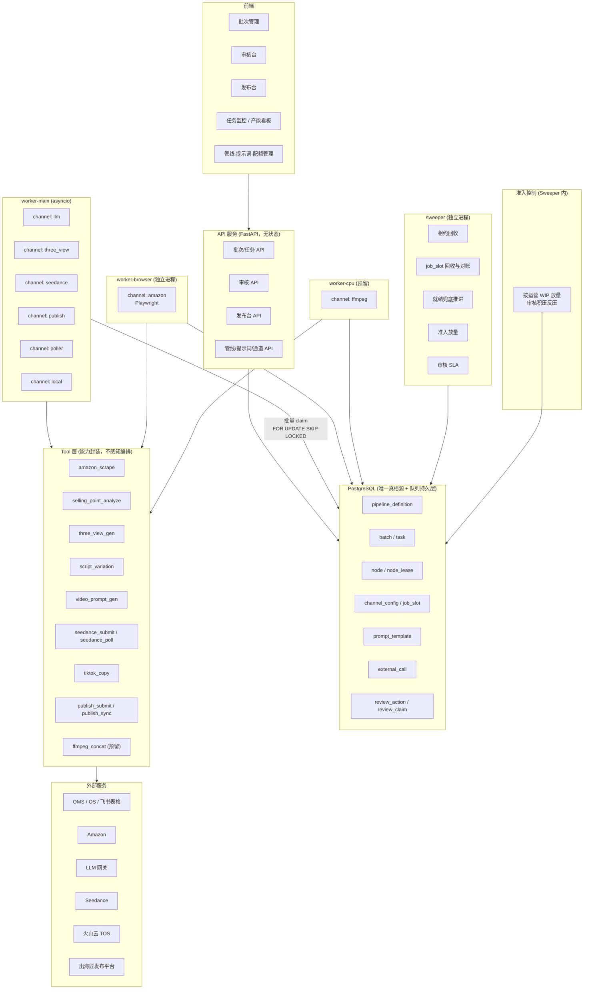
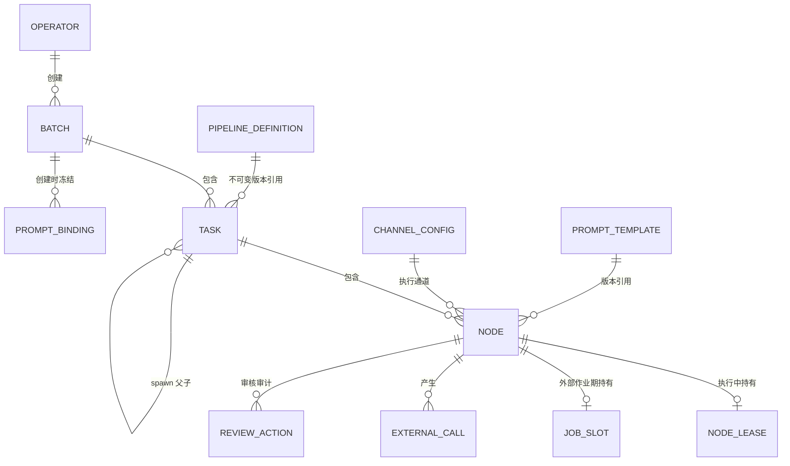
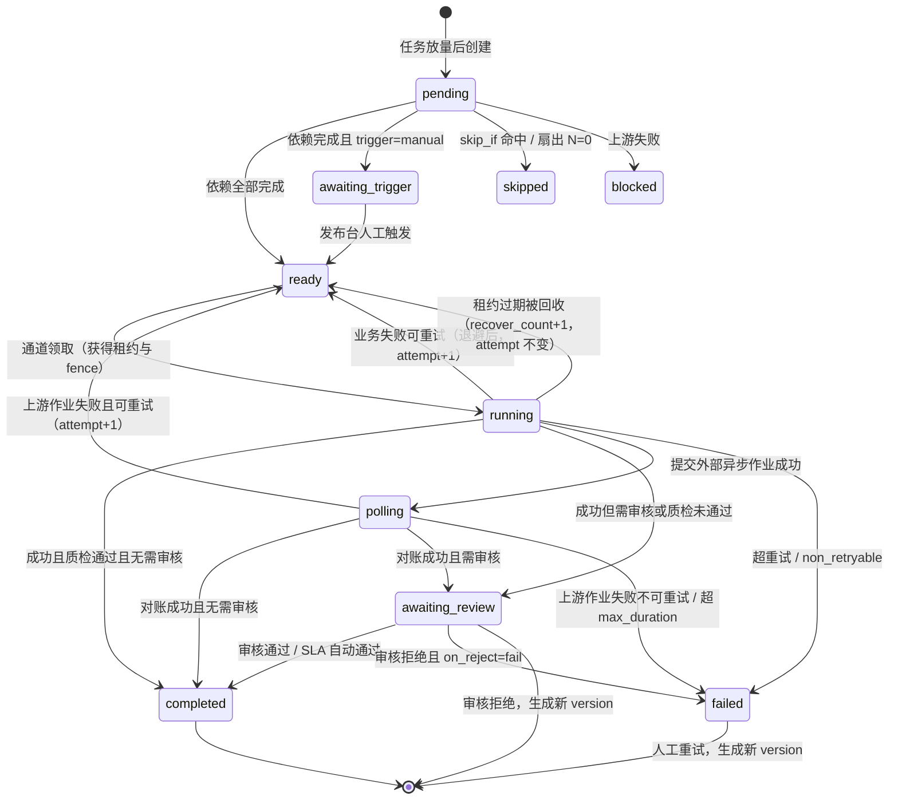

# TikTok 电商视频生产系统 — 架构设计 V2.0.0

> 状态：初稿，待讨论
> 输入依据：`自动化工具需求.md` 节点表、`架构设计-V1.0.0.md`、旧项目 `yunyi-aimv-studio` 实现、V1 架构评审结论
> 取代：`架构设计-V1.0.0.md`（该文档转为历史存档）

## V2 相对 V1 的变更起因

V1.0.0 基于「单一使用者、每天 100~200 任务、每天约 300 次人工审核」的假设。评审阶段补充的业务背景推翻了其中两条：

1. **多名运营独立登录使用**，各自建单、审核、发布，互不干扰
2. **人均每天生产 100+ 视频**，按当前运营人数总量为每天 500~1000 个视频
3. Amazon 主图抓取采用 **Playwright 浏览器抓取**，是重资源、易封禁环节，不是普通的 HTTP 调用

由此产生四类结构性修改：

| 类别 | V1 的问题 | V2 的处理 |
|---|---|---|
| 执行正确性 | 租约过期后可双写、幂等键在失败重试时撞唯一约束、就绪推进可把 `running` 打回 `ready`、批次暂停对 worker 无效 | 引入 fence 校验、幂等键含 `attempt`、条件更新推进、暂停在领取 SQL 生效（第 8 章） |
| 并发模型 | `concurrency_group` 靠「读时聚合计数」限流，行锁保护不了聚合约束，必然超发 | 改为**通道（Channel）模型**：队列的持久层在数据库，执行层在通道；并区分通道槽位、上游作业配额、请求速率三种语义（第 8、9 章） |
| 多运营 | 无 owner 维度、全局 FIFO、提示词全局单例、审核台无并发保护 | 引入 owner 维度、领取时按运营轮转、提示词批次级冻结、审核项领取机制（第 9、10、12、13 章） |
| 审核产能 | 按 300 次/天设计，新规模下为 2000 次/天，人力不可能承载 | 自动质检前置 + 默认抽检 + 审核 SLA + 审核吞吐反压上游（第 10 章） |

V1 中被完整保留的部分：数据库作为唯一真相源、节点级状态机与重跑、Tool 抽象与边界、管线定义数据化、提示词版本化、`external_call` 成本核算、`shard_index` 预留。

---

## 1. 背景与目标

### 1.1 业务目标

批量生产投放到 TikTok 的电商短视频（当前 15 秒，未来扩展 60 秒），覆盖从商品数据收集、参考图生成、脚本与提示词生成、视频生成、文案生成到发布的完整链路。系统由多名运营同时使用，每人独立建单、审核并交付自己的视频。

### 1.2 规模预期

以 5 名运营、人均每天 100+ 视频估算（运营人数待确认，见第 21 章 Q1）：

| 指标 | 当前 | 设计余量 |
|---|---|---|
| 每天视频任务数 | 500 ~ 1000 | 2000 |
| 每天产品准备任务数 | 50 ~ 100 | 300 |
| 单视频任务节点数 | 7（含 submit/poll 拆分） | 不限 |
| 每天节点执行记录 | 约 8000 ~ 10000（含重跑） | 25000 |
| `node` 表年增量 | 约 200 ~ 250 万行 | 需按月分区 |
| 每天 LLM 调用 | 约 3000 ~ 4000 次 | — |
| 每天 Seedance 作业 | 约 1000 ~ 1500 次（含重摇） | — |
| 每天理论审核项 | 约 2000 项（两个必审节点） | 需降至人工 200 ~ 400 项 |
| 单视频时长 | 15 秒 | 60 秒（需视频拼接） |

**两条必须校验的容量假设：**

- **Seedance 吞吐**：若上游允许 10 个作业并发、单作业约 4 分钟，则每小时约 150 个、按 16 小时计约 2400 个，可覆盖 1500 次/天含重摇的需求。若实际并发配额低于 8 或单作业超过 6 分钟，则需要与上游协商扩容，否则视频生成将成为硬瓶颈。
- **人工审核**：2000 个审核项按人均 400 项、单项 30 秒计算是每人每天 3.3 小时，运营将没有时间生产。因此自动质检与抽检不是优化项而是投产前提，目标是把人工审核项压到人均 40~80 项（20~40 分钟/天）。

### 1.3 设计目标

1. **批量可控**：一次发起 100+ 任务，并发严格受外部服务配额约束
2. **多运营互不干扰**：任一运营的批量提交不得饿死其他运营，产能与成本可按人核算
3. **状态透明**：任意任务可查看每个节点的输入、输出、耗时、重试、失败原因、所用提示词版本与操作人
4. **随处可恢复**：进程重启、机器崩溃后自动继续，且不重复扣费
5. **节点级重跑**：审核不通过时只重跑相关节点
6. **人工介入不占资源**：等待审核、等待发布触发、等待外部作业的节点均不占用计算资源与租约
7. **管线可配置**：增删节点、调整顺序、开关审核、调整并发，改配置不改代码
8. **故障物理隔离**：浏览器抓取、CPU 密集节点崩溃不得影响其他节点的执行与心跳
9. **审核可降级**：从全量审核到自动质检 + 抽检，按配置平滑过渡

### 1.4 非目标

- 不做实时/低延迟处理，全部为异步批处理
- 不做跨组织多租户隔离（内部工具），但**做运营级的数据归属、配额与权限**
- V1 阶段不做基于模型的质量评分，自动质检仅做规则校验
- 不做跨机房部署

---

## 2. 需求分析

### 2.1 业务节点梳理

#### 阶段一：产品准备（作用域 = 产品货号）

| 序号 | 节点 | 输入 | 输出 | 人工审核 |
|---|---|---|---|---|
| P1 | 批量建单 | 产品货号 | asin、运营货号、渠道 sku、产品编码、颜色、销售店铺、pid | 是 |
| P2 | Amazon 主图与卖点抓取 | asin | 主图（8 张，转存 TOS）、卖点原文、功能描述原文 | 否 |
| P3 | 卖点结构化分析 | 主图、卖点原文 | 结构化产品描述与卖点 | 否 |
| P4 | 三视图生成 | asin、商品主图 | 三视图（转存 TOS） | 是 |
| P5 | 任务生成 | 产品货号、所需视频数量 | 按 `颜色 × 视频数量` 派生视频任务 | 否 |

#### 阶段二：视频生成（作用域 = 单个视频任务）

| 序号 | 节点 | 输入 | 输出 | 人工审核 |
|---|---|---|---|---|
| V1 | 脚本裂化 | 分镜脚本模板、三视图、产品描述、卖点 | 新分镜脚本 | 是（可抽检） |
| V2 | 视频提示词生成 | 产品货号、颜色、三视图、裂变脚本、时长 | 中文产品分析、Seedance 提示词 | 是（可抽检） |
| V3a | 视频生成提交 | 三视图、视频提示词、时长 | 外部作业 ID | 否 |
| V3b | 视频生成对账 | 外部作业 ID | 视频（转存 TOS） | 否 |
| V4 | TikTok 文案 | 最终 Prompt、产品信息、最终视频 | 英文文案、合规标签 | 否 |
| V5a | 发布提交 | 视频、文案、发布账号、PID、发布方式、预约时间 | 会话 ID | 否，由发布人在发布台手动触发 |
| V5b | 发布状态对账 | 会话 ID | 发布状态、VID、发布链接 | 否 |

> 需求原表中的「分镜首帧图」节点已确认取消。
>
> V3 与 V5 均按「提交 + 对账」拆为两个节点，原因见 8.7：外部异步作业的等待期不应占用执行槽位与租约。

### 2.2 角色与权限

| 角色 | 职责 | 数据可见范围 |
|---|---|---|
| 运营 | 建单、发起批次、审核自己批次的产出、重跑 | 默认仅自己创建的批次；可配置为组内可见 |
| 审核人 | 审核指定节点的产出（可与运营同人） | 被授权的批次与节点 |
| 发布人 | 在发布台指定账号与时间触发发布 | 仅被授权账号所属店铺的视频 |
| 管理员 | 管线版本发布、提示词激活、通道配额调整、运营配额分配 | 全部 |

关键约束：**提示词激活与管线发布是全局动作**，必须限制为管理员操作，且已开始的批次不受影响（见第 12 章）。

### 2.3 关键业务特征

**特征一：链路以 IO 为主，但存在一个重资源环节。**
除 Amazon 抓取外，所有节点都是「调外部服务 → 等返回」。Amazon 抓取使用 Playwright，单浏览器实例占用数百 MB 内存，存在页面僵死、内存泄漏、验证码与封禁风险，必须作为独立运行时与独立进程承载。这是 V1「全链路 IO 密集、单进程即可」判断的修正点。未来 60 秒视频引入 FFmpeg 后新增第三类运行时。

**特征二：人工审核是真正的产能瓶颈，且随人数线性放大。**
两个必审节点在新规模下产生每天约 2000 个审核项。审核 UI 的批量能力、自动质检的拦截率、抽检率共同决定系统实际产能。等待审核期间必须零资源占用。

**特征三：真相源必须是数据库，不能是工作流引擎的执行历史。**
运营需要在前端直接修改节点产出（改脚本、改提示词）后从该节点重跑，属「外部随时改写中间态」模式，要求每个节点的输入输出都作为一等数据持久化。

**特征四：外部依赖异构，且配额语义不统一。**
这是并发设计的核心事实——同样是「限流」，三种语义完全不同：

| 语义 | 例子 | 约束对象 | 名额持有期 |
|---|---|---|---|
| 本地执行并发 | 所有节点 | 本进程同时运行的协程数 | 协程存活期 |
| 上游**作业**并发 | Seedance 同时 N 个生成作业、三视图服务 | 上游同时在跑的作业数 | 外部作业存活期，跨进程、跨重启 |
| 上游**请求**速率 | LLM 的 RPM/TPM、Amazon 页面访问速率 | 单位时间请求数 | 瞬时 |

对短调用（LLM、爬虫）前两者等价；对异步长作业（Seedance）两者相差一个数量级的时间尺度。V1 用单一的 `concurrency_group` 同时表达三种语义，是并发控制失准的根因。

**特征五：付费调用需要幂等保护。**
Seedance 与 LLM 按次计费，重复提交直接造成资金损失。崩溃、租约误判、超时误判三类场景都会触发重复提交。

**特征六：提示词需要版本化，且版本切换不能影响在途批次。**
多运营场景下，一人激活新提示词会改变他人正在执行的批次产出，破坏同批次一致性与可复盘性。

---

## 3. 架构选型

### 3.1 候选方案对比

| 维度 | Celery | Temporal | 数据库队列 + 通道执行（本方案） |
|---|---|---|---|
| 等待人工审核 | 无原语，需自行实现 | signal 可支持，需额外设计 | 状态字段，天然支持 |
| 外部改写中间态 | 无此概念 | 与确定性重放冲突，属反模式 | 天然支持 |
| 节点级重跑 | 需自行实现 | 需自行实现 | 天然支持 |
| 长任务重复执行风险 | 有（visibility timeout 重投） | 无 | 无（租约 + fence） |
| 按外部配额限流 | 需按队列固定消费者数，调整需重启 | 需自行实现 | 通道配置入库，在线可调 |
| 上游作业配额（跨进程） | 无 | 需自行实现 | `job_slot` 表 |
| 按使用者公平调度 | 无 | 需自行实现 | 领取 SQL 内按 owner 轮转 |
| 批次暂停 | 出队后无法拦截 | 支持 | 领取 SQL 内过滤 |
| CPU/浏览器隔离 | 多进程池，强项 | 支持 | 独立运行时通道 |
| 新增运维组件 | broker + result backend | Temporal 集群 | 无 |
| 多实例安全 | 是 | 是 | 是（`FOR UPDATE SKIP LOCKED` + fence） |
| 状态可观测 | 需额外建设 | Web UI，执行历史视角 | 业务表即状态，SQL 直查 |

### 3.2 选型结论

**采用「数据库作为队列持久层 + 通道作为队列执行层」的节点状态机。**

理由：

1. **出队决策依赖全局业务状态。** 本业务的出队条件是「优先级 + 通道名额未满 + 上游作业配额未满 + 速率令牌可用 + 批次未暂停 + 该运营 WIP 未超限 + 退避时间已到」。这是一个带多重条件的查询，数据库天然支持；MQ 的 FIFO/分区模型无法表达，只能出队后再判断并丢回，等于自己实现一遍调度。

2. **待执行项在被消费前会被人改写或作废。** 运营会改脚本、打回审核、重跑、取消批次。MQ 的语义是「入队即应被消费」，独立队列必然出现「消息还在队列里，但数据库说这条已取消/已换版本」，真相源分裂。数据库队列不存在这个缝：状态即队列。

3. **at-least-once 重投在付费节点上等于重复扣费。** Redis broker 的 visibility timeout、SQS 的自动重投时机不可控。自管租约 + fence 可控。

4. **规模上远未触及数据库队列的极限。** 每天 10000 个节点、集中在 10 小时内即约 0.3 个/秒；每个节点全生命周期约 10 次数据库写，合计约 3 QPS。单台 4C8G Postgres 有三个数量级的余量。真正需要防范的不是吞吐而是写放大（见 6.5 租约窄表）。

5. **通道模型让并发控制从分布式问题降级为本地问题。** 通道内的并发上限是进程内计数，零竞态；只有跨进程共享的上游作业配额才需要数据库协调，而这类节点只有两个（Seedance、发布）。

### 3.3 从旧项目 yunyi-aimv-studio 继承什么

旧项目实际有两层队列，V1 文档只描述了第一层。第二层 `ThreadedTaskQueueManager` 的设计是本方案通道模型的直接来源。

| 旧项目实现 | 本方案 | 说明 |
|---|---|---|
| `ThreadedTaskQueueManager`：按素材类型分独立队列，各配独立 `Semaphore` 与独立线程（`srt=45, image=20, audio=30, video=8, text=15`） | **演进为 Channel 模型** | 「按资源类型隔离队列 + 独立并发上限 + 独立执行单元」是旧项目最正确的设计，原样继承；队列载体由内存改为数据库 |
| `_async_worker_loop` 的槽位填充式领取：`available_slots = max_concurrent - len(running_tasks)`，按空位批量取任务 | **原样继承** | 由「从内存队列取」改为「批量 claim 一条 SQL」，循环结构不变 |
| 并发数从配置文件读取 | 提升为 `channel_config` 表 | 支持在线调整，无需重启 |
| `ArtworkQueue` 的 `(timestamp, artwork_id)` 延迟入队 | `node.next_run_at` | 语义相同，落库 |
| `ArtworkWorker`：跑完一个 stage 就重新入队，按新 stage 切换队列 | 节点级让出 | 思路正确，粒度由 stage 细化为 node |
| `ArtworkQueue._processing` 内存去重集合 | 租约 + `fence` | 支持多实例与崩溃恢复 |
| `ResultHandler` 与执行器解耦 | Runner 写回与 Tool 分离 | 保留 |
| `ToolInterface` + `ToolRegistry` | 原样继承 | 统一工具抽象 |
| `get_queue_type_for_stage` 硬编码 stage→queue 映射 | 节点声明 `channel`，部署配置绑定通道到进程 | 加节点无需改调度代码 |
| `material_producer` 的 `submit_batch` + `wait_for_batch(600)`、`pipeline.py` 的 `time.sleep(45)` / `time.sleep(30)` | `polling` 状态 + 批量对账通道 | 旧项目最大的性能缺陷：一个作品占满一个 worker 线程数十分钟，3 个线程即锁死吞吐 |
| 内存态 `retry_count` / `_processing` / `submit_time` | 全部落库 | 旧项目无法多实例、重启丢状态的根因 |
| `load_unfinished_artworks()` 重启重建队列、`assembling_work` 阶段重启即暂停 | 无需任何恢复动作 | 队列本身就在数据库 |
| `WorkStage` 枚举 + `run()` if 链 | 数据化节点 DAG | 节点增删无需改代码 |
| 无幂等保护，本地超时 10 分钟 < 上游 1800 秒 | `external_call` + 幂等键 + 超时约束 | 防重复扣费 |
| 关键字段埋在 JSON（`playscript`、`input_data`） | 高频字段提升为独立列 | 支持索引与约束 |

---

## 4. 总体架构



### 4.1 分层职责

| 层 | 职责 | 明确不做 |
|---|---|---|
| **Tool** | 一项业务能力的完整封装：接收业务参数，产出可直接使用的业务结果（含产物持久化） | 不读写编排状态，不感知自己处于哪条管线的哪个位置，不做重试与限流判断 |
| **Runner（通道循环）** | 按槽位批量领取节点、解析输入、注入依赖、调用 Tool、带 fence 写回、判定审核、推进就绪 | 不包含任何业务逻辑，不理解 Tool 的输出语义 |
| **Channel** | 承载一类外部依赖的执行：并发槽位、速率令牌、熔断、运行时隔离 | 不理解节点业务含义 |
| **Sweeper** | 租约与作业名额回收、就绪兜底、准入放量、审核 SLA、对账 | 不执行 Tool |
| **管线定义** | 声明节点、依赖、审核策略、通道、输入映射、质检规则 | 不含可执行代码 |
| **API** | 批次与任务管理、审核操作、发布触发、管线与提示词维护、状态查询 | 不执行任何节点 |

**Tool 的边界不是「不碰存储」，而是「不碰编排」。** 详见 5.3。

---

## 5. 核心概念模型

### 5.1 概念关系



### 5.2 概念定义

**Tool（工具）**
一项业务能力的完整封装。详见 5.3。

**PipelineDefinition（管线定义）**
声明式的节点 DAG，以 `(key, version)` 唯一标识。**一经发布不可修改**，变更需发布新版本。task 引用它即等价于持有快照。

**Channel（执行通道）**
一类外部依赖的执行单元，取代 V1 的 `executor` + `concurrency_group` 两个字段。一个通道 = 一个队列视图（`node` 表中 `channel = X AND status = 'ready'` 的集合）+ 一个并发槽位上限 + 一个速率令牌桶 + 一个熔断器 + 一种运行时（`asyncio` / `browser` / `process`）。节点只声明 `channel`，由 worker 启动参数决定哪个进程承载哪些通道。

**JobSlot（上游作业名额）**
表达「上游同时最多运行 N 个作业」这一跨进程配额。提交外部异步作业时占用，对账到终态时释放。与通道槽位的区别见 2.3 特征四与第 9 章。

**Lease（租约）**
节点执行权凭证，含 `owner` 与单调递增的 `fence`。所有状态写回必须校验 fence，防止租约误判导致的双写。

**Batch（批次）**
一次业务操作发起的任务集合，归属某个运营。承载批次级审核覆盖配置、提示词版本冻结。

**Task（任务）**
管线的一次执行实例，是进度与重跑的业务单位。
- `kind = product_prep`：作用域为产品货号
- `kind = video`：作用域为「产品货号 × 颜色 × 序号」，由 `product_prep` 的任务生成节点 spawn 产生

**Node（节点执行记录）**
状态与恢复的**唯一真相源**，同时是队列元素。主键 `(task_id, node_key, shard_index, version)`。重跑产生新 version，历史完整保留。

**Attempt（尝试序号）**
同一 version 内的业务重试计数，参与幂等键计算。区分两类重投：业务失败重试递增 `attempt`（产生新幂等键，重新提交上游），租约回收不递增 `attempt`（保持幂等键，接管已有上游作业）。这是防重复扣费的关键区分，详见 11.2。

**PromptTemplate（提示词模板）**
独立版本化管理。节点定义引用 `prompt_key`，**批次创建时冻结为具体版本**并记入 `batch.prompt_bindings` 与 `node.prompt_version_id`。

**ExternalCall（外部调用记录）**
每次付费/长耗时外部调用的记录，承载幂等保护与成本核算。

### 5.3 Tool 定义

#### 5.3.1 什么是 Tool

**Tool 是一项业务能力的完整封装：给它业务参数，它还你可以直接使用的业务结果。**

以「Amazon 主图提取」为例，完整语义是：给一个 ASIN，还我**稳定可访问**的主图 URL 列表、产品描述和卖点文本。其中「稳定可访问」意味着必须把 Amazon CDN 上会过期的图片下载、上传到自有 TOS、返回自有 URL。**这个持久化动作是能力语义的一部分**，不应剥离给 Runner。

同理 `seedance_poll` 返回的应是已落到自有 TOS 的视频 URL，而非 Seedance 的临时下载地址。

#### 5.3.2 边界：不碰编排，而非不碰存储

| 依赖类型 | 举例 | 是否允许 | 说明 |
|---|---|---|---|
| **基础设施服务** | `StorageService`、`HttpClient`、`LLMGateway`、`BrowserPool` | 允许 | 必须**构造注入**，不得自行读全局配置或新建实例 |
| **业务数据源** | 产品库、脚本模板库、店铺组数据、ASIN 抓取缓存 | 允许 | 通过 Repository 接口注入 |
| **编排状态** | `task`、`node`、`batch`、`job_slot`、`review_action` | **禁止** | 一旦触碰，Tool 即与本系统绑死，无法复用、无法单测，真相源分裂 |
| **限流与重试决策** | 「我要不要退避」「通道还有名额吗」 | **禁止** | 属通道与 Runner 职责 |
| **自身位置信息** | 「我是第几个节点」「我的上游是谁」 | **禁止** | 属 Runner 职责 |

三个具体收益：可注入内存版服务独立单测；可命令行单跑（`python -m tools.amazon_scrape --asin B0XXXX`）；可跨管线复用（同一 `seedance_submit` 服务 15 秒与 60 秒两条管线）。

#### 5.3.3 接口定义

```python
class Tool(ABC):
    name: str
    input_schema: dict      # JSON Schema，Runner 据此校验输入
    output_schema: dict     # JSON Schema，Runner 据此校验输出

    def __init__(self, *, storage: StorageService, http: HttpClient,
                 llm: LLMGateway | None = None, **deps):
        """依赖一律注入，不在内部读全局配置"""

    @abstractmethod
    async def execute(self, payload: dict, settings: ToolSettings) -> ToolResult:
        ...


@dataclass
class ToolSettings:
    """Runner 注入的运行期参数。Tool 只读，不得据此推断编排逻辑。"""
    timeout: int
    idempotency_key: str            # 传给上游做去重，不用于本地判断
    prompt: RenderedPrompt | None   # 已解析好的提示词（含版本），Tool 不自行查表
    trace_id: str
    attempt: int                    # 仅用于日志与上游去重，不得据此改变行为


@dataclass
class ToolResult:
    success: bool
    output: dict                    # 须符合 output_schema
    error_code: str | None = None   # 供 Runner 判定是否可重试
    error_message: str | None = None
    external_calls: list[ExternalCallRecord] = field(default_factory=list)
    metrics: dict = field(default_factory=dict)

    # 异步作业：submit 类 Tool 返回作业句柄，Runner 据此转入 polling 状态
    external_job: ExternalJobHandle | None = None

    # 对账类 Tool 返回「未就绪」时的下次检查建议
    not_ready: bool = False
    retry_after: int | None = None
```

说明：

- **`prompt` 由 Runner 解析后注入**，Tool 不查 `prompt_template` 表，版本选择逻辑集中在一处
- **`external_calls` 由 Tool 上报、Runner 落库**；幂等检查同理由 Runner 前置完成
- **`external_job` 是 V2 新增**：submit 类 Tool 只负责提交并返回作业 ID，不在内部等待。V1 的 `poll_after` 语义被 `polling` 状态取代（见 8.7）

#### 5.3.4 粒度原则

**Tool 的边界应切在「可能需要独立重跑或独立复用」的地方，以及「等待语义发生变化」的地方。**

| 切分 | 理由 |
|---|---|
| `amazon_scrape` / `selling_point_analyze` 拆开 | 爬虫是全链路最脆弱一环，提示词迭代时应能只重跑分析不重爬；抓取结果可跨任务跨运营缓存复用 |
| `seedance_submit` / `seedance_poll` 拆开 | 提交是秒级调用，等待是分钟级；合并会导致执行槽位与租约被长期占用 |
| `publish_submit` / `publish_sync` 拆开 | 定时发布从提交到出结果可能间隔数天 |
| 不把「下载图片」「上传 TOS」做成 Tool | 基础设施动作应作为注入的服务复用，升格为节点会让管线定义被无业务语义的节点淹没 |

#### 5.3.5 Tool 清单

| Tool | 能力 | 产物落地 | 通道 |
|---|---|---|---|
| `fetch_product_info` | 按产品货号汇集 asin、颜色、sku、pid、店铺等信息 | 无 | `local` |
| `amazon_scrape` | 按 asin 用 Playwright 抓取主图与卖点原文，图片转存 TOS，写入抓取缓存 | TOS（图片） | `amazon` |
| `selling_point_analyze` | 由主图与卖点原文产出结构化产品描述与卖点 | 无 | `llm` |
| `three_view_gen` | 由主图生成产品三视图，转存 TOS | TOS（图片） | `three_view` |
| `task_generate` | 按颜色与数量计算待生成的视频任务清单 | 无 | `local` |
| `script_variation` | 由脚本模板裂化出新分镜脚本 | 无 | `llm` |
| `video_prompt_gen` | 产出中文产品分析与 Seedance 提示词 | 无 | `llm` |
| `seedance_submit` | 提交视频生成作业，返回作业 ID | 无 | `seedance` |
| `seedance_poll` | 查询作业状态，就绪后下载并转存 TOS | TOS（视频） | `poller` |
| `tiktok_copy` | 产出英文文案与合规标签 | 无 | `llm` |
| `publish_submit` | 按指定账号与发布方式提交至出海匠，返回会话 ID | 无 | `publish` |
| `publish_sync` | 查询发布状态，直至拿到 VID 与发布链接 | 无 | `poller` |
| `shot_split` *(预留)* | 将长脚本拆分为多个分镜片段 | 无 | `llm` |
| `ffmpeg_concat` *(预留)* | 将多个视频片段拼接为成片，转存 TOS | TOS（视频） | `ffmpeg` |

---

## 6. 数据模型

### 6.1 operator（运营）

```sql
CREATE TABLE operator (
    id              VARCHAR(64) PRIMARY KEY,      -- 登录账号
    name            VARCHAR(128) NOT NULL,
    role            VARCHAR(32)  NOT NULL,        -- operator | reviewer | publisher | admin
    daily_task_quota INT,                         -- 每天最多发起的视频任务数，NULL 不限
    wip_limit       INT NOT NULL DEFAULT 20,      -- 同时在执行的 task 上限，准入控制用
    enabled         BOOLEAN NOT NULL DEFAULT TRUE,
    created_at      BIGINT NOT NULL
);
```

角色可叠加（一人既是运营也是审核人），实现为 `operator_role` 多行或 role 数组，此处简化为主角色 + 授权表。

### 6.2 pipeline_definition

```sql
CREATE TABLE pipeline_definition (
    id              BIGSERIAL PRIMARY KEY,
    key             VARCHAR(64)  NOT NULL,           -- product_prep / video_gen_15s / video_gen_60s
    version         INT          NOT NULL,
    name            VARCHAR(255) NOT NULL,
    definition      JSONB        NOT NULL,           -- 完整节点 DAG 定义，见第 7 章
    status          VARCHAR(16)  NOT NULL DEFAULT 'draft',  -- draft | published | deprecated
    note            TEXT,
    created_by      VARCHAR(64)  REFERENCES operator(id),
    created_at      BIGINT       NOT NULL,
    published_at    BIGINT,
    CONSTRAINT uk_pipeline_key_version UNIQUE (key, version)
);
```

`status = 'published'` 后禁止更新 `definition`，由应用层保证并加数据库触发器兜底。

### 6.3 batch

```sql
CREATE TABLE batch (
    id                  VARCHAR(36) PRIMARY KEY,
    name                VARCHAR(255) NOT NULL,
    kind                VARCHAR(32)  NOT NULL,       -- product_prep | video
    pipeline_def_id     BIGINT       NOT NULL REFERENCES pipeline_definition(id),
    
    review_overrides    JSONB        NOT NULL DEFAULT '{}',  -- {node_key: {mode, sample_rate}}
    prompt_bindings     JSONB        NOT NULL DEFAULT '{}',  -- {prompt_key: version_id}，创建时冻结

    status              VARCHAR(16)  NOT NULL,       -- pending|running|paused|completed|failed|cancelled
    total_tasks         INT          NOT NULL DEFAULT 0,
    created_by          VARCHAR(64)  NOT NULL REFERENCES operator(id),
    created_at          BIGINT       NOT NULL,
    updated_at          BIGINT       NOT NULL,
    finished_at         BIGINT
);

CREATE INDEX idx_batch_created_by ON batch(created_by, created_at DESC);
CREATE INDEX idx_batch_status  ON batch(status);
```

**`prompt_bindings` 是 V2 新增的关键字段**：批次创建时把所引用管线的全部 `prompt_key` 解析为具体版本并冻结，使得其他运营在批次执行期间激活新提示词不会影响本批次。

### 6.4 task

```sql
CREATE TABLE task (
    id               VARCHAR(36) PRIMARY KEY,
    batch_id         VARCHAR(36) NOT NULL REFERENCES batch(id) ON DELETE CASCADE,
    parent_task_id   VARCHAR(36) REFERENCES task(id),   -- spawn 来源
    kind             VARCHAR(32) NOT NULL,              -- product_prep | video
    pipeline_def_id  BIGINT      NOT NULL REFERENCES pipeline_definition(id),
    created_by       VARCHAR(64) NOT NULL REFERENCES operator(id),

    biz_key          VARCHAR(255) NOT NULL,             -- product_prep: {产品货号}
                                                        -- video: {产品货号}:{颜色}:{序号}
    context          JSONB        NOT NULL DEFAULT '{}',

    status           VARCHAR(24)  NOT NULL,             -- admitted_pending|running|awaiting_review
                                                        -- |completed|failed|paused|cancelled
    priority         INT          NOT NULL DEFAULT 100, -- 数字越小越优先
    progress         JSONB        NOT NULL DEFAULT '{}',

    error            TEXT,
    created_at       BIGINT NOT NULL,
    admitted_at      BIGINT,                            -- 准入放量时间
    started_at       BIGINT,
    finished_at      BIGINT,
    updated_at       BIGINT NOT NULL,

    CONSTRAINT uk_task_batch_bizkey UNIQUE (batch_id, biz_key)
);

CREATE INDEX idx_task_batch   ON task(batch_id);
CREATE INDEX idx_task_created_by ON task(created_by, status);
CREATE INDEX idx_task_admit   ON task(status, priority, created_at) WHERE status = 'admitted_pending';
CREATE INDEX idx_task_parent  ON task(parent_task_id);
```

`admitted_pending` 是 V2 新增状态：任务已创建但尚未放量，其节点不会被创建为 `ready`。准入控制据此实现按运营的 WIP 限制（见 9.6）。

### 6.5 node（核心表）

```sql
CREATE TABLE node (
    id                 BIGSERIAL PRIMARY KEY,
    task_id            VARCHAR(36) NOT NULL REFERENCES task(id) ON DELETE CASCADE,
    batch_id           VARCHAR(36) NOT NULL,             -- 冗余，供审核台/发布台/统计直接过滤
    created_by         VARCHAR(64) NOT NULL,             -- 冗余，供公平调度与产能统计
    node_key           VARCHAR(64) NOT NULL,
    shard_index        INT         NOT NULL DEFAULT 0,   -- 扇出分片序号，非扇出恒为 0
    version            INT         NOT NULL DEFAULT 1,   -- 重跑递增
    attempt            INT         NOT NULL DEFAULT 1,   -- 同 version 内业务重试序号，参与幂等键
    is_current         BOOLEAN     NOT NULL DEFAULT TRUE,

    -- 执行归属
    tool               VARCHAR(64) NOT NULL,
    channel            VARCHAR(32) NOT NULL,             -- FK 见下方 ALTER
    priority           INT         NOT NULL DEFAULT 100,

    -- 状态
    status             VARCHAR(24) NOT NULL,
        -- pending | awaiting_trigger | ready | running | polling
        -- | awaiting_review | completed | failed | blocked | skipped | cancelled

    -- 人工触发（trigger: manual 的节点）
    trigger_input      JSONB,
    triggered_by       VARCHAR(64),
    triggered_at       BIGINT,

    -- 审核
    review_mode        VARCHAR(16) NOT NULL DEFAULT 'off',-- off|required|sampling
    review_status      VARCHAR(16),                      -- pending|approved|rejected
    quality_gate       JSONB,                            -- 自动质检结果 {passed, failures[]}
    reviewed_by        VARCHAR(64),
    reviewed_at        BIGINT,
    review_comment     TEXT,
    edited             BOOLEAN     NOT NULL DEFAULT FALSE,

    -- 数据
    input_snapshot     JSONB,
    output             JSONB,
    prompt_version_id  BIGINT,                           -- FK 见 6.9 建表后补加
    idempotency_key    VARCHAR(64),

    -- 异步作业对账
    external_job_id    VARCHAR(128),
    next_poll_at       BIGINT,
    poll_count         INT         NOT NULL DEFAULT 0,
    polling_since      BIGINT,

    -- 执行控制
    retry_count        INT         NOT NULL DEFAULT 0,   -- 业务失败重试次数
    recover_count      INT         NOT NULL DEFAULT 0,   -- 租约回收次数，不影响 attempt
    max_retries        INT         NOT NULL DEFAULT 3,
    non_retryable      BOOLEAN     NOT NULL DEFAULT FALSE,
    next_run_at        BIGINT,
    error              TEXT,
    error_code         VARCHAR(64),

    created_at         BIGINT NOT NULL,
    started_at         BIGINT,
    finished_at        BIGINT,
    updated_at         BIGINT NOT NULL,

    CONSTRAINT uk_node UNIQUE (task_id, node_key, shard_index, version)
);

-- 每个 (task, node_key, shard) 只能有一个当前版本
CREATE UNIQUE INDEX uk_node_current
    ON node(task_id, node_key, shard_index) WHERE is_current;

-- channel_config 在 6.7 创建，外键在其后补加
ALTER TABLE node
    ADD CONSTRAINT fk_node_channel
    FOREIGN KEY (channel) REFERENCES channel_config(name);

-- 通道领取主索引
CREATE INDEX idx_node_claim
    ON node(channel, priority, created_at)
    WHERE status = 'ready';

-- 对账扫描
CREATE INDEX idx_node_poll
    ON node(next_poll_at)
    WHERE status = 'polling';

-- 审核台 / 发布台
CREATE INDEX idx_node_review
    ON node(batch_id, node_key, created_at)
    WHERE status = 'awaiting_review';
CREATE INDEX idx_node_trigger
    ON node(node_key, batch_id)
    WHERE status = 'awaiting_trigger';

-- 任务详情与产能统计
CREATE INDEX idx_node_task  ON node(task_id, node_key, shard_index, version);
CREATE INDEX idx_node_created_by ON node(created_by, finished_at) WHERE status = 'completed';
CREATE INDEX idx_node_idem  ON node(idempotency_key);
```

**设计要点：**

- `channel` 取代 V1 的 `executor` + `concurrency_group`。运行时类型由 `channel_config.runtime` 表达，节点无需关心。
- `attempt` 与 `recover_count` 分离：业务失败重试递增 `attempt`（新幂等键），租约回收只递增 `recover_count`（幂等键不变，接管原有上游作业）。V1 在 sweeper 回收时递增 `retry_count` 会改变幂等键，导致重复提交付费作业。
- `batch_id` / `created_by` 冗余：审核台、发布台、公平调度、产能统计都按这两个维度过滤，若每次都 join `task` 会让领取 SQL 与审核查询同时退化。
- `polling` 状态与 `next_poll_at`：异步作业等待期不占租约、不占通道槽位。
- `uk_node_current` 部分唯一索引：防止并发重跑产生两个当前版本（V1 缺此约束，而全部输入解析与审核查询都依赖 `is_current`）。
- **不做表分区，改用归档表。** 年增量约 250 万行对 Postgres 属小表，真正的体积压力来自 `input_snapshot` / `output` 的大 JSONB，已由 32KB 外置阈值解决（第 14 章）。而分区会与本表的两个正确性约束冲突：Postgres 要求分区表上的唯一索引必须包含全部分区键列，`uk_node` 与 `uk_node_current` 都无法包含 `created_at`（包含后即失去唯一语义）。这两个约束是防止重复分片与双当前版本的基础，优先级高于分区带来的运维便利。历史数据由 Sweeper 定期迁移到结构相同的 `node_archive` 表。

### 6.6 node_lease（租约窄表）

```sql
CREATE TABLE node_lease (
    node_id     BIGINT PRIMARY KEY REFERENCES node(id) ON DELETE CASCADE,
    owner       VARCHAR(128) NOT NULL,        -- host:pid:uuid
    fence       BIGINT       NOT NULL,        -- 每次领取递增，写回时校验
    lease_until BIGINT       NOT NULL,
    acquired_at BIGINT       NOT NULL
);

CREATE INDEX idx_node_lease_until ON node_lease(lease_until);

CREATE SEQUENCE node_fence_seq;
```

**为什么独立成表：** 心跳需要每几分钟更新一次 `lease_until`。若写在 `node` 表上，每次心跳都要更新该行涉及的十几个索引，在 Postgres 的 MVCC 下产生大量死行，几周后表与索引膨胀、autovacuum 压力显著。窄表只有两个索引，心跳走 HOT update 几乎零代价。这是数据库作为队列载体时最容易被忽视的成本。

### 6.7 channel_config（通道配置）

```sql
CREATE TABLE channel_config (
    name               VARCHAR(32) PRIMARY KEY,
    runtime            VARCHAR(16) NOT NULL,          -- asyncio | browser | process
    max_concurrent     INT         NOT NULL,          -- 通道槽位：本进程同时执行的节点数
    rate_limit_per_min INT,                           -- 请求速率上限，NULL 不限
    job_slot_limit     INT,                           -- 上游作业并发配额，NULL 表示无异步作业
    scan_limit         INT         NOT NULL DEFAULT 200,  -- 单次领取的扫描窗口
    per_owner_take     INT         NOT NULL DEFAULT 3,    -- 单次领取每个运营最多取几条
    poll_interval_ms   INT         NOT NULL DEFAULT 2000,
    enabled            BOOLEAN     NOT NULL DEFAULT TRUE,
    breaker_until      BIGINT,                        -- 熔断恢复时间，全实例共享
    breaker_fail_count INT         NOT NULL DEFAULT 0,
    note               VARCHAR(255),
    updated_at         BIGINT      NOT NULL
);

INSERT INTO channel_config
    (name, runtime, max_concurrent, rate_limit_per_min, job_slot_limit, note, updated_at) VALUES
    ('llm',        'asyncio', 24, 600,  NULL, 'LLM 网关，速率受 RPM/TPM 约束',    :now),
    ('amazon',     'browser',  2,  30,  NULL, 'Playwright 抓取，独立进程，需低速', :now),
    ('three_view', 'asyncio',  5, NULL,    5, '三视图生成服务',                   :now),
    ('seedance',   'asyncio',  8, NULL,   10, '视频生成提交，作业配额独立',        :now),
    ('publish',    'asyncio',  3,   20,    3, '出海匠发布平台',                   :now),
    ('poller',     'asyncio', 20, NULL, NULL, '异步作业批量对账',                 :now),
    ('local',      'asyncio', 10, NULL, NULL, '无外部依赖节点',                   :now),
    ('ffmpeg',     'process',  4, NULL, NULL, 'FFmpeg（CPU，预留）',              :now);
```

### 6.8 job_slot（上游作业名额）

```sql
CREATE TABLE job_slot (
    id              BIGSERIAL PRIMARY KEY,
    channel         VARCHAR(32)  NOT NULL REFERENCES channel_config(name),
    node_id         BIGINT       NOT NULL REFERENCES node(id) ON DELETE CASCADE,
    external_job_id VARCHAR(128),
    acquired_at     BIGINT       NOT NULL,
    expires_at      BIGINT       NOT NULL,     -- 兜底回收，防上游永不返回终态
    CONSTRAINT uk_job_slot_node UNIQUE (node_id)
);

CREATE INDEX idx_job_slot_channel ON job_slot(channel);
CREATE INDEX idx_job_slot_expire  ON job_slot(expires_at);
```

一行 = 一个在上游存活的作业。占用与释放规则见 9.3。

### 6.9 prompt_template

```sql
CREATE TABLE prompt_template (
    id           BIGSERIAL PRIMARY KEY,
    key          VARCHAR(64)  NOT NULL,
    version      INT          NOT NULL,
    content      TEXT         NOT NULL,
    variables    JSONB        NOT NULL DEFAULT '[]',
    model_config JSONB        NOT NULL DEFAULT '{}',
    status       VARCHAR(16)  NOT NULL DEFAULT 'draft',  -- draft | active | archived
    note         TEXT,
    created_by   VARCHAR(64)  REFERENCES operator(id),
    created_at   BIGINT NOT NULL,
    CONSTRAINT uk_prompt_key_version UNIQUE (key, version)
);

-- 同一 key 同时只能有一个 active 版本（仅决定「新批次默认用哪版」）
CREATE UNIQUE INDEX uk_prompt_active
    ON prompt_template(key) WHERE status = 'active';

ALTER TABLE node
    ADD CONSTRAINT fk_node_prompt
    FOREIGN KEY (prompt_version_id) REFERENCES prompt_template(id);
```

### 6.10 external_call

```sql
CREATE TABLE external_call (
    id               BIGSERIAL PRIMARY KEY,
    idempotency_key  VARCHAR(64)  NOT NULL UNIQUE,
    node_id          BIGINT       NOT NULL REFERENCES node(id) ON DELETE CASCADE,
    provider         VARCHAR(32)  NOT NULL,      -- seedance | llm | three_view | publish
    external_job_id  VARCHAR(128),
    status           VARCHAR(16)  NOT NULL,      -- submitted | succeeded | failed
    request_digest   VARCHAR(64),
    response         JSONB,
    cost_amount      NUMERIC(12,4),
    cost_unit        VARCHAR(16),
    submitted_at     BIGINT NOT NULL,
    finished_at      BIGINT
);

CREATE INDEX idx_external_call_node ON external_call(node_id);
CREATE INDEX idx_external_call_prov ON external_call(provider, submitted_at);
```

### 6.11 review_action / review_claim

```sql
-- 审核审计
CREATE TABLE review_action (
    id            BIGSERIAL PRIMARY KEY,
    node_id       BIGINT      NOT NULL REFERENCES node(id) ON DELETE CASCADE,
    action        VARCHAR(24) NOT NULL,   -- approve | approve_with_edit | reject | auto_approve
    operator      VARCHAR(64) NOT NULL,
    reject_reason VARCHAR(32),            -- 结构化拒绝原因分类
    comment       TEXT,
    output_before JSONB,
    output_after  JSONB,
    created_at    BIGINT NOT NULL
);

CREATE INDEX idx_review_action_node ON review_action(node_id);
CREATE INDEX idx_review_action_op   ON review_action(operator, created_at DESC);

-- 审核项领取：防多人重复审核同一批
CREATE TABLE review_claim (
    node_id      BIGINT      PRIMARY KEY REFERENCES node(id) ON DELETE CASCADE,
    operator     VARCHAR(64) NOT NULL,
    claimed_at   BIGINT      NOT NULL,
    expires_at   BIGINT      NOT NULL     -- 到期自动释放
);

CREATE INDEX idx_review_claim_expire ON review_claim(expires_at);
```

### 6.12 publish_account（发布账号与授权）

```sql
CREATE TABLE publish_account (
    id       VARCHAR(64)  PRIMARY KEY,    -- 出海匠侧账号标识
    name     VARCHAR(255) NOT NULL,
    shop     VARCHAR(128),
    pid      VARCHAR(128),
    enabled  BOOLEAN      NOT NULL DEFAULT TRUE,
    updated_at BIGINT     NOT NULL
);

CREATE TABLE publish_account_grant (
    account_id VARCHAR(64) NOT NULL REFERENCES publish_account(id) ON DELETE CASCADE,
    operator   VARCHAR(64) NOT NULL REFERENCES operator(id),
    created_at BIGINT      NOT NULL,
    PRIMARY KEY (account_id, operator)
);
```

### 6.13 asin_scrape_cache（抓取缓存）

```sql
CREATE TABLE asin_scrape_cache (
    asin            VARCHAR(32) PRIMARY KEY,
    main_images     JSONB NOT NULL,        -- 已转存 TOS 的 URL 列表
    raw_bullets     JSONB,
    raw_description TEXT,
    scraped_at      BIGINT NOT NULL,
    expires_at      BIGINT NOT NULL
);
```

Amazon 抓取是全链路最脆弱、最慢、最受配额限制的一环（通道槽位仅 2）。多运营场景下同一 ASIN 会被不同批次反复请求，缓存命中直接跳过抓取节点。命中判定由 `amazon_scrape` Tool 内部完成（缓存属业务数据源，Tool 可访问，见 5.3.2）。

---

## 7. 管线定义规范

### 7.1 顶层结构

```yaml
key: video_gen_15s
version: 1
name: TikTok 电商视频生成（15秒）
scope: video                 # product_prep | video
nodes: [...]
```

### 7.2 节点字段

| 字段 | 必填 | 说明 |
|---|---|---|
| `key` | 是 | 节点唯一标识，管线内唯一 |
| `name` | 是 | 展示名 |
| `tool` | 是 | 绑定的 Tool 名称 |
| `channel` | 是 | 执行通道名，须存在于 `channel_config` |
| `depends_on` | 否 | 依赖的节点 key 列表，默认为空 |
| `timeout` | 否 | 单次执行超时（秒），默认 600 |
| `max_retries` | 否 | 业务失败最大重试次数，默认 3 |
| `prompt_key` | 否 | 引用的提示词模板 key |
| `input` | 否 | 输入映射表达式 |
| `review` | 否 | 审核配置，见 7.5 |
| `quality_gate` | 否 | 自动质检规则，见 7.5 |
| `poll` | 否 | 异步作业对账配置，见 7.6 |
| `fan_out` | 否 | 扇出表达式，见 7.7 |
| `spawn_tasks` | 否 | 派生新任务的表达式，见 7.8 |
| `skip_if` | 否 | 条件跳过表达式 |
| `trigger` | 否 | `auto`（默认）\| `manual` |

### 7.3 完整示例：视频生成管线（15 秒）

```yaml
key: video_gen_15s
version: 1
name: TikTok 电商视频生成（15秒）
scope: video

nodes:
  - key: script_variation
    name: 脚本裂化
    tool: script_variation
    channel: llm
    depends_on: []
    timeout: 300
    prompt_key: script_variation
    input:
      script_template: "$.task.context.script_template"
      three_view_urls: "$.task.context.three_view_urls"
      product_desc:    "$.task.context.product_desc"
      selling_points:  "$.task.context.selling_points"
      color:           "$.task.context.color"
    quality_gate:
      - { field: "$.output.script",        rule: not_empty }
      - { field: "$.output.script",        rule: max_length, value: 2000 }
      - { field: "$.output.shots",         rule: array_size_between, value: [3, 8] }
      - { field: "$.output.total_seconds", rule: number_between,     value: [14, 16] }
      - { field: "$.output.script",        rule: no_forbidden_words, value: forbidden_zh }
    review:
      mode: sampling
      sample_rate: 0.2
      on_reject: rerun_self
      allow_edit: true
      sla_hours: 8

  - key: video_prompt
    name: 视频提示词生成
    tool: video_prompt_gen
    channel: llm
    depends_on: [script_variation]
    timeout: 300
    prompt_key: video_prompt_gen
    input:
      sku:             "$.task.context.sku"
      color:           "$.task.context.color"
      three_view_urls: "$.task.context.three_view_urls"
      script:          "$.nodes.script_variation.output.script"
      duration:        "$.task.context.duration"
    quality_gate:
      - { field: "$.output.seedance_prompt", rule: not_empty }
      - { field: "$.output.seedance_prompt", rule: length_between, value: [50, 1500] }
      - { field: "$.output.seedance_prompt", rule: no_forbidden_words, value: forbidden_en }
    review:
      mode: sampling
      sample_rate: 0.2
      on_reject: rerun_self
      allow_edit: true
      sla_hours: 8

  - key: video_submit
    name: 视频生成提交
    tool: seedance_submit
    channel: seedance
    depends_on: [video_prompt]
    timeout: 120
    max_retries: 2
    input:
      prompt:    "$.nodes.video_prompt.output.seedance_prompt"
      image_url: "$.task.context.three_view_urls[0]"
      duration:  "$.task.context.duration"
    poll:
      tool: seedance_poll
      backoff: [30, 30, 60, 60, 120]     # 秒，超出后按最后一项固定间隔
      max_duration: 5400                 # 最长等待 90 分钟
    review:
      mode: off

  - key: tiktok_copy
    name: TikTok 文案
    tool: tiktok_copy
    channel: llm
    depends_on: [video_submit]
    timeout: 300
    prompt_key: tiktok_copy
    input:
      final_prompt: "$.nodes.video_prompt.output.seedance_prompt"
      product_info: "$.task.context.product_info"
      video_url:    "$.nodes.video_submit.output.video_url"
    quality_gate:
      - { field: "$.output.caption",        rule: length_between, value: [20, 2200] }
      - { field: "$.output.compliance_tag", rule: not_empty }
    review:
      mode: off

  - key: publish_submit
    name: 发布提交
    tool: publish_submit
    channel: publish
    depends_on: [tiktok_copy]
    trigger: manual                # 发布人在发布台触发，见 10.7
    timeout: 600
    max_retries: 0                 # 重复发帖代价高，失败后由发布人决定是否重试
    input:
      video_url:      "$.nodes.video_submit.output.video_url"
      caption:        "$.nodes.tiktok_copy.output.caption"
      compliance_tag: "$.nodes.tiktok_copy.output.compliance_tag"
      account_id:     "$.trigger.account_id"
      pid:            "$.trigger.pid"
      publish_mode:   "$.trigger.publish_mode"     # now | scheduled
      schedule_at:    "$.trigger.schedule_at"
    poll:
      tool: publish_sync
      backoff: [60, 300, 900]
      max_duration: 259200                         # 定时发布最长等待 3 天
    review:
      mode: off
```

`video_submit` 的输出在 `poll` 完成后被合并写入同一节点的 `output`（对账 Tool 的输出与提交 Tool 的输出做浅合并），因此下游仍以 `$.nodes.video_submit.output.video_url` 引用，管线定义中不出现独立的对账节点。

### 7.4 输入映射表达式

采用简化的 JSONPath 子集：

| 表达式 | 含义 |
|---|---|
| `$.task.context.<path>` | 任务上下文字段 |
| `$.task.<field>` | 任务自身字段（id、biz_key、created_by 等） |
| `$.nodes.<key>.output.<path>` | 上游节点输出（`shard_index = 0`，`is_current` 版本） |
| `$.nodes.<key>[*].output.<path>` | 扇出节点全部分片的输出，按 `shard_index` 升序聚合为数组 |
| `$.nodes.<key>[i].output.<path>` | 指定分片的输出 |
| `$.shard.<path>` | 当前分片数据（仅扇出节点内可用） |
| `$.batch.<field>` | 批次字段 |
| `$.trigger.<field>` | 人工触发时填写的参数（仅 `trigger: manual` 节点内可用） |
| 字面量 | 非 `$.` 开头的值原样传递 |

**不支持函数、条件、运算。** 任何需要计算的逻辑都应放进 Tool。配置一旦图灵完备，就会变成难以调试的第二套代码。

**上游为 `skipped` 的解析规则：** 表达式解析到 `skipped` 节点的输出时返回 `null`；若该字段在 Tool 的 `input_schema` 中为必填，Runner 在执行前即判定为 `non_retryable` 配置错误并标记节点 `failed`，不会调用 Tool。管线校验阶段应对「依赖可能被 skip 的节点」给出告警。

### 7.5 审核与自动质检

```yaml
quality_gate:                  # 先执行，硬规则
  - { field: "$.output.script", rule: not_empty }
  - { field: "$.output.script", rule: max_length, value: 2000 }
review:
  mode: sampling               # off | required | sampling
  sample_rate: 0.2
  on_reject: rerun_self        # rerun_self | rerun_from:<node_key> | fail
  allow_edit: true
  group_by: shard              # shard | node，扇出节点的审核粒度
  sla_hours: 8                 # 超时未审核的处理，见 10.6
```

**判定顺序：自动质检 → 抽检采样 → 人工审核。**

1. **自动质检**在 Tool 返回后立即执行，规则清单见下表。任一规则失败则该节点**强制进入人工审核**（而非直接失败），并把失败项写入 `node.quality_gate`，审核台高亮展示。
2. 质检全部通过时，按 `review.mode` 判定：`off` 直接完成；`required` 进入审核；`sampling` 按 `sample_rate` 随机决定。
3. 有效审核模式在节点执行完成时计算并写入 `node.review_mode`，之后不再变化，保证「批次中途改配置」不会让已完成节点状态错乱，也能回答「这条为什么没被审核」。

可用质检规则（V1 阶段仅规则校验，不做模型评分）：

| 规则 | 参数 | 用途 |
|---|---|---|
| `not_empty` | — | 字段非空 |
| `max_length` / `length_between` | 长度 | 文案长度合规 |
| `array_size_between` | [min, max] | 分镜数量合理 |
| `number_between` | [min, max] | 时长、比例等数值范围 |
| `no_forbidden_words` | 词表 key | 违禁词、竞品词、平台敏感词 |
| `json_schema` | schema key | 结构化输出格式 |
| `url_reachable` | — | 图片/视频 URL 可访问（HEAD 请求） |
| `distinct_from` | 上游字段表达式 | 产出与输入不能雷同（防 LLM 复读） |

**三层审核配置合并，优先级从低到高：** 管线定义的 `review` 块 → 批次的 `review_overrides` → 单任务临时覆盖（重跑时强制审核或跳过）。

**`on_reject` 语义：**

| 值 | 行为 |
|---|---|
| `rerun_self` | 当前节点生成新 version（`attempt` 重置为 1）并置为 `ready`，下游节点重置为 `pending` |
| `rerun_from:<key>` | 指定上游节点生成新 version 并置 `ready`；该节点与被打回节点之间的所有节点，已执行过的生成新 version 后置 `pending`，未执行过的保持 `pending` |
| `fail` | 节点标记 `failed`，下游 `blocked`，任务标记 `failed` |

**`allow_edit` 是刚需。** 实际操作中运营更多是「改两个字然后通过」。`approve_with_edit` 会把编辑后内容写入 `node.output`、置 `edited = true`、在 `review_action` 记录修改前后内容，然后按正常通过流程推进下游。

### 7.6 异步作业对账（poll）

```yaml
poll:
  tool: seedance_poll          # 对账 Tool，与提交 Tool 成对
  backoff: [30, 30, 60, 60, 120]
  max_duration: 5400
  batch_size: 20               # 可选：该 provider 支持批量查询时的单次查询数
```

声明了 `poll` 的节点在提交成功后转入 `polling` 状态而非 `completed`，由 `poller` 通道按 `next_poll_at` 批量对账。执行语义见 8.7。

### 7.7 扇出（fan-out）

```yaml
  - key: shot_video
    name: 分镜视频生成
    tool: seedance_submit
    channel: seedance
    depends_on: [shot_split]
    fan_out: "$.nodes.shot_split.output.shots"   # 按该数组长度实例化 N 个分片
    input:
      prompt:   "$.shard.prompt"
      duration: "$.shard.duration"
    poll:
      tool: seedance_poll
      backoff: [30, 30, 60]
      max_duration: 5400
    review:
      mode: required
      group_by: node                             # 全部分片完成后一次性审核
```

**规则：**

1. **实例化时机**：上游全部完成、该节点即将变 `ready` 时，Runner 读取 `fan_out` 表达式指向的数组，在同一事务内创建 N 条 `node`（`shard_index = 0..N-1`）。该操作必须幂等——先检查是否已存在分片，避免就绪推进被重复触发时产生重复分片。
2. **就绪判定**：下游依赖扇出节点时，要求其**所有分片的当前 version 均为 `completed` 或 `skipped`**。
3. **重跑粒度**：单个分片可独立重跑，不影响兄弟分片；重跑后所有下游节点回到 `pending`。
4. **审核粒度**：`group_by: shard` 逐分片审核；`group_by: node` 时，全部分片执行完成后聚合为一个审核项——实现为在 `shard_index = 0` 的节点上挂 `awaiting_review`，其余分片置 `awaiting_review` 但在审核台聚合展示；审核动作在一个事务内更新全部分片。
5. **N = 0**：该节点全部分片标记 `skipped`，下游按 7.4 的 skipped 规则推进。

### 7.8 派生任务（spawn）

产品准备管线的最后一个节点按「颜色 × 视频数量」创建 N 个视频任务，属**跨任务扇出**：

```yaml
  - key: task_generate
    name: 任务生成
    tool: task_generate
    channel: local
    depends_on: [three_view, selling_point]
    spawn_tasks:
      kind: video
      pipeline_key: video_gen_15s
      target_batch: new                     # new | same，见下
      items: "$.nodes.task_generate.output.tasks"
      biz_key_template: "{sku}:{color}:{seq}"
      context_from_item: true
      chunk_size: 50                        # 分批创建，每批一个事务
```

**规则：**

1. **`target_batch: new`**：视频任务写入一个新建的 `kind = video` 批次（`pipeline_def_id` 为视频管线、`created_by` 继承产品准备批次），并在 `batch.note` 中记录来源批次。V1 让 spawn 出的 video 任务复用 product_prep 批次，与 `batch.kind` / `batch.pipeline_def_id` 单值字段矛盾。
2. **分批创建**：按 `chunk_size` 分多个事务提交，每批之间可中断可恢复。一个产品 10 色 × 10 视频 = 100 个 task，批量建单 100 个产品即上万行插入，单事务会造成长事务与锁膨胀。
3. **幂等**：依赖 `uk_task_batch_bizkey` 唯一约束，重跑或中断恢复时冲突即跳过。
4. **创建为 `admitted_pending`**：新任务默认不放量，由准入控制按运营 WIP 逐步放行（见 9.6）。这是控制审核洪峰与外部配额脉冲的关键。

### 7.9 产品准备管线

```yaml
key: product_prep
version: 1
name: 产品数据准备
scope: product_prep

nodes:
  - key: create_order
    name: 批量建单
    tool: fetch_product_info
    channel: local
    depends_on: []
    input:
      sku: "$.task.context.sku"
    quality_gate:
      - { field: "$.output.asin",   rule: not_empty }
      - { field: "$.output.colors", rule: array_size_between, value: [1, 20] }
    review:
      mode: required
      on_reject: rerun_self
      allow_edit: true
      sla_hours: 24

  # 爬取与分析拆为两个节点：爬虫最脆弱且结果可跨任务复用，
  # 提示词迭代时应能只重跑分析、不重爬（见 5.3.4）
  - key: amazon_scrape
    name: Amazon 主图与卖点抓取
    tool: amazon_scrape
    channel: amazon
    depends_on: [create_order]
    timeout: 600
    max_retries: 5
    input:
      asin: "$.nodes.create_order.output.asin"
    quality_gate:
      - { field: "$.output.main_images", rule: array_size_between, value: [1, 20] }
      - { field: "$.output.main_images", rule: url_reachable }
    review:
      mode: off

  - key: selling_point
    name: 卖点结构化分析
    tool: selling_point_analyze
    channel: llm
    depends_on: [amazon_scrape]
    timeout: 300
    prompt_key: selling_point_analyze
    input:
      main_images:     "$.nodes.amazon_scrape.output.main_images"
      raw_bullets:     "$.nodes.amazon_scrape.output.raw_bullets"
      raw_description: "$.nodes.amazon_scrape.output.raw_description"
    quality_gate:
      - { field: "$.output.product_desc",   rule: not_empty }
      - { field: "$.output.selling_points", rule: array_size_between, value: [1, 10] }
    review:
      mode: off

  - key: three_view
    name: 三视图生成
    tool: three_view_gen
    channel: three_view
    depends_on: [amazon_scrape]
    timeout: 900
    prompt_key: three_view_gen
    input:
      main_images: "$.nodes.amazon_scrape.output.main_images"
      sku:         "$.task.context.sku"
    quality_gate:
      - { field: "$.output.three_view_urls", rule: array_size_between, value: [1, 6] }
      - { field: "$.output.three_view_urls", rule: url_reachable }
    review:
      mode: required
      on_reject: rerun_self
      allow_edit: false
      sla_hours: 24

  - key: task_generate
    name: 任务生成
    tool: task_generate
    channel: local
    depends_on: [three_view, selling_point]
    input:
      sku:             "$.task.context.sku"
      video_count:     "$.task.context.video_count"
      colors:          "$.nodes.create_order.output.colors"
      three_view_urls: "$.nodes.three_view.output.three_view_urls"
      product_desc:    "$.nodes.selling_point.output.product_desc"
      selling_points:  "$.nodes.selling_point.output.selling_points"
      script_template: "$.task.context.script_template"
    spawn_tasks:
      kind: video
      pipeline_key: video_gen_15s
      target_batch: new
      items: "$.nodes.task_generate.output.tasks"
      biz_key_template: "{sku}:{color}:{seq}"
      context_from_item: true
      chunk_size: 50
    review:
      mode: off
```

---

## 8. 调度与执行

### 8.1 整体视图

队列不是一个独立组件，而是 `node` 表上的一组视图：

| 队列 | 定义 | 消费者 |
|---|---|---|
| 就绪队列 | `status = 'ready' AND channel = X` | 通道 X 的执行循环 |
| 对账队列 | `status = 'polling' AND next_poll_at <= now` | `poller` 通道 |
| 审核队列 | `status = 'awaiting_review'` | 人（审核台） |
| 触发队列 | `status = 'awaiting_trigger'` | 人（发布台） |
| 准入队列 | `task.status = 'admitted_pending'` | Sweeper 的准入器 |

执行链路上的控制点共五处，任一处不满足，节点就停在队列里不消耗资源：

```
准入放量(按运营 WIP) → 通道槽位 → 速率令牌 → 上游作业名额 → 熔断器
```

### 8.2 node 状态机



**两个刻意的设计：**

- **没有 `paused` 状态。** 批次与任务的暂停通过领取 SQL 过滤实现（8.4），不改写 node 状态。这样暂停/恢复是 O(1) 操作而非批量 UPDATE，也不会与重跑的状态变更竞争。代价是已进入 `polling` 的节点不受暂停影响——这是**有意的**：外部作业已经提交并占用了 `job_slot`，必须跟踪到终态才能释放名额，否则名额泄漏。
- **人工重试一律生成新 version。** V1 的状态图允许 `failed → ready` 原地重试，这会复用同一个幂等键，而该键对应的 `external_call` 记录已是 `failed` 状态，再次调用时插入唯一约束冲突，节点永久卡死。新 version 意味着新幂等键，语义干净。

### 8.3 通道执行循环

结构继承旧项目 `ThreadedTaskQueueManager._async_worker_loop` 的槽位填充式领取，把「从内存队列取」换成「批量 claim 一条 SQL」：

```python
async def channel_loop(ch: ChannelConfig):
    inflight: set[asyncio.Task] = set()
    bucket   = TokenBucket(ch.rate_limit_per_min)
    breaker  = Breaker(ch.name)

    while not shutting_down:
        inflight = {t for t in inflight if not t.done()}
        free = ch.max_concurrent - len(inflight)

        if free <= 0:
            await asyncio.sleep(0.1)             # 槽位满，等任务完成
            continue
        if breaker.is_open():
            await asyncio.sleep(breaker.remaining())
            continue

        # 三种配额取交集，决定这一轮最多领几条
        take = min(free, bucket.available(), await free_job_slots(ch))
        if take <= 0:
            await asyncio.sleep(0.5)
            continue

        nodes = await claim_batch(ch.name, take)
        if not nodes:
            await wait_notify_or_sleep(ch.poll_interval_ms)   # LISTEN/NOTIFY 唤醒
            continue

        for n in nodes:
            t = asyncio.create_task(execute_node(n, ch, bucket, breaker))
            inflight.add(t)
            t.add_done_callback(inflight.discard)

        ch.reload_if_changed()                   # 配置热更新，无需重启
```

```python
async def execute_node(node: Node, ch: ChannelConfig,
                       bucket: TokenBucket, breaker: Breaker):
    heartbeat = asyncio.create_task(renew_lease(node))
    try:
        payload = resolve_input(node)                  # 表达式解析
        prompt  = resolve_prompt(node)                 # 取批次冻结的提示词版本
        await persist_input_snapshot(node, payload, prompt)

        if reuse := await check_idempotency(node):     # 命中已成功的外部调用
            return await on_success(node, reuse.output)

        await bucket.consume(estimate_tokens(payload))

        tool   = tool_registry.get(node.tool)
        result = await asyncio.wait_for(
            tool.execute(payload, settings=build_settings(node)),
            timeout=node.timeout,
        )

        await record_external_calls(node, result.external_calls)

        if result.external_job is not None:            # 异步作业：转 polling
            return await on_submitted(node, result.external_job)

        validate_output_schema(node.tool, result.output)
        await on_success(node, result.output)           # 质检 + 审核判定 + 推进下游
        breaker.on_success()
    except Exception as e:
        breaker.on_failure(e)
        await on_failure(node, e)
    finally:
        heartbeat.cancel()
```

**核心约束：执行体内绝不 sleep 等待外部完成。**

| 等待对象 | 处理 |
|---|---|
| 等同步调用返回 | 保持 `running` + 租约续期，Tool 内部 await |
| 等外部异步作业 | 置 `polling`，**释放租约与通道槽位**，保留 `job_slot` |
| 等人工审核 | 置 `awaiting_review`，完全释放 |
| 等人工触发 | 置 `awaiting_trigger`，完全释放 |

> 旧项目的核心缺陷正在于此：`pipeline.py` 用 `while True: time.sleep(45)` 在 worker 线程里轮询素材状态，`material_producer` 用 `wait_for_batch(timeout=600)` 阻塞等待整批素材，一个作品占满一个线程数十分钟，3 个 default worker 即锁死整个系统吞吐。

**为什么不做内存预取（`prefetch = 0`）：** 旧项目必须有内存队列（没有别处可存）。本方案 claim 多少就立即执行多少，不在内存里二次排队。预取的害处有二：被 claim 的节点在内存排队期间已占租约，进程崩溃需等租约过期才能被接管；新到达的高优先级节点会排在预取队列之后，优先级失效。

**为什么不用 `Semaphore`：** 旧项目同时使用 `available_slots` 与 `Semaphore(concurrency)`，两者冗余。既然领取条数受 `free` 限制且领到即执行，`len(inflight)` 本身就是并发控制。少一个同步原语少一类 bug。

### 8.4 批量领取（claim_batch）

```sql
WITH cand AS (
    SELECT n.id,
           row_number() OVER (PARTITION BY n.created_by
                              ORDER BY n.priority, n.created_at) AS rn
    FROM node n
    JOIN task  t ON t.id = n.task_id
    JOIN batch b ON b.id = n.batch_id
    WHERE n.channel = :channel
      AND n.status  = 'ready'
      AND (n.next_run_at IS NULL OR n.next_run_at <= :now)
      AND b.status  = 'running'                      -- 批次暂停在此生效
      AND t.status  NOT IN ('paused', 'cancelled')   -- 任务暂停在此生效
    ORDER BY n.priority, n.created_at
    LIMIT :scan_limit
)
SELECT n.*
FROM node n
WHERE n.id IN (SELECT id FROM cand WHERE rn <= :per_owner_take)
ORDER BY n.priority, n.created_at
FOR UPDATE OF n SKIP LOCKED
LIMIT :take;
```

领取成功后在同一事务内：

```sql
-- 1) 发放租约与 fence
INSERT INTO node_lease (node_id, owner, fence, lease_until, acquired_at)
VALUES (:id, :worker_id, nextval('node_fence_seq'), :now + :lease_ttl, :now)
ON CONFLICT (node_id) DO UPDATE
   SET owner = :worker_id,
       fence = nextval('node_fence_seq'),
       lease_until = :now + :lease_ttl,
       acquired_at = :now;

-- 2) 置运行态
UPDATE node
SET status = 'running', started_at = COALESCE(started_at, :now), updated_at = :now
WHERE id = :id AND status = 'ready';
```

**四个要点：**

1. **`row_number() OVER (PARTITION BY created_by)`** 实现按运营轮转：每轮每人最多取 `per_owner_take` 条。没有这一句，一个运营提交 100+ 视频就会按 FIFO 独占整条通道数小时，其他人的任务全部排在后面。
2. **`join batch/task`** 让暂停真正生效。V1 的领取 SQL 只看 `node`，暂停批次后 worker 照样继续执行并烧钱。
3. **`LIMIT :take` 批量领取**取代 V1 的 `LIMIT 1`，把数据库往返从「每节点一次」降为「每批一次」，并且不再需要 V1 那个每次领取都要跑一遍的 `running_by_group` 全表聚合。
4. **`scan_limit` 限制扫描窗口**，防止某通道堆积上万条 `ready` 时窗口函数的排序代价失控。

### 8.5 租约、心跳与 fence

| 机制 | 规则 |
|---|---|
| 租约时长 | `lease_ttl = min(node.timeout × 1.5, 3600)` |
| 心跳续期 | 执行中每 `lease_ttl / 3` 更新一次 `node_lease.lease_until`（窄表，HOT update） |
| 过期回收 | Sweeper 将 `node.status='running'` 且 `node_lease.lease_until < now` 的记录置回 `ready`，`recover_count + 1`，**`attempt` 不变** |
| 写回校验 | 所有终态写回必须校验 fence |

```sql
-- fence 校验：影响行数为 0 则说明租约已被回收，本次结果必须丢弃
UPDATE node
SET status = :status, output = :output, finished_at = :now, updated_at = :now
WHERE id = :id
  AND EXISTS (
        SELECT 1 FROM node_lease
        WHERE node_id = :id AND owner = :me AND fence = :my_fence);
```

**为什么必须有 fence：** 心跳漏更新并不代表 worker 已死——事件循环卡顿、GC 停顿、数据库连接抖动都会造成漏更。此时 Sweeper 回收租约、另一个 worker 领取执行，两个 worker 同时在跑同一节点。若无 fence 校验，两者都会写回 `output`、都会触发 `advance_task`、都会执行 `spawn_tasks`。V1 缺少这一层，是「数据库状态机」方案最典型的漏项。

写回被 fence 拒绝时记录 `node_write_fenced` 指标并告警：该指标持续不为零说明心跳不可靠（通常是事件循环被同步阻塞调用卡住，例如 Tool 里误用了 Playwright 同步 API 或 `requests`）。

### 8.6 就绪推进（advance_task）

每当一个 node 进入 `completed` 或 `skipped`，在同一事务内推进该任务：

```python
def advance_task(session, task_id: str):
    task       = lock_task(session, task_id)          # 行锁，避免并发推进
    definition = load_pipeline_definition(session, task)
    done       = load_done_node_keys(session, task_id)   # completed + skipped，含扇出全分片判定

    for nd in definition.nodes:
        if not all(dep in done for dep in nd.depends_on):
            continue

        if nd.skip_if and evaluate(nd.skip_if, ctx):
            transition(session, task_id, nd.key, frm='pending', to='skipped')
            continue

        if nd.fan_out:
            materialize_shards_idempotent(session, task_id, nd)   # 已存在则跳过

        target = 'awaiting_trigger' if nd.trigger == 'manual' else 'ready'
        transition(session, task_id, nd.key, frm='pending', to=target)

    refresh_task_progress(session, task_id)
```

**`transition` 必须是条件更新：**

```sql
UPDATE node SET status = :to, updated_at = :now
WHERE task_id = :task_id AND node_key = :key AND is_current
  AND status = :frm;        -- 关键：只有仍处于 pending 的节点才被推进
```

**为什么这是硬性要求：** 推进逻辑每次都遍历全部节点定义，而「依赖已满足」的节点集合里必然包含那些已经是 `running` / `polling` / `awaiting_review` / `completed` 的节点。若不带 `status = 'pending'` 条件，一次推进就会把正在执行的付费节点打回 `ready`，被重复领取、重复提交。Sweeper 的兜底全量扫描会把这个风险放大到每分钟一次。V1 的伪码没有体现该条件。

事件驱动推进保证及时性，Sweeper 每分钟全量扫一次作为兜底，处理事务回滚等边缘情况导致的漏推进。

### 8.7 异步作业对账（polling）

这是替代旧项目 `time.sleep(45)` / `wait_for_batch(600)` 的方案，也是 V1「Seedance 单节点 `timeout: 1800` 死等」的修正。

**提交阶段**（`seedance` 通道）：

```python
async def on_submitted(node, job: ExternalJobHandle):
    async with transaction():
        assert_fence(node)
        await acquire_job_slot(node, channel=node.channel,   # 占上游作业名额
                               job_id=job.id,
                               expires_at=now() + node.poll.max_duration)
        node.external_job_id = job.id
        node.status          = 'polling'
        node.polling_since   = now()
        node.next_poll_at    = now() + node.poll.backoff[0]
        await release_lease(node)          # 释放租约与通道槽位
```

**对账阶段**（`poller` 通道，批量）：

```python
async def poll_round(ch: ChannelConfig):
    nodes = await claim_polling_batch(limit=ch.max_concurrent)   # next_poll_at <= now
    for provider, group in group_by_provider(nodes):
        tool     = tool_registry.get(group[0].poll.tool)
        statuses = await tool.query_many([n.external_job_id for n in group])

        for node, st in zip(group, statuses):
            if st.ready:
                out = await tool.fetch_and_persist(node, st)   # 下载 + 转存 TOS
                await release_job_slot(node)
                await on_success(node, merge(node.output, out))
            elif st.failed:
                await release_job_slot(node)
                await on_failure(node, st.error)               # attempt+1，可能重新提交
            elif now() - node.polling_since > node.poll.max_duration:
                await release_job_slot(node)
                await on_failure(node, PollTimeout())
            else:
                node.poll_count  += 1
                node.next_poll_at = now() + backoff_at(node.poll.backoff, node.poll_count)
```

**四点收益：**

1. **上游作业配额语义正确**：Seedance 的 10 个名额被「上游真正在跑的作业」占用，而不是被「本地等待的协程」占用
2. **等待期零占用**：不占通道槽位、不占租约、不占协程，进程重启无影响
3. **支持超长等待**：定时发布可等 3 天，与 15 秒视频等 5 分钟共用同一机制
4. **批量查询**：一次 API 调用查多个作业状态。V1 让每条 `publish_sync` 各自走一遍 `claim` 并计入 `publish` 组并发，上千条排期积压时会把真正要提交的 `publish_submit` 完全挤掉

`job_slot.expires_at` 是兜底：上游永不返回终态时由 Sweeper 回收名额，否则泄漏几次后通道就永久「满」。

### 8.8 重试、退避与 attempt 语义

```python
BACKOFF = [30, 120, 600]   # 秒

async def on_failure(node, error):
    code = classify(error)
    async with transaction():
        assert_fence(node)                       # 租约已被回收则不写
        node.error, node.error_code = str(error), code

        if is_non_retryable(code) or node.retry_count + 1 > node.max_retries:
            node.status        = 'failed'
            node.non_retryable = is_non_retryable(code)
            node.retry_count  += 1
            propagate_failure(node)              # 下游置 blocked，任务置 failed
        else:
            node.retry_count += 1
            node.attempt     += 1                # 新幂等键 → 允许重新提交上游
            node.status       = 'ready'
            node.next_run_at  = now() + BACKOFF[min(node.retry_count - 1, len(BACKOFF) - 1)]
            await release_lease(node)
```

**三类重投的区分**（V2 的关键修正）：

| 触发原因 | `attempt` | 幂等键 | 上游行为 |
|---|---|---|---|
| 业务失败重试（5xx、超时判失败） | +1 | 变化 | 重新提交 |
| 租约过期回收（进程崩溃、心跳漏更） | 不变 | 不变 | 命中 `external_call.status='submitted'`，**接管原作业**继续对账 |
| 人工重试 / 审核打回 | version+1，attempt 重置 1 | 变化 | 重新提交 |

V1 在 Sweeper 回收时递增 `retry_count`，而 `retry_count` 参与幂等键计算，导致崩溃恢复后生成新键、重新提交付费作业——这是最隐蔽也最贵的一个缺陷。

**不可重试错误分类：**

| 类别 | 示例 | 处理 |
|---|---|---|
| 凭据缺失/失效 | API Key 未配置、token 过期 | `non_retryable`，需人工处理 |
| 配额/白名单拒绝 | 账号不在白名单、额度耗尽 | `non_retryable` |
| 内容合规拒绝 | 版权拦截、违规内容 | `non_retryable`，需换素材 |
| 输入校验失败 | schema 不匹配、必填缺失（含依赖被 skip） | `non_retryable`，属配置错误 |
| 浏览器被封禁/验证码 | Amazon 反爬 | 可重试，但触发通道熔断降速 |
| 上游 5xx / 超时 / 限流 | — | 可重试 |

### 8.9 失败传播

```python
def propagate_failure(node):
    # 下游（含间接下游）标记 blocked，与 failed 区分：blocked 是「因上游而不可执行」
    for key in downstream_closure(node.task, node.node_key):
        transition(task_id, key, frm='pending', to='blocked')
    set_task_status(node.task_id, 'failed')
```

`blocked` 与 `failed` 分开的价值：监控与告警只关注 `failed`（真正需要人介入的根因节点），审核台与任务详情用 `blocked` 说明「这些节点没跑是因为上游失败」，避免一个根因产生十条告警。重跑上游成功后，`blocked` 节点由 `advance_task` 置回 `pending` 再进入正常流程。

### 8.10 崩溃恢复与优雅停机

**恢复无需任何特殊动作。** 通道循环每轮都在扫描 `ready`，Sweeper 回收失效租约，`polling` 节点由 `poller` 按 `next_poll_at` 继续对账。

对比旧项目：`initialize_production_system` 启动时必须 `load_unfinished_artworks()` 把未完成作品重新入队，还要特判「处于 `assembling_work` 阶段的作品直接置 PAUSED」（因为用户 token 缓存在内存中、重启即丢），并调用 `_fix_pending_review_materials()` 把卡在 RUNNING 的素材改回 PENDING。这些恢复逻辑在本方案中全部不需要——队列和状态本来就在数据库里。

**优雅停机：**

```
收到 SIGTERM
  → 各通道停止 claim（继续处理 inflight）
  → 等待 inflight 完成，上限 N 秒（默认 60）
  → 未完成的：删除其 node_lease，node 置回 ready（不计 retry_count）
  → 已提交外部作业的：保持 polling，job_slot 不释放，由其他实例的 poller 接管
  → 退出
```

旧项目 `stop(graceful=True)` 需要 `await queue.join()` 等内存队列清空，否则队列内容丢失。本方案不需要清空：没执行的节点仍在数据库队列里。

### 8.11 Sweeper 职责清单

Sweeper 独立进程部署（V1 将其内置于 worker，worker 挂掉后无人回收租约，最坏空转一小时）。多实例运行时靠数据库行锁与幂等保证安全。

| 周期 | 任务 | 说明 |
|---|---|---|
| 10s | 准入放量 | 按运营 WIP 把 `admitted_pending` 任务放量（9.6） |
| 30s | 租约回收 | `running` 且租约过期 → `ready`，`recover_count + 1` |
| 30s | 就绪兜底推进 | 全量扫描依赖已满足但仍 `pending` 的节点 |
| 60s | `job_slot` 过期回收 | `expires_at < now` 的名额释放并把节点判失败 |
| 60s | `job_slot` 对账 | 名额数与 `polling` 节点数不一致时校正（防泄漏） |
| 60s | 审核 SLA | 超 `sla_hours` 未审核的按配置自动通过或升级告警（10.6） |
| 60s | `review_claim` 过期释放 | 审核人打开页面后离开，释放占用 |
| 5min | 熔断半开试探 | `breaker_until` 到期后重置计数 |
| 1h | 通道饱和度统计 | 写入监控指标 |
| 1d | 归档 | 已完成超过 12 个月的任务，其 `node` 行迁移至 `node_archive` |

---

## 9. 并发与流量控制

### 9.1 三种配额语义

V1 用单一的 `concurrency_group` 同时表达三件事，是并发失准的根因。V2 显式区分：

| 语义 | 约束对象 | 实现 | 作用范围 | 适用通道 |
|---|---|---|---|---|
| **通道槽位** | 本进程同时执行的节点数 | 进程内 `len(inflight)` 计数 | 单进程 | 全部 |
| **上游作业配额** | 上游同时运行的作业数 | `job_slot` 表 | 全局，跨进程跨重启 | `seedance`、`three_view`、`publish` |
| **请求速率** | 单位时间请求数 / token 数 | 通道内令牌桶 | 单进程（配额需按实例数分摊） | `llm`、`amazon`、`publish` |

对短调用（LLM、爬虫）通道槽位与上游并发等价，槽位即足够。对异步长作业（Seedance）两者的时间尺度差一个数量级，必须分离。

### 9.2 通道槽位

槽位是进程内的整数计数，零竞态、零泄漏、无需校正。这是相对 V1 最重要的简化：

> V1 要维护的不变量是 `count(node WHERE status='running' AND concurrency_group=X) <= max_concurrent`，这是**跨行聚合约束**，而 `FOR UPDATE SKIP LOCKED` 只提供**行级互斥**。两个 worker 各锁不同的 node 行互不阻塞，各自读到的聚合计数都是事务快照里的旧值，于是同时判定「还有名额」并同时领取。超发是必然的，只是概率问题。要补救就得引入计数器行、再引入「名额释放必须覆盖 completed/failed/poll让出/租约回收/pause/cancel 全部出口」、再引入 Sweeper 定期用真实计数校正——三层补丁，每层都能漏。
>
> 通道模型把这个分布式不变量降级为本地不变量：`free = max_concurrent - len(inflight)`，一行代码，不可能出错。

代价是多实例下本地槽位不构成全局上限（全局 = 槽位 × 实例数）。对 `llm`、`local`、`poller` 这类超限只是 429 重试的通道无所谓；对付费或不可逆的通道由 `job_slot` 兜底（9.3）。

### 9.3 上游作业配额（job_slot）

```python
async def free_job_slots(ch) -> int:
    if ch.job_slot_limit is None:
        return INF
    used = await count_job_slots(ch.name)
    return max(0, ch.job_slot_limit - used)

async def acquire_job_slot(node, channel, job_id, expires_at):
    # UNIQUE(node_id) 保证同一节点不会占用两个名额
    await insert_job_slot(channel, node.id, job_id, expires_at)
```

**占用与释放的完整出口清单**（漏掉任何一条都会造成名额泄漏，进而通道永久「满」）：

| 出口 | 动作 |
|---|---|
| 对账到成功 | 释放 |
| 对账到失败 | 释放 |
| 超 `poll.max_duration` | 释放 + 节点判失败 |
| `expires_at` 到期（上游永不回终态） | Sweeper 释放 + 节点判失败 |
| 任务/批次被取消 | 释放（取消操作显式调用） |
| node 被删除 | `ON DELETE CASCADE` |

由于释放路径多，Sweeper 每分钟做一次对账：`job_slot` 行数应等于该通道 `polling` 状态节点数，不一致则以 node 状态为准校正。

领取阶段的 `take = min(free, tokens, free_job_slots)` 保证不会领取超过作业配额的节点——避免「领了却拿不到名额」的空转。

### 9.4 请求速率（令牌桶）

通道内令牌桶，按 `rate_limit_per_min / 实例数` 配置：

- **LLM**：真实上限通常是 TPM 而非 RPM，`bucket.consume(estimate_tokens(payload))` 按预估 token 数扣多个令牌；实际用量从响应回填用于校准
- **Amazon**：约束是页面访问速率而非并发数。通道槽位为 2，但速率限制为 30 次/分钟才是防封禁的关键。V1 的 `concurrency_group` 表虽有 `rate_limit_per_min` 字段，但领取 SQL 从未使用它，属半成品
- **发布平台**：限制提交频率，避免同账号集中发帖触发风控

### 9.5 熔断

```python
class Breaker:
    def on_failure(self, err):
        if not is_breaker_trigger(err):     # 仅对封禁、连续 5xx、限流触发
            return
        self.fails += 1
        if self.fails >= THRESHOLD:         # 默认 5
            cooldown = min(60 * 2 ** (self.rounds), 1800)
            persist_breaker_until(self.channel, now() + cooldown)   # 写库，全实例共享
            self.rounds += 1

    def on_success(self):
        self.fails = 0
        self.rounds = 0
```

熔断状态写入 `channel_config.breaker_until` 而非仅存本地，使多个实例同时降速。半开策略：冷却到期后先放行 1 条试探，成功则完全恢复，失败则冷却时间翻倍（上限 30 分钟）。

这比 V1「`amazon` 节点 `max_retries: 5` 配 30/120/600 退避」要好得多——后者在被封禁时是持续硬撞，会加深封禁。

### 9.6 准入控制与公平调度

两个不同层次，解决两个不同问题：

**第一层：准入放量（Sweeper 内，任务级）**

```python
def admit_tasks():
    for op in enabled_operators():
        running = count_tasks(owner=op.id, status='running')
        free    = op.wip_limit - running
        if free <= 0:
            continue
        if review_backlog(op.id) > op.wip_limit * 2:    # 审核积压则停止放量
            continue
        for task in next_admitted_pending(owner=op.id, limit=free):
            with transaction():
                task.status      = 'running'
                task.admitted_at = now()
                create_initial_nodes(task)      # 首批节点置 ready
```

解决三个问题：

1. **一个运营提交 100+ 视频不再独占全部外部配额**：同时在跑的任务数受 `wip_limit` 约束
2. **审核项不再洪峰式涌入**：100 个视频一起跑完 `script_variation` 会同时产生 100 个审核项，运营被迫批量审；按 WIP 放量后审核项持续均匀产出
3. **成片持续产出**而非批量脉冲，运营可以边审边发

**第二层：领取轮转（通道内，节点级）**

即 8.4 的 `row_number() OVER (PARTITION BY created_by)`。即使准入层已放量，多个运营的节点仍会同时处于 `ready`，此时按运营轮转取，防止某人的节点因 `created_at` 靠前而持续占据通道。

两层都需要：准入层控制「进入执行的任务总量」，领取层控制「已就绪节点的消费顺序」。

**日配额**：`operator.daily_task_quota` 在创建批次时校验，防止单人一次提交耗尽当天的 Seedance 预算。

### 9.7 审核反压

审核是产能瓶颈（2.3 特征二），因此上游产出速度必须与审核吞吐匹配，否则只是把积压从「未生成」搬到「等审核」，还白占了 LLM 与 Seedance 的钱。

反压点设在准入层（9.6 的 `review_backlog` 判断）：当某运营的待审项超过其 `wip_limit × 2` 时暂停为他放量。这比在通道层限流更合理——已经生成的产出不应被丢弃，该停的是尚未开始的任务。

### 9.8 运行时隔离

| runtime | 承载 | 隔离理由 |
|---|---|---|
| `asyncio` | `llm`、`three_view`、`seedance`、`publish`、`poller`、`local` | 纯 IO，协程开销极低 |
| `browser` | `amazon` | Playwright 单实例数百 MB 内存，存在页面僵死、内存泄漏、崩溃；且反爬导致的长时间阻塞会拖慢事件循环 |
| `process` | `ffmpeg`（预留） | CPU 密集，必须 `asyncio.create_subprocess_exec` 或独立进程池 |

**`browser` 必须独立进程，这是安全性要求而非性能优化。** 若与其他通道共享事件循环，浏览器僵死会卡住事件循环 → 所有在跑节点的心跳停摆 → Sweeper 集体回收租约 → 集体重投。在付费节点上这就是群体性重复扣费。V1 把 Amazon 抓取标为 `executor: io`、与 Seedance 轮询共享单进程，是最高风险的配置错误。

`browser` 通道的额外要求：

1. 浏览器实例池化并设最大复用次数，超过即重建（防内存泄漏）
2. 每次抓取独立 context（Cookie/指纹隔离）
3. 代理池轮换，与速率限制、熔断配合
4. 禁止使用 Playwright 同步 API（会阻塞事件循环导致心跳停摆）
5. 抓取结果写入 `asin_scrape_cache`，同 ASIN 跨批次跨运营复用

`process` 通道（60 秒视频预留）的额外约束：执行前校验临时目录可用空间，不足则延后；`TemporaryDirectory` 上下文管理器确保异常时也清理；`ffmpeg -threads N` 与 `max_concurrent` 联动避免超卖 CPU。

### 9.9 部署与通道绑定

```bash
# 主 worker：软配额通道 + 对账
python -m worker --channels llm,three_view,seedance,publish,poller,local

# 浏览器 worker：独立进程，崩溃不影响其他通道
python -m worker --channels amazon

# CPU worker（60 秒视频阶段启用）
python -m worker --channels ffmpeg

# Sweeper：独立进程
python -m sweeper
```

通道到进程的绑定是**部署配置**，不进入管线定义。节点只声明 `channel`，加节点、换机器都不需要改调度代码——这是对旧项目 `get_queue_type_for_stage` 硬编码映射的修正，同时保留了它「按资源类型隔离」的正确内核。

扩容路径：`llm` 等软配额通道直接多开实例；`seedance`、`publish` 多开实例也安全，因为硬配额由 `job_slot` 全局约束；`amazon` 通道扩容需同步扩容代理池。

---

## 10. 审核机制

### 10.1 产能算术与策略

新规模下每天约 2000 个理论审核项（1000 视频 × 2 个必审节点）。按 5 名运营分摊为人均 400 项，单项 30 秒即每人每天 3.3 小时，运营将没有时间生产。因此**审核减负不是优化项，而是投产前提**。

三级漏斗，目标把人工审核压到人均 40~80 项：

| 层 | 手段 | 预期拦截/放行 |
|---|---|---|
| 1 | 自动质检（规则） | 拦下 5~15% 明确有问题的产出，推入人工；其余放行到第 2 层 |
| 2 | 抽检采样（`sample_rate`） | 初期 100%，提示词稳定后降至 10~20% |
| 3 | 人工审核 | 批量操作 + 就地编辑 + 键盘操作，单项目标 15~30 秒 |

配套的质量反馈闭环：`review_action.reject_reason` 做结构化分类，按「提示词版本 × 拒绝原因」统计，驱动提示词迭代与抽检率调整。某模板连续 N 批拒绝率低于阈值即可下调 `sample_rate`。

### 10.2 自动质检

在 Tool 返回后、审核判定前执行，规则清单见 7.5。

```python
async def on_success(node, output):
    async with transaction():
        assert_fence(node)
        node.output = output

        gate = run_quality_gate(node.definition.quality_gate, node, output)
        node.quality_gate = gate.to_json()

        if not gate.passed:
            node.review_mode   = 'required'      # 质检失败强制人工审核
            node.review_status = 'pending'
            node.status        = 'awaiting_review'
        else:
            mode = effective_review_mode(node)   # 三层配置合并 + 抽检采样
            node.review_mode = mode
            if mode == 'required':
                node.review_status = 'pending'
                node.status        = 'awaiting_review'
            else:
                node.status = 'completed'
                advance_task(node.task_id)
```

**质检失败不等于节点失败。** LLM 产出不合规是常态，直接判失败会触发无意义的重试与付费。正确处理是推给人：审核台高亮失败项，运营可就地改好通过，或打回重跑。

例外：`url_reachable` 失败通常是转存环节出了问题（而非内容问题），应判为可重试失败而不是推人工。规则表中需标注每条规则的失败归属（`to_review` / `to_retry`）。

### 10.3 审核台数据模型与并发保护

审核项 = 处于 `awaiting_review` 的 `node`。多运营同时审核时必须防止重复劳动与覆盖写。

```sql
-- 待审列表（按批次 + 节点聚合，命中 idx_node_review）
SELECT n.id, n.node_key, n.output, n.quality_gate, n.input_snapshot,
       t.biz_key, t.context, rc.operator AS claimed_by
FROM node n
JOIN task t ON t.id = n.task_id
LEFT JOIN review_claim rc ON rc.node_id = n.id AND rc.expires_at > :now
WHERE n.batch_id = :batch_id
  AND n.node_key = :node_key
  AND n.status   = 'awaiting_review'
  AND n.is_current
  AND (rc.operator IS NULL OR rc.operator = :me)     -- 不展示别人正在审的
ORDER BY t.biz_key, n.shard_index
LIMIT :size;
```

**领取机制：** 打开审核页时对当前页的审核项批量插入 `review_claim`（`expires_at = now + 15min`），离开页面或超时自动释放。这解决两个问题：多人不会同时看到同一批（重复劳动）；`approve_with_edit` 不会发生后写覆盖。

**乐观锁兜底：** 提交审核时校验 `node.updated_at` 与页面加载时一致，不一致则提示「该项已被他人处理」。

V1 的 `approve` 只做 `assert node.status == 'awaiting_review'`，两人同时批量通过时第二人整批报错，且编辑内容会互相覆盖。

### 10.4 交互设计要求

审核 UI 直接决定系统实际产能，必须满足：

1. **批次聚合展示**：一屏展示同批次同节点的全部待审项（缩略图/文本摘要网格），而非逐条弹窗
2. **反向操作**：默认全选通过，运营只勾出有问题的少数几个打回
3. **质检失败优先**：`quality_gate.passed = false` 的项置顶并高亮失败原因
4. **就地编辑**：文本类产出（脚本、提示词、文案）支持直接修改后通过
5. **对比视图**：显示上游输入与本节点输出的对照
6. **键盘操作**：方向键切换、快捷键通过/打回
7. **结构化打回原因**：预设原因分类（提示词问题/素材问题/内容违规/产品不符/其他）

### 10.5 审核处理流程

```python
def approve(node_id, operator, edited_output=None, comment=None, expected_updated_at=None):
    with transaction():
        node = lock_node(node_id)
        assert node.status == 'awaiting_review'
        assert_claim(node_id, operator)                       # 领取校验
        assert node.updated_at == expected_updated_at         # 乐观锁

        if edited_output is not None:
            assert node.review_config.allow_edit
            record_review_action(node, 'approve_with_edit', operator,
                                 before=node.output, after=edited_output)
            node.output = edited_output
            node.edited = True
        else:
            record_review_action(node, 'approve', operator, comment=comment)

        node.status        = 'completed'
        node.review_status = 'approved'
        node.reviewed_by   = operator
        node.reviewed_at   = now()
        node.finished_at   = now()
        release_claim(node_id)

        advance_task(node.task_id)


def reject(node_id, operator, reason, action=None):
    with transaction():
        node = lock_node(node_id)
        assert node.status == 'awaiting_review'
        assert_claim(node_id, operator)
        record_review_action(node, 'reject', operator, reject_reason=reason)

        act = action or node.definition.review.on_reject
        if act == 'fail':
            node.status = 'failed'
            propagate_failure(node)
        elif act == 'rerun_self':
            rerun_node(node, from_key=node.node_key)      # 新 version，下游置 pending
        elif act.startswith('rerun_from:'):
            rerun_node(node, from_key=act.split(':', 1)[1])
        release_claim(node_id)
```

`rerun_node` 统一处理版本推进：目标节点 `is_current = false`，插入新 version（`attempt = 1`，`status = 'ready'`），该节点到被打回节点之间已执行过的节点同样生成新 version 并置 `pending`，下游未执行节点保持 `pending`。整个过程在一个事务内完成，由 `uk_node_current` 保证不会产生两个当前版本。

### 10.6 抽检与 SLA

**抽检判定**（节点完成时一次性决定并落库）：

```python
if review_mode == 'sampling':
    effective = 'required' if random() < sample_rate else 'off'
```

判定结果写入 `node.review_mode`，保证可追溯（能回答「这条为什么没被审核」）。

**审核 SLA**：`review.sla_hours` 声明最长等待时长，Sweeper 按配置处理超时项：

| 策略 | 适用 |
|---|---|
| `auto_approve` | 抽检节点超时自动通过，记 `review_action.action = 'auto_approve'`，operator 记为 `system` |
| `escalate` | 必审节点超时升级告警到批次 owner 与管理员，不自动通过 |

未定义 SLA 的审核项永久等待。`awaiting_review` 积压量与最长等待时长是系统最关键的监控指标（第 17 章）。

### 10.7 发布台（人工触发）

发布节点留在管线内（`publish_submit`，`trigger: manual`），由独立的发布台页面触发。发布台不另建数据，本质是 `node` 上的一个视图。

**与审核台的区别：** 审核是「判断内容能否通过」，发布是「安排账号与时间」；审核人与发布人是不同角色，权限分开。

**列表范围：** 仅展示 `publish_submit` 处于 `awaiting_trigger` 且所属店铺在当前发布人授权范围内的视频。仍在生成或审核中的视频不出现，避免误发。

```sql
SELECT n.id, t.biz_key, t.context, n.batch_id
FROM node n
JOIN task t ON t.id = n.task_id
WHERE n.node_key = 'publish_submit'
  AND n.status   = 'awaiting_trigger'
  AND n.is_current
  AND t.context->>'shop' IN (
        SELECT a.shop FROM publish_account a
        JOIN publish_account_grant g ON g.account_id = a.id
        WHERE g.operator = :operator AND a.enabled)
ORDER BY t.biz_key;
```

**页面分栏：**

| 分栏 | 数据来源 |
|---|---|
| 待发布 | `publish_submit` = `awaiting_trigger` |
| 已排期 | `publish_submit` = `polling`（已提交，等对账） |
| 已发布 | `publish_submit` = `completed`，展示 VID 与发布链接 |
| 发布失败 | `publish_submit` = `failed`，可重试 |

**交互要求：**

1. 按批次、产品货号、颜色、店铺筛选；每条可预览成片、查看文案与合规标签
2. 批量勾选后统一指定账号，选择「立刻发布」或「定时发布」
3. 定时发布支持按间隔错开（如每 30 分钟一条），避免同一账号集中发帖

**触发处理：**

```python
def trigger_publish(node_ids, operator, account_id, publish_mode,
                    schedule_at=None, interval=None):
    with transaction():
        assert has_grant(operator, account_id)
        for i, node in enumerate(lock_nodes(node_ids)):
            assert node.status == 'awaiting_trigger'
            node.trigger_input = {
                'account_id':   account_id,
                'pid':          account_pid(account_id),
                'publish_mode': publish_mode,
                'schedule_at':  schedule_at + i * interval if interval else schedule_at,
            }
            node.triggered_by = operator
            node.triggered_at = now()
            node.status       = 'ready'          # 进入 publish 通道
```

`publish_submit` 的 `max_retries = 0` 且走幂等保护，崩溃重试不会重复发帖。提交后转入 `polling`，由 `publish_sync` 对账（`max_duration` 支持 3 天）。

---

## 11. 幂等与成本保护

### 11.1 问题

Seedance 视频生成与 LLM 调用按次计费。以下场景会导致重复扣费：

1. Worker 在调用已发出、结果未写回时崩溃 → 重试时重新提交
2. 本地超时早于上游超时 → 上游仍在执行，本地已判失败并重提
3. 租约过期误判 → 节点被另一 worker 重复领取
4. 就绪推进逻辑缺少状态条件 → 把正在执行的节点打回 `ready`
5. 幂等键包含会被崩溃恢复改变的字段 → 恢复后生成新键，重新提交

> 旧项目的真实隐患：`SUBMIT_TIMEOUT_SECONDS = 10 * 60`，而云翼工作流自身超时为 1800 秒。上游变慢时旧任务仍在执行、新任务已被提交。

V2 对这五条分别有对应措施：幂等键 + `external_call` 前置检查（1、2）、fence 校验（3）、条件更新推进（4）、`attempt` 与 `recover_count` 分离（5）。

### 11.2 幂等键

```python
idempotency_key = sha256(
    f"{task_id}|{node_key}|{shard_index}|{version}|{attempt}|{digest(input_snapshot)}"
)[:64]
```

键的组成决定了「什么情况下允许重新提交上游」：

| 变化的字段 | 触发场景 | 键是否变化 | 期望行为 |
|---|---|---|---|
| — | 进程崩溃后被其他 worker 接管 | 不变 | 接管原有上游作业，不重新提交 |
| `attempt` | 业务失败重试 | 变化 | 重新提交 |
| `version` | 人工重试、审核打回 | 变化 | 重新提交 |
| `input_snapshot` | 审核时编辑了上游输出后重跑 | 变化 | 重新提交 |

**关键：`retry_count` 与 `recover_count` 都不参与键计算，只有 `attempt` 参与。** Sweeper 回收租约时只增 `recover_count`，幂等键不变，因此恢复后能命中 `external_call` 里 `status = 'submitted'` 的记录并接管作业。V1 把 `retry_count` 用于键计算且在回收时递增，是重复扣费的直接来源。

### 11.3 external_call 与 job_slot 协同

```python
async def check_idempotency(node) -> Reuse | None:
    """Runner 在调用 Tool 前执行"""
    existing = await get_external_call(node.idempotency_key)
    if existing is None:
        return None
    if existing.status == 'succeeded':
        return Reuse(output=existing.response)          # 直接复用，不调用 Tool
    if existing.status == 'submitted':
        # 已提交未出结果：接管为 polling，不重新提交
        await adopt_external_job(node, existing.external_job_id)
        return Reuse(adopted=True)
    # status == 'failed'：该 attempt 已确定失败，
    # 而失败重试必然带来新的 attempt 与新的键，因此不可能走到这里；
    # 若走到，说明键计算有误，按配置错误告警而非继续调用。
    raise IdempotencyKeyReused(node.idempotency_key)
```

提交路径：**先落 `external_call` 记录再发起调用。**

```python
async def call_external(provider, payload, idem_key, node_id):
    call = await create_external_call(idem_key, provider, node_id, 'submitted')  # 先落库
    job  = await provider.submit(payload, idempotency_key=idem_key)              # 再调用
    await update_external_job_id(call.id, job.id)
    return job
```

这样即使 worker 在提交后立即崩溃，重启后也能通过 `external_job_id` 接管原有作业而非重新提交。`idempotency_key` 的 UNIQUE 约束保证并发场景下只有一个 worker 能创建记录。

`external_call` 与 `job_slot` 的分工：前者是**幂等与成本账本**（永久保留，记录每一次调用及花费），后者是**并发名额**（作业结束即删除）。

### 11.4 超时约定

```
node.timeout      >= 上游同步调用超时 + 缓冲
poll.max_duration >= 上游异步作业最长执行时间 + 缓冲
lease_ttl          = min(node.timeout × 1.5, 3600)
job_slot.expires_at = now + poll.max_duration
```

管线发布时校验以上约束。异步作业拆分后，`node.timeout` 只需覆盖「提交调用」的耗时（秒级），长等待全部由 `poll.max_duration` 承载——V1 那种「`timeout: 1800` 死等 Seedance、超时即失败重试」的问题不再存在。

### 11.5 成本核算

`external_call.cost_amount` 记录每次调用成本，支持按批次、按运营、按节点、按日统计：

```sql
SELECT t.created_by, t.batch_id, ec.provider,
       COUNT(*) AS calls,
       SUM(ec.cost_amount) AS total_cost
FROM external_call ec
JOIN node n ON n.id = ec.node_id
JOIN task t ON t.id = n.task_id
WHERE ec.submitted_at BETWEEN :from AND :to
GROUP BY t.created_by, t.batch_id, ec.provider;
```

按运营维度的成本统计是多运营场景的新增需求：用于核算人均产出成本、识别异常重跑、支撑 `daily_task_quota` 的配额分配。

---

## 12. 提示词管理

### 12.1 版本化与批次冻结

- 提示词按 `key` 组织，每次修改发布新 `version`
- 同一 `key` 同时只有一个 `active` 版本（数据库唯一索引约束），`active` 的含义是**新建批次的默认版本**
- **批次创建时**将所引用管线的全部 `prompt_key` 解析为具体 `version_id`，冻结写入 `batch.prompt_bindings`
- 节点执行时从 `batch.prompt_bindings` 取版本（而非查 `active`），并写入 `node.prompt_version_id`

**为什么必须冻结：** V1 在节点运行时解析 `active` 版本。多运营场景下，运营 A 上午 10 点激活新版本，运营 B 正在执行的批次中途就会切换提示词，同一批次内前后产出不一致，既破坏可复盘性也让审核标准漂移。冻结后，提示词迭代只影响新批次。

重跑时的版本选择：默认沿用批次冻结版本；审核打回后若运营希望用新版本重跑，需显式选择「使用最新提示词重跑」，该选择记入 `node.prompt_version_id`，两个版本的产出在任务详情中可并列对比。

### 12.2 关键收益

1. **可复盘**：任意产出都能追溯到具体提示词版本，回答「为什么这批效果好」
2. **可回滚**：新版本效果不佳时，将旧版本改回 `active` 即可，无需发版
3. **可对比**：配合管线版本做 A/B，两个批次分别绑定不同版本对比产出质量
4. **质量闭环**：按「提示词版本 × 拒绝原因」统计审核结果，驱动迭代与抽检率调整

### 12.3 变量校验

`prompt_template.variables` 声明所需变量名。发布提示词时，校验其变量集合被引用它的节点的 `input` 映射完全覆盖，避免运行时才发现缺参数。

---

## 13. 多运营与权限

### 13.1 数据归属

| 实体 | 归属字段 | 用途 |
|---|---|---|
| `batch` | `created_by` | 列表默认筛选、配额、成本核算 |
| `task` | `created_by` | 准入 WIP 统计 |
| `node` | `created_by`（冗余） | 领取轮转、产能统计 |
| `review_action` | `operator` | 审核审计与工作量统计 |
| `node.triggered_by` | 发布人 | 发布审计 |

`node.created_by` 是冗余列，在创建节点时从 task 继承。它让领取 SQL 的 `PARTITION BY created_by` 与产能统计无需 join，这两处都是高频查询。

### 13.2 权限矩阵

| 操作 | 运营 | 审核人 | 发布人 | 管理员 |
|---|---|---|---|---|
| 创建批次 / 追加任务 | 自己 | — | — | 全部 |
| 查看批次与任务 | 自己（可配置为组内可见） | 被授权批次 | 被授权店铺 | 全部 |
| 暂停 / 取消批次 | 自己 | — | — | 全部 |
| 重跑节点 | 自己 | 被授权批次 | — | 全部 |
| 审核通过 / 打回 | 自己的批次 | 被授权批次 | — | 全部 |
| 编辑节点输出 | 自己的批次且 `allow_edit` | 同 | — | 全部 |
| 触发发布 | — | — | 被授权账号 | 全部 |
| 发布管线版本 | — | — | — | 仅管理员 |
| 激活提示词版本 | — | — | — | 仅管理员 |
| 调整通道配额 / 熔断 | — | — | — | 仅管理员 |
| 分配运营配额（`wip_limit`、`daily_task_quota`） | — | — | — | 仅管理员 |

管线发布与提示词激活限制为管理员，是因为它们是全局动作：前者影响所有新建批次的执行拓扑，后者影响新建批次的产出质量。配合 12.1 的批次冻结，这两个动作不会影响在途批次。

### 13.3 产能与成本看板

多运营场景的新增需求，直接支撑「人均每天 100+ 视频」的目标管理：

| 指标 | 口径 |
|---|---|
| 人均日产成片数 | `publish_submit` 或 `video_submit` 当日 `completed` 计数，按 `created_by` 分组 |
| 人均日审核量与平均耗时 | `review_action` 按 operator 分组，耗时取 `reviewed_at - node.finished_at` |
| 人均重跑率 | `version > 1` 的节点占比 |
| 人均成本 | 11.5 的按 owner 统计 |
| 人均在途任务数 | `task.status = 'running'` 计数，与 `wip_limit` 对比 |

---

## 14. 存储

| 数据类别 | 存储 | 说明 |
|---|---|---|
| 所有状态与元数据 | PostgreSQL | 唯一真相源，同时是队列载体 |
| 主图、三视图 | 火山云 TOS | 数据库只存 URL |
| 视频成片 | 火山云 TOS | 数据库只存 URL |
| 临时中间文件 | Worker 本地临时目录 | 执行结束立即清理 |

**不引入 Redis。** 并发控制由通道槽位（进程内）与 `job_slot`（数据库）承担，当前规模完全够用。引入 Redis 的触发条件明确为：claim 频率进入每秒数百、`polling` 常驻项上万、或需要精确的全局 TPM 令牌桶且实例数扩到十几个。当前三者均未满足。

**数据保留与容量：**

- `node` 单表，年增量约 250 万行；已完成超过 12 个月的任务其节点行迁移至 `node_archive`（结构相同，无索引负担）。不分区的理由见 6.5
- `input_snapshot` / `output` 中的大文本（脚本、中文分析、提示词全文）超过 32KB 时转存 TOS，库中存引用。这是 V2 明确的阈值（V1 列为待讨论）——按每天 10000 个节点、平均 8KB 的 JSONB 估算，年增约 200GB，不做外置会让 TOAST 与备份成本失控
- `external_call.response` 同样适用上述阈值
- TOS 视频文件保留期限需按成本核算后确定（第 21 章 Q6）

---

## 15. API 设计

### 15.1 批次与任务

```
POST   /api/batches                        创建批次（含管线选择、审核覆盖、提示词冻结）
GET    /api/batches                        批次列表（默认按当前用户过滤，?created_by=all 需权限）
GET    /api/batches/{id}                   批次详情与进度汇总
POST   /api/batches/{id}/pause             暂停批次（领取 SQL 即时生效）
POST   /api/batches/{id}/resume            恢复批次
POST   /api/batches/{id}/cancel            取消批次（释放 job_slot）

POST   /api/batches/{id}/tasks             批量追加任务（传业务键列表）
GET    /api/tasks                          任务列表（按批次/状态/业务键/created_by 筛选）
GET    /api/tasks/{id}                     任务详情（含全部 node 时间线）
POST   /api/tasks/{id}/retry               重试失败节点（生成新 version）
POST   /api/tasks/{id}/rerun-from/{node}   从指定节点重跑
POST   /api/tasks/{id}/pause               暂停任务
POST   /api/tasks/{id}/cancel              取消任务
```

### 15.2 节点

```
GET    /api/tasks/{id}/nodes               节点执行时间线（全部 version）
GET    /api/nodes/{id}                     单节点详情（输入快照、输出、质检结果、错误、提示词版本）
POST   /api/nodes/{id}/retry               重试单节点
GET    /api/nodes/{id}/external-calls      该节点的外部调用与成本明细
```

### 15.3 审核

```
GET    /api/reviews?batch_id=&node_key=&only_gate_failed=&page=&size=
                                           待审列表（自动领取当前页，含质检结果）
POST   /api/reviews/claim                  { node_ids: [...] } 显式领取
POST   /api/reviews/release                { node_ids: [...] } 释放领取
POST   /api/reviews/batch-approve          { node_ids: [...], comment? }
POST   /api/reviews/{node_id}/approve      { edited_output?, comment?, expected_updated_at }
POST   /api/reviews/{node_id}/reject       { reason, action? }
POST   /api/reviews/batch-reject           { node_ids: [...], reason, action? }
GET    /api/reviews/stats                  按运营/节点/提示词版本的审核统计
```

### 15.4 发布台

```
GET    /api/publish/items                  发布台列表
                                           ?tab=pending|scheduled|published|failed&batch_id=&sku=&shop=
GET    /api/publish/accounts               当前发布人可用的账号
POST   /api/publish/trigger                批量触发发布
       { node_ids: [...], account_id, publish_mode: "now"|"scheduled",
         schedule_at?, interval_seconds? }
POST   /api/publish/{node_id}/retry        重试失败的发布
```

### 15.5 管线、提示词与通道

```
GET    /api/pipelines                      管线列表
GET    /api/pipelines/{key}/versions       版本列表
POST   /api/pipelines                      创建草稿
POST   /api/pipelines/{id}/publish         发布（管理员，发布后不可改）
POST   /api/pipelines/{id}/validate        校验（DAG 无环、表达式合法、Tool 存在、
                                           channel 存在、timeout 约束、skip 依赖告警）

GET    /api/prompts                        提示词列表
POST   /api/prompts                        新建版本
POST   /api/prompts/{id}/activate          设为 active（管理员）

GET    /api/channels                       通道配置与实时状态（槽位、job_slot、熔断、队列深度）
PATCH  /api/channels/{name}                调整配额（管理员，热生效）
POST   /api/channels/{name}/reset-breaker  手动解除熔断

GET    /api/operators                      运营列表与配额
PATCH  /api/operators/{id}                 调整 wip_limit / daily_task_quota（管理员）
```

### 15.6 任务详情响应示例

```json
{
  "task_id": "t-8f3a...",
  "batch_id": "b-2c91...",
  "created_by": "zhangsan",
  "biz_key": "SKU12345:black:1",
  "status": "running",
  "progress": { "total": 6, "completed": 2, "polling": 1, "awaiting_review": 0, "failed": 0 },
  "nodes": [
    {
      "node_key": "script_variation",
      "name": "脚本裂化",
      "shard_index": 0,
      "version": 2,
      "attempt": 1,
      "channel": "llm",
      "status": "completed",
      "quality_gate": { "passed": true },
      "review": { "mode": "sampling", "sampled": true, "status": "approved",
                  "by": "zhangsan", "at": 1790261922, "edited": true },
      "prompt": { "key": "script_variation", "version": 3 },
      "duration_ms": 12400,
      "retry_count": 0,
      "output_summary": "分镜脚本 5 段，共 15 秒"
    },
    {
      "node_key": "video_prompt",
      "name": "视频提示词生成",
      "version": 1,
      "attempt": 1,
      "channel": "llm",
      "status": "completed",
      "quality_gate": { "passed": true },
      "review": { "mode": "sampling", "sampled": false },
      "prompt": { "key": "video_prompt_gen", "version": 2 },
      "duration_ms": 8100
    },
    {
      "node_key": "video_submit",
      "name": "视频生成提交",
      "version": 1,
      "attempt": 1,
      "channel": "seedance",
      "status": "polling",
      "external_job_id": "sd-77c1...",
      "polling_since": 1790262400,
      "poll_count": 3,
      "next_poll_at": 1790262640,
      "cost": { "provider": "seedance", "amount": 0.35, "unit": "USD" }
    }
  ]
}
```

---

## 16. 部署形态

### 16.1 当前规模（每天 500~1000 视频任务）

| 组件 | 实例数 | 规格建议 | 承载 |
|---|---|---|---|
| API (FastAPI) | 2 | 2C4G | 无状态，负载均衡 |
| worker-main | 2 | 2C4G | `llm`、`three_view`、`seedance`、`publish`、`poller`、`local` |
| worker-browser | 1 | 4C8G | `amazon`（Playwright + 代理池） |
| worker-cpu | 0（预留） | — | `ffmpeg` |
| sweeper | 1（可 2 做冗余） | 1C2G | 独立进程 |
| PostgreSQL | 1 主 + 1 备 | 4C8G，SSD | 唯一真相源 |

**与 V1 部署的三个差异：**

1. **worker-main 至少 2 实例。** V1 只部署 1 个 worker-io，是单点：进程挂掉后在租约到期（最长 3600 秒）之前无人接管，最坏空转一小时。多实例安全性由 `FOR UPDATE SKIP LOCKED` + fence + `job_slot` 保证。
2. **Sweeper 独立进程。** V1 把 sweeper 作为 worker 的后台协程，worker 挂掉时租约回收也随之停止——恰恰在最需要它的时候失效。
3. **worker-browser 独立。** 理由见 9.8。

### 16.2 扩展路径

| 场景 | 动作 |
|---|---|
| 任务量增长 2~5 倍 | worker-main 增至 4 个实例；`llm` 通道槽位上调；无需改代码 |
| Amazon 抓取成为瓶颈 | worker-browser 增至 2~3 实例 + 扩容代理池 + 提高 `asin_scrape_cache` 命中率 |
| Seedance 配额扩容 | 调整 `channel_config.job_slot_limit`，热生效 |
| 引入 60 秒视频 | 部署 worker-cpu，启用 `ffmpeg` 通道，发布 `video_gen_60s` 管线 |
| 审核成为瓶颈 | 下调 `sample_rate`、增加质检规则、增派审核人 |
| 数据库写入压力 | 心跳已走 `node_lease` 窄表；进一步可加快 `node_archive` 归档频率、`external_call` 归档、只读查询走备库 |

---

## 17. 可观测性

### 17.1 状态可见性

`node` 表本身即完整审计日志。一条 SQL 获取任务全貌：

```sql
SELECT node_key, shard_index, version, attempt, channel, status,
       review_mode, review_status, quality_gate->>'passed' AS gate_passed,
       retry_count, recover_count, poll_count, error_code,
       finished_at - started_at AS duration_s,
       prompt_version_id
FROM node
WHERE task_id = :task_id
ORDER BY node_key, shard_index, version;
```

### 17.2 核心指标

**产能与瓶颈（最关键）：**

| 指标 | 用途 |
|---|---|
| `awaiting_review` 积压量与最长等待时长（按运营、按节点） | 判断人工审核是否成瓶颈 |
| `ready` 队列深度（按通道） | 判断外部配额是否成瓶颈 |
| **`ready → running` 排队时长** | 区分「限流卡住」与「没人审」两种完全不同的瓶颈 |
| 人均日产成片数 | 对齐「人均 100+」目标 |
| 任务端到端时长分布 | 交付能力评估 |

**通道健康：**

| 指标 | 用途 |
|---|---|
| 通道槽位利用率 | 判断槽位配置是否合理 |
| `job_slot` 占用率（按通道） | 判断上游作业配额是否饱和 |
| 令牌桶拒绝率 | 判断速率限制是否成为瓶颈 |
| 熔断次数与时长（按通道） | 上游稳定性 |
| `polling` 节点数与平均等待时长 | 上游作业耗时趋势 |

**执行正确性（V2 新增，直接反映架构风险）：**

| 指标 | 阈值 | 含义 |
|---|---|---|
| `node_write_fenced`（写回被 fence 拒绝次数） | 应为 0 | 不为 0 说明心跳不可靠，通常是事件循环被同步调用阻塞 |
| `lease_recovered`（租约回收次数） | 低频 | 高频说明 worker 不稳定或 `lease_ttl` 过短 |
| `job_slot_leaked`（对账校正次数） | 应为 0 | 不为 0 说明存在未覆盖的名额释放出口 |
| `idempotency_key_reused` | 应为 0 | 不为 0 说明键计算逻辑有误，有重复扣费风险 |
| `duplicate_external_call`（同 node 同 provider 多次 submitted） | 应为 0 | 重复扣费的直接证据 |

**成本：** 每批次/每运营/每天的外部调用成本，以及单条成片的平均成本。

### 17.3 告警

- `awaiting_review` 积压超阈值持续 N 小时（通知批次 owner）
- 单通道失败率超过 20% 或进入熔断
- 存在 `non_retryable` 失败任务（通知 owner 与管理员）
- `node_write_fenced` / `job_slot_leaked` / `idempotency_key_reused` 任一不为零（P0，架构级问题）
- 租约回收频次异常
- 单批次或单运营成本超预算
- `job_slot` 持续饱和超过 N 小时（上游配额不足）
- 某运营连续 N 小时零产出（可能被饿死或卡在审核）

---

## 18. 扩展场景验证：60 秒视频

验证当前设计能否在**不修改框架**的前提下支持 60 秒视频。

### 18.1 拓扑

```
脚本裂化 → 分镜拆解 → ┌─ 片段 1 提交/对账 ─┐
                      ├─ 片段 2 提交/对账 ─┤ → 拼接 → 文案 → 发布
                      └─ 片段 N 提交/对账 ─┘
```

`N` 在运行时由分镜拆解节点决定。

### 18.2 所需改动

| 项 | 改动 |
|---|---|
| 新增管线定义 | `video_gen_60s` v1，与 15 秒管线并存 |
| 新增 Tool | `shot_split`、`ffmpeg_concat` |
| 部署 | 启动 worker-cpu 实例 |
| 配置 | `channel_config` 中 `ffmpeg` 通道启用 |
| **框架代码** | **无需改动** |

### 18.3 管线片段

```yaml
key: video_gen_60s
version: 1
scope: video

nodes:
  - key: script_variation
    # 与 15 秒管线一致

  - key: shot_split
    name: 分镜拆解
    tool: shot_split
    channel: llm
    depends_on: [script_variation]
    prompt_key: shot_split
    input:
      script:         "$.nodes.script_variation.output.script"
      total_duration: 60
    quality_gate:
      - { field: "$.output.shots", rule: array_size_between, value: [2, 8] }
    review:
      mode: required
      allow_edit: true
      sla_hours: 8

  - key: shot_video
    name: 分镜视频生成
    tool: seedance_submit
    channel: seedance
    depends_on: [shot_split]
    fan_out: "$.nodes.shot_split.output.shots"
    timeout: 120
    input:
      prompt:    "$.shard.prompt"
      image_url: "$.shard.ref_image"
      duration:  "$.shard.duration"
    poll:
      tool: seedance_poll
      backoff: [30, 30, 60]
      max_duration: 5400
    review:
      mode: sampling
      sample_rate: 0.3
      group_by: node          # 全部分片完成后聚合审核

  - key: concat
    name: 视频拼接
    tool: ffmpeg_concat
    channel: ffmpeg
    depends_on: [shot_video]
    timeout: 3600
    input:
      clips:      "$.nodes.shot_video[*].output.video_url"
      resolution: { width: 1080, height: 1920, fps: 30 }
    quality_gate:
      - { field: "$.output.video_url",      rule: url_reachable }
      - { field: "$.output.duration_secs",  rule: number_between, value: [58, 62] }

  - key: tiktok_copy
    depends_on: [concat]
    # 后续与 15 秒管线一致
```

### 18.4 结论

设计可满足扩展需求，前提是三项在 V1 阶段即落库：`shard_index`（扇出分片）、`channel`（通道路由，含 `process` 运行时）、`attempt`（幂等语义）。这三项若后补，需要重写状态机的依赖判定、输入解析与幂等核心，并迁移历史数据。

一个值得注意的放大效应：60 秒视频每个成片需要 N 次 Seedance 作业（N 约 4~6），同样的每日成片数意味着 4~6 倍的作业量与成本。`job_slot` 与 `daily_task_quota` 的配置需按此重算。

---

## 19. 关键设计决策记录

| 编号 | 决策 | 理由 | 备选方案及否决原因 |
|---|---|---|---|
| D1 | 数据库作为队列持久层，而非 MQ | 出队决策依赖全局业务状态（配额、暂停、公平、审核）；待执行项在消费前会被人改写；at-least-once 重投在付费节点上等于重复扣费 | Celery：CPU 池优势无法兑现，visibility timeout 重投风险；Temporal：运维成本高，与中间态改写模型冲突 |
| D2 | 通道（Channel）模型，取代 `executor` + `concurrency_group` | 把「跨行聚合不变量」降级为「进程内计数」，零竞态；故障物理隔离；领取查询不随堆积退化 | V1 的读时聚合计数：行锁保护不了聚合约束，必然超发，补救需三层补丁 |
| D3 | 区分通道槽位 / `job_slot` / 令牌桶三种配额语义 | 三者约束对象与持有期完全不同，单一抽象必然失准 | 单一 `concurrency_group`：对异步长作业语义错误 |
| D4 | 异步作业拆 submit + poll，等待期置 `polling` | 等待期零占用；支持数天级等待；支持批量对账 | 单节点死等（V1 的 Seedance）：占租约与槽位、超时即误判失败；旧项目 `time.sleep(45)`：锁死线程 |
| D5 | 槽位填充式批量领取（继承旧项目 `available_slots`） | 减少数据库往返；天然形成背压 | `LIMIT 1` 逐条领取（V1）：每次都跑全表聚合，claim 成为热点 |
| D6 | 不做内存预取（`prefetch = 0`） | 预取节点已占租约，崩溃需等过期；破坏优先级 | 内存缓冲队列（旧项目必须，本方案不必） |
| D7 | 租约 + 单调 fence，所有写回校验 fence | 心跳漏更不等于进程已死，无 fence 必然双写 | 仅靠租约（V1）：output 覆盖、`advance_task` 与 `spawn_tasks` 双跑 |
| D8 | `attempt` 参与幂等键，`recover_count` 不参与 | 崩溃恢复须接管原作业，业务重试须重新提交，两者必须区分 | `retry_count` 参与（V1）：Sweeper 回收即改键，重复扣费 |
| D9 | 就绪推进一律条件更新（`WHERE status='pending'`） | 推进逻辑会遍历到正在执行的节点，无条件更新会把付费节点打回 `ready` | 无条件推进（V1 伪码）：重复提交 |
| D10 | 暂停在领取 SQL 生效，不改写 node 状态 | O(1) 暂停/恢复；不与重跑竞争；已提交作业继续跟踪以释放名额 | 批量改 node 状态（V1 实际无实现）：暂停对 worker 无效，继续烧钱 |
| D11 | 租约拆 `node_lease` 窄表 | 心跳高频更新，写在宽表会带动十几个索引膨胀 | 写在 `node` 表（V1）：表与索引膨胀、autovacuum 压力 |
| D12 | 引入 owner 维度与两层公平（准入 WIP + 领取轮转） | 多运营下全局 FIFO 会让先提交者独占配额数小时 | 纯优先级队列（V1）：其他运营被饿死 |
| D13 | 提示词版本在批次创建时冻结 | 多人协作下运行时取 `active` 会让在途批次中途换版本 | 运行时解析 `active`（V1）：同批次产出不一致，破坏可复盘 |
| D14 | 自动质检前置 + 默认抽检 + 审核 SLA | 新规模下全量人工审核需人均 3.3 小时/天，不可行 | 全量必审（V1）：审核成为硬瓶颈 |
| D15 | 审核项领取（`review_claim`）+ 乐观锁 | 多人同审会重复劳动并互相覆盖编辑 | 仅状态断言（V1）：批量操作整批报错、编辑覆盖 |
| D16 | Playwright 独立 `browser` 运行时与独立进程 | 浏览器僵死会卡住共享事件循环 → 心跳停摆 → 群体重复扣费 | 标为 `executor: io` 与其他节点共享进程（V1）：最高风险配置 |
| D17 | Tool 封装完整能力（含产物落地），不触碰编排状态 | 能力内聚、可单测、可跨管线复用 | 「Tool 纯函数、产物由 Runner 转存」：能力残缺，Runner 被迫理解各 Tool 输出语义 |
| D18 | 管线定义数据化 + 版本不可变 | 节点增删改无需发版；task 引用即持有快照 | 旧项目 `"stage:impl"` 注册表：节点数量与顺序硬编码 |
| D19 | 输入表达式不支持函数与运算 | 避免配置图灵完备化 | 表达式引擎：演变为难调试的第二套代码 |
| D20 | `spawn_tasks` 分批创建、写入新批次、默认 `admitted_pending` | 单事务上万行会长事务锁膨胀；`batch` 单值 kind 装不下混合任务；默认不放量以控审核洪峰 | 单事务全量创建并复用原批次（V1）：锁膨胀 + 数据模型矛盾 |
| D21 | `node` 单表 + 大字段外置 + 归档表，不做分区 | 分区表的唯一索引必须包含分区键，会迫使放弃 `uk_node` 与 `uk_node_current` 两个正确性约束；体积压力主要来自大 JSONB，外置后单表可承载 | 按月分区：与唯一约束冲突；不做任何处理（V1 按 50 万行/年估算，低估 5 倍且未处理大字段） |
| D22 | Sweeper 独立进程 | 内置于 worker 时，worker 挂掉后租约无人回收 | 内置于 worker（V1）：最需要时失效 |
| D23 | 不引入 Redis | 通道槽位在进程内、硬配额在数据库，当前规模够用 | 引入：增加运维面，收益不明确。触发条件见第 14 章 |
| D24 | 发布节点留在管线内，`trigger: manual` + 独立发布台 | 状态统一可查，复用重试、幂等、限流与审计 | 管线外独立发布队列：状态分裂；自动发布：账号与时间需人工决策 |

---

## 20. 实施计划

### M1 — 调度骨架（5~7 天）

- [ ] 数据库 DDL 与迁移脚本（含 `node` 分区、`node_lease`、`channel_config`、`job_slot`、`operator`）
- [ ] 管线定义解析与校验（DAG 无环、表达式合法、Tool 与 channel 存在、timeout 约束）
- [ ] 输入表达式解析器（含 `$.shard`、`[*]` 聚合、skipped 规则）
- [ ] 通道执行循环：批量 claim、槽位控制、令牌桶、熔断
- [ ] 租约与 fence：发放、心跳、回收、写回校验
- [ ] 就绪推进（条件更新）+ 失败传播
- [ ] Sweeper：租约回收、就绪兜底、准入放量
- [ ] 一个 mock Tool 端到端跑通三节点管线

**验收标准（可自动化）：**

1. 创建批次 → 自动流转 → 中途 `kill -9` worker → 重启后自动继续 → 任务完成
2. 两个 worker 实例并发跑同一批 500 个节点：产出无重复、`duplicate_external_call = 0`
3. 注入「心跳停摆」故障（暂停心跳协程）：租约被回收后原 worker 的写回被 fence 拒绝，`node_write_fenced` 计数增加，节点最终只有一份产出
4. 暂停批次后 5 秒内无新节点被领取
5. 两个运营各提交 100 个任务：两人首个成片完成时间差 < 10 分钟
6. 1 万条 `ready` 数据下 `claim_batch` P95 < 20ms

### M2 — 异步作业与幂等（3~5 天，与 M2' 并行）

- [ ] `polling` 状态与 `poller` 通道、批量对账
- [ ] `job_slot` 占用/释放全出口 + Sweeper 对账
- [ ] `external_call` 前置检查、提交前落库、接管逻辑
- [ ] `attempt` / `recover_count` 语义与幂等键

**验收：** submit 后 `kill -9`，重启由 poller 接管拿到结果；`job_slot` 数量与 `polling` 节点数长期一致；对同一节点强制触发 5 次租约回收，`external_call` 仅一条 `submitted` 记录

### M2' — 工具接入（按上游就绪度排期）

- [ ] `StorageService` / `HttpClient` / `LLMGateway` / `BrowserPool` 与依赖注入容器
- [ ] `fetch_product_info`（OMS/OS/飞书表格）
- [ ] `amazon_scrape`（Playwright + 代理池 + `asin_scrape_cache`）
- [ ] `selling_point_analyze`
- [ ] `three_view_gen`
- [ ] `task_generate` + spawn 机制（分批 + 新批次）
- [ ] `script_variation`
- [ ] `video_prompt_gen`
- [ ] `seedance_submit` / `seedance_poll`
- [ ] `tiktok_copy`

**验收：** 单个产品货号跑通产品准备 + 一个视频任务全流程（发布节点除外）

### M3 — 审核与提示词（与 M2' 并行）

- [ ] 自动质检引擎与规则库（含违禁词表维护）
- [ ] 审核 API（批量操作、就地编辑、领取、乐观锁）
- [ ] 审核台前端（批次聚合、质检失败置顶、反向操作、键盘操作）
- [ ] 提示词管理 + 批次冻结
- [ ] 三层审核配置合并、抽检、SLA

**验收：** 一次审核 50 个任务的脚本裂化结果，操作次数不超过 10 次；两人同时打开同一批次审核台，不会看到相同条目；质检失败项 100% 进入人工审核

### M4 — 多运营与配额（3~4 天）

- [ ] `operator` 与权限矩阵、登录鉴权
- [ ] 准入控制与 WIP 放量、`daily_task_quota`
- [ ] 领取轮转（`PARTITION BY created_by`）
- [ ] 产能与成本看板

**验收：** 单运营提交 300 任务时其他运营的任务仍能在 10 分钟内开始执行；审核积压超阈值时自动停止为该运营放量

### M5 — 发布与投产

- [ ] `publish_submit` / `publish_sync`（出海匠对接）
- [ ] 发布账号与授权表、发布台 API 与前端
- [ ] 监控指标与告警（含 17.2 的正确性指标）
- [ ] 灰度：10 任务 → 50 任务 → 单人 100 任务 → 全量

### M6 — 60 秒视频（不在 V1 范围）

- [ ] `shot_split`、`ffmpeg_concat`
- [ ] worker-cpu 部署与 `process` 运行时
- [ ] `fan_out` / `fan_in` 完整联调

---

## 21. 待确认问题

### 21.1 阻塞设计的问题

| 编号 | 问题 | 影响 |
|---|---|---|
| Q1 | 运营人数与各自的日产目标？是否需要组（team）这一层归属？ | 直接决定 `wip_limit`、通道配额、审核策略与部署规模 |
| Q2 | Seedance 是否提供异步提交 + job id 查询接口？是否支持批量查询？是否支持传入幂等键？作业并发配额是多少？ | 决定 `poller` 的批量能力与 `job_slot_limit`；若仅同步调用，崩溃后无法接管，须退回单节点死等模式 |
| Q3 | 三视图生成服务的接口形式（同步/异步）、并发配额、单次耗时？ | 决定该通道是否需要 submit/poll 拆分 |
| Q4 | Amazon 抓取的封禁应对策略：是否有代理池？失败是否允许转人工补录？同 ASIN 缓存的有效期？ | 决定 `amazon` 通道配额、熔断参数与缓存 TTL |
| Q5 | `核心流程图.md` 中是否包含本文档未覆盖的失败流转或审核退回分支？ | 可能影响状态机细节 |

### 21.2 影响实施排期的问题

| 编号 | 问题 |
|---|---|
| Q6 | 视频成片在 TOS 的保留期限与成本预算？`node.output` 大文本外置阈值是否接受 32KB？ |
| Q7 | OMS/OS 系统与飞书表格的对接方式：主动拉取还是推送？是否需要本地镜像表？ |
| Q8 | 出海匠发布平台的账号权限模型？定时发布是由出海匠排期，还是由本系统到点再提交？ |
| Q9 | 分镜脚本模板库的数据结构与打标签维度？「视频反推」流程是否纳入本系统？ |
| Q10 | TikTok 文案节点的「产品信息」具体来源是哪张表哪些字段？ |
| Q11 | LLM 网关的真实配额口径是 RPM 还是 TPM？数值是多少？ |

### 21.3 需要业务侧确认的问题

| 编号 | 问题 |
|---|---|
| Q12 | 违禁词/竞品词/平台敏感词词表由谁维护？更新频率？ |
| Q13 | 自动质检各规则的具体阈值（脚本长度、分镜数量、文案长度）？ |
| Q14 | 抽检率的初始值与调整责任人？是否接受「抽检未命中即自动放行」？ |
| Q15 | 审核 SLA 超时后是自动通过还是仅告警？不同节点是否不同策略？ |
| Q16 | 运营之间的数据是否需要互相可见（便于互审与交接）？ |
| Q17 | 单条成片的成本上限？超预算时是拦截还是仅告警？ |

---

## 附录 A：与旧项目 yunyi-aimv-studio 的对照

| 维度 | 旧项目 | 本方案 |
|---|---|---|
| 队列载体 | 内存：`ArtworkQueue` 3 个 `queue.PriorityQueue` + `ThreadedTaskQueueManager` 6 个队列 | `node` 表按 `channel` 的查询视图 |
| 执行层次 | 两层（作品级 stage + 素材级 task），层间阻塞等待 | 一层（node） |
| 并发控制 | 每队列独立 `Semaphore`，配置文件驱动 | 通道槽位 + `job_slot` + 令牌桶，三种语义分离，配置入库热更新 |
| 领取方式 | `available_slots = max_concurrent - len(running_tasks)` 批量填充 | **原样继承**，取数换为 `claim_batch` SQL |
| 队列路由 | `get_queue_type_for_stage` 硬编码 stage→queue | 节点声明 `channel`，部署配置绑定通道到进程 |
| 长等待 | `pipeline.py` `while True: time.sleep(45)`、`wait_for_batch(600)`，占满 worker 线程 | `polling` 状态 + 批量对账，零占用 |
| 延迟重试 | `(timestamp, artwork_id)` 入队 | `next_run_at` |
| 重复执行防护 | `_processing` 内存集合 | 租约 + fence |
| 重试计数 | 内存 `_retry_count`（重启丢失） | `retry_count` / `attempt` / `recover_count` 落库并区分语义 |
| 崩溃恢复 | `load_unfinished_artworks()` 重建队列、`_fix_pending_review_materials()` 修 RUNNING 素材、`assembling_work` 阶段重启即 PAUSED | 无需任何动作 |
| 优雅停机 | `await queue.join()` 等内存队列清空 | 释放租约即可，未执行节点留在数据库 |
| 阶段/节点定义 | `WorkStage` 枚举 + `run()` if 链 | 数据化节点 DAG |
| 实现选择 | `pipeline_factory` 注册表 `"stage:impl"` | 管线定义中的 `tool` 字段 |
| 素材依赖 | `material.input_data.depend` 运行时解析 | `depends_on` + 输入映射表达式 |
| 人工审核 | `_check_stage_review` + 抛 `PipelineAbortedException` 暂停 | `awaiting_review` 状态，零资源占用；含自动质检、抽检、SLA、领取机制 |
| 中间态并发写 | `update_artwork_only` 整字段覆盖 `playscript`，存在丢失更新风险 | 节点级独立行 + fence，无覆盖 |
| 业务字段 | 埋在 `playscript` / `input_data` JSON | 高频字段提升为独立列并建索引 |
| 多实例 | 不支持（内存队列 + 内存状态） | 支持 |
| 幂等保护 | 无；本地超时 10 分钟 < 上游 1800 秒 | `external_call` + `attempt` 幂等键 + 超时约束 |
| 提示词 | 散落在代码与配置中 | 独立表版本化，批次级冻结，执行记录引用 |
| 浏览器/CPU 隔离 | 无区分 | `browser` / `process` 独立运行时与进程 |
| 多使用者 | 无概念 | owner 维度 + 准入 WIP + 领取轮转 + 权限矩阵 + 人均看板 |
| 结果处理 | `ResultHandler` 与执行器解耦（`material_result_handler_drive.py` 混杂了能力与编排） | Tool（能力）与 Runner（编排）分离 |

## 附录 B：V1.0.0 → V2.0.0 变更清单

**新增表：** `operator`、`channel_config`（取代 `concurrency_group`）、`job_slot`、`node_lease`、`review_claim`、`asin_scrape_cache`

**`node` 表变更：** `executor` + `concurrency_group` → `channel`；新增 `batch_id`、`created_by`、`attempt`、`recover_count`、`quality_gate`、`external_job_id`、`next_poll_at`、`poll_count`、`polling_since`；移除 `lease_owner`、`lease_until`（移至 `node_lease`）；新增状态 `polling`、`blocked`；新增 `uk_node_current` 部分唯一索引；新增 `node_archive` 归档表与大字段外置阈值

**`batch` 表变更：** 新增 `created_by`、`prompt_bindings`；移除 `concurrency_profile`

**`task` 表变更：** 新增 `created_by`、`admitted_at`；新增状态 `admitted_pending`

**管线定义变更：** 节点字段 `executor` + `concurrency_group` → `channel`；新增 `quality_gate`、`poll`；`review` 新增 `sla_hours`；`spawn_tasks` 新增 `target_batch`、`chunk_size`；移除 `max_poll_duration`（并入 `poll.max_duration`）

**执行语义变更：** 领取由 `LIMIT 1` 改为批量；限流由读时聚合改为通道槽位 + `job_slot` + 令牌桶；新增 fence 校验；就绪推进改为条件更新；`poll_after` 机制改为 `polling` 状态 + 批量对账；租约回收不再递增 `retry_count`

**删除的设计：** `concurrency_group` 的读时聚合限流 SQL、`ToolResult.poll_after`、V1 的 `executor` 二分法

---

*文档版本 V2.0.0 · 初稿待讨论*
```
