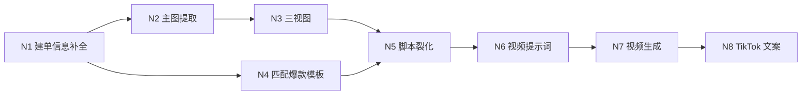
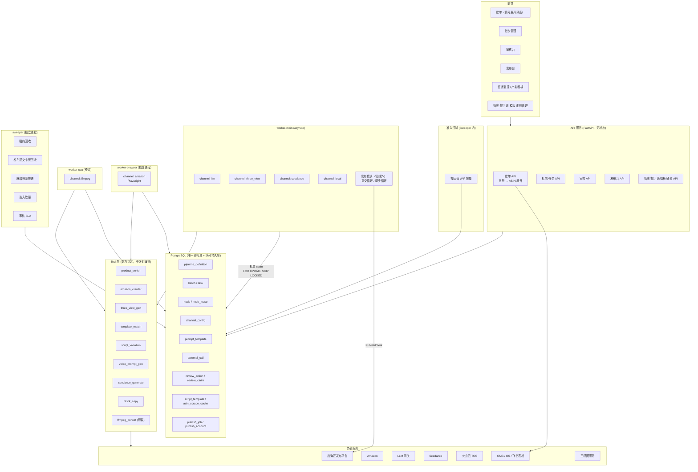
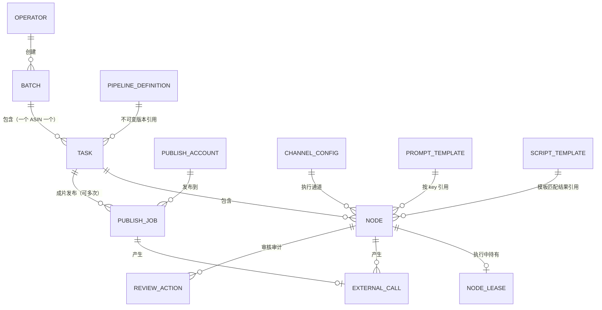
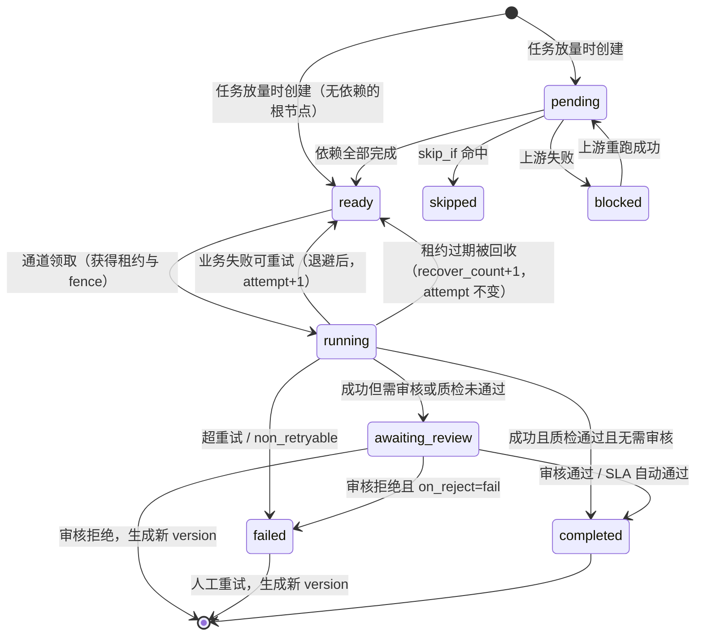

# TikTok 电商视频生产系统 — 架构设计 V3.0.0

> 状态：初稿，待讨论
> 输入依据：`自动化工具需求.md` 节点表、`架构设计-V2.0.0.md`、V2 执行计划 P1a / P1b 的实际运行验证结论、V3 业务模型讨论结论
> 取代：`架构设计-V2.0.0.md`（该文档转为历史存档）

## V3 相对 V2 的变更起因

V2 把业务拆成两条管线：`product_prep`（作用域 = 产品货号）在最后一个节点按「颜色 × 视频数量」派生（spawn）出 `video` 任务，写入新建的视频批次。评审阶段确认了新的业务模型：

1. **一个 ASIN 对应一条视频。** 同一产品货号的不同颜色各有子 ASIN，每个 ASIN 只生产一条视频。
2. **分钟级长视频不做扇出。** 由一个复杂节点在内部处理全部分镜作业，节点的 `input` / `output` 保存全部分镜的并集数据。
3. **建单在任务创建之前完成。** 「产品货号 → ASIN 列表」是一对多展开，必须在任务存在之前完成，放进管线就意味着 spawn。
4. **合并为一条管线：** 建单信息补全 → 主图提取 → 三视图 → 匹配爆款模板 → 脚本裂化 → 视频提示词 → 视频生成 → TikTok 文案。任务在 TikTok 文案完成时即为「成片」。
5. **发布独立于管线。** 发布由发布人在发布台对成片发起，由管线外的发布模块执行与跟踪（10.7）；一条成片可发布到多个账号、失败后可重发。

由此产生的结构性修改：

| 类别 | V2 | V3 |
|---|---|---|
| 管线数量 | `product_prep` + `video_gen_15s` 两条，跨任务派生 | 一条线性管线，一个任务 = 一个 ASIN = 一条视频 |
| 建单 | 管线第一个节点（必审） | 管线外：建批次时同步展开货号为 ASIN 并预览确认；管线第一个节点只做信息补全 |
| 派生 | `spawn_tasks`、`target_batch`、`chunk_size`、`task.parent_task_id`、`batch.kind` / `task.kind` | 全部删除 |
| 扇出 | `fan_out`、`shard_index`、`group_by`、`$.shard`、`[*]` 聚合、分片就绪判定 | 全部删除 |
| 长视频 | 扇出分片 + 聚合审核 | 复杂节点 + 子作业（第 18 章，后续阶段实现） |
| 爆款模板 | 由 `task.context.script_template` 外部传入 | 新增「匹配爆款模板」节点，按规则从模板库匹配 |
| 三视图粒度 | 每个产品货号一次 | 每个 ASIN 一次（颜色不同，参考图本应不同） |

同时并入 V2 执行计划 P1 实际运行中发现的文档问题：

| 位置 | V2 的问题 | V3 的处理 |
|---|---|---|
| 8.4 领取 SQL | 窗口函数与 `LIMIT :scan_limit` 同层，Postgres 先排序全部 ready 行；1 万条积压时 P95 约 40ms | 以 `operator` 驱动、`CROSS JOIN LATERAL` 按运营走索引各取 `per_owner_take` 条，P95 约 3ms |
| 6.5 `idx_node_claim` | `(channel, priority, created_at)` 不支持按运营取数 | `(channel, created_by, priority, created_at, id) WHERE status = 'ready'` |
| 6.7 `channel_config.scan_limit` | 新领取 SQL 不再需要 | 删除 |
| 1.2、第 20 章 | 仍写「需按月分区」，与决策 D21 矛盾 | 统一为不分区 |
| YAML 示例 | 裸写 `mode: off` 会被 YAML 1.1 解析为布尔 `false` | 示例统一写 `mode: "off"`，解析器兼容 `false` |

同时简化提示词机制：

| 位置 | V2 的做法 | V3 的处理 |
|---|---|---|
| 提示词版本选择 | 批次创建时冻结为具体版本（`batch.prompt_bindings`），节点记录所用版本（`node.prompt_version_id`） | 删除冻结与节点级版本记录；节点执行时直接取 `active` 版本，修改提示词立即影响在途任务。实际使用的提示词全文保存在 `input_snapshot` 中 |

同时简化外部作业等待与发布：

| 位置 | V2 的做法 | V3 的处理 |
|---|---|---|
| 外部作业等待 | 视频、发布均两段式：提交后节点转 `polling`，`poller` 通道批量对账，`job_slot` 约束上游作业数 | 三视图、视频在 Tool 内等待（8.7）；删除 `polling` 状态、`poll` 配置、`poller` 通道与 `job_slot` |
| 发布 | 管线末节点 `publish_submit`，`trigger: manual` + `awaiting_trigger` 状态，由发布台触发 | 移出管线，改为独立发布模块（`publish_job` 表 + 提交/同步循环，10.7）；删除 `trigger`、`awaiting_trigger`、`$.trigger` 与节点上的触发字段 |

V2 中被完整保留的部分：数据库作为唯一真相源与队列持久层、通道模型、租约 + fence、`attempt` 幂等语义、条件更新推进、准入 WIP + 领取轮转、自动质检 + 抽检 + SLA、发布台、Tool 抽象与边界。

---

## 1. 背景与目标

### 1.1 业务目标

批量生产投放到 TikTok 的电商短视频（当前 15 秒，未来扩展到分钟级），覆盖从商品信息补全、主图提取、参考图生成、模板匹配、脚本与提示词生成、视频生成、文案生成到发布的完整链路。系统由多名运营同时使用，每人独立建单、审核并交付自己的视频。

### 1.2 规模预期

以 5 名运营、人均每天 100+ 视频估算（运营人数待确认，见第 21 章 Q1）：

| 指标 | 当前 | 设计余量 |
|---|---|---|
| 每天视频任务数（= ASIN 数） | 500 ~ 1000 | 2000 |
| 单任务节点数 | 8（发布在管线外） | 不限 |
| 每天节点执行记录 | 约 10000 ~ 13000（含重跑） | 30000 |
| `node` 表年增量 | 约 300 ~ 400 万行 | 单表 + 大字段外置 + 归档，不分区 |
| 每天 Amazon 抓取 | ≤ 500 ~ 1000 次（扣除缓存命中） | — |
| 每天三视图生成 | 约 500 ~ 1000 次 | — |
| 每天 LLM 调用 | 约 3000 ~ 5000 次（4 个 LLM 节点，含重跑） | — |
| 每天 Seedance 作业 | 约 1000 ~ 1500 次（含重摇） | — |
| 每天理论审核项 | 约 1000 项必审 + 2000 项抽检候选 | 需降至人工 200 ~ 400 项 |
| 单视频时长 | 15 秒 | 分钟级（复杂节点 + 视频拼接） |

**四条必须校验的容量假设：**

- **Seedance 吞吐**：若上游允许 10 个作业并发、单作业约 4 分钟，则每小时约 150 个、按 16 小时计约 2400 个，可覆盖 1500 次/天含重摇的需求。若实际并发配额低于 8 或单作业超过 6 分钟，则需要与上游协商扩容。
- **Amazon 抓取吞吐**：抓取粒度从 V2 的「每货号一次」变为「每 ASIN 一次」。按 2 个并发、单次约 40 秒估算，每小时约 180 次，1000 次/天需要约 5.5 小时。缓存命中率与代理池规模决定是否需要扩到 2 个 browser 实例。
- **三视图吞吐与成本**：同样从每货号一次变为每 ASIN 一次，调用量约为 V2 的「颜色数」倍。需按上游并发配额与单价重算（Q3、Q17）。
- **人工审核**：三视图必审每天约 1000 项，按单项 15 秒计约 4 小时总工作量，人均约 50 分钟。脚本与提示词必须走抽检，三视图需尽快依靠质检与抽检降量（10.1）。

### 1.3 设计目标

1. **批量可控**：一次发起 100+ 任务，并发严格受外部服务配额约束
2. **多运营互不干扰**：任一运营的批量提交不得饿死其他运营，产能与成本可按人核算
3. **状态透明**：任意任务可查看每个节点的输入、输出、耗时、重试、失败原因、所用提示词与操作人
4. **随处可恢复**：进程重启、机器崩溃后自动继续，且不重复扣费
5. **节点级重跑**：审核不通过时只重跑相关节点
6. **人工介入不占资源**：等待审核的节点、等待发布的成片均不占用计算资源与租约
7. **管线可配置**：增删节点、调整顺序、开关审核、调整并发，改配置不改代码
8. **故障物理隔离**：浏览器抓取、CPU 密集节点崩溃不得影响其他节点的执行与心跳
9. **审核可降级**：从全量审核到自动质检 + 抽检，按配置平滑过渡
10. **模型简单**：一个任务就是一条视频，任务内是线性节点链，不存在任务派生与节点扇出

### 1.4 非目标

- 不做实时/低延迟处理，全部为异步批处理
- 不做跨组织多租户隔离（内部工具），但**做运营级的数据归属、配额与权限**
- 当前阶段不做基于模型的质量评分，自动质检仅做规则校验
- 不做跨机房部署
- 不做 DAG 层面的节点扇出与跨任务派生

---

## 2. 需求分析

### 2.1 业务流程梳理

#### 建单（管线外，任务创建前）

| 步骤 | 输入 | 输出 | 人工确认 |
|---|---|---|---|
| 货号展开 | 产品货号列表 | 每个货号下的 ASIN × 颜色 × 销售店铺清单 | 是：预览后勾选确认 |
| 创建批次与任务 | 确认后的 ASIN 清单 | 一个批次 + 每个 ASIN 一个任务（`admitted_pending`） | — |

货号展开是一对多（一个货号有多个颜色、多个子 ASIN），必须在任务创建前完成。展开只做轻量映射查询，完整的产品明细由管线第一个节点补全。

#### 视频管线（作用域 = 单个 ASIN = 单条视频）

| 序号 | 节点 | 输入 | 输出 | 人工审核 |
|---|---|---|---|---|
| N1 | 建单信息补全 | ASIN、产品货号 | 运营货号、渠道 sku、产品编码、pid、类目与标签 | 否（建单时已确认） |
| N2 | 主图提取 | ASIN | 主图（转存 TOS）、卖点原文、功能描述原文 | 否 |
| N3 | 三视图生成 | ASIN、主图 | 三视图（转存 TOS） | 是 |
| N4 | 匹配爆款模板 | 类目、标签、时长 | 选中的分镜脚本模板 | 否（可按批次开启） |
| N5 | 脚本裂化 | 模板、三视图、卖点原文、功能描述原文、颜色 | 新分镜脚本 | 是（抽检） |
| N6 | 视频提示词生成 | 货号、颜色、三视图、脚本、时长 | 中文产品分析、Seedance 提示词 | 是（抽检） |
| N7 | 视频生成 | 三视图、提示词、时长 | 视频（转存 TOS） | 否 |
| N8 | TikTok 文案 | 最终提示词、卖点原文、功能描述原文、视频 | 英文文案、合规标签 | 否 |

> 需求原表中的「分镜首帧图」「卖点结构化分析」节点已确认取消；下游直接使用 N2 抓取的卖点原文与功能描述原文。
>
> N3、N7 在 Tool 内提交外部作业后直接等待结果（三视图、Seedance 均为分钟级），等待期占用各自通道槽位与租约（8.7）。
>
> N8 完成即任务完成（成片），释放运营的 WIP 名额。

#### 发布（管线外，任务完成后）

| 步骤 | 输入 | 输出 | 人工确认 |
|---|---|---|---|
| 发起发布 | 成片（视频、文案、合规标签）、发布账号、PID、发布方式、预约时间 | 一条发布记录（`publish_job`） | 是：发布人在发布台选择 |
| 提交与状态同步 | 发布记录 | 发布状态、VID、发布链接 | — |

发布与制作是两个角色、两种节奏：一条成片可以发到多个账号，发布失败后可换账号或时间重发，定时发布从提交到出结果可能间隔数天。这些都不适合用节点模型表达，因此由独立的发布模块承担（10.7）。

依赖关系：



N4（匹配爆款模板）只依赖 N1 的类目标签，与 N2、N3 并行执行；N5 同时等待 N3 与 N4。

### 2.2 角色与权限

| 角色 | 职责 | 数据可见范围 |
|---|---|---|
| 运营 | 建单、发起批次、审核自己批次的产出、重跑 | 默认仅自己创建的批次；可配置为组内可见 |
| 审核人 | 审核指定节点的产出（可与运营同人） | 被授权的批次与节点 |
| 发布人 | 在发布台对成片指定账号与时间发起发布、重发失败的发布 | 仅被授权账号所属店铺的成片 |
| 管理员 | 管线版本发布、提示词激活、模板库维护、通道配额调整、运营配额分配 | 全部 |

关键约束：**提示词激活与管线发布是全局动作**，必须限制为管理员操作。管线发布不影响已开始的批次；提示词激活立即影响在途任务（见第 12 章）。

### 2.3 关键业务特征

**特征一：链路以 IO 为主，但存在一个重资源环节。**
除 Amazon 抓取外，所有节点都是「调外部服务 → 等返回」。Amazon 抓取使用 Playwright，单浏览器实例占用数百 MB 内存，存在页面僵死、内存泄漏、验证码与封禁风险，必须作为独立运行时与独立进程承载。分钟级视频引入 FFmpeg 拼接后新增第三类运行时。

**特征二：人工审核是真正的产能瓶颈，且随人数线性放大。**
三视图必审在新规模下每天约 1000 项，脚本与提示词若全量审核再加 2000 项。审核 UI 的批量能力、自动质检的拦截率、抽检率共同决定系统实际产能。等待审核期间必须零资源占用。

**特征三：真相源必须是数据库，不能是工作流引擎的执行历史。**
运营需要在前端直接修改节点产出（改脚本、改提示词）后从该节点重跑，属「外部随时改写中间态」模式，要求每个节点的输入输出都作为一等数据持久化。

**特征四：外部依赖异构，且配额语义不统一。**
这是并发设计的核心事实——同样是「限流」，三种语义完全不同：

| 语义 | 例子 | 约束对象 | 名额持有期 |
|---|---|---|---|
| 本地执行并发 | 所有节点 | 本进程同时运行的协程数 | 协程存活期 |
| 上游**作业**并发 | Seedance 同时 N 个生成作业、三视图服务 | 上游同时在跑的作业数 | 外部作业存活期，跨进程、跨重启 |
| 上游**请求**速率 | LLM 的 RPM/TPM、Amazon 页面访问速率 | 单位时间请求数 | 瞬时 |

对短调用（LLM、爬虫）前两者等价。对异步作业（三视图、Seedance），本设计让 Tool 在执行期内等待作业结束（8.7），作业存活期被包含在节点执行期内，前两者同样等价，由通道槽位统一约束；速率仍需令牌桶单独约束。

**特征五：付费调用需要幂等保护。**
Seedance、三视图与 LLM 按次计费，重复提交直接造成资金损失。崩溃、租约误判、超时误判三类场景都会触发重复提交。

**特征六：提示词由管理员集中维护，修改即时生效。**
提示词迭代频繁，当前阶段优先让修改尽快作用到产出：节点执行时取最新激活版本，在途任务中尚未执行的节点也会使用新版本。代价是同一批次内前后产出可能使用不同版本的提示词；实际使用的提示词全文随 `input_snapshot` 保存，可追溯。

**特征七：一个任务只产出一条视频。**
任务的粒度与视频一一对应，准入放量、审核节奏、成本核算都以任务为单位；发布以成片（已完成的任务）为对象。这使任务内的节点图保持线性，不需要任务派生或节点扇出。

---

## 3. 架构选型

### 3.1 候选方案对比

| 维度 | Celery | Temporal | 数据库队列 + 通道执行（本方案） |
|---|---|---|---|
| 等待人工审核 | 无原语，需自行实现 | signal 可支持，需额外设计 | 状态字段，天然支持 |
| 外部改写中间态 | 无此概念 | 与确定性重放冲突，属反模式 | 天然支持 |
| 节点级重跑 | 需自行实现 | 需自行实现 | 天然支持 |
| 长任务重复执行风险 | 有（visibility timeout 重投） | 无 | 无（租约 + fence） |
| 按外部配额限流 | 需按队列固定消费者数，调整需重启 | 需自行实现 | 通道配置入库，在线可调 |
| 按使用者公平调度 | 无 | 需自行实现 | 领取 SQL 内按运营轮转 |
| 批次暂停 | 出队后无法拦截 | 支持 | 领取 SQL 内过滤 |
| CPU/浏览器隔离 | 多进程池，强项 | 支持 | 独立运行时通道 |
| 新增运维组件 | broker + result backend | Temporal 集群 | 无 |
| 多实例安全 | 是 | 是 | 是（`FOR UPDATE SKIP LOCKED` + fence） |
| 状态可观测 | 需额外建设 | Web UI，执行历史视角 | 业务表即状态，SQL 直查 |

### 3.2 选型结论

**采用「数据库作为队列持久层 + 通道作为队列执行层」的节点状态机。**

理由：

1. **出队决策依赖全局业务状态。** 本业务的出队条件是「优先级 + 通道名额未满 + 速率令牌可用 + 批次未暂停 + 该运营 WIP 未超限 + 退避时间已到」。这是一个带多重条件的查询，数据库天然支持；MQ 的 FIFO/分区模型无法表达，只能出队后再判断并丢回，等于自己实现一遍调度。

2. **待执行项在被消费前会被人改写或作废。** 运营会改脚本、打回审核、重跑、取消批次。MQ 的语义是「入队即应被消费」，独立队列必然出现「消息还在队列里，但数据库说这条已取消/已换版本」，真相源分裂。数据库队列不存在这个缝：状态即队列。

3. **at-least-once 重投在付费节点上等于重复扣费。** Redis broker 的 visibility timeout、SQS 的自动重投时机不可控。自管租约 + fence 可控。

4. **规模上远未触及数据库队列的极限。** 每天约 13000 个节点、集中在 10 小时内即约 0.4 个/秒；每个节点全生命周期约 10 次数据库写，合计约 4 QPS。单台 4C8G Postgres 有三个数量级的余量。真正需要防范的不是吞吐而是写放大（见 6.6 租约窄表）。

5. **通道模型让并发控制从分布式问题降级为本地问题。** 通道内的并发上限是进程内计数，零竞态。三视图与 Seedance 在 Tool 内等待结果，上游作业数等于通道在跑节点数，由通道槽位直接约束（9.3），不需要跨进程的数据库名额。

### 3.3 从旧项目 yunyi-aimv-studio 继承什么

旧项目实际有两层队列。第二层 `ThreadedTaskQueueManager` 的设计是本方案通道模型的直接来源。

| 旧项目实现 | 本方案 | 说明 |
|---|---|---|
| `ThreadedTaskQueueManager`：按素材类型分独立队列，各配独立 `Semaphore` 与独立线程（`srt=45, image=20, audio=30, video=8, text=15`） | **演进为 Channel 模型** | 「按资源类型隔离队列 + 独立并发上限 + 独立执行单元」原样继承；队列载体由内存改为数据库 |
| `_async_worker_loop` 的槽位填充式领取：`available_slots = max_concurrent - len(running_tasks)`，按空位批量取任务 | **原样继承** | 由「从内存队列取」改为「批量 claim 一条 SQL」，循环结构不变 |
| 并发数从配置文件读取 | 提升为 `channel_config` 表 | 支持在线调整，无需重启 |
| `ArtworkQueue` 的 `(timestamp, artwork_id)` 延迟入队 | `node.next_run_at` | 语义相同，落库 |
| `ArtworkWorker`：跑完一个 stage 就重新入队，按新 stage 切换队列 | 节点级让出 | 思路正确，粒度由 stage 细化为 node |
| `ArtworkQueue._processing` 内存去重集合 | 租约 + `fence` | 支持多实例与崩溃恢复 |
| `ResultHandler` 与执行器解耦 | Runner 写回与 Tool 分离 | 保留 |
| `ToolInterface` + `ToolRegistry` | 原样继承 | 统一工具抽象 |
| `get_queue_type_for_stage` 硬编码 stage→queue 映射 | 节点声明 `channel`，部署配置绑定通道到进程 | 加节点无需改调度代码 |
| `material_producer` 的 `submit_batch` + `wait_for_batch(600)`、`pipeline.py` 的 `time.sleep(45)` / `time.sleep(30)` | Tool 内协程等待（作业 ID 落库、可接管）；发布移出管线 | 旧项目最大的性能缺陷：一个作品占满一个 worker 线程数十分钟，3 个线程即锁死吞吐。协程等待不占线程，且等待粒度是单个节点而非整个作品 |
| 内存态 `retry_count` / `_processing` / `submit_time` | 全部落库 | 旧项目无法多实例、重启丢状态的根因 |
| `load_unfinished_artworks()` 重启重建队列、`assembling_work` 阶段重启即暂停 | 无需任何恢复动作 | 队列本身就在数据库 |
| `WorkStage` 枚举 + `run()` if 链 | 数据化节点 DAG | 节点增删无需改代码 |
| 无幂等保护，本地超时 10 分钟 < 上游 1800 秒 | `external_call` + 幂等键 + 超时约束 | 防重复扣费 |
| 关键字段埋在 JSON（`playscript`、`input_data`） | 高频字段提升为独立列 | 支持索引与约束 |

---

## 4. 总体架构



### 4.1 分层职责

| 层 | 职责 | 明确不做 |
|---|---|---|
| **Tool** | 一项业务能力的完整封装：接收业务参数，产出可直接使用的业务结果（含产物持久化） | 不读写编排状态，不感知自己处于哪条管线的哪个位置，不做重试与限流判断 |
| **Runner（通道循环）** | 按槽位批量领取节点、解析输入、注入依赖、调用 Tool、带 fence 写回、判定审核、推进就绪 | 不包含任何业务逻辑，不理解 Tool 的输出语义 |
| **Channel** | 承载一类外部依赖的执行：并发槽位、速率令牌、熔断、运行时隔离 | 不理解节点业务含义 |
| **Sweeper** | 租约回收、就绪兜底、准入放量、审核 SLA、发布提交卡死回收 | 不执行 Tool |
| **管线定义** | 声明节点、依赖、审核策略、通道、输入映射、质检规则 | 不含可执行代码 |
| **发布模块** | 对成片执行发布：提交至发布平台、同步发布状态直至拿到 VID 与链接（10.7） | 不属于管线，不读写 `node`，不影响任务状态 |
| **API** | 建单展开、批次与任务管理、审核操作、创建发布记录、管线/提示词/模板维护、状态查询 | 不执行任何节点，不调用发布平台 |

**Tool 的边界不是「不碰存储」，而是「不碰编排」。** 详见 5.3。

**建单展开放在 API 而不是 Tool。** 它发生在任务存在之前，是批次创建的一部分，不属于任何节点；它只做「货号 → ASIN 清单」的轻量查询，结果交给用户确认后才落库。

---

## 5. 核心概念模型

### 5.1 概念关系



### 5.2 概念定义

**Tool（工具）**
一项业务能力的完整封装。详见 5.3。

**PipelineDefinition（管线定义）**
声明式的节点 DAG，以 `(key, version)` 唯一标识。**一经发布不可修改**，变更需发布新版本。task 引用它即等价于持有快照。V3 只有视频管线一类（按时长区分，如 `video_gen_15s`），不再有 `scope`。

**Channel（执行通道）**
一类外部依赖的执行单元。一个通道 = 一个队列视图（`node` 表中 `channel = X AND status = 'ready'` 的集合）+ 一个并发槽位上限 + 一个速率令牌桶 + 一个熔断器 + 一种运行时（`asyncio` / `browser` / `process`）。节点只声明 `channel`，由 worker 启动参数决定哪个进程承载哪些通道。

**PublishJob（发布记录）**
一次「把某条成片发布到某个账号」的请求与其执行结果。由发布人在发布台创建，由管线外的发布模块提交与同步。同一成片可有多条发布记录（多账号、失败重发）。详见 10.7。

**Lease（租约）**
节点执行权凭证，含持有者标识与单调递增的 `fence`。所有状态写回必须校验 fence，防止租约误判导致的双写。

**Batch（批次）**
一次建单确认后发起的任务集合，归属创建它的运营。承载批次级审核覆盖配置。

**Task（任务）**
管线的一次执行实例，是进度、重跑、准入与成本的业务单位。**一个任务对应一个 ASIN，产出一条视频**；`biz_key` 即 ASIN，同一批次内唯一。任务 `completed` 即成片完成，可进入发布台。

**Node（节点执行记录）**
状态与恢复的**唯一真相源**，同时是队列元素。业务唯一键 `(task_id, node_key, version)`。重跑产生新 version，历史完整保留。

**Attempt（尝试序号）**
同一 version 内的业务重试计数，参与幂等键计算。区分两类重投：业务失败重试递增 `attempt`（产生新幂等键，重新提交上游），租约回收不递增 `attempt`（保持幂等键，接管已有上游作业）。这是防重复扣费的关键区分，详见 11.2。

**PromptTemplate（提示词模板）**
独立版本化管理。节点定义引用 `prompt_key`，**节点执行时取该 key 当前的 `active` 版本**，不做批次冻结，也不在节点上记录版本。

**ScriptTemplate（爆款分镜脚本模板）**
业务数据源，由管理员维护。「匹配爆款模板」节点按规则从中选出一个模板，模板内容写入节点 `output`，下游引用的是这份快照，模板库后续修改不影响已匹配的任务。

**ExternalCall（外部调用记录）**
每次付费/长耗时外部调用的记录，承载幂等保护与成本核算。

**SubJob（节点子作业，后续阶段）**
分钟级视频的复杂节点在内部提交多个分镜作业，每个分镜一行子作业，由通道与对账循环调度。V3 当前阶段不实现，设计见第 18 章。

### 5.3 Tool 定义

#### 5.3.1 什么是 Tool

**Tool 是一项业务能力的完整封装：给它业务参数，它还你可以直接使用的业务结果。**

以「Amazon 主图提取」为例，完整语义是：给一个 ASIN，还我**稳定可访问**的主图 URL 列表、产品描述和卖点文本。其中「稳定可访问」意味着必须把 Amazon CDN 上会过期的图片下载、上传到自有 TOS、返回自有 URL。**这个持久化动作是能力语义的一部分**，不应剥离给 Runner。

同理 `seedance_generate` 返回的应是已落到自有 TOS 的视频 URL，而非 Seedance 的临时下载地址。

#### 5.3.2 边界：不碰编排，而非不碰存储

| 依赖类型 | 举例 | 是否允许 | 说明 |
|---|---|---|---|
| **基础设施服务** | `StorageService`、`HttpClient`、`LLMGateway`、`BrowserPool` | 允许 | 必须**构造注入**，不得自行读全局配置或新建实例 |
| **业务数据源** | 产品库、爆款模板库、店铺数据、ASIN 抓取缓存 | 允许 | 通过 Repository 接口注入 |
| **编排状态** | `task`、`node`、`batch`、`review_action` | **禁止** | 一旦触碰，Tool 即与本系统绑死，无法复用、无法单测，真相源分裂 |
| **限流与重试决策** | 「我要不要退避」「通道还有名额吗」 | **禁止** | 属通道与 Runner 职责 |
| **自身位置信息** | 「我是第几个节点」「我的上游是谁」 | **禁止** | 属 Runner 职责 |

三个具体收益：可注入内存版服务独立单测；可命令行单跑（`python -m tools.amazon_crawler --asin B0XXXX`）；可跨管线复用（同一 `seedance_generate` 服务不同时长的管线）。

#### 5.3.3 接口定义

```python
class Tool(ABC):
    name: str
    input_schema: dict      # JSON Schema，Runner 据此校验输入
    output_schema: dict     # JSON Schema，Runner 据此校验输出

    def __init__(self, *, storage: StorageService, http: HttpClient,
                 llm: LLMGateway | None = None, **deps):
        """依赖一律注入，不在内部读全局配置"""

    @abstractmethod
    async def execute(self, payload: dict, settings: ToolSettings) -> ToolResult:
        ...


@dataclass
class ToolSettings:
    """Runner 注入的运行期参数。Tool 只读，不得据此推断编排逻辑。"""
    timeout: int
    idempotency_key: str            # 传给上游做去重，不用于本地判断
    prompt: RenderedPrompt | None   # 已解析好的提示词（含版本），Tool 不自行查表
    trace_id: str
    attempt: int                    # 仅用于日志与上游去重，不得据此改变行为

    # Tool 内等待外部作业时使用（8.7）
    submit_external: SubmitExternal # 提交上游作业须经此回调：先落 external_call 再调用上游（11.3）
    resume_job_id: str | None       # 崩溃恢复时注入：本 attempt 已提交的上游作业 ID，Tool 须接管等待，不得重新提交


@dataclass
class ToolResult:
    success: bool
    output: dict                    # 须符合 output_schema
    error_code: str | None = None   # 供 Runner 判定是否可重试
    error_message: str | None = None
    external_calls: list[ExternalCallRecord] = field(default_factory=list)
    metrics: dict = field(default_factory=dict)
```

说明：

- **`prompt` 由 Runner 解析后注入**，Tool 不查 `prompt_template` 表，版本选择逻辑集中在一处
- **`external_calls` 由 Tool 上报、Runner 落库**；幂等检查同理由 Runner 前置完成
- **`submit_external` / `resume_job_id`**：Tool 内等待的 Tool（`three_view_gen`、`seedance_generate`）必须经 `submit_external` 提交，保证作业 ID 在等待开始前已落库；收到 `resume_job_id` 时跳过提交、直接等待该作业

#### 5.3.4 粒度原则

**Tool 的边界应切在「可能需要独立重跑或独立复用」的地方，以及「等待语义发生变化」的地方。**

| 切分 | 理由 |
|---|---|
| `product_enrich` 独立于建单展开 | 展开是建批次时的同步轻量查询；明细补全涉及多个外部系统，慢且可能失败，需要重试、日志与节点级重跑 |
| `template_match` 独立成节点 | 匹配结果需要可见、可追溯（「这条视频用了哪个模板」），并能在不重跑上游的情况下单独重跑 |
| `three_view_gen` / `seedance_generate` 不拆成提交与对账 | 等待在分钟级，在 Tool 内 `await` 轮询即可；等待期占用槽位与租约，但省去 `polling` 状态与对账通道。分钟级视频改为子作业（第 18 章） |
| 发布不做成 Tool / 节点 | 发布以成片为对象、可多账号多次、定时发布等待数天，由管线外的发布模块承担（10.7） |
| 不把「下载图片」「上传 TOS」做成 Tool | 基础设施动作应作为注入的服务复用，升格为节点会让管线定义被无业务语义的节点淹没 |

#### 5.3.5 Tool 清单

| Tool | 能力 | 产物落地 | 通道 |
|---|---|---|---|
| `product_enrich` | 按 ASIN 与货号补全运营货号、渠道 sku、产品编码、pid、类目与标签 | 无 | `local` |
| `amazon_crawler` | 按 ASIN 用 Playwright 抓取主图与卖点原文，图片转存 TOS，写入抓取缓存 | TOS（图片） | `amazon` |
| `three_view_gen` | 提交三视图生成作业并在 Tool 内轮询等待，就绪后转存 TOS | TOS（图片） | `three_view` |
| `template_match` | 按类目、标签与时长规则匹配爆款分镜脚本模板 | 无 | `local` |
| `script_variation` | 由模板、三视图与卖点原文裂化出新分镜脚本 | 无 | `llm` |
| `video_prompt_gen` | 产出中文产品分析与 Seedance 提示词 | 无 | `llm` |
| `seedance_generate` | 提交视频生成作业并在 Tool 内轮询等待，就绪后下载并转存 TOS | TOS（视频） | `seedance` |
| `tiktok_copy` | 产出英文文案与合规标签 | 无 | `llm` |
| `seedance_multi` *(后续阶段)* | 分钟级视频的复杂节点 Tool：规划分镜子作业、提交、对账、汇总（第 18 章） | TOS（视频片段） | `seedance` / `poller`（第 18 章启用时新增） |
| `ffmpeg_concat` *(后续阶段)* | 将多个视频片段拼接为成片，转存 TOS | TOS（视频） | `ffmpeg` |

发布平台对接不属于 Tool，由发布模块注入的 `PublishClient`（`submit` / `query_many`）承担（10.7）。

---

## 6. 数据模型

### 6.1 operator（运营）

```sql
CREATE TABLE operator (
    id               VARCHAR(64) PRIMARY KEY,      -- 登录账号
    name             VARCHAR(128) NOT NULL,
    role             VARCHAR(32)  NOT NULL,        -- operator | reviewer | publisher | admin
    daily_task_quota INT,                          -- 每天最多发起的视频任务数，NULL 不限
    wip_limit        INT NOT NULL DEFAULT 20,      -- 同时在执行的 task 上限，准入控制用
    enabled          BOOLEAN NOT NULL DEFAULT TRUE,
    created_at       BIGINT NOT NULL
);
```

角色可叠加（一人既是运营也是审核人），实现为 `operator_role` 多行或 role 数组，此处简化为主角色 + 授权表。

### 6.2 pipeline_definition

```sql
CREATE TABLE pipeline_definition (
    id              BIGSERIAL PRIMARY KEY,
    key             VARCHAR(64)  NOT NULL,           -- 15秒视频生产管线 / 60秒视频生产管线 / 图文图片生产管线
    version         INT          NOT NULL,
    name            VARCHAR(255) NOT NULL,
    definition      JSONB        NOT NULL,           -- 完整节点 DAG 定义，见第 7 章
    status          VARCHAR(16)  NOT NULL DEFAULT 'draft',  -- draft | published | deprecated
    note            TEXT,
    created_by      VARCHAR(64)  REFERENCES operator(id),
    created_at      BIGINT       NOT NULL,
    published_at    BIGINT,
    CONSTRAINT uk_pipeline_key_version UNIQUE (key, version)
);
```

`status = 'published'` 后禁止更新 `definition`，由应用层保证并加数据库触发器兜底。

### 6.3 batch

```sql
CREATE TABLE batch (
    id                  VARCHAR(36)  PRIMARY KEY,
    name                VARCHAR(255) NOT NULL,
    pipeline_def_id     BIGINT       NOT NULL REFERENCES pipeline_definition(id),

    review_overrides    JSONB        NOT NULL DEFAULT '{}',  -- {node_key: {mode, sample_rate}}

    status              VARCHAR(16)  NOT NULL,       -- running|paused|completed|failed|cancelled
    total_tasks         INT          NOT NULL DEFAULT 0,
    note                TEXT,                        -- 运营备注
    created_by          VARCHAR(64)  NOT NULL REFERENCES operator(id),
    created_at          BIGINT       NOT NULL,
    updated_at          BIGINT       NOT NULL,
    finished_at         BIGINT
);

CREATE INDEX idx_batch_created_by ON batch(created_by, created_at DESC);
CREATE INDEX idx_batch_status     ON batch(status);
```

- `review_overrides` 以 `node_key` 为键，只写需要覆盖的节点，未出现的节点沿用管线定义的 `review` 配置（7.5）。
- 所有任务同属一条管线，`batch` 不再需要 `kind`。

### 6.4 task

```sql
CREATE TABLE task (
    id               VARCHAR(36)  PRIMARY KEY,
    batch_id         VARCHAR(36)  NOT NULL REFERENCES batch(id) ON DELETE CASCADE,
    pipeline_def_id  BIGINT       NOT NULL REFERENCES pipeline_definition(id),
    created_by       VARCHAR(64)  NOT NULL REFERENCES operator(id),

    biz_key          VARCHAR(255) NOT NULL,             -- ASIN
    context          JSONB        NOT NULL DEFAULT '{}',-- 建单确认的字段，见 7.7

    status           VARCHAR(24)  NOT NULL,             -- admitted_pending|running|awaiting_review
                                                        -- |completed|failed|paused|cancelled
    priority         INT          NOT NULL DEFAULT 100, -- 数字越小越优先
    progress         JSONB        NOT NULL DEFAULT '{}',

    error            TEXT,
    created_at       BIGINT NOT NULL,
    admitted_at      BIGINT,                            -- 准入放量时间
    started_at       BIGINT,
    finished_at      BIGINT,
    updated_at       BIGINT NOT NULL,

    CONSTRAINT uk_task_batch_bizkey UNIQUE (batch_id, biz_key)
);

CREATE INDEX idx_task_batch      ON task(batch_id);
CREATE INDEX idx_task_created_by ON task(created_by, status);
CREATE INDEX idx_task_admit      ON task(status, priority, created_at) WHERE status = 'admitted_pending';
CREATE INDEX idx_task_biz_key    ON task(biz_key);
```

- `admitted_pending`：任务已创建但尚未放量，其节点尚未创建。准入控制据此实现按运营的 WIP 限制（9.6）。
- `uk_task_batch_bizkey` 保证同一批次内一个 ASIN 只有一个任务；跨批次再做同一 ASIN 的视频不受限制。
- `idx_task_biz_key` 支撑「这个 ASIN 做过哪些视频」的查询，以及建单预览时的重复提示（7.7）。

### 6.5 node（核心表）

```sql
CREATE TABLE node (
    id                 BIGSERIAL PRIMARY KEY,
    task_id            VARCHAR(36) NOT NULL REFERENCES task(id) ON DELETE CASCADE,
    batch_id           VARCHAR(36) NOT NULL,             -- 冗余，供审核台/统计直接过滤
   
    node_key           VARCHAR(64) NOT NULL,
    version            INT         NOT NULL DEFAULT 1,   -- 重跑递增
    attempt            INT         NOT NULL DEFAULT 1,   -- 同 version 内业务重试序号，参与幂等键
    is_current         BOOLEAN     NOT NULL DEFAULT TRUE,

    -- 执行归属
    tool               VARCHAR(64) NOT NULL,
    channel            VARCHAR(32) NOT NULL,             -- FK 见下方 ALTER
    priority           INT         NOT NULL DEFAULT 100,

    -- 状态
    status             VARCHAR(24) NOT NULL,
        -- pending | ready | running | awaiting_review
        -- | completed | failed | blocked | skipped | cancelled

    -- 审核
    review_mode        VARCHAR(16) NOT NULL DEFAULT 'off',-- off|required|sampling
    review_status      VARCHAR(16),                      -- pending|approved|rejected
    quality_gate       JSONB,                            -- 自动质检结果 {passed, failures[]}
    reviewed_by        VARCHAR(64),
    reviewed_at        BIGINT,
    review_comment     TEXT,
    edited             BOOLEAN     NOT NULL DEFAULT FALSE,

    -- 数据
    input_snapshot     JSONB,
    output             JSONB,
    idempotency_key    VARCHAR(64),

    -- 执行控制
    retry_count        INT         NOT NULL DEFAULT 0,   -- 业务失败重试次数
    recover_count      INT         NOT NULL DEFAULT 0,   -- 租约回收次数，不影响 attempt
    max_retries        INT         NOT NULL DEFAULT 3,
    non_retryable      BOOLEAN     NOT NULL DEFAULT FALSE,
    next_run_at        BIGINT,
    error              TEXT,
    error_code         VARCHAR(64),

    created_by         VARCHAR(64) NOT NULL,             -- 运营人员账号
    created_at         BIGINT NOT NULL,
    started_at         BIGINT,
    finished_at        BIGINT,
    updated_at         BIGINT NOT NULL,

    CONSTRAINT uk_node UNIQUE (task_id, node_key, version)
);

-- 每个 (task, node_key) 只能有一个当前版本
CREATE UNIQUE INDEX uk_node_current
    ON node(task_id, node_key) WHERE is_current;

-- channel_config 在 6.7 创建，外键在其后补加
ALTER TABLE node
    ADD CONSTRAINT fk_node_channel
    FOREIGN KEY (channel) REFERENCES channel_config(name);

-- 通道领取主索引：列顺序与 8.4 领取 SQL 的过滤与排序一致
CREATE INDEX idx_node_claim
    ON node(channel, created_by, priority, created_at, id)
    WHERE status = 'ready';

-- 审核台
CREATE INDEX idx_node_review
    ON node(batch_id, node_key, created_at)
    WHERE status = 'awaiting_review';

-- 任务详情与产能统计
CREATE INDEX idx_node_task       ON node(task_id, node_key, version);
CREATE INDEX idx_node_created_by ON node(created_by, finished_at) WHERE status = 'completed';
CREATE INDEX idx_node_idem       ON node(idempotency_key);
```

**设计要点：**

- `channel` 表达执行归属。运行时类型由 `channel_config.runtime` 表达，节点无需关心。
- `attempt` 与 `recover_count` 分离：业务失败重试递增 `attempt`（新幂等键），租约回收只递增 `recover_count`（幂等键不变，接管原有上游作业）。
- `batch_id` / `created_by` 冗余：审核台、公平调度、产能统计都按这两个维度过滤，若每次都 join `task` 会让领取 SQL 与审核查询同时退化。
- **没有外部作业字段。** 三视图、视频的外部作业 ID 记录在 `external_call`（6.10），崩溃恢复经幂等键查回；节点不需要 `polling` 状态与对账字段。
- `uk_node_current` 部分唯一索引：防止并发重跑产生两个当前版本，全部输入解析与审核查询都依赖 `is_current`。
- **没有 `shard_index`。** V3 不做节点扇出，一个 `(task, node_key)` 在任一时刻只有一个当前版本；分钟级视频的多个分镜作业由子作业表承载（第 18 章），不进入 `node` 的唯一键。
- **不做表分区，改用归档表。** 年增量约 400 万行对 Postgres 属小表，真正的体积压力来自 `input_snapshot` / `output` 的大 JSONB，已由 32KB 外置阈值解决（第 14 章）。分区会与本表的正确性约束冲突：Postgres 要求分区表上的唯一索引必须包含全部分区键列，`uk_node` 与 `uk_node_current` 都无法包含 `created_at`（包含后即失去唯一语义）。历史数据由 Sweeper 定期迁移到结构相同的 `node_archive` 表。

### 6.6 node_lease（租约窄表）

```sql
CREATE TABLE node_lease (
    node_id     BIGINT PRIMARY KEY REFERENCES node(id) ON DELETE CASCADE,
    owner       VARCHAR(128) NOT NULL,        -- worker 标识 host:pid:uuid
    fence       BIGINT       NOT NULL,        -- 每次领取递增，写回时校验
    lease_until BIGINT       NOT NULL,
    acquired_at BIGINT       NOT NULL
);

CREATE INDEX idx_node_lease_until ON node_lease(lease_until);

CREATE SEQUENCE node_fence_seq;
```

**为什么独立成表：** 心跳需要每几分钟更新一次 `lease_until`。若写在 `node` 表上，每次心跳都要更新该行涉及的十几个索引，在 Postgres 的 MVCC 下产生大量死行，几周后表与索引膨胀、autovacuum 压力显著。窄表只有两个索引，心跳走 HOT update 几乎零代价。这是数据库作为队列载体时最容易被忽视的成本。

### 6.7 channel_config（通道配置）

```sql
CREATE TABLE channel_config (
    name               VARCHAR(32) PRIMARY KEY,
    runtime            VARCHAR(16) NOT NULL,          -- asyncio | browser | process
    max_concurrent     INT         NOT NULL,          -- 通道槽位：本进程同时执行的节点数
    rate_limit_per_min INT,                           -- 请求速率上限，NULL 不限
    per_owner_take     INT         NOT NULL DEFAULT 3,-- 单次领取每个运营最多取几条
    poll_interval_ms   INT         NOT NULL DEFAULT 2000,
    enabled            BOOLEAN     NOT NULL DEFAULT TRUE,
    breaker_until      BIGINT,                        -- 熔断恢复时间，全实例共享
    breaker_fail_count INT         NOT NULL DEFAULT 0,
    note               VARCHAR(255),
    updated_at         BIGINT      NOT NULL
);

INSERT INTO channel_config
    (name, runtime, max_concurrent, rate_limit_per_min, note, updated_at) VALUES
    ('llm',        'asyncio', 24, 600,  'LLM 网关，速率受 RPM/TPM 约束',    :now),
    ('amazon',     'browser',  2,  30,  'Playwright 抓取，独立进程，需低速', :now),
    ('three_view', 'asyncio',  5, NULL, '三视图生成，Tool 内等待；槽位 = 上游作业并发，仅单进程承载', :now),
    ('seedance',   'asyncio', 10, NULL, '视频生成，Tool 内等待；槽位 = 上游作业并发，仅单进程承载', :now),
    ('local',      'asyncio', 10, NULL, '信息补全、模板匹配等轻量节点',     :now),
    ('ffmpeg',     'process',  4, NULL, 'FFmpeg（CPU，预留）',              :now);
```

发布不经过通道，其速率限制由发布模块配置（10.7）。

### 6.8 publish_job（发布记录）

```sql
CREATE TABLE publish_job (
    id               BIGSERIAL PRIMARY KEY,
    task_id          VARCHAR(36)  NOT NULL REFERENCES task(id),
    account_id       VARCHAR(64)  NOT NULL,              -- FK 见 6.12 建表后补加

    -- 发起时快照：成片后续被重跑不影响已发起的发布
    video_url        TEXT         NOT NULL,
    caption          TEXT         NOT NULL,
    compliance_tag   VARCHAR(64),
    pid              VARCHAR(64),
    publish_mode     VARCHAR(16)  NOT NULL,              -- now | scheduled
    schedule_at      BIGINT,

    status           VARCHAR(16)  NOT NULL,
        -- pending | submitting | scheduled | published | failed | cancelled
    idempotency_key  VARCHAR(64)  NOT NULL UNIQUE,       -- 'publish:' || id，重发即新记录新键
    external_job_id  VARCHAR(128),                       -- 发布平台会话 ID
    vid              VARCHAR(64),
    publish_url      TEXT,
    error_code       VARCHAR(64),
    error_message    TEXT,

    next_sync_at     BIGINT,                             -- 下次同步状态的时间
    sync_count       INT          NOT NULL DEFAULT 0,
    claimed_at       BIGINT,                             -- 进入 submitting 的时间，用于卡死回收

    published_by     VARCHAR(64)  NOT NULL REFERENCES operator(id),
    created_at       BIGINT       NOT NULL,
    submitted_at     BIGINT,
    finished_at      BIGINT,
    updated_at       BIGINT       NOT NULL
);

-- 同一成片同一账号同时只能有一条未失败的发布，防止重复发帖
CREATE UNIQUE INDEX uk_publish_job_active
    ON publish_job(task_id, account_id)
    WHERE status IN ('pending', 'submitting', 'scheduled', 'published');

CREATE INDEX idx_publish_job_task    ON publish_job(task_id);
CREATE INDEX idx_publish_job_pending ON publish_job(created_at)   WHERE status = 'pending';
CREATE INDEX idx_publish_job_sync    ON publish_job(next_sync_at) WHERE status = 'scheduled';
```

- 一行 = 一次「成片 → 账号」的发布请求。失败后重发是新建一行，旧行保留为历史。
- 视频、文案在发起时快照进来：发布记录与节点版本解耦，运营事后重跑文案不会改变已排期的发布内容。
- `scheduled` 表示已提交到发布平台、尚未拿到最终结果（含「立即发布」处理中与「定时发布」等待中）。执行语义见 10.7。

### 6.9 prompt_template

```sql
CREATE TABLE prompt_template (
    id           BIGSERIAL PRIMARY KEY,
    key          VARCHAR(64)  NOT NULL,
    version      INT          NOT NULL,
    content      TEXT         NOT NULL,
    variables    JSONB        NOT NULL DEFAULT '[]',
    model_config JSONB        NOT NULL DEFAULT '{}',
    status       VARCHAR(16)  NOT NULL DEFAULT 'draft',  -- draft | active | archived
    note         TEXT,
    created_by   VARCHAR(64)  REFERENCES operator(id),
    created_at   BIGINT NOT NULL,
    CONSTRAINT uk_prompt_key_version UNIQUE (key, version)
);

-- 同一 key 同时只能有一个 active 版本（节点执行时使用的版本）
CREATE UNIQUE INDEX uk_prompt_active
    ON prompt_template(key) WHERE status = 'active';
```

### 6.10 external_call

```sql
CREATE TABLE external_call (
    id               BIGSERIAL PRIMARY KEY,
    idempotency_key  VARCHAR(64)  NOT NULL UNIQUE,
    node_id          BIGINT       REFERENCES node(id) ON DELETE CASCADE,
    publish_job_id   BIGINT       REFERENCES publish_job(id),
    provider         VARCHAR(32)  NOT NULL,      -- seedance | llm | three_view | publish
    external_job_id  VARCHAR(128),
    status           VARCHAR(16)  NOT NULL,      -- submitted | succeeded | failed
    request_digest   VARCHAR(64),
    response         JSONB,
    cost_amount      NUMERIC(12,4),
    cost_unit        VARCHAR(16),
    submitted_at     BIGINT NOT NULL,
    finished_at      BIGINT,
    CONSTRAINT ck_external_call_owner CHECK ((node_id IS NULL) <> (publish_job_id IS NULL))
);

CREATE INDEX idx_external_call_node    ON external_call(node_id);
CREATE INDEX idx_external_call_publish ON external_call(publish_job_id);
CREATE INDEX idx_external_call_prov    ON external_call(provider, submitted_at);
```

`node_id` 只建普通索引、不做唯一约束：一个节点可以有多条外部调用记录（业务重试各一条；分钟级视频的每个分镜各一条）。发布调用归属 `publish_job`，与节点调用共用同一套幂等与成本账本，`ck_external_call_owner` 保证每条记录恰好归属其一。

### 6.11 review_action / review_claim

```sql
-- 审核审计
CREATE TABLE review_action (
    id            BIGSERIAL PRIMARY KEY,
    node_id       BIGINT      NOT NULL REFERENCES node(id) ON DELETE CASCADE,
    action        VARCHAR(24) NOT NULL,   -- approve | approve_with_edit | reject | auto_approve
    operator      VARCHAR(64) NOT NULL,
    reject_reason VARCHAR(32),            -- 结构化拒绝原因分类
    comment       TEXT,
    output_before JSONB,
    output_after  JSONB,
    created_at    BIGINT NOT NULL
);

CREATE INDEX idx_review_action_node ON review_action(node_id);
CREATE INDEX idx_review_action_op   ON review_action(operator, created_at DESC);

-- 审核项领取：防多人重复审核同一批
CREATE TABLE review_claim (
    node_id      BIGINT      PRIMARY KEY REFERENCES node(id) ON DELETE CASCADE,
    operator     VARCHAR(64) NOT NULL,
    claimed_at   BIGINT      NOT NULL,
    expires_at   BIGINT      NOT NULL     -- 到期自动释放
);

CREATE INDEX idx_review_claim_expire ON review_claim(expires_at);
```

### 6.12 publish_account（发布账号与授权）

```sql
CREATE TABLE publish_account (
    id         VARCHAR(64)  PRIMARY KEY,    -- 出海匠侧账号标识
    name       VARCHAR(255) NOT NULL,
    shop       VARCHAR(128),
    pid        VARCHAR(128),
    enabled    BOOLEAN      NOT NULL DEFAULT TRUE,
    updated_at BIGINT       NOT NULL
);

CREATE TABLE publish_account_grant (
    account_id VARCHAR(64) NOT NULL REFERENCES publish_account(id) ON DELETE CASCADE,
    operator   VARCHAR(64) NOT NULL REFERENCES operator(id),
    created_at BIGINT      NOT NULL,
    PRIMARY KEY (account_id, operator)
);

-- publish_job 在 6.8 创建，外键在此补加
ALTER TABLE publish_job
    ADD CONSTRAINT fk_publish_job_account
    FOREIGN KEY (account_id) REFERENCES publish_account(id);
```

### 6.13 asin_scrape_cache（抓取缓存）

```sql
CREATE TABLE asin_scrape_cache (
    asin            VARCHAR(32) PRIMARY KEY,
    main_images     JSONB NOT NULL,        -- 已转存 TOS 的 URL 列表
    raw_bullets     JSONB,
    raw_description TEXT,
    scraped_at      BIGINT NOT NULL,
    expires_at      BIGINT NOT NULL
);
```

Amazon 抓取是全链路最脆弱、最慢、最受配额限制的一环（通道槽位仅 2），而 V3 的抓取粒度是每个 ASIN 一次。同一 ASIN 会被不同批次、不同运营反复制作视频，缓存命中直接返回、不打开浏览器。命中判定由 `amazon_crawler` Tool 内部完成（缓存属业务数据源，Tool 可访问，见 5.3.2）。

### 6.14 script_template（爆款分镜脚本模板库）

```sql
CREATE TABLE script_template (
    id              BIGSERIAL PRIMARY KEY,
    name            VARCHAR(255) NOT NULL,
    duration        INT          NOT NULL,          -- 适用时长（秒）：15 / 60 ...
    categories      JSONB        NOT NULL DEFAULT '[]',   -- 适用类目，空数组表示通用
    tags            JSONB        NOT NULL DEFAULT '[]',   -- 卖点/风格标签，用于打分
    content         JSONB        NOT NULL,          -- 分镜结构：[{seq, seconds, description, ...}]
    weight          INT          NOT NULL DEFAULT 100,    -- 人工调权
    enabled         BOOLEAN      NOT NULL DEFAULT TRUE,
    note            TEXT,
    created_by      VARCHAR(64)  REFERENCES operator(id),
    created_at      BIGINT       NOT NULL,
    updated_at      BIGINT       NOT NULL
);

CREATE INDEX idx_script_template_match ON script_template(duration) WHERE enabled;
```

- 属业务数据源，由管理员维护，`template_match` Tool 通过 Repository 只读访问。
- 匹配结果把模板内容整体写入节点 `output`，下游引用的是快照；模板被修改或停用不影响已匹配的任务，也能回答「这条视频用的是哪个版本的模板」。
- 模板的打标维度与「视频反推」流程是否纳入本系统待确认（Q9），表结构中的 `categories` / `tags` 按该结论调整。

---

## 7. 管线定义规范

### 7.1 顶层结构

```yaml
key: video_gen_15s
version: 1
name: TikTok 电商视频（15秒）
nodes: [...]
```

V3 只有视频管线一类，不再有 `scope` 字段。不同时长的视频是不同的管线（`video_gen_15s`、`video_gen_60s`），节点可以复用同一批 Tool。

### 7.2 节点字段

| 字段 | 必填 | 说明 |
|---|---|---|
| `key` | 是 | 节点唯一标识，管线内唯一 |
| `name` | 是 | 展示名 |
| `tool` | 是 | 绑定的 Tool 名称 |
| `channel` | 是 | 执行通道名，须存在于 `channel_config` |
| `depends_on` | 否 | 依赖的节点 key 列表，默认为空 |
| `timeout` | 否 | 单次执行超时（秒），默认 600 |
| `max_retries` | 否 | 业务失败最大重试次数，默认 3 |
| `prompt_key` | 否 | 引用的提示词模板 key |
| `input` | 否 | 输入映射表达式，见 7.4 |
| `review` | 否 | 审核配置，见 7.5 |
| `quality_gate` | 否 | 自动质检规则，见 7.5 |
| `skip_if` | 否 | 条件跳过表达式 |

### 7.3 完整管线：`video_gen_15s`

```yaml
key: video_gen_15s
version: 1
name: TikTok 电商视频（15秒）

nodes:
  # N1 建单信息补全：建单时已确认 ASIN / 货号 / 颜色 / 店铺，这里补全其余明细
  - key: product_enrich
    name: 建单信息补全
    tool: product_enrich
    channel: local
    depends_on: []
    timeout: 120
    input:
      asin: "$.task.context.asin"
      sku:  "$.task.context.sku"
    quality_gate:
      - { field: "$.output.channel_sku",  rule: not_empty }
      - { field: "$.output.product_code", rule: not_empty }
      - { field: "$.output.pid",          rule: not_empty }
    review:
      mode: "off"

  # N2 主图提取：爬虫最脆弱且结果可跨任务复用；卖点原文与功能描述原文供下游直接引用
  - key: amazon_crawler
    name: 主图提取
    tool: amazon_crawler
    channel: amazon
    depends_on: [product_enrich]
    timeout: 600
    max_retries: 5
    input:
      asin: "$.task.context.asin"
    quality_gate:
      - { field: "$.output.main_images", rule: array_size_between, value: [1, 20] }
      - { field: "$.output.main_images", rule: url_reachable }
    review:
      mode: "off"

  # N3 三视图：Tool 内提交并等待结果（8.7）
  - key: three_view
    name: 三视图生成
    tool: three_view_gen
    channel: three_view
    depends_on: [amazon_crawler]
    timeout: 300                         # 含等待，须大于上游单作业最长执行时间（Q3）
    prompt_key: three_view_gen
    input:
      main_images: "$.nodes.amazon_crawler.output.main_images"
      asin:        "$.task.context.asin"
      color:       "$.task.context.color"
    quality_gate:
      - { field: "$.output.three_view_urls", rule: array_size_between, value: [1, 6] }
      - { field: "$.output.three_view_urls", rule: url_reachable }
    review:
      mode: required
      on_reject: rerun_self
      allow_edit: false
      sla_hours: 24

  # N4 匹配爆款模板：规则匹配，无 LLM（7.8）；与 N2、N3 并行
  - key: template_match
    name: 匹配爆款模板
    tool: template_match
    channel: local
    depends_on: [product_enrich]
    timeout: 60
    max_retries: 0                    # 规则匹配无瞬时故障，未命中属数据问题
    input:
      task_id:        "$.task.id"     # 同分模板的稳定选择种子
      duration:       15
      category:       "$.nodes.product_enrich.output.category"
      tags:           "$.nodes.product_enrich.output.tags"
    quality_gate:
      - { field: "$.output.template_id", rule: not_empty }
      - { field: "$.output.content",     rule: array_size_between, value: [3, 8] }
    review:
      mode: "off"                     # 批次可通过 review_overrides 开启人工确认
      allow_edit: true                # 开启审核时可就地改选模板

  # N5 脚本裂化
  - key: script_variation
    name: 脚本裂化
    tool: script_variation
    channel: llm
    depends_on: [three_view, template_match]
    timeout: 300
    prompt_key: script_variation
    input:
      script_template: "$.nodes.template_match.output.content"
      three_view_urls: "$.nodes.three_view.output.three_view_urls"
      raw_bullets:     "$.nodes.amazon_crawler.output.raw_bullets"
      raw_description: "$.nodes.amazon_crawler.output.raw_description"
      color:           "$.task.context.color"
    quality_gate:
      - { field: "$.output.script",        rule: not_empty }
      - { field: "$.output.script",        rule: max_length, value: 2000 }
      - { field: "$.output.shots",         rule: array_size_between, value: [3, 8] }
      - { field: "$.output.total_seconds", rule: number_between,     value: [14, 16] }
      - { field: "$.output.script",        rule: no_forbidden_words, value: forbidden_zh }
    review:
      mode: sampling
      sample_rate: 0.2
      on_reject: rerun_self
      allow_edit: true
      sla_hours: 8

  # N6 视频提示词
  - key: video_prompt
    name: 视频提示词生成
    tool: video_prompt_gen
    channel: llm
    depends_on: [script_variation]
    timeout: 300
    prompt_key: video_prompt_gen
    input:
      sku:             "$.task.context.sku"
      color:           "$.task.context.color"
      three_view_urls: "$.nodes.three_view.output.three_view_urls"
      script:          "$.nodes.script_variation.output.script"
      duration:        15
    quality_gate:
      - { field: "$.output.seedance_prompt", rule: not_empty }
      - { field: "$.output.seedance_prompt", rule: length_between, value: [50, 1500] }
      - { field: "$.output.seedance_prompt", rule: no_forbidden_words, value: forbidden_en }
    review:
      mode: sampling
      sample_rate: 0.2
      on_reject: rerun_self
      allow_edit: true
      sla_hours: 8

  # N7 视频生成：Tool 内提交并等待结果（8.7）
  - key: video_submit
    name: 视频生成
    tool: seedance_generate
    channel: seedance
    depends_on: [video_prompt]
    timeout: 900                         # 含等待，须大于上游单作业正常耗时（约 4 分钟）的数倍
    max_retries: 2
    input:
      prompt:    "$.nodes.video_prompt.output.seedance_prompt"
      image_url: "$.nodes.three_view.output.three_view_urls[0]"
      duration:  15
    quality_gate:
      - { field: "$.output.video_url", rule: url_reachable }
    review:
      mode: "off"

  # N8 TikTok 文案
  - key: tiktok_copy
    name: TikTok 文案
    tool: tiktok_copy
    channel: llm
    depends_on: [video_submit]
    timeout: 300
    prompt_key: tiktok_copy
    input:
      final_prompt:    "$.nodes.video_prompt.output.seedance_prompt"
      raw_bullets:     "$.nodes.amazon_crawler.output.raw_bullets"
      raw_description: "$.nodes.amazon_crawler.output.raw_description"
      video_url:       "$.nodes.video_submit.output.video_url"
    quality_gate:
      - { field: "$.output.caption",        rule: length_between, value: [20, 2200] }
      - { field: "$.output.compliance_tag", rule: not_empty }
    review:
      mode: "off"

  # 管线到此结束：tiktok_copy 完成即任务完成（成片），发布由发布模块处理（10.7）
```

**说明：**

- `three_view`、`video_submit` 的外部作业在 Tool 内完成提交、等待与转存，节点保持 `running` 直到拿到结果（8.7）。
- 管线不含发布节点：发布需要人工选择账号与时间、且可能等待数天，放在管线内会让任务长期处于未完成状态、占用运营 WIP。
- 时长写为字面量 `15`：时长是管线的固有属性，不同时长是不同管线，不放进 `task.context`。
- 产品信息统一从上游节点输出引用（`amazon_crawler`、`product_enrich`），`task.context` 只放建单确认的字段（7.7）。

### 7.4 输入映射表达式

采用简化的 JSONPath 子集：

| 表达式 | 含义 |
|---|---|
| `$.task.context.<path>` | 任务上下文字段（建单确认的字段） |
| `$.task.<field>` | 任务自身字段（id、biz_key、created_by 等） |
| `$.nodes.<key>.output.<path>` | 上游节点输出（`is_current` 版本） |
| `$.batch.<field>` | 批次字段 |
| 字面量 | 非 `$.` 开头的值原样传递 |

路径中可以使用数组下标，如 `three_view_urls[0]`、`shots[2].prompt`；下标越界返回 `null`。

**不支持函数、条件、运算，也不支持 `[*]` 通配。** 任何需要计算或聚合的逻辑都应放进 Tool。配置一旦图灵完备，就会变成难以调试的第二套代码。

**`$.nodes.<key>` 只能引用上游节点**（`depends_on` 的传递闭包），管线发布时校验。

**上游为 `skipped` 的解析规则：** 表达式解析到 `skipped` 节点的输出时返回 `null`；若该字段在 Tool 的 `input_schema` 中为必填，Runner 在执行前即判定为 `non_retryable` 配置错误并标记节点 `failed`，不会调用 Tool。管线校验阶段应对「依赖可能被 skip 的节点」给出告警。

### 7.5 审核与自动质检

```yaml
quality_gate:                  # 先执行，硬规则
  - { field: "$.output.script", rule: not_empty }
  - { field: "$.output.script", rule: max_length, value: 2000 }
review:
  mode: sampling               # "off" | required | sampling
  sample_rate: 0.2
  on_reject: rerun_self        # rerun_self | rerun_from:<node_key> | fail
  allow_edit: true
  sla_hours: 8                 # 超时未审核的处理，见 10.6
```

> YAML 1.1 会把裸写的 `off` 解析为布尔 `false`，示例一律写 `"off"`；解析器同时兼容 `false`。

**判定顺序：自动质检 → 抽检采样 → 人工审核。**

1. **自动质检**在 Tool 返回后立即执行，规则清单见下表。任一规则失败则该节点**强制进入人工审核**（而非直接失败），并把失败项写入 `node.quality_gate`，审核台高亮展示。
2. 质检全部通过时，按 `review.mode` 判定：`off` 直接完成；`required` 进入审核；`sampling` 按 `sample_rate` 随机决定。
3. 有效审核模式在节点执行完成时计算并写入 `node.review_mode`，之后不再变化，保证「批次中途改配置」不会让已完成节点状态错乱，也能回答「这条为什么没被审核」。

可用质检规则（当前阶段仅规则校验，不做模型评分）：

| 规则 | 参数 | 用途 | 失败归属 |
|---|---|---|---|
| `not_empty` | — | 字段非空 | `to_review` |
| `max_length` / `length_between` | 长度 | 文案长度合规 | `to_review` |
| `array_size_between` | [min, max] | 分镜数量、图片数量合理 | `to_review` |
| `number_between` | [min, max] | 时长、比例等数值范围 | `to_review` |
| `no_forbidden_words` | 词表 key | 违禁词、竞品词、平台敏感词 | `to_review` |
| `json_schema` | schema key | 结构化输出格式 | `to_review` |
| `url_reachable` | — | 图片/视频 URL 可访问（HEAD 请求） | `to_retry` |
| `distinct_from` | 上游字段表达式 | 产出与输入不能雷同（防 LLM 复读） | `to_review` |

`url_reachable` 失败通常是转存环节出了问题而非内容问题，判为可重试失败，不推人工。

**三层审核配置合并，优先级从低到高：** 管线定义的 `review` 块 → 批次的 `review_overrides` → 单任务临时覆盖（重跑时强制审核或跳过）。

**`on_reject` 语义：**

| 值 | 行为 |
|---|---|
| `rerun_self` | 当前节点生成新 version（`attempt` 重置为 1）并置为 `ready`，下游节点重置为 `pending` |
| `rerun_from:<key>` | 指定上游节点生成新 version 并置 `ready`；该节点与被打回节点之间的所有节点，已执行过的生成新 version 后置 `pending`，未执行过的保持 `pending` |
| `fail` | 节点标记 `failed`，下游 `blocked`，任务标记 `failed` |

**`allow_edit` 是刚需。** 实际操作中运营更多是「改两个字然后通过」。`approve_with_edit` 会把编辑后内容写入 `node.output`、置 `edited = true`、在 `review_action` 记录修改前后内容，然后按正常通过流程推进下游。

### 7.6 外部作业等待

节点定义不提供异步对账配置。分钟级的外部作业（三视图、15 秒视频）在 Tool 内提交并等待，`timeout` 同时覆盖提交与等待，执行语义见 8.7。等待可能长达数天的发布不属于管线，见 10.7。

### 7.7 建单与任务创建（管线外）

建单分两步，都在 API 内同步完成，不经过调度器：

**第一步：货号展开预览**

```
POST /api/orders/preview
{ "skus": ["SKU12345", "SKU67890"] }
```

API 通过产品库 Repository（OMS / OS / 飞书表格，Q7）把每个货号展开为 ASIN 清单，返回给前端预览：

```json
{
  "items": [
    { "sku": "SKU12345", "asin": "B0AAA", "color": "black", "shop": "US-01",
      "warnings": [] },
    { "sku": "SKU12345", "asin": "B0BBB", "color": "white", "shop": "US-01",
      "warnings": ["该 ASIN 在你的批次 b-2c91 中仍在制作"] },
    { "sku": "SKU67890", "asin": null, "color": "red", "shop": null,
      "warnings": ["未找到 ASIN"] }
  ]
}
```

- 展开只做「货号 → ASIN × 颜色 × 店铺」的映射查询，秒级返回；查询失败直接在页面提示，由用户重试。
- `warnings` 提示三类问题：未找到 ASIN、同一批次内 ASIN 重复、该 ASIN 已有在途任务（查 `idx_task_biz_key`）。在途提示只是提醒，不拦截。
- 预览由用户勾选确认，取代 V2 中「批量建单」节点的人工审核：确认发生在建任务之前，错误数据不会进入管线。

**第二步：创建批次与任务**

```
POST /api/batches
{
  "name": "0928 新品",
  "pipeline_key": "video_gen_15s",
  "items": [ { "sku": "SKU12345", "asin": "B0AAA", "color": "black", "shop": "US-01" }, ... ],
  "review_overrides": {},
  "priority": 100
}
```

在一个事务内完成：

1. 校验 `operator.daily_task_quota`（当日已创建任务数 + 本次条数）。
2. 解析管线的 `active` 已发布版本，写入 `batch.pipeline_def_id`。
3. 插入 `batch`，并为每个 ASIN 插入一个 `task`：`biz_key = asin`，`context = {sku, asin, color, shop}`，`status = 'admitted_pending'`。
4. 依赖 `uk_task_batch_bizkey` 保证同一请求重复提交时不会重复建任务。

**任务只建行、不建节点。** 节点在准入放量时创建（9.6），因此一次建 1000 个任务也只是 1000 行插入，单事务可承受；单批次上限设为 2000 条，超过则提示拆分。

**`task.context` 的约定：** 只放建单时用户确认过的字段（`sku`、`asin`、`color`、`shop`）。`shop` 放在这里是因为发布台按店铺过滤授权（10.7），需要在任务级别直接可查。其余产品明细一律来自 `product_enrich` 节点的输出。

**为什么展开不做成管线节点：** 节点属于某个任务，而任务要按 ASIN 建，ASIN 又是展开的结果——展开必须先于任务存在。把它放进管线只能让一个「货号任务」再派生出多个「ASIN 任务」，即回到 V2 的 spawn 模型。

**为什么补全仍是节点：** 补全涉及多个外部系统，可能慢、可能失败，需要重试、失败原因、节点级重跑与执行记录；而且补全结果（类目、标签）是下游模板匹配的输入，需要作为节点输出被引用。

### 7.8 爆款模板匹配规则

`template_match` 是纯规则 Tool，不调用 LLM：

1. **候选集**：`script_template` 中 `enabled = true`、`duration` 等于管线时长、且 `categories` 为空或包含产品类目的模板。
2. **打分**：`score = |模板 tags ∩ 产品 tags| × 10 + weight / 10`。
3. **选择**：取最高分；同分时以 `hash(task_id)` 在同分模板中选取。`task_id` 由管线显式传入（Tool 不自行获取编排信息，5.3.2），结果稳定可复现，同一批次的视频也会分散到不同的同分模板。
4. **输出**：`{template_id, template_name, content, score, matched_tags}`，其中 `content` 是模板分镜结构的完整快照。
5. **未命中**：返回 `error_code = template_not_found`，属 `non_retryable`，节点 `failed`、下游 `blocked`。管理员补充模板后，运营从任务详情重试该节点。
6. **人工换模板**：批次通过 `review_overrides` 开启该节点审核后，审核人可在审核台就地改选其他模板（`allow_edit`，写入完整模板快照），通过后按正常流程推进下游。

规则中的打分公式与标签来源在 Q9 确认后定稿；规则变更属于 Tool 代码变更，不进入管线定义。

---

## 8. 调度与执行

### 8.1 整体视图

队列不是一个独立组件，而是 `node` / `task` 表上的一组视图：

| 队列 | 定义 | 消费者 |
|---|---|---|
| 准入队列 | `task.status = 'admitted_pending'` | Sweeper 的准入器 |
| 就绪队列 | `status = 'ready' AND channel = X` | 通道 X 的执行循环 |
| 审核队列 | `status = 'awaiting_review'` | 人（审核台） |

执行链路上的控制点共四处，任一处不满足，节点就停在队列里不消耗资源：

```
准入放量(按运营 WIP) → 通道槽位 → 速率令牌 → 熔断器
```

一个任务的生命周期：

```
建单确认 → task(admitted_pending) → 准入放量：创建全部节点，根节点 ready
        → 节点逐个执行、审核、推进 → tiktok_copy 完成 → task(completed)，成片进入发布台
```

发布队列（`publish_job`）不在管线内，由发布模块消费（10.7）。

### 8.2 node 状态机



**两个刻意的设计：**

- **没有 `paused` 状态。** 批次与任务的暂停通过领取 SQL 过滤实现（8.4），不改写 node 状态。这样暂停/恢复是 O(1) 操作而非批量 UPDATE，也不会与重跑的状态变更竞争。已在 `running` 的节点不受暂停影响，执行完后下游不再被领取。
- **人工重试一律生成新 version。** 原地 `failed → ready` 会复用同一个幂等键，而该键对应的 `external_call` 记录已是 `failed` 状态，再次调用时插入唯一约束冲突，节点永久卡死。新 version 意味着新幂等键，语义干净。

### 8.3 通道执行循环

结构继承旧项目 `ThreadedTaskQueueManager._async_worker_loop` 的槽位填充式领取，把「从内存队列取」换成「批量 claim 一条 SQL」：

```python
async def channel_loop(ch: ChannelConfig):
    inflight: set[asyncio.Task] = set()
    bucket   = TokenBucket(ch.rate_limit_per_min)
    breaker  = Breaker(ch.name)

    while not shutting_down:
        inflight = {t for t in inflight if not t.done()}
        free = ch.max_concurrent - len(inflight)

        if free <= 0:
            await asyncio.sleep(0.1)             # 槽位满，等任务完成
            continue
        if breaker.is_open():
            await asyncio.sleep(breaker.remaining())
            continue

        # 槽位与速率取交集，决定这一轮最多领几条
        take = min(free, bucket.available())
        if take <= 0:
            await asyncio.sleep(0.5)
            continue

        nodes = await claim_batch(ch.name, take, ch.per_owner_take)
        if not nodes:
            await wait_notify_or_sleep(ch.poll_interval_ms)   # LISTEN/NOTIFY 唤醒
            continue

        for n in nodes:
            t = asyncio.create_task(execute_node(n, ch, bucket, breaker))
            inflight.add(t)
            t.add_done_callback(inflight.discard)

        ch.reload_if_changed()                   # 配置热更新，无需重启
```

```python
async def execute_node(node: Node, ch: ChannelConfig,
                       bucket: TokenBucket, breaker: Breaker):
    heartbeat = asyncio.create_task(renew_lease(node))
    try:
        if node.input_snapshot is None:                # 同一 version 只解析一次，重试与崩溃恢复沿用快照
            payload = resolve_input(node)              # 表达式解析
            prompt  = resolve_prompt(node)             # 取 prompt_key 当前的 active 版本
            await persist_input_snapshot(node, payload, prompt)
        payload, prompt = load_input_snapshot(node)

        reuse = await check_idempotency(node)          # 命中本 attempt 已有的外部调用（11.3）
        if reuse and reuse.output is not None:         # 已成功：直接复用
            return await on_success(node, reuse.output)

        await bucket.consume(estimate_tokens(payload))

        tool   = tool_registry.get(node.tool)
        result = await asyncio.wait_for(
            tool.execute(payload, settings=build_settings(
                node, resume_job_id=reuse.resume_job_id if reuse else None)),
            timeout=node.timeout,
        )

        await record_external_calls(node, result.external_calls)

        validate_output_schema(node.tool, result.output)
        await on_success(node, result.output)           # 质检 + 审核判定 + 推进下游
        breaker.on_success()
    except Exception as e:
        breaker.on_failure(e)
        await on_failure(node, e)
    finally:
        heartbeat.cancel()
```

**核心约束：执行体内绝不阻塞线程等待外部完成；小时级以上的等待不进入管线。**

| 等待对象 | 处理 |
|---|---|
| 等同步调用返回 | 保持 `running` + 租约续期，Tool 内部 await |
| 等分钟级外部作业（三视图、15 秒视频） | 保持 `running` + 租约续期，Tool 内部 `await asyncio.sleep` 轮询；作业 ID 提交即落库，崩溃恢复后接管（8.7） |
| 等人工审核 | 置 `awaiting_review`，完全释放 |
| 等发布（可能长达数天） | 不在管线内：任务已 `completed`，由发布模块跟踪（10.7） |

> 旧项目的核心缺陷正在于此：`pipeline.py` 用 `while True: time.sleep(45)` 在 worker 线程里轮询素材状态，`material_producer` 用 `wait_for_batch(timeout=600)` 阻塞等待整批素材，一个作品占满一个线程数十分钟，3 个 default worker 即锁死整个系统吞吐。

**为什么不做内存预取（`prefetch = 0`）：** 本方案 claim 多少就立即执行多少，不在内存里二次排队。预取的害处有二：被 claim 的节点在内存排队期间已占租约，进程崩溃需等租约过期才能被接管；新到达的高优先级节点会排在预取队列之后，优先级失效。

**为什么不用 `Semaphore`：** 既然领取条数受 `free` 限制且领到即执行，`len(inflight)` 本身就是并发控制。少一个同步原语少一类 bug。

### 8.4 批量领取（claim_batch）

```sql
-- 按运营逐个走 idx_node_claim 取前 per_owner_take 条：代价只与运营人数成正比，与积压量无关。
-- ORDER BY 必须与 idx_node_claim 的列顺序一致，否则退化为逐运营全量排序。
WITH cand AS (
    SELECT c.id
    FROM operator o
    CROSS JOIN LATERAL (
        SELECT n.id
        FROM node n
        JOIN task  t ON t.id = n.task_id
        JOIN batch b ON b.id = n.batch_id
        WHERE n.created_by = o.id
          AND n.channel    = :channel
          AND n.status     = 'ready'
          AND (n.next_run_at IS NULL OR n.next_run_at <= :now)
          AND b.status     = 'running'                     -- 批次暂停在此生效
          AND t.status NOT IN ('paused', 'cancelled')      -- 任务暂停在此生效
        ORDER BY n.priority, n.created_at, n.id
        LIMIT :per_owner_take
    ) c
)
SELECT n.*
FROM node n
WHERE n.id = ANY(ARRAY(SELECT id FROM cand))
  AND n.status = 'ready'
ORDER BY n.priority, n.created_at, n.id
LIMIT :take
FOR UPDATE OF n SKIP LOCKED;
```

领取成功后在同一事务内：

```sql
-- 1) 批量发放租约与 fence
INSERT INTO node_lease (node_id, owner, fence, lease_until, acquired_at)
SELECT u.id, :worker_id, nextval('node_fence_seq'), u.until, :now
FROM unnest(CAST(:ids AS BIGINT[]), CAST(:untils AS BIGINT[])) AS u(id, until)
ON CONFLICT (node_id) DO UPDATE
    SET owner = EXCLUDED.owner, fence = EXCLUDED.fence,
        lease_until = EXCLUDED.lease_until, acquired_at = EXCLUDED.acquired_at
RETURNING node_id, fence;

-- 2) 置运行态
UPDATE node
SET status = 'running', started_at = COALESCE(started_at, :now), updated_at = :now
WHERE id = ANY(:ids) AND status = 'ready';
```

**四个要点：**

1. **以 `operator` 为驱动表、`CROSS JOIN LATERAL` 按运营取数**实现按运营轮转：每轮每人最多取 `per_owner_take` 条。没有这一层，一个运营提交 100+ 视频就会按 FIFO 独占整条通道数小时，其他人的任务全部排在后面。
2. **不用全量 `row_number() OVER (PARTITION BY created_by)` 再截取。** 窗口函数会先对该通道全部 ready 行排序并计算窗口，1 万条积压时单次领取 P95 约 40ms；只把 LIMIT 挪到内层又会在某运营积压超过窗口大小时饿死其他运营。LATERAL 写法对每个运营走 `idx_node_claim` 取前几条，实测 P95 约 3ms，公平性不受积压量影响。
3. **`join batch/task`** 让暂停真正生效：暂停批次后 worker 不再领取该批次的节点。
4. **`LIMIT :take` 批量领取**把数据库往返从「每节点一次」降为「每批一次」。

### 8.5 租约、心跳与 fence

| 机制 | 规则 |
|---|---|
| 租约时长 | `lease_ttl = min(node.timeout × 1.5, 3600)` |
| 心跳续期 | 执行中每 `lease_ttl / 3` 更新一次 `node_lease.lease_until`（窄表，HOT update） |
| 过期回收 | Sweeper 将 `node.status='running'` 且 `node_lease.lease_until < now` 的记录置回 `ready`，`recover_count + 1`，**`attempt` 不变** |
| 写回校验 | 所有终态写回必须校验 fence |

```sql
-- fence 校验：影响行数为 0 则说明租约已被回收，本次结果必须丢弃
UPDATE node
SET status = :status, output = :output, finished_at = :now, updated_at = :now
WHERE id = :id
  AND EXISTS (
        SELECT 1 FROM node_lease
        WHERE node_id = :id AND owner = :me AND fence = :my_fence);
```

**为什么必须有 fence：** 心跳漏更新并不代表 worker 已死——事件循环卡顿、GC 停顿、数据库连接抖动都会造成漏更。此时 Sweeper 回收租约、另一个 worker 领取执行，两个 worker 同时在跑同一节点。若无 fence 校验，两者都会写回 `output`、都会触发 `advance_task`。这是「数据库状态机」方案最典型的漏项。

写回被 fence 拒绝时记录 `node_write_fenced` 指标并告警：该指标持续不为零说明心跳不可靠（通常是事件循环被同步阻塞调用卡住，例如 Tool 里误用了 Playwright 同步 API 或 `requests`）。

### 8.6 节点创建与就绪推进（advance_task）

**节点创建：** 任务被准入放量时（9.6），在同一事务内按管线定义为该任务一次性创建全部节点（`version = 1`）：`depends_on` 为空的节点置 `ready`，其余置 `pending`。`video_gen_15s` 每个任务 8 行。

**就绪推进：** 每当一个 node 进入 `completed` 或 `skipped`，在同一事务内推进该任务：

```python
def advance_task(session, task_id: str):
    task       = lock_task(session, task_id)          # 行锁，避免并发推进
    definition = load_pipeline_definition(session, task)
    done       = load_done_node_keys(session, task_id)   # is_current 且 completed / skipped

    for nd in definition.nodes:
        if not all(dep in done for dep in nd.depends_on):
            continue

        if nd.skip_if and evaluate(nd.skip_if, ctx):
            transition(session, task_id, nd.key, frm='pending', to='skipped')
            continue

        transition(session, task_id, nd.key, frm='pending', to='ready')

    refresh_task_progress(session, task_id)
```

**`transition` 必须是条件更新：**

```sql
UPDATE node SET status = :to, updated_at = :now
WHERE task_id = :task_id AND node_key = :key AND is_current
  AND status = :frm;        -- 关键：只有仍处于 pending 的节点才被推进
```

**为什么这是硬性要求：** 推进逻辑每次都遍历全部节点定义，而「依赖已满足」的节点集合里必然包含那些已经是 `running` / `awaiting_review` / `completed` 的节点。若不带 `status = 'pending'` 条件，一次推进就会把正在执行的付费节点打回 `ready`，被重复领取、重复提交。Sweeper 的兜底全量扫描会把这个风险放大到每分钟一次。

事件驱动推进保证及时性，Sweeper 每 30 秒全量扫一次作为兜底，处理事务回滚等边缘情况导致的漏推进。

**任务终态：** 全部节点 `completed` / `skipped` 时任务置 `completed`；任一节点 `failed` 时任务置 `failed`（8.9）；存在 `awaiting_review` 节点时任务置 `awaiting_review`，其余情况为 `running`。

### 8.7 外部异步作业的等待

替代旧项目 `time.sleep(45)` / `wait_for_batch(600)` 的方案。管线内的外部作业只有三视图（`three_view_gen`）与 15 秒视频（`seedance_generate`，约 4 分钟），均为分钟级，统一在 Tool 内等待，等待期占用通道槽位、租约与一个协程。可能等待数天的发布不在管线内（10.7）。

#### 8.7.1 Tool 内等待（three_view_gen、seedance_generate）

以 `seedance_generate` 为例，`three_view_gen` 结构相同（提交三视图作业、就绪后转存全部图片、输出 `three_view_urls`）：

```python
class SeedanceGenerate(Tool):
    async def execute(self, payload, settings):
        job_id = settings.resume_job_id              # 崩溃恢复：接管原作业，不重新提交
        if job_id is None:
            job = await settings.submit_external(    # 先落 external_call 再调用上游（11.3）
                'seedance', lambda key: self.client.submit(payload, idempotency_key=key))
            job_id = job.id

        deadline = now() + settings.timeout - 30     # 留出转存时间，早于 Runner 的 wait_for 超时
        for delay in backoff_iter([15, 15, 30, 30, 60]):
            st = await self.client.query(job_id)
            if st.ready:
                url = await self.storage.save_from_url(st.video_url)   # 转存 TOS
                return ToolResult(success=True, output={'video_url': url, 'job_id': job_id})
            if st.failed:                            # 上游作业已终止，重试重新提交是安全的
                return ToolResult(success=False, error_code='upstream_job_failed',
                                  error_message=st.error)
            if now() + delay > deadline:             # 上游可能仍在跑：不可自动重试，否则重复付费
                return ToolResult(success=False, error_code='upstream_wait_timeout')
            await asyncio.sleep(delay)
```

**三条约束：**

1. **作业 ID 必须在等待开始前落库。** `submit_external` 先插入 `external_call(status='submitted')` 再调用上游并回填作业 ID。进程在等待中重启或优雅停机后，节点被重新领取，`check_idempotency` 命中该记录，Runner 通过 `resume_job_id` 注入原作业 ID，Tool 直接继续等待。
2. **等待超时判为 `non_retryable`。** 本地超时不代表上游作业结束；若按普通超时自动重试，`attempt + 1` 生成新幂等键会重复提交付费作业（11.1 第 2 条）。超时后节点 `failed`，由运营决定是否重试。上游明确返回失败（`upstream_job_failed`）时作业已终止，按普通可重试错误处理。
3. **并发由通道槽位约束。** 等待期节点保持 `running`，`three_view` / `seedance` 通道的在跑节点数即上游作业数，`max_concurrent` 直接设为上游作业配额。前提是这两个通道各只由一个 worker 进程承载（9.9）。

代价：等待期占用租约。两个节点 `timeout` 均为 900，`lease_ttl = min(900 × 1.5, 3600) = 1350` 秒，worker 崩溃（非优雅停机）后最长约 22 分钟才被回收接管。

> 实现约束：对账、成本统计、任务详情等代码不要假设一个节点只有一个外部作业，统一经由「取节点的 `external_call` 列表」这一处访问。分钟级视频引入子作业后（第 18 章），只需替换这一处。

### 8.8 重试、退避与 attempt 语义

```python
BACKOFF = [30, 120, 600]   # 秒

async def on_failure(node, error):
    code = classify(error)
    async with transaction():
        assert_fence(node)                       # 租约已被回收则不写
        node.error, node.error_code = str(error), code

        if is_non_retryable(code) or node.retry_count + 1 > node.max_retries:
            node.status        = 'failed'
            node.non_retryable = is_non_retryable(code)
            node.retry_count  += 1
            propagate_failure(node)              # 下游置 blocked，任务置 failed
        else:
            node.retry_count += 1
            node.attempt     += 1                # 新幂等键 → 允许重新提交上游
            node.status       = 'ready'
            node.next_run_at  = now() + BACKOFF[min(node.retry_count - 1, len(BACKOFF) - 1)]
            await release_lease(node)
```

**三类重投的区分：**

| 触发原因 | `attempt` | 幂等键 | 上游行为 |
|---|---|---|---|
| 业务失败重试（5xx、超时判失败） | +1 | 变化 | 重新提交 |
| 租约过期回收（进程崩溃、心跳漏更）/ 优雅停机置回 | 不变 | 不变 | 命中 `external_call.status='submitted'`，**接管原作业**：经 `resume_job_id` 继续等待 |
| 人工重试 / 审核打回 | version+1，attempt 重置 1 | 变化 | 重新提交 |

回收时若递增参与幂等键计算的计数，崩溃恢复后就会生成新键、重新提交付费作业——这是最隐蔽也最贵的一类缺陷，因此 `retry_count` 与 `recover_count` 都不参与键计算。

**不可重试错误分类：**

| 类别 | 示例 | 处理 |
|---|---|---|
| 凭据缺失/失效 | API Key 未配置、token 过期 | `non_retryable`，需人工处理 |
| 配额/白名单拒绝 | 账号不在白名单、额度耗尽 | `non_retryable` |
| 内容合规拒绝 | 版权拦截、违规内容 | `non_retryable`，需换素材 |
| 输入校验失败 | schema 不匹配、必填缺失（含依赖被 skip） | `non_retryable`，属配置错误 |
| 业务数据缺失 | 产品库查不到明细、`template_not_found` | `non_retryable`，补数据后人工重试 |
| 外部作业等待超时 | `upstream_wait_timeout`；Tool 内等待类节点被 Runner `wait_for` 超时中断 | `non_retryable`：上游作业可能仍在运行，自动重试会重复付费（8.7.1） |
| 浏览器被封禁/验证码 | Amazon 反爬 | 可重试，但触发通道熔断降速 |
| 上游 5xx / 超时 / 限流 | — | 可重试 |

### 8.9 失败传播

```python
def propagate_failure(node):
    # 下游（含间接下游）标记 blocked，与 failed 区分：blocked 是「因上游而不可执行」
    for key in downstream_closure(node.task, node.node_key):
        transition(task_id, key, frm='pending', to='blocked')
    set_task_status(node.task_id, 'failed')
```

`blocked` 与 `failed` 分开的价值：监控与告警只关注 `failed`（真正需要人介入的根因节点），审核台与任务详情用 `blocked` 说明「这些节点没跑是因为上游失败」，避免一个根因产生十条告警。重跑上游成功后，`blocked` 节点由 `advance_task` 置回 `pending` 再进入正常流程，任务恢复为 `running`。

N3 与 N4 并行时，若 N3（三视图）失败，N4（匹配爆款模板）仍可继续执行至完成；只有依赖 N3 的 N5 及之后的节点被 `blocked`。

### 8.10 崩溃恢复与优雅停机

**恢复无需任何特殊动作。** 通道循环每轮都在扫描 `ready`，Sweeper 回收失效租约；发布模块的 `publish_job` 同样全部在库，重启后按状态继续提交与同步（10.7）。

对比旧项目：`initialize_production_system` 启动时必须 `load_unfinished_artworks()` 把未完成作品重新入队，还要特判「处于 `assembling_work` 阶段的作品直接置 PAUSED」，并调用 `_fix_pending_review_materials()` 把卡在 RUNNING 的素材改回 PENDING。这些恢复逻辑在本方案中全部不需要——队列和状态本来就在数据库里。

**优雅停机：**

```
收到 SIGTERM
  → 各通道停止 claim（继续处理 inflight）
  → 等待 inflight 完成，上限 N 秒（默认 60）
  → 未完成的：删除其 node_lease，node 置回 ready（不计 retry_count）
    （含 Tool 内等待中的视频节点：重新领取后经 resume_job_id 接管原作业）
  → 发布模块停止领取；submitting 中的记录由 Sweeper 超时回收（8.11）
  → 退出
```

### 8.11 Sweeper 职责清单

Sweeper 独立进程部署（内置于 worker 时，worker 挂掉后无人回收租约，恰在最需要时失效）。多实例运行时靠数据库行锁与幂等保证安全。

| 周期 | 任务 | 说明 |
|---|---|---|
| 10s | 准入放量 | 按运营 WIP 把 `admitted_pending` 任务放量并创建节点（9.6） |
| 30s | 租约回收 | `running` 且租约过期 → `ready`，`recover_count + 1` |
| 30s | 就绪兜底推进 | 全量扫描依赖已满足但仍 `pending` 的节点 |
| 60s | 发布提交卡死回收 | `publish_job` 处于 `submitting` 超过 5 分钟 → 置回 `pending`（10.7） |
| 60s | 审核 SLA | 超 `sla_hours` 未审核的按配置自动通过或升级告警（10.6） |
| 60s | `review_claim` 过期释放 | 审核人打开页面后离开，释放占用 |
| 5min | 熔断半开试探 | `breaker_until` 到期后重置计数 |
| 1h | 通道饱和度统计 | 写入监控指标 |
| 1d | 归档 | 已完成超过 12 个月的任务，其 `node` 行迁移至 `node_archive` |

---

## 9. 并发与流量控制

### 9.1 两种配额语义

| 语义 | 约束对象 | 实现 | 作用范围 | 适用通道 |
|---|---|---|---|---|
| **通道槽位** | 本进程同时执行的节点数 | 进程内 `len(inflight)` 计数 | 单进程 | 全部 |
| **请求速率** | 单位时间请求数 / token 数 | 通道内令牌桶 | 单进程（配额需按实例数分摊） | `llm`、`amazon` |

对短调用（LLM、爬虫）与 Tool 内等待的作业（三视图、Seedance 15 秒视频），通道槽位与上游并发等价，槽位即足够，不需要单独的上游作业配额表。发布的速率由发布模块自行限制（10.7）。

### 9.2 通道槽位

槽位是进程内的整数计数，零竞态、零泄漏、无需校正。

> 若用「读时聚合计数」限流，要维护的不变量是 `count(node WHERE status='running' AND group=X) <= max_concurrent`，这是**跨行聚合约束**，而 `FOR UPDATE SKIP LOCKED` 只提供**行级互斥**。两个 worker 各锁不同的 node 行互不阻塞，各自读到的聚合计数都是事务快照里的旧值，于是同时判定「还有名额」并同时领取，超发是必然的。
>
> 通道模型把这个分布式不变量降级为本地不变量：`free = max_concurrent - len(inflight)`，一行代码，不可能出错。

代价是多实例下本地槽位不构成全局上限（全局 = 槽位 × 实例数）。对 `llm`、`local` 这类超限只是 429 重试的通道无所谓；付费的 `three_view`、`seedance` 通道以「只由一个 worker 进程承载」保证槽位即全局上限（9.3）。

### 9.3 上游作业并发

三视图与 Seedance 的上游并发配额直接等于通道 `max_concurrent`：节点在 Tool 内等待期间保持 `running`、占用槽位，因此「本进程在跑节点数」就是「上游在跑作业数」。这一等价成立需要两个前提：

1. 两个通道各只由一个 worker 进程承载（9.9），否则全局并发 = 槽位 × 进程数。
2. 优雅停机与崩溃恢复不新建作业：重新领取后经 `resume_job_id` 接管原作业（8.7.1），槽位与上游作业仍一一对应。

崩溃（非优雅停机）后到租约回收前，原作业仍在上游运行，而该节点暂不占用新进程的槽位，上游并发可能短暂超过配额，上游返回的限流错误按可重试处理。

### 9.4 请求速率（令牌桶）

通道内令牌桶，按 `rate_limit_per_min / 实例数` 配置：

- **LLM**：真实上限通常是 TPM 而非 RPM，`bucket.consume(estimate_tokens(payload))` 按预估 token 数扣多个令牌；实际用量从响应回填用于校准
- **Amazon**：约束是页面访问速率而非并发数。通道槽位为 2，但速率限制为 30 次/分钟才是防封禁的关键

发布平台的提交频率由发布模块的提交循环限制（10.7），不经过通道令牌桶。

### 9.5 熔断

```python
class Breaker:
    def on_failure(self, err):
        if not is_breaker_trigger(err):     # 仅对封禁、连续 5xx、限流触发
            return
        self.fails += 1
        if self.fails >= THRESHOLD:         # 默认 5
            cooldown = min(60 * 2 ** (self.rounds), 1800)
            persist_breaker_until(self.channel, now() + cooldown)   # 写库，全实例共享
            self.rounds += 1

    def on_success(self):
        self.fails = 0
        self.rounds = 0
```

熔断状态写入 `channel_config.breaker_until` 而非仅存本地，使多个实例同时降速。半开策略：冷却到期后先放行 1 条试探，成功则完全恢复，失败则冷却时间翻倍（上限 30 分钟）。被封禁时持续按固定退避硬撞只会加深封禁，熔断让整个通道一起停下来。

### 9.6 准入控制与公平调度

两个不同层次，解决两个不同问题：

**第一层：准入放量（Sweeper 内，任务级）**

```python
def admit_tasks():
    for op in enabled_operators():
        running = count_tasks(created_by=op.id, status='running')
        free    = op.wip_limit - running
        if free <= 0:
            continue
        with transaction():
            lock_operator(op.id)                        # advisory lock，多 Sweeper 实例互斥
            for task in next_admitted_pending(created_by=op.id, limit=free):
                task.status      = 'running'
                task.admitted_at = now()
                create_task_nodes(task)                 # 全部节点，根节点 ready（8.6）
```

一个任务就是一条视频，WIP 直接等于「同时在制作的视频数」。解决三个问题：

1. **一个运营提交 100+ 视频不再独占全部外部配额**：同时在跑的任务数受 `wip_limit` 约束
2. **审核项不再洪峰式涌入**：100 个任务一起跑到三视图会同时产生 100 个审核项；按 WIP 放量后审核项持续均匀产出
3. **成片持续产出**而非批量脉冲，运营可以边审边发

**第二层：领取轮转（通道内，节点级）**

即 8.4 的按运营 LATERAL 领取。即使准入层已放量，多个运营的节点仍会同时处于 `ready`，此时按运营轮转取，防止某人的节点因 `created_at` 靠前而持续占据通道。

两层都需要：准入层控制「进入执行的任务总量」，领取层控制「已就绪节点的消费顺序」。

**日配额**：`operator.daily_task_quota` 在创建批次时校验（7.7），防止单人一次提交耗尽当天的 Seedance 预算。

### 9.7 生产与审核解耦

准入放量只看运营 WIP，不因审核积压而停止放量：生产按配额持续推进，审核由审核人按自身节奏消化。`awaiting_review` 的任务不计入 WIP（只统计 `running`），因此待审项不会占用生产名额。审核积压通过监控与告警暴露（第 17 章），由增派审核人或调整抽检率处理。

### 9.8 运行时隔离

| runtime | 承载 | 隔离理由 |
|---|---|---|
| `asyncio` | `llm`、`three_view`、`seedance`、`local` | 纯 IO，协程开销极低 |
| `browser` | `amazon` | Playwright 单实例数百 MB 内存，存在页面僵死、内存泄漏、崩溃；且反爬导致的长时间阻塞会拖慢事件循环 |
| `process` | `ffmpeg`（预留） | CPU 密集，必须 `asyncio.create_subprocess_exec` 或独立进程池 |

**`browser` 必须独立进程，这是安全性要求而非性能优化。** 若与其他通道共享事件循环，浏览器僵死会卡住事件循环 → 所有在跑节点的心跳停摆 → Sweeper 集体回收租约 → 集体重投。在付费节点上这就是群体性重复扣费。

`browser` 通道的额外要求：

1. 浏览器实例池化并设最大复用次数，超过即重建（防内存泄漏）
2. 每次抓取独立 context（Cookie/指纹隔离）
3. 代理池轮换，与速率限制、熔断配合
4. 禁止使用 Playwright 同步 API（会阻塞事件循环导致心跳停摆）
5. 抓取结果写入 `asin_scrape_cache`，同 ASIN 跨批次跨运营复用

`process` 通道（分钟级视频启用）的额外约束：执行前校验临时目录可用空间，不足则延后；`TemporaryDirectory` 上下文管理器确保异常时也清理；`ffmpeg -threads N` 与 `max_concurrent` 联动避免超卖 CPU。

### 9.9 部署与通道绑定

```bash
# 主 worker：管线通道 + 发布模块
python -m src.worker --channels llm,three_view,seedance,local --publish

# 浏览器 worker：独立进程，崩溃不影响其他通道
python -m src.worker --channels amazon

# CPU worker（分钟级视频阶段启用）
python -m src.worker --channels ffmpeg

# Sweeper：独立进程
python -m src.sweeper
```

通道到进程的绑定是**部署配置**，不进入管线定义。节点只声明 `channel`，加节点、换机器都不需要改调度代码。

扩容路径：`llm` 等软配额通道直接多开实例；`amazon` 通道扩容需同步扩容代理池。

**`three_view`、`seedance` 通道只能由一个 worker 进程承载。** 它们以通道槽位作为上游作业并发上限（8.7.1），多个进程同时承载会使实际并发变为槽位 × 进程数。worker-main 多实例部署时，只在其中一个实例的 `--channels` 中包含这两个通道。发布模块（`--publish`）同样只在一个实例中启用，使提交速率限制成为全局限制（10.7）。

---

## 10. 审核机制

### 10.1 产能算术与策略

新规模下每天的审核候选项（1000 视频）：

| 节点 | 默认策略 | 理论项数/天 | 初期人工项数/天 |
|---|---|---|---|
| 三视图 | 必审 | 1000 | 1000 |
| 脚本裂化 | 抽检 20% | 1000 | 200 + 质检失败项 |
| 视频提示词 | 抽检 20% | 1000 | 200 + 质检失败项 |
| 模板匹配 | 默认不审，批次可开启 | — | — |

初期约 1400 项/天，按 5 名运营分摊为人均约 280 项。三视图是图片审核，批量网格下单项约 5~10 秒；脚本与提示词单项约 20~30 秒，合计人均约 1.5 小时/天。**审核减负仍是投产前提**，目标把人工审核压到人均 40~80 项（20~40 分钟/天）：

| 层 | 手段 | 预期效果 |
|---|---|---|
| 1 | 自动质检（规则） | 拦下 5~15% 明确有问题的产出推入人工；其余放行到第 2 层 |
| 2 | 抽检采样（`sample_rate`） | 脚本、提示词初期 20%，稳定后降至 10%；三视图在拒绝率稳定低于阈值后由必审改为抽检 30% |
| 3 | 人工审核 | 批量操作 + 就地编辑 + 键盘操作，文本单项目标 15~30 秒，图片单项 5~10 秒 |

配套的质量反馈闭环：`review_action.reject_reason` 做结构化分类，按「节点 × 拒绝原因」统计，驱动提示词迭代与抽检率调整。某节点连续 N 批拒绝率低于阈值即可下调 `sample_rate` 或把必审改为抽检。

三视图跨批次复用（同一 ASIN 已有审核通过的三视图时直接复用、免审）可以进一步降量，但涉及「复用哪一次的结果、提示词修改后是否仍复用」等规则，列为待确认问题（Q18）。

### 10.2 自动质检

在 Tool 返回后、审核判定前执行，规则清单见 7.5。

```python
async def on_success(node, output):
    async with transaction():
        assert_fence(node)
        node.output = output

        gate = run_quality_gate(node.definition.quality_gate, node, output)
        node.quality_gate = gate.to_json()

        if gate.retryable_failure:               # url_reachable 等 to_retry 规则失败
            return await on_failure(node, QualityGateRetry(gate))

        if not gate.passed:
            node.review_mode   = 'required'      # 质检失败强制人工审核
            node.review_status = 'pending'
            node.status        = 'awaiting_review'
        else:
            mode = effective_review_mode(node)   # 三层配置合并 + 抽检采样
            node.review_mode = mode
            if mode == 'required':
                node.review_status = 'pending'
                node.status        = 'awaiting_review'
            else:
                node.status = 'completed'
                advance_task(node.task_id)
```

**质检失败不等于节点失败。** LLM 产出不合规是常态，直接判失败会触发无意义的重试与付费。正确处理是推给人：审核台高亮失败项，运营可就地改好通过，或打回重跑。

### 10.3 审核台数据模型与并发保护

审核项 = 处于 `awaiting_review` 的 `node`。多运营同时审核时必须防止重复劳动与覆盖写。

```sql
-- 待审列表（按批次 + 节点聚合，命中 idx_node_review）
SELECT n.id, n.node_key, n.output, n.quality_gate, n.input_snapshot,
       t.biz_key, t.context, rc.operator AS claimed_by
FROM node n
JOIN task t ON t.id = n.task_id
LEFT JOIN review_claim rc ON rc.node_id = n.id AND rc.expires_at > :now
WHERE n.batch_id = :batch_id
  AND n.node_key = :node_key
  AND n.status   = 'awaiting_review'
  AND n.is_current
  AND (rc.operator IS NULL OR rc.operator = :me)     -- 不展示别人正在审的
ORDER BY (n.quality_gate->>'passed')::boolean NULLS FIRST, t.biz_key
LIMIT :size;
```

**领取机制：** 打开审核页时对当前页的审核项批量插入 `review_claim`（`expires_at = now + 15min`），离开页面或超时自动释放。这解决两个问题：多人不会同时看到同一批（重复劳动）；`approve_with_edit` 不会发生后写覆盖。

**乐观锁兜底：** 提交审核时校验 `node.updated_at` 与页面加载时一致，不一致则提示「该项已被他人处理」。

### 10.4 交互设计要求

审核 UI 直接决定系统实际产能，必须满足：

1. **批次聚合展示**：一屏展示同批次同节点的全部待审项（三视图缩略图网格 / 文本摘要列表），而非逐条弹窗
2. **反向操作**：默认全选通过，运营只勾出有问题的少数几个打回
3. **质检失败优先**：`quality_gate.passed = false` 的项置顶并高亮失败原因
4. **就地编辑**：文本类产出（脚本、提示词、文案）支持直接修改后通过；模板匹配支持改选模板
5. **对比视图**：显示上游输入与本节点输出的对照（如三视图旁并列主图）
6. **键盘操作**：方向键切换、快捷键通过/打回
7. **结构化打回原因**：预设原因分类（提示词问题/素材问题/内容违规/产品不符/其他）

### 10.5 审核处理流程

```python
def approve(node_id, operator, edited_output=None, comment=None, expected_updated_at=None):
    with transaction():
        node = lock_node(node_id)
        assert node.status == 'awaiting_review'
        assert_claim(node_id, operator)                       # 领取校验
        assert node.updated_at == expected_updated_at         # 乐观锁

        if edited_output is not None:
            assert node.review_config.allow_edit
            record_review_action(node, 'approve_with_edit', operator,
                                 before=node.output, after=edited_output)
            node.output = edited_output
            node.edited = True
        else:
            record_review_action(node, 'approve', operator, comment=comment)

        node.status        = 'completed'
        node.review_status = 'approved'
        node.reviewed_by   = operator
        node.reviewed_at   = now()
        node.finished_at   = now()
        release_claim(node_id)

        advance_task(node.task_id)


def reject(node_id, operator, reason, action=None):
    with transaction():
        node = lock_node(node_id)
        assert node.status == 'awaiting_review'
        assert_claim(node_id, operator)
        record_review_action(node, 'reject', operator, reject_reason=reason)

        act = action or node.definition.review.on_reject
        if act == 'fail':
            node.status = 'failed'
            propagate_failure(node)
        elif act == 'rerun_self':
            rerun_node(node, from_key=node.node_key)      # 新 version，下游置 pending
        elif act.startswith('rerun_from:'):
            rerun_node(node, from_key=act.split(':', 1)[1])
        release_claim(node_id)
```

`rerun_node` 统一处理版本推进：目标节点 `is_current = false`，插入新 version（`attempt = 1`，`status = 'ready'`），该节点到被打回节点之间已执行过的节点同样生成新 version 并置 `pending`，下游未执行节点保持 `pending`。整个过程在一个事务内完成，由 `uk_node_current` 保证不会产生两个当前版本。

### 10.6 抽检与 SLA

**抽检判定**（节点完成时一次性决定并落库）：

```python
if review_mode == 'sampling':
    effective = 'required' if random() < sample_rate else 'off'
```

判定结果写入 `node.review_mode`，保证可追溯（能回答「这条为什么没被审核」）。

**审核 SLA**：`review.sla_hours` 声明最长等待时长，Sweeper 按配置处理超时项：

| 策略 | 适用 |
|---|---|
| `auto_approve` | 抽检节点超时自动通过，记 `review_action.action = 'auto_approve'`，operator 记为 `system` |
| `escalate` | 必审节点超时升级告警到批次创建人与管理员，不自动通过 |

未定义 SLA 的审核项永久等待。`awaiting_review` 积压量与最长等待时长是系统最关键的监控指标（第 17 章）。

### 10.7 发布模块（管线外）

任务在 `tiktok_copy` 完成时即为 `completed`（成片）。发布不是节点：发布人在发布台对成片创建 `publish_job`，由 worker-main 中的发布模块提交到发布平台并同步结果。发布模块不经过调度器、通道与租约，只依赖 `publish_job` 表、`external_call` 幂等账本与注入的 `PublishClient`。

**与审核台的区别：** 审核是「判断内容能否通过」，发布是「安排账号与时间」；审核人与发布人是不同角色，权限分开。

**状态：**

| 状态 | 含义 | 下一步 |
|---|---|---|
| `pending` | 已创建，等待提交循环领取 | `submitting` / `cancelled` |
| `submitting` | 提交循环已领取，正在调用发布平台 | `scheduled` / `failed`；卡死由 Sweeper 置回 `pending` |
| `scheduled` | 发布平台已受理（立即发布处理中或定时发布等待中） | `published` / `failed` |
| `published` | 已发布，已拿到 VID 与发布链接 | 终态 |
| `failed` | 提交或发布失败 | 终态；发布人可重发（新建记录） |
| `cancelled` | 提交前被发布人取消 | 终态 |

**列表范围：** 仅展示已完成、且所属店铺在当前发布人授权范围内的成片。仍在生成或审核中的任务不出现，避免误发。

```sql
-- 待发布：已成片且没有未取消的发布记录
SELECT t.id, t.biz_key, t.context, t.batch_id
FROM task t
WHERE t.status = 'completed'
  AND t.context->>'shop' IN (
        SELECT a.shop FROM publish_account a
        JOIN publish_account_grant g ON g.account_id = a.id
        WHERE g.operator = :operator AND a.enabled)
  AND NOT EXISTS (
        SELECT 1 FROM publish_job p
        WHERE p.task_id = t.id AND p.status <> 'cancelled')
ORDER BY t.biz_key;
```

**页面分栏：**

| 分栏 | 数据来源 |
|---|---|
| 待发布 | 上述查询 |
| 发布中 | `publish_job.status IN ('pending', 'submitting', 'scheduled')` |
| 已发布 | `publish_job.status = 'published'`，展示 VID 与发布链接 |
| 发布失败 | `publish_job.status = 'failed'`，展示错误原因，可重发 |

**交互要求：**

1. 按批次、产品货号、颜色、店铺筛选；每条可预览成片、查看文案与合规标签
2. 批量勾选后统一指定账号，选择「立刻发布」或「定时发布」
3. 定时发布支持按间隔错开（如每 30 分钟一条），避免同一账号集中发帖
4. `pending` 状态可取消；已提交到发布平台的记录暂不支持撤回

**创建发布记录（API 内同步完成，不调用发布平台）：**

```python
def create_publish_jobs(task_ids, operator, account_id, publish_mode,
                        schedule_at=None, interval=None):
    with transaction():
        assert has_grant(operator, account_id)
        for i, task in enumerate(lock_tasks(task_ids)):
            assert task.status == 'completed'
            video = current_output(task.id, 'video_submit')
            copy  = current_output(task.id, 'tiktok_copy')
            job = insert_publish_job(                  # 违反 uk_publish_job_active 时整批拒绝
                task_id=task.id, account_id=account_id, pid=account_pid(account_id),
                video_url=video['video_url'], caption=copy['caption'],
                compliance_tag=copy['compliance_tag'], publish_mode=publish_mode,
                schedule_at=schedule_at + i * interval if interval else schedule_at,
                status='pending', published_by=operator)
            job.idempotency_key = f'publish:{job.id}'
```

**提交循环：**

```python
async def publish_submit_loop():
    bucket = TokenBucket(PUBLISH_RATE_PER_MIN)          # 默认 20 次/分钟，全局仅一个实例
    while not shutting_down:
        jobs = await claim_pending_publish(limit=bucket.available())
        # UPDATE ... SET status='submitting', claimed_at=now WHERE status='pending' ... SKIP LOCKED
        if not jobs:
            await asyncio.sleep(5)
            continue
        for job in jobs:
            await bucket.consume(1)
            try:
                existing = await get_external_call(job.idempotency_key)
                if existing and existing.external_job_id:   # 上次已提交成功，未来得及改状态
                    ext_id = existing.external_job_id
                elif existing:                               # 已发出调用但结果未知：不自动重提
                    await mark_failed(job, 'submit_unknown')
                    continue
                else:
                    ext = await call_external(publish_client, job.payload(),
                                              job.idempotency_key, publish_job_id=job.id)
                    ext_id = ext.id
                await mark_scheduled(job, ext_id,
                                     next_sync_at=max(now() + 60, job.schedule_at or 0))
            except Exception as e:
                await mark_failed(job, classify(e), str(e))  # 不自动重试
```

**同步循环：**

```python
async def publish_sync_loop():
    while not shutting_down:
        jobs = await due_scheduled_jobs(limit=50)       # status='scheduled' AND next_sync_at <= now
        if jobs:
            statuses = await publish_client.query_many([j.external_job_id for j in jobs])
            for job, st in zip(jobs, statuses):
                if st.published:
                    await mark_published(job, vid=st.vid, url=st.url)
                elif st.failed:
                    await mark_failed(job, 'platform_failed', st.error)
                elif now() > (job.schedule_at or job.submitted_at) + SYNC_GRACE:   # 默认 1 天
                    await mark_failed(job, 'sync_timeout')
                else:
                    await bump_next_sync(job, backoff_at([60, 300, 900], job.sync_count))
        await asyncio.sleep(30)
```

**规则：**

1. **失败不自动重试。** 重复发帖的代价高于漏发。发布人在「发布失败」中点重发，即新建一条 `publish_job`（新 ID、新幂等键），旧记录保留为历史。`submit_unknown` 与 `sync_timeout` 表示发布平台侧结果未知，重发前应先在发布平台确认。
2. **提交前先落 `external_call`。** 与节点调用共用 `call_external`（11.3），崩溃后重新领取时据此判断「已提交」「结果未知」「未提交」三种情况。
3. **卡死回收。** 进程在 `submitting` 期间退出时，Sweeper 把超过 5 分钟的 `submitting` 置回 `pending`（8.11），再次领取时按规则 2 处理，不会重复提交。
4. **单实例运行。** 发布模块只在一个 worker-main 实例中启用（9.9），提交速率限制因此是全局限制。领取使用 `SKIP LOCKED`，误开多个实例也不会重复提交，只是实际速率翻倍。
5. **内容在创建时快照。** 发布记录保存创建时的视频地址与文案，之后运营重跑文案不影响已发起的发布；需要用新文案发布时，取消或等失败后重发。

---

## 11. 幂等与成本保护

### 11.1 问题

Seedance 视频生成、三视图与 LLM 调用按次计费。以下场景会导致重复扣费：

1. Worker 在调用已发出、结果未写回时崩溃 → 重试时重新提交
2. 本地超时早于上游超时 → 上游仍在执行，本地已判失败并重提
3. 租约过期误判 → 节点被另一 worker 重复领取
4. 就绪推进逻辑缺少状态条件 → 把正在执行的节点打回 `ready`
5. 幂等键包含会被崩溃恢复改变的字段 → 恢复后生成新键，重新提交

> 旧项目的真实隐患：`SUBMIT_TIMEOUT_SECONDS = 10 * 60`，而云翼工作流自身超时为 1800 秒。上游变慢时旧任务仍在执行、新任务已被提交。

五条分别对应的措施：幂等键 + `external_call` 前置检查（1、2）、fence 校验（3）、条件更新推进（4）、`attempt` 与 `recover_count` 分离（5）。

### 11.2 幂等键

```python
idempotency_key = sha256(
    f"{task_id}|{node_key}|{version}|{attempt}|{digest(input_snapshot)}"
)[:64]
```

键的组成决定了「什么情况下允许重新提交上游」：

| 变化的字段 | 触发场景 | 键是否变化 | 期望行为 |
|---|---|---|---|
| — | 进程崩溃后被其他 worker 接管 | 不变 | 接管原有上游作业，不重新提交 |
| `attempt` | 业务失败重试 | 变化 | 重新提交 |
| `version` | 人工重试、审核打回 | 变化 | 重新提交 |
| `input_snapshot` | 审核时编辑了上游输出后重跑 | 变化 | 重新提交 |

**关键：`retry_count` 与 `recover_count` 都不参与键计算，只有 `attempt` 参与。** Sweeper 回收租约时只增 `recover_count`，幂等键不变，因此恢复后能命中 `external_call` 里 `status = 'submitted'` 的记录并接管作业。

### 11.3 external_call 前置检查

```python
async def check_idempotency(node) -> Reuse | None:
    """Runner 在调用 Tool 前执行"""
    existing = await get_external_call(node.idempotency_key)
    if existing is None:
        return None
    if existing.status == 'succeeded':
        return Reuse(output=existing.response)          # 直接复用，不调用 Tool
    if existing.status == 'submitted':
        # 已提交未出结果：接管原作业，不重新提交
        return Reuse(resume_job_id=existing.external_job_id)   # 注入 settings.resume_job_id
    # status == 'failed'：该 attempt 已确定失败，
    # 而失败重试必然带来新的 attempt 与新的键，因此不可能走到这里；
    # 若走到，说明键计算有误，按配置错误告警而非继续调用。
    raise IdempotencyKeyReused(node.idempotency_key)
```

提交路径：**先落 `external_call` 记录再发起调用。** Tool 内等待的 Tool 通过 `settings.submit_external` 调用这一实现，发布模块直接调用（10.7）。

```python
async def call_external(provider, payload, idem_key, *, node_id=None, publish_job_id=None):
    call = await create_external_call(idem_key, provider, node_id, publish_job_id,
                                      'submitted')                               # 先落库
    job  = await provider.submit(payload, idempotency_key=idem_key)              # 再调用
    await update_external_job_id(call.id, job.id)
    return job
```

这样即使 worker 在提交后立即崩溃，重启后也能通过 `external_job_id` 接管原有作业而非重新提交。`idempotency_key` 的 UNIQUE 约束保证并发场景下只有一个 worker 能创建记录。

`external_call` 是**幂等与成本账本**，永久保留，记录每一次调用及花费。上游并发由通道槽位约束（9.3），不在账本上计数。

### 11.4 超时约定

```
node.timeout      >= 上游同步调用超时 + 缓冲
node.timeout      >= 上游作业最长执行时间 + 缓冲          # Tool 内等待的节点（three_view、video_submit）
lease_ttl          = min(node.timeout × 1.5, 3600)
```

管线发布时校验以上约束。Tool 内等待的节点，`node.timeout` 同时承载等待时长，上游作业最长执行时间需向三视图服务与 Seedance 确认（Q3、Q2）。

### 11.5 成本核算

`external_call.cost_amount` 记录每次调用成本。一个任务即一条视频，任务级汇总就是单条成片成本：

```sql
-- 按运营 / 批次 / 服务商
SELECT t.created_by, t.batch_id, ec.provider,
       COUNT(*) AS calls,
       SUM(ec.cost_amount) AS total_cost
FROM external_call ec
JOIN node n ON n.id = ec.node_id
JOIN task t ON t.id = n.task_id
WHERE ec.submitted_at BETWEEN :from AND :to
GROUP BY t.created_by, t.batch_id, ec.provider;

-- 单条视频成本
SELECT t.id, t.biz_key, SUM(ec.cost_amount) AS video_cost
FROM external_call ec
JOIN node n ON n.id = ec.node_id
JOIN task t ON t.id = n.task_id
WHERE t.batch_id = :batch_id
GROUP BY t.id, t.biz_key;
```

按运营维度的成本统计用于核算人均产出成本、识别异常重跑、支撑 `daily_task_quota` 的配额分配。

---

## 12. 提示词管理

### 12.1 版本化与即时生效

- 提示词按 `key` 组织，每次修改发布新 `version`
- 同一 `key` 同时只有一个 `active` 版本（数据库唯一索引约束）
- 节点执行时由 Runner 取该 `prompt_key` 当前的 `active` 版本渲染后注入 Tool；不做批次冻结，不在节点上记录版本号
- 激活新版本**立即影响在途任务**：此后开始执行的节点（含重跑生成的新 version）都使用新版本，已执行完的节点不受影响
- 已开始执行的节点在业务重试与崩溃恢复时沿用已写入的 `input_snapshot`（8.3），不重新取 `active`。否则恢复期间激活新版本会改变快照摘要，进而改变幂等键（11.2），导致付费作业被重复提交

`video_gen_15s` 引用的 `prompt_key`：`three_view_gen`、`script_variation`、`video_prompt_gen`、`tiktok_copy`。

**取舍：** 当前阶段提示词迭代频繁，优先让修改尽快作用到产出。代价是同一批次内前后节点可能使用不同版本的提示词，也无法直接按版本统计审核结果。实际使用的提示词全文随 `input_snapshot` 保存，单条产出仍可追溯。需要批次一致性或按版本做效果对比时，再引入批次冻结与节点级版本记录。

### 12.2 关键收益

1. **即时生效**：修改提示词后无需等新批次，在途任务的后续节点与重跑直接使用新版本
2. **可回滚**：新版本效果不佳时，将旧版本改回 `active` 即可，无需发版

### 12.3 变量校验

`prompt_template.variables` 声明所需变量名。发布提示词时，校验其变量集合被引用它的节点的 `input` 映射完全覆盖，避免运行时才发现缺参数。

---

## 13. 多运营与权限

### 13.1 数据归属

| 实体 | 归属字段 | 用途 |
|---|---|---|
| `batch` | `created_by` | 列表默认筛选、配额、成本核算 |
| `task` | `created_by` | 准入 WIP 统计 |
| `node` | `created_by`（冗余） | 领取轮转、产能统计 |
| `review_action` | `operator` | 审核审计与工作量统计 |
| `publish_job` | `published_by` | 发布审计与发布人工作量 |

`node.created_by` 是冗余列，在创建节点时从 task 继承。它让领取 SQL 按运营取数与产能统计无需 join，这两处都是高频查询。

### 13.2 权限矩阵

| 操作 | 运营 | 审核人 | 发布人 | 管理员 |
|---|---|---|---|---|
| 建单预览 / 创建批次 | 自己 | — | — | 全部 |
| 查看批次与任务 | 自己（可配置为组内可见） | 被授权批次 | 被授权店铺 | 全部 |
| 暂停 / 取消批次 | 自己 | — | — | 全部 |
| 重跑节点 | 自己 | 被授权批次 | — | 全部 |
| 审核通过 / 打回 | 自己的批次 | 被授权批次 | — | 全部 |
| 编辑节点输出 | 自己的批次且 `allow_edit` | 同 | — | 全部 |
| 发起 / 取消 / 重发发布 | — | — | 被授权账号 | 全部 |
| 发布管线版本 | — | — | — | 仅管理员 |
| 激活提示词版本 | — | — | — | 仅管理员 |
| 维护爆款模板库 | — | — | — | 仅管理员 |
| 调整通道配额 / 熔断 | — | — | — | 仅管理员 |
| 分配运营配额（`wip_limit`、`daily_task_quota`） | — | — | — | 仅管理员 |

管线发布、提示词激活与模板维护限制为管理员，是因为它们是全局动作：分别影响执行拓扑、产出质量与模板匹配结果。管线版本由 task 引用、模板由节点输出快照隔离，这两者不影响在途任务；提示词激活则立即作用于所有在途任务的后续节点（12.1）。

### 13.3 产能与成本看板

| 指标 | 口径 |
|---|---|
| 人均日产成片数 | `video_submit` 当日 `completed` 计数，按 `created_by` 分组 |
| 人均日发布数 | `publish_job` 当日 `published` 计数，按 `task.created_by` 分组（发布人维度按 `published_by`） |
| 人均日审核量与平均耗时 | `review_action` 按 operator 分组，耗时取 `reviewed_at - node.finished_at` |
| 人均重跑率 | `version > 1` 的节点占比 |
| 人均成本 / 单条成片成本 | 11.5 的按运营、按任务统计 |
| 人均在途任务数 | `task.status = 'running'` 计数，与 `wip_limit` 对比 |
| 模板使用分布 | `template_match` 输出的 `template_id` 分组计数，配合审核拒绝率评估模板效果 |

---

## 14. 存储

| 数据类别 | 存储 | 说明 |
|---|---|---|
| 所有状态与元数据 | PostgreSQL | 唯一真相源，同时是队列载体 |
| 主图、三视图 | 火山云 TOS | 数据库只存 URL |
| 视频成片 | 火山云 TOS | 数据库只存 URL |
| 临时中间文件 | Worker 本地临时目录 | 执行结束立即清理 |

**不引入 Redis。** 并发控制由通道槽位（进程内）承担，当前规模完全够用。引入 Redis 的触发条件明确为：claim 频率进入每秒数百、待同步的发布记录常驻上万、或需要精确的全局 TPM 令牌桶且实例数扩到十几个。当前三者均未满足。

**数据保留与容量：**

- `node` 单表，年增量约 400 万行；已完成超过 12 个月的任务其节点行迁移至 `node_archive`（结构相同，无索引负担）。不分区的理由见 6.5
- `input_snapshot` / `output` 中的大文本（脚本、中文分析、提示词全文、模板快照）超过 32KB 时转存 TOS，库中存引用，表达式解析时透明还原。按每天 13000 个节点、平均 8KB 的 JSONB 估算，年增约 38GB；不做外置会让 TOAST 与备份成本随长视频（并集数据更大）快速上升
- `external_call.response` 同样适用上述阈值
- TOS 视频文件保留期限需按成本核算后确定（Q6）

---

## 15. API 设计

### 15.1 建单

```
POST   /api/orders/preview                 货号展开预览
       { skus: [...] }
       → { items: [{ sku, asin, color, shop, warnings[] }] }
```

### 15.2 批次与任务

```
POST   /api/batches                        创建批次（确认后的 ASIN 清单、管线、审核覆盖、优先级）
       { name, pipeline_key, items: [{ sku, asin, color, shop }], review_overrides?, priority?, note? }
GET    /api/batches                        批次列表（默认按当前用户过滤，?created_by=all 需权限）
GET    /api/batches/{id}                   批次详情与进度汇总
POST   /api/batches/{id}/pause             暂停批次（领取 SQL 即时生效）
POST   /api/batches/{id}/resume            恢复批次
POST   /api/batches/{id}/cancel            取消批次

POST   /api/batches/{id}/tasks             向批次追加 ASIN（同样先经 /api/orders/preview 确认）
GET    /api/tasks                          任务列表（按批次/状态/ASIN/created_by 筛选）
GET    /api/tasks/{id}                     任务详情（含全部 node 时间线）
POST   /api/tasks/{id}/retry               重试失败节点（生成新 version）
POST   /api/tasks/{id}/rerun-from/{node}   从指定节点重跑
POST   /api/tasks/{id}/pause               暂停任务
POST   /api/tasks/{id}/cancel              取消任务
```

### 15.3 节点

```
GET    /api/tasks/{id}/nodes               节点执行时间线（全部 version）
GET    /api/nodes/{id}                     单节点详情（输入快照（含所用提示词）、输出、质检结果、错误）
POST   /api/nodes/{id}/retry               重试单节点
GET    /api/nodes/{id}/external-calls      该节点的外部调用与成本明细
```

### 15.4 审核

```
GET    /api/reviews?batch_id=&node_key=&only_gate_failed=&page=&size=
                                           待审列表（自动领取当前页，含质检结果）
POST   /api/reviews/claim                  { node_ids: [...] } 显式领取
POST   /api/reviews/release                { node_ids: [...] } 释放领取
POST   /api/reviews/batch-approve          { node_ids: [...], comment? }
POST   /api/reviews/{node_id}/approve      { edited_output?, comment?, expected_updated_at }
POST   /api/reviews/{node_id}/reject       { reason, action? }
POST   /api/reviews/batch-reject           { node_ids: [...], reason, action? }
GET    /api/reviews/stats                  按运营/节点的审核统计
```

### 15.5 发布台

```
GET    /api/publish/items                  发布台列表（10.7）
                                           ?tab=unpublished|in_progress|published|failed&batch_id=&sku=&shop=
GET    /api/publish/accounts               当前发布人可用的账号
POST   /api/publish/jobs                   批量创建发布记录（只写库，不调用发布平台）
       { task_ids: [...], account_id, publish_mode: "now"|"scheduled",
         schedule_at?, interval_seconds? }
POST   /api/publish/jobs/{id}/cancel       取消 pending 状态的发布记录
POST   /api/publish/jobs/{id}/republish    重发失败的发布（新建记录，可换账号与时间）
       { account_id?, publish_mode?, schedule_at? }
GET    /api/tasks/{id}/publish-jobs        某成片的全部发布记录
```

### 15.6 管线、提示词、模板与通道

```
GET    /api/pipelines                      管线列表
GET    /api/pipelines/{key}/versions       版本列表
POST   /api/pipelines                      创建草稿
POST   /api/pipelines/{id}/publish         发布（管理员，发布后不可改）
POST   /api/pipelines/{id}/validate        校验（DAG 无环、表达式合法、只引用上游、Tool 与
                                           channel 存在、timeout 约束、skip 依赖告警）

GET    /api/prompts                        提示词列表
POST   /api/prompts                        新建版本
POST   /api/prompts/{id}/activate          设为 active（管理员）

GET    /api/script-templates               爆款模板列表（按时长、类目、标签筛选）
POST   /api/script-templates               新建模板（管理员）
PATCH  /api/script-templates/{id}          修改 / 启停 / 调权（管理员）

GET    /api/channels                       通道配置与实时状态（槽位、熔断、队列深度）
PATCH  /api/channels/{name}                调整配额（管理员，热生效）
POST   /api/channels/{name}/reset-breaker  手动解除熔断

GET    /api/operators                      运营列表与配额
PATCH  /api/operators/{id}                 调整 wip_limit / daily_task_quota（管理员）
```

### 15.7 任务详情响应示例

```json
{
  "task_id": "t-8f3a...",
  "batch_id": "b-2c91...",
  "created_by": "zhangsan",
  "biz_key": "B0AAA",
  "context": { "sku": "SKU12345", "asin": "B0AAA", "color": "black", "shop": "US-01" },
  "status": "running",
  "progress": { "total": 8, "completed": 5, "running": 1, "awaiting_review": 0, "failed": 0 },
  "cost": { "amount": 0.52, "unit": "USD" },
  "nodes": [
    {
      "node_key": "template_match",
      "name": "匹配爆款模板",
      "version": 1,
      "attempt": 1,
      "channel": "local",
      "status": "completed",
      "quality_gate": { "passed": true },
      "review": { "mode": "off" },
      "output_summary": "模板 #42「开箱对比」，匹配标签 3 个",
      "duration_ms": 35
    },
    {
      "node_key": "script_variation",
      "name": "脚本裂化",
      "version": 2,
      "attempt": 1,
      "channel": "llm",
      "status": "completed",
      "quality_gate": { "passed": true },
      "review": { "mode": "sampling", "sampled": true, "status": "approved",
                  "by": "zhangsan", "at": 1790261922, "edited": true },
      "duration_ms": 12400,
      "retry_count": 0,
      "output_summary": "分镜脚本 5 段，共 15 秒"
    },
    {
      "node_key": "video_submit",
      "name": "视频生成",
      "version": 1,
      "attempt": 1,
      "channel": "seedance",
      "status": "running",
      "external_job_id": "sd-77c1...",
      "started_at": 1790262400,
      "cost": { "provider": "seedance", "amount": 0.35, "unit": "USD" }
    }
  ]
}
```

---

## 16. 部署形态

### 16.1 当前规模（每天 500~1000 视频任务）

| 组件 | 实例数 | 规格建议 | 承载 |
|---|---|---|---|
| API (FastAPI) | 2 | 2C4G | 无状态，负载均衡；含建单展开 |
| worker-main | 2 | 2C4G | `llm`、`local`；`three_view`、`seedance` 与发布模块仅在其中一个实例承载（9.9） |
| worker-browser | 1（按 1.2 抓取吞吐评估可增至 2） | 4C8G | `amazon`（Playwright + 代理池） |
| worker-cpu | 0（预留） | — | `ffmpeg` |
| sweeper | 1（可 2 做冗余） | 1C2G | 独立进程 |
| PostgreSQL | 1 主 + 1 备 | 4C8G，SSD | 唯一真相源 |

**三个部署要点：**

1. **worker-main 至少 2 实例。** 单实例是单点：进程挂掉后在租约到期（最长 3600 秒）之前无人接管。多实例安全性由 `FOR UPDATE SKIP LOCKED` + fence 保证。承载 `three_view`、`seedance` 与发布模块的实例挂掉时，需人工或由部署编排在另一实例上启用它们。
2. **Sweeper 独立进程。** 作为 worker 的后台协程时，worker 挂掉租约回收也随之停止——恰恰在最需要它的时候失效。
3. **worker-browser 独立。** 理由见 9.8。

### 16.2 扩展路径

| 场景 | 动作 |
|---|---|
| 任务量增长 2~5 倍 | worker-main 增至 4 个实例；`llm` 通道槽位上调；无需改代码 |
| Amazon 抓取成为瓶颈 | worker-browser 增至 2~3 实例 + 扩容代理池 + 提高 `asin_scrape_cache` 命中率 |
| Seedance 配额扩容 | 调整 `seedance` 通道的 `channel_config.max_concurrent`，热生效 |
| 三视图配额扩容 | 调整 `three_view` 通道的 `channel_config.max_concurrent`，热生效 |
| 引入分钟级视频 | 实现子作业（第 18 章），部署 worker-cpu，启用 `ffmpeg` 通道，发布 `video_gen_60s` 管线 |
| 审核成为瓶颈 | 下调 `sample_rate`、三视图改抽检、增加质检规则、增派审核人 |
| 数据库写入压力 | 心跳已走 `node_lease` 窄表；进一步可加快 `node_archive` 归档频率、`external_call` 归档、只读查询走备库 |

---

## 17. 可观测性

### 17.1 状态可见性

`node` 表本身即完整审计日志。一条 SQL 获取任务全貌：

```sql
SELECT node_key, version, attempt, channel, status,
       review_mode, review_status, quality_gate->>'passed' AS gate_passed,
       retry_count, recover_count, error_code,
       finished_at - started_at AS duration_s
FROM node
WHERE task_id = :task_id
ORDER BY created_at, node_key, version;
```

### 17.2 核心指标

**产能与瓶颈（最关键）：**

| 指标 | 用途 |
|---|---|
| `awaiting_review` 积压量与最长等待时长（按运营、按节点） | 判断人工审核是否成瓶颈 |
| `ready` 队列深度（按通道） | 判断外部配额是否成瓶颈 |
| **`ready → running` 排队时长** | 区分「限流卡住」与「没人审」两种完全不同的瓶颈 |
| `admitted_pending` 任务数与等待时长（按运营） | 判断 WIP 是否卡住放量 |
| 人均日产成片数 | 对齐「人均 100+」目标 |
| 任务端到端时长分布（建单确认 → 成片 / 发布） | 交付能力评估 |

**通道健康：**

| 指标 | 用途 |
|---|---|
| 通道槽位利用率 | 判断槽位配置是否合理；`three_view`、`seedance` 即上游作业配额是否饱和 |
| 令牌桶拒绝率 | 判断速率限制是否成为瓶颈 |
| 熔断次数与时长（按通道） | 上游稳定性 |
| `three_view`、`video_submit` 执行时长分布 | 上游作业耗时趋势，接近 `timeout` 时需调大 |
| `upstream_wait_timeout` 次数 | 等待超时即需人工处理的失败，应接近 0 |
| `publish_job` 各状态数量与 `scheduled` 最长停留时长 | 发布积压与发布平台稳定性 |
| `publish_job` 的 `failed` 数（按 `error_code`） | `submit_unknown` / `sync_timeout` 需人工到发布平台确认 |
| `asin_scrape_cache` 命中率 | 抓取负载与封禁风险 |
| `template_not_found` 次数（按类目） | 模板库覆盖缺口 |

**执行正确性（直接反映架构风险）：**

| 指标 | 阈值 | 含义 |
|---|---|---|
| `node_write_fenced`（写回被 fence 拒绝次数） | 应为 0 | 不为 0 说明心跳不可靠，通常是事件循环被同步调用阻塞 |
| `lease_recovered`（租约回收次数） | 低频 | 高频说明 worker 不稳定或 `lease_ttl` 过短 |
| `idempotency_key_reused` | 应为 0 | 不为 0 说明键计算逻辑有误，有重复扣费风险 |
| `duplicate_external_call`（同 node 同 attempt 多次 submitted） | 应为 0 | 重复扣费的直接证据 |

**成本：** 每批次/每运营/每天的外部调用成本，以及单条成片的平均成本。

### 17.3 告警

- `awaiting_review` 积压超阈值持续 N 小时（通知批次创建人）
- 单通道失败率超过 20% 或进入熔断
- 存在 `non_retryable` 失败任务（通知创建人与管理员）
- `node_write_fenced` / `idempotency_key_reused` 任一不为零（P0，架构级问题）
- 租约回收频次异常
- 单批次或单运营成本超预算
- `three_view` / `seedance` 通道槽位持续饱和超过 N 小时（上游配额不足）
- 发布失败率超阈值，或存在 `submit_unknown` / `sync_timeout`（通知发布人）
- 某运营连续 N 小时零产出（可能被饿死或卡在审核）

---

## 18. 扩展设计：分钟级视频（复杂节点 + 子作业）

> 本章是后续阶段（M6）的设计，当前阶段不实现。写入本文档的目的，是确认当前的数据模型与执行机制能以**纯增量**的方式支持它，并提前约束当前实现不要堵死这条路。
>
> 当前阶段已删除 `job_slot` 表、`polling` 状态、`poller` 通道与 `channel_config.job_slot_limit`（8.7、9.3）。本章依赖这些机制，启用时需按下文重新引入：`job_slot` 表结构同 V2（`channel`、`node_id`、`external_job_id`、`acquired_at`、`expires_at`，`UNIQUE (node_id)`），再按 18.5 增加 `subjob_id`；`seedance` 通道恢复 `job_slot_limit`，`poller` 通道仅对账子作业。

### 18.1 目标与约束

分钟级视频需要多个分镜片段（约 4~6 个）分别生成后拼接。按 V3 的原则：

1. **不做节点扇出。** 由一个复杂节点在内部处理全部分镜作业，节点的 `input_snapshot` 保存全部分镜的输入，`output` 保存全部分镜的产出（并集数据）。对管线、表达式、审核台、就绪推进而言，它仍是一个普通节点。
2. **每个分镜的作业 ID 与进度必须落库。** 否则崩溃重跑会把所有分镜重新提交，重复扣费。
3. **每个分镜有独立的幂等键。**
4. **上游作业名额按分镜占用。** 一个节点占用多个 `job_slot`，否则会打穿上游并发配额。
5. **名额不足时能分批提交。** 6 个分镜、只剩 2 个名额时，先提交 2 个，名额释放后再提交其余分镜，且不能让协程在节点内等待。
6. **单个分镜可以单独重做。** 只有 1 个分镜不合格时，不能把 6 个分镜全部重新付费提交。
7. **拼接与生成分离。** FFmpeg 拼接是 CPU 工作，属于 `process` 运行时（9.8），不放进 Seedance 通道的复杂节点里。

### 18.2 拓扑

```
... → 脚本裂化 → 视频提示词（输出 shots[]：每个分镜的提示词与时长）
    → 分镜视频生成（复杂节点，子作业 × N）→ 视频拼接（ffmpeg）→ TikTok 文案 → 发布
```

分镜数 N 由上游节点输出决定，在复杂节点执行时读取，不需要管线层面的扇出声明。

### 18.3 子作业模型

把「分镜作业」做成调度器可领取的一等单位，由已有的通道与对账循环调度，复杂节点本身只负责拆解与汇总。

```sql
CREATE TABLE node_subjob (
    id               BIGSERIAL PRIMARY KEY,
    node_id          BIGINT       NOT NULL REFERENCES node(id) ON DELETE CASCADE,
    task_id          VARCHAR(36)  NOT NULL,        -- 冗余，供领取时过滤暂停
    batch_id         VARCHAR(36)  NOT NULL,
    created_by       VARCHAR(64)  NOT NULL,        -- 冗余，供领取轮转
    seq              INT          NOT NULL,        -- 分镜序号
    channel          VARCHAR(32)  NOT NULL REFERENCES channel_config(name),

    status           VARCHAR(16)  NOT NULL,
        -- pending | submitting | submitted | succeeded | reused | failed | cancelled
    reroll           INT          NOT NULL DEFAULT 0,  -- 人工重摇次数，参与幂等键
    attempt          INT          NOT NULL DEFAULT 1,  -- 业务重试序号，参与幂等键
    retry_count      INT          NOT NULL DEFAULT 0,
    max_retries      INT          NOT NULL DEFAULT 2,
    next_run_at      BIGINT,

    input            JSONB        NOT NULL,        -- 该分镜的提交参数
    input_digest     VARCHAR(64)  NOT NULL,
    idempotency_key  VARCHAR(64),
    external_job_id  VARCHAR(128),
    lease_owner      VARCHAR(128),                 -- submitting 期间的持有者
    lease_until      BIGINT,
    next_poll_at     BIGINT,
    poll_count       INT          NOT NULL DEFAULT 0,
    polling_since    BIGINT,
    output           JSONB,                        -- 该分镜产出（片段 URL、时长等）
    error            TEXT,
    error_code       VARCHAR(64),

    created_at       BIGINT       NOT NULL,
    updated_at       BIGINT       NOT NULL,
    finished_at      BIGINT,

    CONSTRAINT uk_subjob UNIQUE (node_id, seq)
);

CREATE INDEX idx_subjob_claim ON node_subjob(channel, created_by, created_at, id)
    WHERE status = 'pending';
CREATE INDEX idx_subjob_poll  ON node_subjob(next_poll_at)
    WHERE status = 'submitted';
CREATE INDEX idx_subjob_node  ON node_subjob(node_id);
```

`node` 新增一个状态 `awaiting_subjobs`：节点已完成拆解，正在等待全部子作业完成。该状态不占租约与通道槽位。

### 18.4 执行流程

职责按现有分工分给四个角色，每一块都是现有机制，只是处理对象从节点扩展到子作业：

| 角色 | 职责 | 复用的现有机制 |
|---|---|---|
| 复杂节点（`llm` 或 `local` 通道领取执行） | 调用 Tool 的 `plan`，按上游 `shots[]` 算出 N 个分镜的提交参数；同一事务内写入 N 行 `pending` 子作业，节点置 `awaiting_subjobs`，释放租约 | 节点状态机、fence |
| `seedance` 通道 | 领取 `pending` 子作业；有 `job_slot` 名额才领取；提交后置 `submitted` | 按运营 LATERAL 领取、`job_slot`、令牌桶、熔断、幂等键 |
| `poller` 通道 | 批量查询 `submitted` 子作业，成功则转存片段、释放名额、置 `succeeded` | V2 两段式对账的批量查询 |
| 汇总（在子作业进入终态的同一事务内） | 锁节点行，若全部子作业为 `succeeded` / `reused`，调用 Tool 的 `aggregate` 生成节点 `output`，走 `on_success`（质检、审核判定、推进下游） | 8.6 的条件更新推进 |

```
node: ready → running（plan）→ awaiting_subjobs ──全部成功──→ completed / awaiting_review
                                     │
                                     └─某子作业超重试──→ failed（下游 blocked）

subjob: pending → submitting → submitted → succeeded
           ↑           │            │
           └─可重试失败─┴────────────┘（attempt+1，退避）
```

**名额不足时的补交不需要专门逻辑。** 子作业拿不到名额就停在 `pending`；名额释放后，`seedance` 通道下一轮领取自然会取到它。复杂节点内部没有任何等待，对账循环也不承担提交。

**子作业的执行权保护：** 提交只持续秒级，不单独建租约表：领取时置 `submitting` 并写 `lease_owner` / `lease_until`，写回时以 `WHERE id = :id AND status = 'submitting' AND lease_owner = :me` 条件更新。Sweeper 把过期的 `submitting` 置回 `pending`，`attempt` 不变、幂等键不变，重新领取后命中 `external_call.status = 'submitted'` 即接管原作业。

**暂停与取消：** 子作业领取 SQL 同样 join `batch` / `task` 过滤暂停；取消任务时 `pending` 子作业置 `cancelled`，已 `submitted` 的继续对账到终态以释放名额。

**失败：** 子作业可重试失败时 `attempt + 1` 并退避；超过 `max_retries` 后子作业 `failed`、节点 `failed`、下游 `blocked`。其他仍在上游运行的子作业继续对账到终态以释放名额，其成功结果保留，供重试时复用（18.6）。

### 18.5 上游作业名额

`job_slot` 改为按子作业占用：

```sql
ALTER TABLE job_slot ADD COLUMN subjob_id BIGINT REFERENCES node_subjob(id) ON DELETE CASCADE;
ALTER TABLE job_slot DROP CONSTRAINT uk_job_slot_node;
CREATE UNIQUE INDEX uk_job_slot_node   ON job_slot(node_id)   WHERE subjob_id IS NULL;
CREATE UNIQUE INDEX uk_job_slot_subjob ON job_slot(subjob_id) WHERE subjob_id IS NOT NULL;
```

- 普通异步节点（15 秒视频、发布）继续按节点占用，行为不变。
- `free_job_slots` 仍按通道计数，两类占用共享同一个上限。
- Sweeper 的名额对账：`job_slot` 行数 = `submitted` 子作业数。

**公平性：** 子作业领取同样按运营 LATERAL 轮转，一个运营的长视频不会一次占满所有 Seedance 名额。

### 18.6 幂等与单分镜重做

子作业的幂等键不绑定节点 version：

```python
subjob_key = sha256(
    f"{task_id}|{node_key}|{seq}|{reroll}|{attempt}|{input_digest}"
)[:64]
```

**节点生成新 version 时的子作业继承规则**（`rerun_node` 与人工重试共用）：对新 version 规划出的每个分镜，若上一 version 中同一 `seq` 的子作业已 `succeeded`、`input_digest` 相同、且该分镜不在本次重摇清单内，则新子作业直接置 `reused` 并复制其 `output`，不提交上游；否则置 `pending`。

由此得到以下行为：

| 场景 | 结果 |
|---|---|
| 审核打回并勾选第 3、5 个分镜重摇 | 第 3、5 个分镜 `reroll + 1`、新键、重新提交；其余复用，不付费 |
| 审核打回并选择「全部重摇」 | 所有分镜 `reroll + 1`，全部重新提交 |
| 运营编辑了上游第 2 个分镜的提示词后重跑 | 只有第 2 个分镜 `input_digest` 变化，只重新提交它 |
| 上游脚本整体重跑、提示词全部变化 | 全部 `input_digest` 变化，全部重新提交 |
| 某分镜超重试导致节点失败，人工重试 | 已成功的分镜复用，只重新提交失败的分镜 |

审核打回的请求增加可选参数 `reroll_seqs: [...]`。复杂节点的 `on_reject: rerun_self` 在未指定分镜时视为「全部重摇」，因为输入未变时不重摇就等于原样复用。

### 18.7 Tool 接口

复杂节点的 Tool 仍不触碰编排状态，只是把能力拆成可被 Runner 分别调用的几步：

```python
class MultiJobTool(Tool):
    def plan(self, payload: dict, settings: ToolSettings) -> list[SubJobSpec]:
        """按输入算出每个分镜的提交参数（纯计算）"""

    async def submit(self, spec: SubJobSpec, settings: ToolSettings) -> ExternalJobHandle:
        """提交一个分镜作业"""

    async def query_many(self, job_ids: list[str]) -> list[JobStatus]:
        """批量查询"""

    async def fetch_and_persist(self, status: JobStatus) -> dict:
        """下载片段并转存 TOS"""

    def aggregate(self, payload: dict, results: list[dict]) -> dict:
        """把各分镜产出按 seq 汇总为节点 output（纯计算）"""
```

`seedance_multi` 实现该接口，`submit` / `query_many` / `fetch_and_persist` 复用 `seedance_generate` 中的提交、查询与转存实现。节点 `output` 形如：

```json
{
  "shots": [
    { "seq": 0, "prompt": "...", "duration": 10, "video_url": "tos://.../s0.mp4", "reused": false },
    { "seq": 1, "prompt": "...", "duration": 12, "video_url": "tos://.../s1.mp4", "reused": true }
  ],
  "total_seconds": 60
}
```

### 18.8 管线片段

```yaml
key: video_gen_60s
version: 1
name: TikTok 电商视频（60秒）

nodes:
  # N1 ~ N5 与 video_gen_15s 相同，template_match 的 duration 为 60

  - key: video_prompt
    name: 分镜提示词生成
    tool: video_prompt_gen
    channel: llm
    depends_on: [script_variation]
    prompt_key: video_prompt_gen_multi
    input:
      three_view_urls: "$.nodes.three_view.output.three_view_urls"
      script:          "$.nodes.script_variation.output.script"
      duration:        60
    quality_gate:
      - { field: "$.output.shots", rule: array_size_between, value: [2, 8] }
    review:
      mode: sampling
      sample_rate: 0.2
      allow_edit: true

  - key: shot_video
    name: 分镜视频生成
    tool: seedance_multi
    channel: local                    # plan 为纯计算；子作业由 seedance 通道提交
    subjob_channel: seedance
    depends_on: [video_prompt]
    timeout: 60
    input:
      shots:     "$.nodes.video_prompt.output.shots"
      image_url: "$.nodes.three_view.output.three_view_urls[0]"
    poll:
      tool: seedance_multi
      backoff: [30, 30, 60]
      max_duration: 5400              # 单个子作业的最长等待
    review:
      mode: sampling
      sample_rate: 0.3
      on_reject: rerun_self           # 可带 reroll_seqs 只重摇部分分镜

  - key: concat
    name: 视频拼接
    tool: ffmpeg_concat
    channel: ffmpeg
    depends_on: [shot_video]
    timeout: 1800
    input:
      clips:      "$.nodes.shot_video.output.shots"
      resolution: { width: 1080, height: 1920, fps: 30 }
    quality_gate:
      - { field: "$.output.video_url",     rule: url_reachable }
      - { field: "$.output.duration_secs", rule: number_between, value: [58, 62] }

  - key: tiktok_copy
    depends_on: [concat]
    # 输入中的 video_url 改为 $.nodes.concat.output.video_url，其余与 15 秒管线一致
```

发布模块创建发布记录时，60 秒管线的视频地址取自 `concat` 节点输出（10.7 中 `current_output` 的节点 key 随管线配置）。

### 18.9 所需改动

| 项 | 改动 | 性质 |
|---|---|---|
| 数据库 | 重新引入 `job_slot` 与 `channel_config.job_slot_limit`；新增 `node_subjob`；`job_slot` 增加 `subjob_id` 并改为两个部分唯一索引；`node.status` 增加 `awaiting_subjobs` | 增量，不影响现有数据 |
| 管线定义 | 节点字段新增 `subjob_channel`、`poll`；校验规则识别复杂节点 | 增量 |
| 执行引擎 | 子作业领取 SQL（结构同 8.4）；新增 `poller` 通道对账子作业；领取时按 `job_slot` 剩余名额限制条数；子作业终态触发汇总；Sweeper 回收过期 `submitting` 子作业并按新口径对账名额 | 增量，15 秒路径不变 |
| 审核 | 打回参数 `reroll_seqs`；审核台按分镜网格展示复杂节点产出 | 增量 |
| Tool | `seedance_multi`、`ffmpeg_concat` | 新增 |
| 部署 | 启动 worker-cpu，启用 `ffmpeg` 通道 | 新增 |

### 18.10 结论

当前设计可以增量支持分钟级视频，不需要推翻现有结构：`node` 唯一键、就绪推进、准入、表达式与审核判定都不变，复杂节点对上层表现为普通节点。当前阶段需要遵守的约束只有两条：

1. 访问节点外部作业的代码集中在一处，不在各处假设一个节点只有一个外部作业（8.7）。
2. `external_call.node_id` 保持非唯一（6.10）。

放大效应：分钟级视频每个成片需要 4~6 次 Seedance 作业，同样的每日成片数意味着 4~6 倍的作业量与成本，`job_slot_limit` 与 `daily_task_quota` 需按此重算。子作业不在 Tool 内等待，启用本章后 `seedance` 通道需改回以 `job_slot_limit` 约束上游作业并发（当前 15 秒视频由通道槽位约束，见 8.7.1）。若 Seedance 支持单作业直接生成分钟级视频或一次提交多镜头（Q2），本章的子作业可以不做。

---

## 19. 关键设计决策记录

| 编号 | 决策 | 理由 | 备选方案及否决原因 |
|---|---|---|---|
| D1 | 数据库作为队列持久层，而非 MQ | 出队决策依赖全局业务状态（配额、暂停、公平、审核）；待执行项在消费前会被人改写；at-least-once 重投在付费节点上等于重复扣费 | Celery：visibility timeout 重投风险；Temporal：运维成本高，与中间态改写模型冲突 |
| D2 | 通道（Channel）模型 | 把「跨行聚合不变量」降级为「进程内计数」，零竞态；故障物理隔离；领取查询不随堆积退化 | 读时聚合计数限流：行锁保护不了聚合约束，必然超发 |
| D3 | 区分通道槽位 / 令牌桶两种配额语义，不设上游作业名额表 | 管线内外部作业均在 Tool 内等待，槽位即上游并发；付费通道单进程承载保证槽位即全局上限 | `job_slot` 表：仅在等待期不占槽位时才需要，当前无此类作业，多一套占用与释放出口 |
| D4 | 管线内的外部作业（三视图、15 秒视频）一律在 Tool 内 `await` 等待 | 省去 `polling` 状态、对账通道与名额表；作业 ID 提交即落库、恢复时接管，等待超时不自动重试 | 两阶段提交 + 对账：15 秒视频多一套状态与对账，当前规模收益不明显；`time.sleep` 轮询：锁死线程 |
| D5 | 槽位填充式批量领取（继承旧项目 `available_slots`） | 减少数据库往返；天然形成背压 | `LIMIT 1` 逐条领取：claim 成为热点 |
| D6 | 不做内存预取（`prefetch = 0`） | 预取节点已占租约，崩溃需等过期；破坏优先级 | 内存缓冲队列 |
| D7 | 租约 + 单调 fence，所有写回校验 fence | 心跳漏更不等于进程已死，无 fence 必然双写 | 仅靠租约：output 覆盖、`advance_task` 双跑 |
| D8 | `attempt` 参与幂等键，`recover_count` 不参与 | 崩溃恢复须接管原作业，业务重试须重新提交，两者必须区分 | 回收时递增参与键计算的计数：重复扣费 |
| D9 | 就绪推进一律条件更新（`WHERE status='pending'`） | 推进逻辑会遍历到正在执行的节点，无条件更新会把付费节点打回 `ready` | 无条件推进：重复提交 |
| D10 | 暂停在领取 SQL 生效，不改写 node 状态 | O(1) 暂停/恢复；不与重跑竞争；执行中的节点自然跑完 | 批量改 node 状态：与重跑竞争，实现复杂 |
| D11 | 租约拆 `node_lease` 窄表 | 心跳高频更新，写在宽表会带动十几个索引膨胀 | 写在 `node` 表：表与索引膨胀、autovacuum 压力 |
| D12 | 两层公平：准入 WIP + 按运营 LATERAL 领取 | 多运营下全局 FIFO 会让先提交者独占配额数小时；LATERAL 使领取代价与积压量无关 | 纯优先级队列：其他运营被饿死；全量窗口函数：积压时退化到 40ms |
| D13 | 提示词不做批次冻结，节点执行时取 `active` 版本 | 当前阶段提示词迭代频繁，修改需立即作用到在途任务；实际所用提示词随 `input_snapshot` 保存 | 批次创建时冻结 + 节点记录版本：保证同批次一致与按版本统计，但机制复杂，待真实需要时再引入 |
| D14 | 自动质检前置 + 默认抽检 + 审核 SLA | 新规模下全量人工审核不可行 | 全量必审：审核成为硬瓶颈 |
| D15 | 审核项领取（`review_claim`）+ 乐观锁 | 多人同审会重复劳动并互相覆盖编辑 | 仅状态断言：批量操作整批报错、编辑覆盖 |
| D16 | Playwright 独立 `browser` 运行时与独立进程 | 浏览器僵死会卡住共享事件循环 → 心跳停摆 → 群体重复扣费 | 与其他通道共享进程：最高风险配置 |
| D17 | Tool 封装完整能力（含产物落地），不触碰编排状态 | 能力内聚、可单测、可跨管线复用 | 「Tool 纯函数、产物由 Runner 转存」：Runner 被迫理解各 Tool 输出语义 |
| D18 | 管线定义数据化 + 版本不可变 | 节点增删改无需发版；task 引用即持有快照 | `"stage:impl"` 注册表：节点数量与顺序硬编码 |
| D19 | 输入表达式不支持函数、运算与通配 | 避免配置图灵完备化 | 表达式引擎：演变为难调试的第二套代码 |
| D20 | 建单展开在任务创建前（API 同步 + 预览确认），信息补全作为管线首节点 | 一对多展开必须先于任务存在；补全涉及多个外部系统，需要重试、记录与重跑 | 展开作为节点：需要 spawn；补全也放进 API：慢且无执行记录，失败无法重跑 |
| D21 | `node` 单表 + 大字段外置 + 归档表，不做分区 | 分区表的唯一索引必须包含分区键，会迫使放弃 `uk_node` 与 `uk_node_current`；体积压力主要来自大 JSONB | 按月分区：与唯一约束冲突 |
| D22 | Sweeper 独立进程 | 内置于 worker 时，worker 挂掉后租约无人回收 | 内置于 worker：最需要时失效 |
| D23 | 不引入 Redis | 通道槽位在进程内，当前规模够用 | 引入：增加运维面，收益不明确。触发条件见第 14 章 |
| D24 | 发布移出管线，由独立发布模块（`publish_job` + 提交/同步循环）承担；任务在成片时即完成 | 发布需人工选账号与时间、可能等待数天、一条成片可多账号发布与失败重发，均不适合节点模型；成片即释放运营 WIP；管线省去人工触发与对账机制 | 发布节点留在管线末尾（`trigger: manual` + 两段式对账）：待发布成片长期占用 WIP，多账号与重发需在节点上额外建模；自动发布：账号与时间需人工决策 |
| D25 | 单条管线，一个任务 = 一个 ASIN = 一条视频 | 任务粒度与视频一致，WIP、审核节奏、成本、发布天然以任务为单位；删除派生、父子任务与任务类型 | 两段管线 + spawn（V2）：跨批次关联、分批派生与幂等、父子生命周期均需额外设计 |
| D26 | 不做节点扇出；长视频用复杂节点，节点输入输出保存并集数据 | DAG 保持线性；分镜差异在执行层消化，表达式、审核台、推进不感知 | `fan_out`（V2）：分片间有就绪关卡、兄弟分片连带重跑、缺少同序号引用；分片级子图：在任务内再造一套任务机制 |
| D27 | 长视频的分镜作业作为可调度子作业，由通道提交、`poller` 对账（启用时重新引入 `job_slot` 与 `poller`，第 18 章） | 名额不足时的补交即普通领取；复用领取轮转、幂等；支持单分镜重做 | 节点内协程等待：占槽位与租约；`poller` 兼管提交：职责混杂；一次预占全部名额：长视频被短视频饿死 |
| D28 | 爆款模板按规则匹配，模板快照写入节点输出 | 可预测、可解释、零调用成本；快照隔离模板库后续变更 | LLM 匹配：成本与结果不确定；建单时手选：增加运营负担 |
| D29 | 三视图按 ASIN 生成 | 不同颜色的主图不同，按货号共用会导致视频颜色与产品不符 | 按货号一次：省调用但颜色失真 |

---

## 20. 实施计划

### M1 — 调度骨架（5~7 天）

- [ ] 数据库 DDL 与迁移脚本（`node` 不分区 + `node_archive`、`node_lease`、`channel_config`、`operator`、`script_template`、`asin_scrape_cache`）
- [ ] 管线定义解析与校验（DAG 无环、表达式合法、只能引用上游、Tool 与 channel 存在、timeout 约束）
- [ ] 输入表达式解析器（含路径下标、skipped 规则）
- [ ] 通道执行循环：批量 claim、槽位控制、令牌桶、熔断
- [ ] 租约与 fence：发放、心跳、回收、写回校验
- [ ] 节点创建、就绪推进（条件更新）+ 失败传播
- [ ] Sweeper：租约回收、就绪兜底、准入放量
- [ ] 一个 mock Tool 端到端跑通三节点管线

**验收标准（可自动化）：**

1. 创建批次 → 自动流转 → 中途 `kill -9` worker → 重启后自动继续 → 任务完成
2. 两个 worker 实例并发跑同一批 500 个节点：产出无重复、`duplicate_external_call = 0`
3. 注入「心跳停摆」故障（暂停心跳协程）：租约被回收后原 worker 的写回被 fence 拒绝，`node_write_fenced` 计数增加，节点最终只有一份产出
4. 暂停批次后 5 秒内无新节点被领取
5. 两个运营各提交 100 个任务：两人首个节点开始执行的时间差 < 10 分钟
6. 1 万条 `ready` 数据下 `claim_batch` P95 < 20ms

### M2 — 异步作业与幂等（3~5 天，与 M2' 并行）

- [ ] `external_call` 前置检查、提交前落库、接管逻辑
- [ ] `ToolSettings.submit_external` / `resume_job_id` 与 Tool 内等待的超时分类
- [ ] `attempt` / `recover_count` 语义与幂等键
- [ ] 节点外部作业的统一访问入口（8.7 实现约束）

**验收：** 用 mock 异步作业 Tool，提交后 `kill -9`，重启后经 `resume_job_id` 接管原作业拿到结果、上游仅一次提交；优雅停机后同样接管；对同一节点强制触发 5 次租约回收，`external_call` 仅一条 `submitted` 记录；等待超时后节点 `failed` 且不自动重试

### M2' — 工具接入（按上游就绪度排期）

- [ ] `StorageService` / `HttpClient` / `LLMGateway` / `BrowserPool` 与依赖注入容器
- [ ] `product_enrich`（OMS / OS / 飞书表格）
- [ ] `amazon_crawler`（Playwright + 代理池 + `asin_scrape_cache`）
- [ ] `three_view_gen`（Tool 内等待、`resume_job_id` 接管、等待超时不可重试）
- [ ] `template_match` + `script_template` 仓储
- [ ] `script_variation`
- [ ] `video_prompt_gen`
- [ ] `seedance_generate`（Tool 内等待、`resume_job_id` 接管、等待超时不可重试）
- [ ] `tiktok_copy`
- [ ] 发布 `video_gen_15s` v1 管线定义

**验收：** 一个 ASIN 从建单信息补全跑到 TikTok 文案，任务 `completed`；同一 ASIN 第二次制作时主图提取命中缓存、不打开浏览器；模板未命中时节点 `failed` 且下游 `blocked`，补充模板后重试可继续

### M3 — 审核与提示词（与 M2' 并行）

- [ ] 自动质检引擎与规则库（含违禁词表维护、`to_review` / `to_retry` 归属）
- [ ] 审核 API（批量操作、就地编辑、领取、乐观锁）
- [ ] 审核台前端（批次聚合、三视图网格、质检失败置顶、反向操作、键盘操作）
- [ ] 提示词管理（版本发布与激活）
- [ ] 三层审核配置合并、抽检、SLA

**验收：** 一次审核 50 个任务的三视图，操作次数不超过 10 次；两人同时打开同一批次审核台，不会看到相同条目；质检失败项 100% 进入人工审核；批次执行中激活新提示词后，尚未执行的节点使用新版本

### M4 — 建单、多运营与配额（3~4 天）

- [ ] `operator` 与权限矩阵、登录鉴权
- [ ] 建单预览 API（货号展开、重复与在途提示）与批次创建（日配额校验、任务批量插入）
- [ ] 准入控制与 WIP 放量
- [ ] 按运营 LATERAL 领取的多运营压测
- [ ] 产能与成本看板、模板库管理 API

**验收：** 输入 50 个货号可在 5 秒内返回展开预览；单运营提交 300 任务时其他运营的任务仍能在 10 分钟内开始执行；审核积压不影响放量；越权访问被拒绝

### M5 — 发布与投产

- [ ] `publish_job` 表与发布模块：提交循环、同步循环、Sweeper 卡死回收（10.7）
- [ ] `PublishClient`（出海匠对接：`submit` / `query_many`）
- [ ] 发布账号与授权表、发布台 API 与前端（创建、取消、重发）
- [ ] 监控指标与告警（含 17.2 的正确性指标）

**发布验收：** 批量对 20 条成片定时发布，按间隔错开排期；提交中 `kill -9` 后重启不重复发帖；同一成片同一账号重复发起被拒绝；失败记录重发生成新记录
- [ ] 灰度：10 任务 → 50 任务 → 单人 100 任务 → 全量

### M6 — 分钟级视频（不在当前范围）

- [ ] 重新引入 `job_slot` 与 `poller`；`node_subjob`、`job_slot` 按子作业占用、`awaiting_subjobs` 状态
- [ ] 子作业领取、对账、汇总、继承复用与单分镜重摇
- [ ] `seedance_multi`、`ffmpeg_concat`，worker-cpu 部署与 `process` 运行时
- [ ] `video_gen_60s` 管线定义与审核台分镜网格

---

## 21. 待确认问题

### 21.1 阻塞设计的问题

| 编号 | 问题 | 影响 |
|---|---|---|
| Q1 | 运营人数与各自的日产目标？是否需要组（team）这一层归属？ | 直接决定 `wip_limit`、通道配额、审核策略与部署规模 |
| Q2 | Seedance 是否提供异步提交 + job id 查询接口？是否支持批量查询？是否支持传入幂等键？作业并发配额是多少？单作业最长执行时间是多少（决定 `video_submit.timeout`）？是否支持单作业生成分钟级视频或一次提交多镜头？ | 作业并发配额决定 `seedance.max_concurrent`，最长执行时间决定 `video_submit.timeout`；最后一项决定第 18 章的子作业是否需要 |
| Q3 | 三视图生成服务的接口形式（同步/异步）、是否支持传入幂等键、并发配额、单作业最长执行时间与单价？ | 三视图改为每 ASIN 一次，调用量按颜色数放大；并发配额决定 `three_view.max_concurrent`，最长执行时间决定 `three_view.timeout`。当前按「提交 + 查询」异步接口设计（8.7.1）；若为同步长请求，Tool 去掉提交/轮询，直接 await 调用，但本地超时仍判为 `non_retryable` |
| Q4 | Amazon 抓取的封禁应对策略：是否有代理池？失败是否允许转人工补录？同 ASIN 缓存的有效期？ | 决定 `amazon` 通道配额、熔断参数与缓存 TTL |
| Q5 | `核心流程图.md` 中是否包含本文档未覆盖的失败流转或审核退回分支？ | 可能影响状态机细节 |
| Q7 | 货号展开（货号 → ASIN × 颜色 × 店铺）与信息补全分别从哪个系统取数：OMS / OS / 飞书表格？主动拉取还是本地镜像表？展开接口能否在秒级返回？ | 决定建单预览的实现与 `product_enrich` 的数据源 |
| Q9 | 爆款模板库的数据结构、打标签维度与打分规则？「视频反推」流程是否纳入本系统？ | 决定 `script_template` 表结构与 `template_match` 规则 |
| Q19 | 一个 ASIN 是否可能在多个店铺销售？若是，建单时店铺由谁选定？ | `task.context.shop` 是发布台授权过滤的依据 |

### 21.2 影响实施排期的问题

| 编号 | 问题 |
|---|---|
| Q6 | 视频成片在 TOS 的保留期限与成本预算？`node.output` 大文本外置阈值是否接受 32KB？ |
| Q8 | 出海匠发布平台的账号权限模型？定时发布是由出海匠排期，还是由本系统到点再提交？是否支持批量查询发布状态、传入幂等键、撤回已排期的发布？提交频率限制是多少？ |
| Q10 | TikTok 文案节点除 Amazon 卖点原文与功能描述原文外，是否还需要其他产品信息字段？来源是哪张表？ |
| Q11 | LLM 网关的真实配额口径是 RPM 还是 TPM？数值是多少？ |

### 21.3 需要业务侧确认的问题

| 编号 | 问题 |
|---|---|
| Q12 | 违禁词/竞品词/平台敏感词词表由谁维护？更新频率？ |
| Q13 | 自动质检各规则的具体阈值（脚本长度、分镜数量、文案长度）？ |
| Q14 | 抽检率的初始值与调整责任人？是否接受「抽检未命中即自动放行」？三视图何时可由必审改为抽检？ |
| Q15 | 审核 SLA 超时后是自动通过还是仅告警？不同节点是否不同策略？ |
| Q16 | 运营之间的数据是否需要互相可见（便于互审与交接）？ |
| Q17 | 单条成片的成本上限？超预算时是拦截还是仅告警？ |
| Q18 | 同一 ASIN 再次制作视频时，是否复用已审核通过的三视图并免审？提示词修改后是否仍复用？ |
| Q20 | 同一 ASIN 重复制作视频是否需要限制（间隔、次数），还是仅在建单预览中提示？ |

---

## 附录 A：与旧项目 yunyi-aimv-studio 的对照

| 维度 | 旧项目 | 本方案 |
|---|---|---|
| 队列载体 | 内存：`ArtworkQueue` 3 个 `queue.PriorityQueue` + `ThreadedTaskQueueManager` 6 个队列 | `node` 表按 `channel` 的查询视图 |
| 执行层次 | 两层（作品级 stage + 素材级 task），层间阻塞等待 | 一层（node）；长视频分镜为执行层子作业，不阻塞等待 |
| 并发控制 | 每队列独立 `Semaphore`，配置文件驱动 | 通道槽位 + 令牌桶，两种语义分离，配置入库热更新 |
| 领取方式 | `available_slots = max_concurrent - len(running_tasks)` 批量填充 | **原样继承**，取数换为 `claim_batch` SQL |
| 队列路由 | `get_queue_type_for_stage` 硬编码 stage→queue | 节点声明 `channel`，部署配置绑定通道到进程 |
| 长等待 | `pipeline.py` `while True: time.sleep(45)`、`wait_for_batch(600)`，占满 worker 线程 | 分钟级作业在 Tool 内协程 `await` 轮询，不占线程，作业 ID 落库可接管；数天级的发布移出管线，由发布模块同步 |
| 延迟重试 | `(timestamp, artwork_id)` 入队 | `next_run_at` |
| 重复执行防护 | `_processing` 内存集合 | 租约 + fence |
| 重试计数 | 内存 `_retry_count`（重启丢失） | `retry_count` / `attempt` / `recover_count` 落库并区分语义 |
| 崩溃恢复 | `load_unfinished_artworks()` 重建队列、`_fix_pending_review_materials()` 修 RUNNING 素材、`assembling_work` 阶段重启即 PAUSED | 无需任何动作 |
| 优雅停机 | `await queue.join()` 等内存队列清空 | 释放租约即可，未执行节点留在数据库 |
| 阶段/节点定义 | `WorkStage` 枚举 + `run()` if 链 | 数据化节点 DAG |
| 实现选择 | `pipeline_factory` 注册表 `"stage:impl"` | 管线定义中的 `tool` 字段 |
| 素材依赖 | `material.input_data.depend` 运行时解析 | `depends_on` + 输入映射表达式 |
| 人工审核 | `_check_stage_review` + 抛 `PipelineAbortedException` 暂停 | `awaiting_review` 状态，零资源占用；含自动质检、抽检、SLA、领取机制 |
| 中间态并发写 | `update_artwork_only` 整字段覆盖 `playscript`，存在丢失更新风险 | 节点级独立行 + fence，无覆盖 |
| 业务字段 | 埋在 `playscript` / `input_data` JSON | 高频字段提升为独立列并建索引 |
| 多实例 | 不支持（内存队列 + 内存状态） | 支持 |
| 幂等保护 | 无；本地超时 10 分钟 < 上游 1800 秒 | `external_call` + `attempt` 幂等键 + 超时约束 |
| 提示词 | 散落在代码与配置中 | 独立表版本化，执行时取 `active` 版本，所用全文随输入快照保存 |
| 浏览器/CPU 隔离 | 无区分 | `browser` / `process` 独立运行时与进程 |
| 多使用者 | 无概念 | 运营归属 + 准入 WIP + 领取轮转 + 权限矩阵 + 人均看板 |
| 结果处理 | `ResultHandler` 与执行器解耦（`material_result_handler_drive.py` 混杂了能力与编排） | Tool（能力）与 Runner（编排）分离 |

## 附录 B：V2.0.0 → V3.0.0 变更清单

**业务模型：** 一个任务 = 一个 ASIN = 一条视频；`product_prep` 与 `video_gen_15s` 合并为一条 `video_gen_15s`；建单拆为「API 同步展开 + 预览确认」与「管线首节点信息补全」；新增「匹配爆款模板」节点；删除「卖点结构化分析」节点（`selling_point_analyze`），下游直接引用主图提取的卖点原文与功能描述原文，模板匹配只按类目与标签打分；三视图从每货号一次改为每 ASIN 一次。

**新增表：** `script_template`、`publish_job`

**删除表：** `job_slot`（第 18 章启用时重新引入）

**`batch` 表变更：** 删除 `kind`、`prompt_bindings`；新增 `note`；状态去掉 `pending`（创建即 `running`，任务由准入控制放量）

**`task` 表变更：** 删除 `parent_task_id`、`kind` 及 `idx_task_parent`；`biz_key` 改为 ASIN；新增 `idx_task_biz_key`

**`node` 表变更：** 删除 `shard_index`、`prompt_version_id`（及外键 `fk_node_prompt`）；`uk_node` 改为 `(task_id, node_key, version)`，`uk_node_current` 改为 `(task_id, node_key)`；`idx_node_claim` 改为 `(channel, created_by, priority, created_at, id) WHERE status = 'ready'`；`idx_node_task` 去掉 `shard_index`；删除 `trigger_input`、`triggered_by`、`triggered_at`、`external_job_id`、`next_poll_at`、`poll_count`、`polling_since` 及 `idx_node_poll`、`idx_node_trigger`；状态去掉 `awaiting_trigger`、`polling`

**`channel_config` 表变更：** 删除 `scan_limit`、`job_slot_limit`；删除 `publish`、`poller` 通道；`seedance` 通道 `max_concurrent` 改为 10

**`external_call` 表变更：** `node_id` 改为可空；新增 `publish_job_id` 与 `ck_external_call_owner`（二者恰有其一）

**管线定义变更：** 删除 `scope`、`fan_out`、`spawn_tasks`（含 `target_batch`、`chunk_size`）、`review.group_by`、`poll`、`trigger`；删除 `publish_submit` 节点，`video_gen_15s` 以 `tiktok_copy` 结束；示例中的 `mode: off` 统一写为 `"off"`

**输入表达式变更：** 删除 `$.shard`、`$.nodes.<key>[*]`、`$.nodes.<key>[i]`、`$.trigger`；保留路径内数组下标

**执行语义变更：** 领取 SQL 改为以 `operator` 驱动的 `CROSS JOIN LATERAL`；节点在准入放量时一次性全部创建；删除分片物化与分片就绪判定；幂等键去掉 `shard_index`；质检规则增加失败归属（`to_review` / `to_retry`）；视频生成由 `seedance_submit` + `seedance_poll` 两段式改为 `seedance_generate` Tool 内等待（8.7.1），`three_view_gen` 同样改为 Tool 内等待，`ToolSettings` 新增 `submit_external` 与 `resume_job_id`，等待超时判为 `non_retryable`；删除两段式对账（`polling`、`poller`、`job_slot`），通道领取只取槽位与令牌的交集；任务在 `tiktok_copy` 完成时即 `completed`

**发布变更：** 发布移出管线，改为独立发布模块（10.7）：发布台创建 `publish_job`，worker-main 单实例运行提交循环与同步循环，经 `PublishClient` 对接发布平台；失败不自动重试，由发布人重发（新建记录）；Sweeper 新增 `submitting` 卡死回收

**新增设计（后续阶段实现）：** 分钟级视频的复杂节点 + 子作业（`node_subjob`、`awaiting_subjobs`、`job_slot` 按子作业占用、单分镜重摇），见第 18 章

**删除的设计：** 跨任务派生（spawn）、节点扇出（fan-out）、产品准备批次与视频批次的双批次模型、提示词批次冻结与节点级版本记录、审核积压反压（准入放量不再受待审项数量影响）

---

*文档版本 V3.0.0 · 初稿待讨论*
