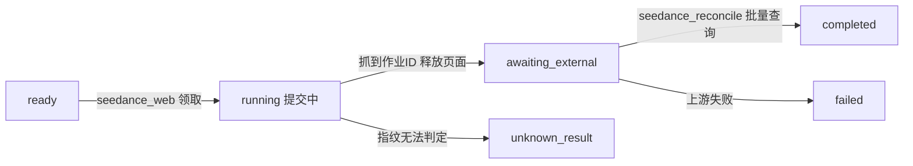

# TikTok 电商视频生产系统 — 架构设计 V5.0.0

> 状态：初稿，待讨论
> 输入依据：`history/架构设计-V4.0.0.md`、`架构规范.md`（lancha-ai-studio 框架约定）
> 与 V4 的关系：**V4 不作废**。本文只写变更与新增，未在第 0 章列出的章节一律沿用 V4 原文。

---

## V5 相对 V4 的变更起因

三个外部输入，与 V4 的设计质量无关：

1. **运行载体变更。** 系统不再是独立工程，而是 `lancha-ai-studio` 框架下的一个业务模块（`tiktok_studio`）。框架已有平台层（RBAC、网关、模块装载、schema 隔离）与强制的模块边界约束，V4 中自建的身份体系、进程模型、部署形态需要与之对齐。
2. **规模下调。** 产能目标由每天 500~1000 条视频改为 **360 条/天**。V4 中一批为更大规模设计的机制在新规模下属于过度设计，应推迟实现。
3. **视频生成方案变更。** Seedance 由「带幂等键的 API」改为「Playwright 操作 TikTok 广告后台账号」，API 方式降级为账号额度耗尽时的兜底路径。这是本次变更中影响最深的一项——V4 关于视频生成的设计建立在两个前提上（上游支持幂等键、通道只由一个进程承载），两个前提都不再成立。

**一句话概括 V5 的取舍**：V4 的正确性机制（租约、fence、幂等、公平调度）全部保留；V4 的吞吐优化机制按新规模推迟；视频生成环节重新设计。

---

## 0. 章节处置对照表

阅读本文时，请对照 V4 原文。未列出的章节均无变化。

| V4 章节 | V5 处置 | 见本文 |
|---|---|---|
| 1.2 规模预期 | **重写**，360/天，容量余量重算 | 3.1 |
| 2.2 角色与权限 | **调整**，角色与身份归平台 RBAC，配额留模块 | 1.3 |
| 4 总体架构 | **调整**，进程模型与分层归属变化 | 1.1、2 |
| 4.1 分层职责 | **调整**，新增「平台层」一行 | 1.1 |
| 6.1 operator | **重写**，拆为 `platform.user` + `operator_quota` | 1.3 |
| 6.5 node | **调整**，新增 3 个字段、1 个状态 | 4.6、4.7 |
| 6.7 channel_config | **调整**，seedance 拆为两个通道 | 4.2 |
| 6.x 新增 | **新增** `seedance_account`、`seedance_slot` | 4.4、4.7 |
| 7.2 节点字段 | **调整**，新增 `channel_resolver` | 4.3 |
| 8.2 node 状态机 | **调整**，新增 `awaiting_external`、`unknown_result` | 4.6、4.7 |
| 8.4 批量领取 | **调整**，驱动表由 `operator` 改为 `operator_quota` | 1.3 |
| 8.5 租约心跳 | **调整**，心跳移入独立线程 | 2.4 |
| 8.6 就绪推进 | **调整**，新增通道路由 hook | 4.3 |
| 8.7 外部作业等待 | **重写**，Tool 内等待改为提交-对账两段式 | 4.7 |
| 9.3 上游作业并发 | **重写**，改为按账号的数据库槽位 | 4.7 |
| 9.6 准入控制 | **调整**，`pg_notify` 触发器推迟，改周期轮询 | 3.3 |
| 9.8 运行时隔离 | **调整**，browser 不再要求独立进程，改为三条前提约束 | 2.3 |
| 9.9 部署与通道绑定 | **重写**，单入口 + 单 worker + loops | 2 |
| 11.2 幂等键 | **调整**，浏览器路径无幂等键，改指纹匹配 | 4.6 |
| 11.3 前置检查 | **重写**，新增 reconcile 与人工确认路径 | 4.6 |
| 11.5 成本核算 | **调整**，额度消耗与现金付费分开计量 | 4.5 |
| 13.1 数据归属 | 沿用 | — |
| 13.2 权限矩阵 | **调整**，映射到平台权限码 + 数据权限 | 1.3、1.4 |
| 15 API 设计 | **调整**，路径加模块前缀 | 1.2 |
| 16 部署形态 | **重写**，单机四进程改为单机双进程 | 5 |
| 18 分钟级视频 | **部分提前启用**，`job_slot` 机制用于 seedance_web | 4.7 |
| 其余全部章节 | **沿用 V4 原文** | — |

---

## 1. 运行载体：从独立工程到平台模块

### 1.1 分层归属

V4 的全部内容落在 `server/modules/tiktok_studio/` 内。平台层**不为本模块新增任何业务能力**，只提供三样此前没有的通用机制（见第 2 章）。

| 层 | 归属 | 内容 |
|---|---|---|
| **平台层** `server/platforms/` | 框架团队 | 模块装载、RBAC、数据权限、进程入口与循环调度、数据库会话、统一错误与请求上下文 |
| **模块层** `server/modules/tiktok_studio/` | 业务团队 | V4 的全部：管线定义、node 状态机、通道执行、租约、准入、审核台、发布模块、Tool 实现 |

**明确不做的事：把 `node` / `channel_config` 升格为平台通用表。**

V4 的表结构是为本业务精心设计的——`batch_id` 与 `created_by` 冗余是为了领取 SQL 不做 join，`is_current` 部分唯一索引是为了重跑语义，`review_mode` 是审核特有的。抽象成通用任务表只有两个结果：丢掉这些设计，或者退化成一个 JSONB 大袋子。

目前只有一个模块需要这套机制，不具备提取共性的信息。等图片生成模块真正要用时再提取，届时已经有两个真实用例可参照。

### 1.2 命名与边界约束

框架的强制约定（见 `架构规范.md` 第 2、3 节）对本模块的影响：

| 项 | V4 | V5 |
|---|---|---|
| 数据库 schema | 独立库 | `mod_tiktok_studio` |
| 接口前缀 | `/api/batches`、`/api/nodes` | `/api/tiktok_studio/batches` |
| 前端路由 | `/batches` | `/tiktok_studio/batches` |
| 权限码 | 角色枚举 | `tiktok_studio:batch:create` 等 |
| 迁移分支 | 单链 | `alembic -n tiktok_studio` |
| 模块配置前缀 | — | `TIKTOK_STUDIO_` |

违反前四项的，`platforms/gateway/loader.py` 在进程启动时直接拒绝加载，不会留到运行期。

**跨 schema 的硬约束**：本模块的表不得与其他模块 schema 做 JOIN 或建外键，唯一例外是可以引用 `platform.user.id`。这条约束对 8.4 的领取 SQL 有直接影响，见下节。

### 1.3 身份、角色与配额的拆分

V4 的 `operator` 表同时承担三件事：身份、角色、配额。在框架下必须拆开。

```sql
-- 身份与角色：平台层，本模块只读
platform."user"          (id, username, display_name, is_superuser, is_active)
platform.role / user_role / permission / role_permission

-- 配额：本模块 schema
CREATE TABLE operator_quota (
    user_id           BIGINT PRIMARY KEY,   -- 逻辑指向 platform."user".id
    wip_limit         INT NOT NULL DEFAULT 10,
    daily_task_quota  INT NOT NULL DEFAULT 100,
    enabled           BOOLEAN NOT NULL DEFAULT TRUE,
    updated_at        BIGINT NOT NULL
);
```

**V4 的角色映射到平台权限码**，`module.py` 中声明：

| V4 角色 | 平台实现 |
|---|---|
| 运营 | 角色 `tiktok_operator`，持有 `batch:create`、`batch:pause`、`node:rerun`、`review:approve` 等 |
| 审核人 | 角色 `tiktok_reviewer`，持有 `review:approve`、`node:edit` |
| 发布人 | 角色 `tiktok_publisher`，持有 `publish:create`、`publish:retry` |
| 管理员 | 角色 `tiktok_admin`，额外持有 `pipeline:publish`、`prompt:activate`、`channel:config`、`quota:assign` |

**8.4 领取 SQL 的驱动表要换。** V4 写的是 `FROM operator o CROSS JOIN LATERAL (...)`，现在 `operator` 不在本模块 schema 里，直接 join `platform."user"` 会违反边界约束。改为以 `operator_quota` 为驱动表：

```sql
WITH cand AS (
    SELECT c.id
    FROM operator_quota q                       -- 驱动表改为本模块的配额表
    CROSS JOIN LATERAL (
        SELECT n.id FROM node n
        JOIN task t ON t.id = n.task_id
        JOIN batch b ON b.id = n.batch_id
        WHERE n.created_by = q.user_id
          AND n.channel = :channel
          AND n.status  = 'ready'
          ...
        ORDER BY n.priority, n.created_at, n.id
        LIMIT :per_owner_take                   -- 仍取自 channel_config，与 V4 一致
    ) c
    WHERE q.enabled
)
...
```

语义与 V4 完全一致，代价是**运营必须先有一条 `operator_quota` 记录才会被调度到**。处理方式：用户首次创建批次时自动插入一条默认配额记录，同时管理员可在配额管理页调整。这一点必须写进实现清单，否则会出现「建单成功但节点永远不被领取」的静默故障。

> 领取层轮转是否有必要保留，存在更简单的替代方案，分析见 6.3。当前暂按本节执行。

### 1.4 数据权限（平台层新增）

V4 的权限矩阵中有大量数据维度的表述——「自己创建的批次」「被授权批次」「被授权账号所属店铺的成片」。平台当前的 RBAC 只有功能权限，没有数据权限，必须补。

**设计原则：平台负责存储与查询，不解释业务语义。**

```sql
platform.role_data_scope (
    id, role_id,
    scope_key     VARCHAR(64),   -- 如 'tiktok_studio:batch'、'tiktok_studio:publish_account'
    scope_type    VARCHAR(16),   -- own | all | list
    scope_values  JSONB          -- scope_type = list 时生效
);
```

模块侧取到的是一个三选一的结果，自己转成 SQL 条件：

```python
scope = await auth.data_scope(principal, "tiktok_studio:batch")
if scope.type == "own":
    stmt = stmt.where(Batch.created_by == principal.user_id)
elif scope.type == "list":
    stmt = stmt.where(Batch.id.in_(scope.values))
# all 不加条件
```

平台不知道 `tiktok_studio:batch` 是什么，模块不需要自己造一套权限存储。图片模块将来要「只看指定店铺」时，复用同一套机制。

**显式过滤，不做 ORM 全局隐式过滤。** 隐式过滤写起来省事，但会产生「数据明明在库里却查不出来」的幽灵问题，排查成本极高。

### 1.5 迁移与 schema

全部表建在 `mod_tiktok_studio`，独立迁移分支，与平台表互不阻塞：

```bash
alembic -n tiktok_studio revision --autogenerate -m "xxx"
alembic -n tiktok_studio upgrade head
alembic -n tiktok_studio check          # CI 必跑
```

注意带 schema 的表，SQLAlchemy 生成的索引名会带 schema 前缀（如 `ix_mod_tiktok_studio_node_claim`），手写迁移时要对齐，否则 `alembic check` 会一直有 diff。

---

## 2. 进程模型：单入口、单 worker、循环可切分

V4 的部署是 API + worker-main + worker-browser 三类进程，各有独立启动命令。V5 统一为**一个入口、两个进程**。

### 2.1 单入口与子命令

```bash
python main.py api                          # 网关进程
python main.py worker                       # 后台进程，跑全部循环
python main.py worker --loops seedance_web  # 将来拆分部署时才用
```

argparse 即可，零新增依赖。启动前的日志配置、模块装载、数据库初始化全部共用；Dockerfile 只需一个 `ENTRYPOINT`，部署时改 `command` 即可。

### 2.2 循环（loop）模型

**「循环」指 worker 进程内一个常驻的后台协程**，它有自己的 `while`，独立领活、独立退出。不是跑一轮就结束。

平台侧在 `ModuleSpec` 上新增一个字段，模块声明自己有哪些循环：

```python
# platforms/contract.py
@dataclass(frozen=True)
class BackgroundLoop:
    name: str                                    # --loops 用它筛选
    run: Callable[[LoopContext], Awaitable[None]]

@dataclass(frozen=True)
class ModuleSpec:
    ...
    loops: tuple[BackgroundLoop, ...] = ()
```

平台只负责**装载、筛选、启动、优雅停机**。循环内部做什么——通道领取、对账、准入放量——完全是模块的事，平台不理解也不需要理解。这是「平台只提供进程骨架」原则的落点。

`tiktok_studio` 声明的循环：

```
llm                 通道循环
local               通道循环
three_view          通道循环
seedance_web        通道循环（提交，Playwright）
seedance_api        通道循环（降级路径）
seedance_reconcile  对账循环（查在途作业状态，4.7）
amazon              通道循环（抓取，Playwright）
publish_submit      发布提交循环
publish_sync        发布状态同步循环
admit               准入放量
maintenance         周期维护
```

`python main.py worker` 不带参数时，这 11 个协程用 `asyncio.gather` 并发常驻在同一进程内。

**`--loops` 与 `ENABLED_MODULES` 是两个维度**：后者决定装载哪些模块（API 与 worker 必须一致，否则会出现「能建单但没人执行」的静默故障），前者决定本进程跑其中哪些循环。

### 2.3 单 worker 的三个前提条件

V4 的 9.8 要求 browser 必须独立进程，理由是浏览器僵死会卡住事件循环 → 心跳停摆 → 其他 worker 集体抢占租约 → 群体性重复扣费。

V5 把浏览器循环合回主 worker，**前提是下面三条必须守住**，否则 V4 的结论依然成立：

1. **只用 Playwright 的 async API。** 同步 API 会真正阻塞事件循环，这是 V4 那条结论的真实来源。用 async API 时浏览器卡住只挂起单个协程，不影响其他循环。
2. **任何 CPU 密集操作走子进程或线程池。** 图片处理、将来的 FFmpeg 拼接直接在协程里跑就会阻塞整个事件循环。
3. **浏览器实例池化并设最大复用次数，超过即重建。** 否则连续运行几天内存会涨到拖垮整个 worker。

配合 2.4 的心跳隔离，单 worker 在 360/天 的规模下是安全的。

**单 worker 还顺带消除了 V4 的一条约束**：V4 的 9.3 与 9.9 要求「`three_view`、`seedance` 通道只能由一个 worker 进程承载」，否则全局并发变成槽位乘进程数。单进程下这条自动满足，部署时不需要小心规划通道绑定。

### 2.4 心跳移入独立线程（V5 关键改动）

这是单 worker 方案唯一需要额外设计的地方。

只要事件循环被卡住，所有在途节点的租约就续不上，其他执行单元（或重启后的自己）会判定租约过期并抢占。在没有幂等键的 `seedance_web` 节点上，这意味着重复提交、重复消耗账号额度。

**解法：心跳从事件循环里拿出来，用独立线程配同步 psycopg 连接专门续租。**

```python
class Heartbeat(threading.Thread):
    """独立线程续租。即使事件循环被某个协程卡死，租约仍然在续。"""
    def run(self):
        conn = psycopg.connect(**dsn)          # 同步连接，不走事件循环
        while not self._stop.is_set():
            with conn.transaction():
                renew(conn, self._leases.snapshot())   # 带 fence 条件
            self._stop.wait(HEARTBEAT_INTERVAL)
```

续租仍然按 V4 的 8.5 带 fence 条件：影响 0 行说明租约已被接管，通知对应协程取消本地执行。

`_leases` 是主线程与心跳线程共享的租约表，用锁保护；除此之外两者无交互。

**两段式提交还大幅降低了心跳压力**（见 4.7）：`seedance` 节点的 `running` 期从 4 分钟缩短到几十秒，租约 TTL 可以从 V4 算出的 1350 秒降到 300 秒以内，崩溃后的接管延迟随之从 22 分钟降到 5 分钟。

### 2.5 何时拆分

出现下面任意一条，就把对应循环拆进独立进程。拆分只改启动命令，不改代码：

- worker 进程内存峰值逼近机器上限
- 出现过因其他循环的问题导致 seedance 在途作业被牵连重启
- seedance 实际并发需要超过单机能承载的浏览器上下文数

在那之前不必提前拆。

---

## 3. 规模重算与由此推迟的机制

### 3.1 容量算术（替代 V4 的 1.2）

| 指标 | V4 假设 | V5 实际 |
|---|---|---|
| 每天视频任务数 | 500 ~ 1000 | **360** |
| 每天节点执行记录 | 10000 ~ 13000 | 约 3500（8 节点 × 360 × 1.2 重跑系数） |
| 每天 seedance 作业 | 1000 ~ 1500 | 约 540（含重摇 1.5 倍） |
| 每天 LLM 调用 | 3000 ~ 5000 | 约 1700 |
| 每天 Amazon 抓取 | ≤ 1000 | ≤ 360（扣除缓存命中后更低） |
| 每天审核项 | 约 3000 | 约 1080 |
| `node` 表年增量 | 300 ~ 400 万行 | 约 100 万行 |

**seedance 并发需求**：540 次/天，单作业约 4 分钟，一个并发槽位每小时产出 15 次。

- 生产窗口 8 小时（保守，受审核节奏约束）：每小时 68 次，需要约 **4.5 个并发**
- 生产窗口 16 小时：每小时 34 次，需要约 **2.3 个并发**

对照可用配额：**单个广告账号 5 并发基本够用，两个账号宽松，三个账号有约 3 倍余量**；API 兜底的 10 并发更是远超需求。

**结论：3 个广告账号的价值是额度轮换与冗余，不是并发扩展。** 这个判断直接决定了 5.2 的部署选择。

**审核产能**：1080 项/天，5 名运营人均 216 项。按每项 30 秒计约 1.8 小时/人/天，可接受。审核仍是全链路中最接近瓶颈的环节，但不再紧张。

### 3.2 推迟实现的机制

严格区分两类：**只推迟吞吐优化，绝不推迟正确性保障**。

**可以推迟（新规模下属过度设计）：**

| V4 机制 | 推迟理由 | V5 替代 |
|---|---|---|
| 9.6 的 `pg_notify` 触发器 + 通知合并 + 补偿计数 | 360/天下放量延迟 30 秒完全无感 | 周期轮询放量，保留 advisory lock 与「先加锁再统计」 |
| 8.11 的 `node_archive` 归档 | 年增 100 万行，PostgreSQL 无压力 | 不做，留接口 |
| 9.5 熔断状态写库共享 | 单进程部署，本地熔断即全局 | 进程内熔断 |
| 6.5 的大字段 32KB 外置 | 数据量降到 1/4 | 保留设计但阈值可放宽 |

**必须保留（与规模无关的正确性）：**

租约 + fence、`attempt` 与 `recover_count` 分离、`external_call` 幂等前置检查、`uk_node_current` 部分唯一索引、按运营的 LATERAL 轮转领取、准入 WIP 的「先加锁再统计」、`node_lease` 窄表。

最后一项值得单独说明：`node_lease` 窄表是为了避免心跳更新导致主表索引膨胀，实现成本极低，不值得为省一张表而埋下隐患。

---

## 4. 视频生成：双通道与提交-对账（V5 核心变更）

### 4.1 两种方式的本质差异

| | Playwright 广告后台 | API |
|---|---|---|
| 运行时 | browser | asyncio |
| 并发约束 | **按账号**，各 5 | **上游统一**，共 10 |
| 幂等保护 | 无幂等键，靠指纹匹配 | 幂等键，可靠 |
| 成本性质 | 消耗账号已购额度 | 实时现金付费 |
| 失败模式 | 登录失效、验证码、风控、页面改版 | HTTP 状态码 |
| 定位 | 主路径 | 账号额度耗尽时的兜底 |

四个维度全不同，且一个通道只能有一种 runtime，因此**不能合并为一个通道内部做适配**。

### 4.2 通道拆分

`channel_config` 中 `seedance` 一行拆为两行：

```sql
('seedance_web', 'browser', 5,  NULL, '广告后台，并发由 seedance_slot 按账号约束', :now),
('seedance_api', 'asyncio', 10, NULL, '降级路径，上游统一并发配额',              :now),
```

`seedance_web` 的 `max_concurrent` 只是本进程的协程上限，**真正的并发约束在 4.7 的 `seedance_slot` 表**，因为名额持有期跨越了节点的 `running` 状态。

### 4.3 运行时通道路由

V4 的 `node.channel` 在节点创建时从管线定义直接抄写。现在选哪个通道取决于账号当时有没有余额，管线定义里写不死。

**在节点转为 `ready` 的那一刻做路由决策**（V4 的 8.6 `advance_task` 中），因为那时离实际执行最近。节点字段新增：

```yaml
- key: video_gen
  tool: seedance_generate
  channel: seedance_web          # 静态默认值，保持 fk_node_channel 外键有效
  channel_resolver: seedance     # 有 resolver 则在置 ready 时覆盖 channel
```

```python
def resolve_seedance_channel(node) -> str:
    if has_available_account():        # 任一账号余额足够且未被摘除
        return "seedance_web"
    return "seedance_api"
```

三个要点：

1. `node.channel` 始终存物理通道名，领取 SQL 与 `idx_node_claim` 完全不变。
2. **重试时（`attempt + 1`）重新路由**，因为失败原因可能正是账号余额耗尽。
3. 没有 `channel_resolver` 的节点走原逻辑，其他七个节点完全不受影响。

### 4.4 账号模型与余额探测

```sql
CREATE TABLE seedance_account (
    id                 VARCHAR(32) PRIMARY KEY,
    name               VARCHAR(64) NOT NULL,
    profile_path       VARCHAR(255) NOT NULL,   -- 浏览器 profile 目录，登录态持久化位置
    max_concurrent     INT NOT NULL DEFAULT 5,
    status             VARCHAR(16) NOT NULL,    -- active | exhausted | login_expired | disabled
    balance            NUMERIC(12,2),
    balance_checked_at BIGINT,
    last_error         TEXT,
    updated_at         BIGINT NOT NULL
);
```

**余额探测用「定期探测 + 失败时立即标记」两条腿：**

- 周期维护中每 10~30 分钟打开一次页面读取各账号余额，写入 `balance` 与 `balance_checked_at`
- 提交时若页面提示余额不足，立刻把该账号置为 `exhausted`，不等下一轮探测

只靠定期探测会滞后（期间的提交都会失败），只靠失败标记则每次账号耗尽都要浪费一次提交。两者结合才能兼顾。

登录态失效同理：探测时发现跳转登录页即置 `login_expired` 并告警，该账号不再参与槽位分配。

### 4.5 降级策略与成本护栏

从 `seedance_web` 切到 `seedance_api`，性质是**从消耗已购额度变成实时花钱**。如果余额判断因页面改版而误判，系统会把所有任务默默涌向付费 API，等发现时账单已经产生。

**采用带日限额的自动降级：**

- 自动切换，不阻塞产线
- `seedance_api` 通道配置每日调用上限（`TIKTOK_STUDIO_SEEDANCE_API_DAILY_LIMIT`），触顶即停并告警
- 降级发生时立即告警一次（而不是等到触顶）

最坏情况的损失因此有明确上界。

**成本计量口径分开**（调整 V4 的 11.5）：`external_call` 增加 `cost_type` 字段，`quota`（额度消耗，记消耗单位数）与 `cash`（现金付费，记金额）分别统计，看板上分两列展示。混在一起会让「这个月花了多少钱」这个问题无法回答。

### 4.6 幂等保护重设计（最高风险项）

V4 的 11.2、11.3 建立在「提交时带幂等键、崩溃后用 `resume_job_id` 接管原作业」之上。浏览器自动化里**没有幂等键可传**，「到底提交成功了没有」只能回到后台页面去查。

**三段式写入：**

```
1. 提交前   INSERT external_call(status='submitting', fingerprint=...)
            fingerprint = 账号ID + 提交时间戳 + 参数摘要（提示词哈希、素材 URL 哈希）
2. 提交后   立刻从页面抓取作业标识，回填 external_job_id，status='submitted'
3. 崩溃恢复 命中 status='submitting' 且 external_job_id 为空的记录 → 进入 reconcile
```

**reconcile 的三种结果：**

| 匹配结果 | 处置 |
|---|---|
| 后台列表中用指纹唯一匹配到一条 | 回填 `external_job_id`，节点转 `awaiting_external` 继续等待 |
| 匹配不到任何记录 | 判定未提交成功，可安全重新提交 |
| 匹配到多条或无法判定 | 节点置 **`unknown_result`**，停止自动处理，等待人工确认 |

**新增节点状态 `unknown_result`**（V4 的 8.2 状态机中没有）。它不是失败，不能自动重试——重试会重复消耗额度并可能触发风控。配套需要：

- 任务详情页展示该状态并给出后台链接与指纹信息
- 人工确认入口：确认「已生成」则填入作业标识转 `awaiting_external`，确认「未生成」则转 `ready` 重新提交
- 该状态的计数作为一级监控指标，持续不为 0 说明指纹匹配规则需要调整

**这是全系统最脆弱的环节**，指纹设计的质量直接决定人工介入的频率。参数摘要要选择在后台页面上可见、可比对的字段（作业名称、创建时间、提示词前缀），不能用只存在于本地的内部 ID。

### 4.7 提交-对账两段式（替代 V4 的 8.7）

V4 特意把 seedance 设计成 Tool 内 `await` 轮询，省掉 `polling` 状态与对账通道。**这个简化在浏览器场景下不成立**：等待 4 分钟意味着一个 browser context 一直占着几百 MB 内存，5 个并发就是数 GB。

改为两段式：



- **`seedance_web` 循环只负责提交**：领槽位 → 打开页面 → 提交 → 抓作业 ID → **释放页面、释放租约** → 节点置 `awaiting_external`
- **`seedance_reconcile` 循环负责对账**：定期打开**一个**页面，批量查询所有 `awaiting_external` 节点的作业状态，就绪则下载转存 TOS 并置 `completed`

这正是 V4 第 18 章为分钟级视频子作业设计的 `poller` 模式，提前启用于此。

**并发约束随之改变。** 节点在 `awaiting_external` 期间不占进程内槽位，但仍占用账号的上游并发名额——名额持有期跨越了 `running` 状态，进程内计数管不住了。V4 的 9.2 论证过「读时聚合计数」有竞态，不能用。

**解法：预建固定槽位行，领取即抢行，行级互斥零竞态。**

```sql
CREATE TABLE seedance_slot (
    account_id  VARCHAR(32) NOT NULL REFERENCES seedance_account(id),
    slot_index  INT         NOT NULL,
    node_id     BIGINT,                      -- NULL 表示空闲
    acquired_at BIGINT,
    expires_at  BIGINT,                      -- 兜底回收，防止节点异常消失导致名额泄漏
    PRIMARY KEY (account_id, slot_index)
);
-- 每个账号按 max_concurrent 预建 N 行
```

抢占：

```sql
WITH picked AS (
    SELECT s.account_id, s.slot_index
    FROM seedance_slot s
    JOIN seedance_account a ON a.id = s.account_id
    WHERE a.status = 'active'
      AND (s.node_id IS NULL OR s.expires_at < :now)   -- 空闲，或过期可回收
    ORDER BY a.balance DESC NULLS LAST, s.account_id, s.slot_index
    LIMIT 1
    FOR UPDATE OF s SKIP LOCKED
)
UPDATE seedance_slot t
SET node_id = :node_id, acquired_at = :now, expires_at = :now + :ttl
FROM picked p
WHERE t.account_id = p.account_id AND t.slot_index = p.slot_index
RETURNING t.account_id;
```

这一条 SQL 同时完成了三件事：**选账号（按余额优先）、限并发（槽位总数即上限）、绑定账号（返回的 account_id 写入 node）**。行级互斥，不存在超发。抢不到槽位的节点停在 `ready`，下一轮自然被领取，不需要专门的补交逻辑。

节点完成或失败时释放槽位（`node_id = NULL`）；`expires_at` 作为兜底，防止节点异常消失导致名额永久泄漏。

`node` 表新增三个字段承接这套机制：

```sql
ALTER TABLE node
  ADD COLUMN account_id     VARCHAR(32),   -- 实际使用的广告账号，提交后写入
  ADD COLUMN external_ref   VARCHAR(128),  -- 后台作业标识，供对账循环使用
  ADD COLUMN awaiting_since BIGINT;        -- 进入 awaiting_external 的时刻，用于超时判定
```

**等待超时仍判为不可自动重试**（沿用 V4 的 8.7 结论）：本地超时不代表上游作业结束，自动重试会重复消耗额度。超时后节点转 `unknown_result` 而非 `failed`，因为此时作业可能仍在跑。

---

## 5. 部署形态（替代 V4 的 16）

### 5.1 进程清单

```
api        python main.py api        2C4G    网关，无状态
worker     python main.py worker     4C8G    全部 11 个循环 + 心跳线程
postgres   PostgreSQL 17             4C8G    唯一真相源
```

**一台 8C16G 机器装得下**，进程守护（systemd / supervisor，`Restart=always`）负责自动重启。

对比 V4 的四进程（api + worker-main + worker-browser + 预留 worker-cpu），减少到两个应用进程。依据是 3.1 的容量算术与 2.3 的三条前提条件。

### 5.2 单机多 profile，不做分布式

**3 个广告账号全部放在同一台机器上，各用独立的浏览器 profile 目录**（独立 cookie 与 storage state）。

这个选择的直接收益是**整套分布式调度机制都不需要**：

| 如果账号绑定到不同机器 | 单机多 profile |
|---|---|
| `node` 需要亲和字段，领取 SQL 需要亲和条件 | `account_id` 只是记录，不构成调度约束 |
| 租约接管需要同账号才能接管 | 任何执行单元都能拿着 `account_id` 去查作业 |
| 3 个故障域，任一台宕机其账号上的在途作业无人可救 | 1 个故障域 |
| 需要账号健康检查、自动摘除、卡单人工接管 | 只需要账号状态管理 |
| PostgreSQL 必须对外暴露，配置分发复杂 | 本机单库 |

按 3.1 的算术，单机 5 个并发浏览器上下文足以支撑 360/天，没有任何吞吐劣势。

**只有一种情况需要多机**：确认必须使用不同出口 IP 防关联。届时再加亲和字段，`node.account_id` 已经预留，改造面集中在领取 SQL 与租约接管两处。

需要说明的是：这三个账号本属同一主体，从平台风控视角大概率已经关联，不同 IP 能带来多少实际保护存疑。这一条建议与实际操作的同事确认后再决定。

### 5.3 数据库

单库，每天 `pg_dump` 全量 + WAL 持续归档到 TOS，可恢复到任意时间点，恢复流程定期演练。沿用 V4 的 16.1 第 5 点。

---

## 6. 风险与待确认

### 6.1 风险排序

| 风险 | 等级 | 缓解 |
|---|---|---|
| 浏览器路径无幂等键，崩溃后「是否已提交」只能靠指纹匹配 | **高** | 4.6 的三段式写入 + `unknown_result` 状态 + 人工确认入口 |
| 页面结构变化导致静默批量失败，且可能引发错误的降级决策 | **高** | 选择器变化快速失败并告警，绝不进重试循环；余额读取失败视为「未知」而非「0」 |
| 自动降级到付费 API 的成本失控 | 中 | 4.5 的日限额 + 降级即告警 |
| 数据权限缺失 | 中 | 1.4 在平台层补齐 |
| 单 worker 一损俱损 | 低 | 2.3 三条前提 + 2.4 心跳独立线程 + 2.5 拆分触发条件 |
| 可用性（单机单库） | 低 | 容量有 3 倍余量，重启影响可接受；沿用 V4 的崩溃恢复设计 |

相比之下，V4 主体机制移植到新框架是整个工作里最简单的部分。

### 6.2 动手前需确认

1. **广告后台是否有作业列表页可查历史记录？** 直接决定 4.7 的提交-对账能否成立。若只能在提交页面死等结果，两段式不成立，5 个并发就是 5 个常驻浏览器上下文，内存开销需重新评估。
2. **账号登录态能维持多久，掉线后是否需要短信或邮箱验证码？** 若需人工过验证，自动化链路会频繁中断，需要配套值守机制与告警。
3. **账号余额能否在页面上直接读取？** 决定 4.4 的余额探测是主动的还是被动的。只能被动的话，每次账号耗尽都要浪费一次失败提交。
4. **3 台机器是否为防关联的硬要求？** 若否，5.2 的单机方案成立，可省掉整套亲和调度。

前三项直接影响 4.6 与 4.7 的实现方案，建议在编码前确认。

### 6.3 已识别、暂缓决策：领取层公平调度是否保留

**现状：暂按 1.3 执行（驱动表改 `operator_quota`），本节只记录分析，不改变方案。**

V4 的公平调度分两层：准入 WIP（任务级）与领取轮转（节点级，8.4 的 LATERAL）。移植时发现第二层存在三个问题：驱动表跨 schema、依赖配额记录完备性（缺记录则节点永不被领取，且故障静默）、SQL 复杂度偏高。

评估中发现**第二层在 V5 规模下可能是冗余的**。推理链：D25 规定一个任务 = 一条视频，D26 规定不做扇出、DAG 保持线性，因此一个 `running` 任务在任一时刻最多只有 1 个活跃节点。于是单个运营能压入队列的节点数不是他提交的总数，而是他的 `wip_limit`——等待时间已被准入层限定。

按 Little's law 核算所需在制品：360 条/天、8 小时窗口即 45 条/小时，端到端按 30 分钟算，需要 45 × 0.5 ≈ 23 条在制。4 个运营每人 `wip_limit = 8` 即可（V4 默认的 20 是按 500–1000/天定的，V5 规模下偏大）。此时单通道 ready 深度最坏 32 且分散在 4 个通道，seedance 15 并发、每轮 3 分钟，最坏等待约 7 分钟，满足 V4 验收标准第 5 条（两人各提交 100 条，首节点开始执行时间差 < 10 分钟）。

三个候选方案：

| 方案 | 做法 | 代价 |
|---|---|---|
| **A. 删除领取层轮转**（分析倾向） | 调小 `wip_limit` 至 8，领取 SQL 退化为朴素 `ORDER BY priority, created_at LIMIT take` | 放弃同优先级下的严格轮转 |
| B. 递归 CTE 自行枚举 | 用 loose index scan 从 `idx_node_claim` 跳跃取出 distinct `created_by`，不依赖任何字典表 | SQL 可读性差，小团队维护负担 |
| C. 维持 1.3 现方案 | `operator_quota` 为驱动表 + 建单时自动插默认配额 | 需维护配额记录完备性这一不变量 |

方案 A 的附带收益是故障模式变好：配额缺失从「节点永远 `ready` 无人领取」（静默）变为「任务停在 `admitted_pending`」，后者在第 17 章已有现成监控指标；且 `admit_for_operator` 对配额取 `COALESCE(记录, 默认值)` 可使该故障完全消失。

**重新评估的触发条件**：运营人数超过 10 人，或出现单人单批次超过 200 条的提交模式，或监控显示同通道内不同运营的 `ready → running` 排队时长差异超过 10 分钟。

---

## 7. 落地顺序

```
阶段 1  平台层补齐（与 V4 移植解耦，可并行）
        - 单入口 + 子命令、ModuleSpec.loops、worker 进程骨架与优雅停机
        - session_scope() 非依赖会话入口
        - 心跳独立线程的通用实现
        - platform.role_data_scope 与 auth.data_scope()
        验证：example 模块声明一个空循环，worker 能启动、能优雅停机

阶段 2  V4 主体移植（不含视频生成）
        - 数据模型建表与迁移分支，operator 拆分为 user + operator_quota
        - 通道执行循环、claim_batch（驱动表改 operator_quota）、租约与 fence
        - 准入（周期轮询版）、就绪推进、重试退避
        - 除 seedance 外的 7 个节点与对应 Tool
        验证：跑通一条不含视频生成的管线，崩溃重启后能继续

阶段 3  视频生成双通道
        - seedance_account / seedance_slot 建表与槽位预建
        - channel_resolver 路由、余额探测
        - seedance_web 提交循环、seedance_reconcile 对账循环
        - 幂等三段式、unknown_result 状态与人工确认入口
        验证：重点测崩溃恢复——提交后立即杀进程，确认不产生重复提交

阶段 4  审核台与发布模块
        - 沿用 V4 的第 10 章，前端按框架模块规范建在 web/src/modules/tiktok_studio

阶段 5  可观测与看板
        - 沿用 V4 的第 17 章，新增 unknown_result 计数、账号余额、降级次数三项指标
```

阶段 1 与阶段 2 可以并行开工。阶段 3 的验证项是全系统最关键的一条测试，不通过不能上生产。
